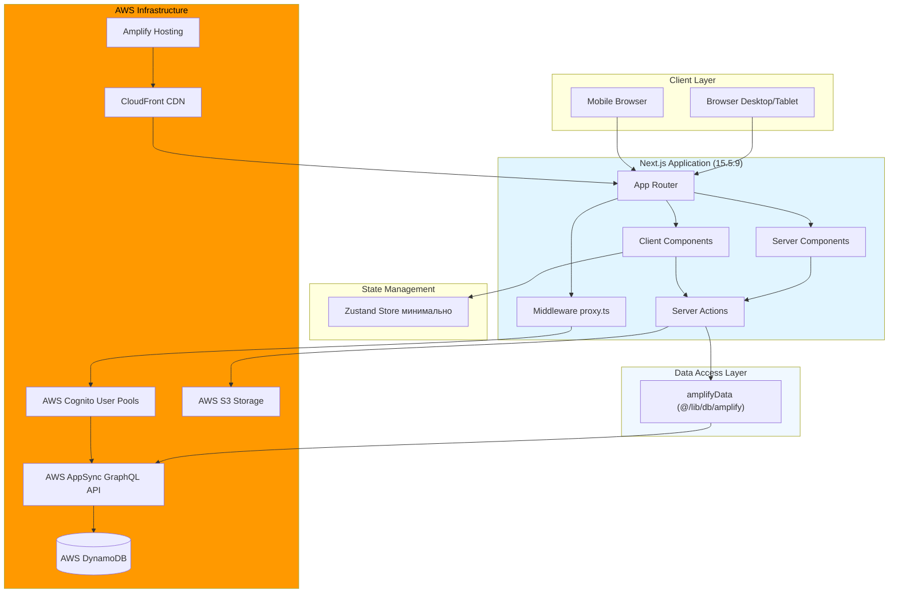
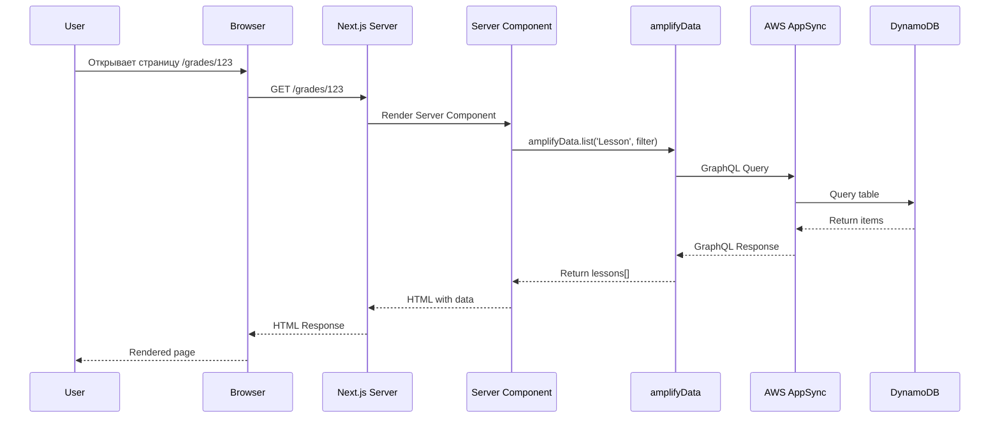
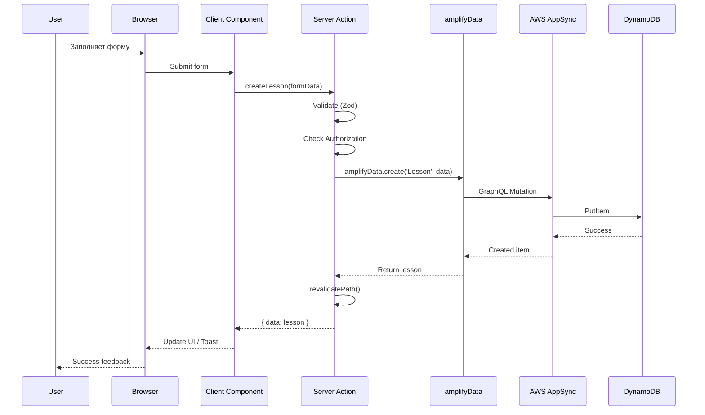
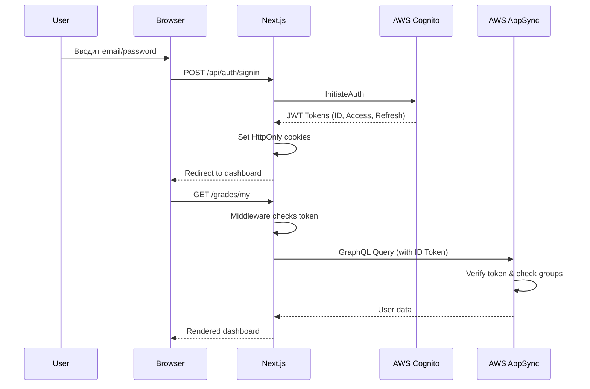
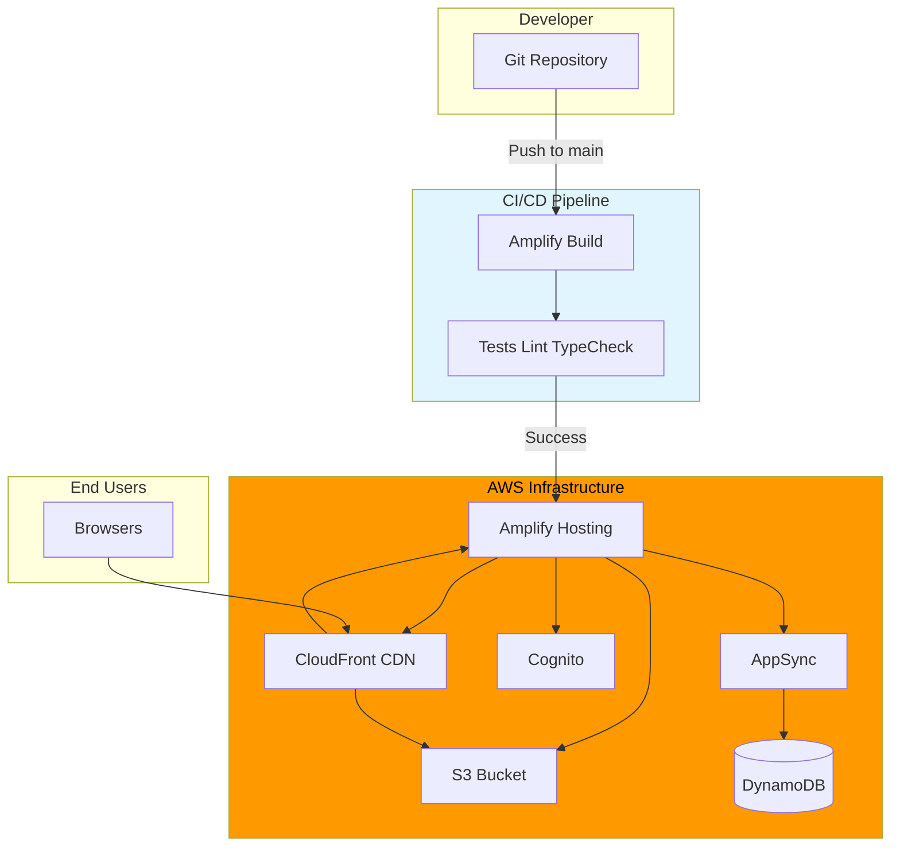

# Архитектура проекта - Sunday School App

## Версия документа: 1.0
**Дата создания:** 23 декабря 2025  
**Последнее обновление:** 23 декабря 2025  
**Проект:** Sunday School App  
**Технологии:** Next.js 15.5.9, React 19, AWS Amplify Gen 1, AWS DynamoDB, AWS AppSync, AWS Cognito, TypeScript, Shadcn UI, Tailwind CSS

> [!NOTE]
> Документация основана на актуальных источниках:
> - Next.js 15.1.8 — официальная документация Vercel
> - AWS Amplify Gen 1 — официальная документация AWS
> - DynamoDB + AppSync — best practices AWS

---

## 1. Обзор архитектуры

Sunday School App — веб-приложение для автоматизации управления воскресной школой баптистской церкви, построенное на современном технологическом стеке с использованием serverless архитектуры AWS.

### 1.1. Общее описание системы

Приложение предоставляет полный цикл управления учебным процессом воскресной школы:
- Управление уроками и учебными годами
- Проверка домашних заданий с автоматическим расчетом баллов
- Система мотивации учеников (баллы, домики, достижения)
- Рейтинг учеников с игрофикацией
- Управление преподавателями, учениками и семьями
- Ролевой доступ (Teacher, Admin, Superadmin)

### 1.2. Ключевые принципы

- **Server-First Architecture** — максимальное использование Server Components для улучшения производительности
- **Mobile-First Design** — адаптивный дизайн с приоритетом мобильных устройств
- **Type Safety** — полная типизация с TypeScript для всего стека
- **Serverless & Scalable** — использование AWS serverless сервисов для автомасштабирования
- **Educational Focus** — фокус на образовательных процессах и мотивации учеников
- **Security by Default** — безопасность на всех уровнях (Cognito, RBAC, валидация)
- **Infrastructure as Code** — вся конфигурация инфраструктуры хранится в коде для обеспечения идентичности dev и prod окружений

### 1.3. Архитектурные решения

**Монолитный фронтенд:**
- Единое Next.js приложение с App Router
- Server Components по умолчанию, Client Components только для интерактивности
- Server Actions для всех мутаций данных

**Serverless backend:**
- AWS Amplify Gen 1 для управления инфраструктурой
- DynamoDB для хранения данных
- AppSync (GraphQL API) для абстракции над DynamoDB
- Cognito для аутентификации и авторизации

---

## 2. Диаграмма высокоуровневой архитектуры



---

## 3. Frontend архитектура

### 3.1. Next.js 15.5.9 App Router

**Ключевые особенности:**
- **App Router** — файловая маршрутизация на основе папок в `app/`
- **React 19** — использование новых возможностей React Compiler
- **TypeScript** — строгая типизация без `any`
- **Turbopack** — быстрая сборка для разработки

**Структура приложения:**

```
app/
├── (auth)/
│   └── auth/              # Страница входа
├── (private)/             # Защищенные маршруты
│   ├── grades/
│   │   ├── [gradeId]/     # Страницы группы
│   │   └── my/            # Редирект для Teacher
│   ├── lessons/           # Уроки
│   ├── pupils/            # Ученики
│   ├── teachers/          # Преподаватели (Admin)
│   └── families/          # Семьи (Admin)
├── actions/               # Server Actions
│   ├── lessons.ts
│   ├── pupils.ts
│   ├── users.ts
│   └── ...
├── components/            # React компоненты
│   ├── ui/                # Shadcn UI компоненты
│   ├── server/            # Server Components
│   └── client/            # Client Components
└── lib/                   # Утилиты и хелперы
    ├── db/
    │   └── amplify.ts     # amplifyData
    └── utils/
```

### 3.2. Server Components vs Client Components

**Server Components (по умолчанию):**
- Выполняются на сервере
- Прямой доступ к backend ресурсам (БД, API)
- Не включаются в bundle клиента
- Улучшают производительность и SEO

**Примеры использования:**
- Список уроков (LessonsList)
- Список учеников (PupilsList)
- Личная карточка ученика (PupilCard)
- Dashboard страницы

**Client Components ("use client"):**
- Выполняются на клиенте
- Используют React hooks (useState, useEffect)
- Обрабатывают интерактивность
- Включаются в bundle клиента

**Примеры использования:**
- Формы (LessonForm, PupilForm)
- Модальные окна (Dialog, Modal)
- Интерактивные UI (Календарь, Рейтинг с фильтрами)
- Toast уведомления

### 3.3. State Management (Zustand)

**Использование:** Минимально, только для глобального клиентского состояния

**Примеры:**
- Состояние UI (открытые модальные окна, sidebar)
- Temporary cache для оптимизации UX
- Toast notifications queue

**НЕ используется для:**
- Серверных данных (используем Server Components)
- Форм (используем React Hook Form или нативные формы)

### 3.4. Routing и Middleware

**proxy.ts (Middleware):**
- Защита приватных маршрутов
- Проверка JWT токена из Cognito
- Редирект неавторизованных пользователей на `/auth`
- Проверка роли пользователя для доступа к страницам

```typescript
// Упрощенный пример proxy.ts
export async function middleware(request: NextRequest) {
  const token = request.cookies.get('cognito-token')?.value;
  
  if (!token && request.nextUrl.pathname.startsWith('/(private)')) {
    return NextResponse.redirect(new URL('/auth', request.url));
  }
  
  // Проверка роли для админских страниц
  const userRole = await getUserRole(token);
  
  if (request.nextUrl.pathname.startsWith('/teachers') && userRole !== 'ADMIN') {
    return NextResponse.redirect(new URL('/grades/my', request.url));
  }
  
  return NextResponse.next();
}
```

---

## 4. Backend архитектура

### 4.1. AWS Amplify Gen 1

**⚠️ КРИТИЧНО:** Используется AWS Amplify **Gen 1**, НЕ Gen 2!

**Почему Gen 1:**
- Стабильная, проверенная временем версия
- Полная поддержка DynamoDB + AppSync
- Достаточная функциональность для MVP
- Хорошо документирована

**Команды Amplify Gen 1:**
```bash
amplify init              # Инициализация проекта
amplify add auth          # Добавление Cognito
amplify add api           # Добавление AppSync + DynamoDB
amplify push              # Деплой изменений в AWS
amplify console           # Открытие AWS консоли
```

**⛔ НЕ используем Gen 2:**
```bash
npx ampx ...  # ❌ Это Gen 2 — НЕ ИСПОЛЬЗУЕМ!
```

### 4.2. Server Actions

**Паттерн использования:**

Server Actions — основной способ взаимодействия с backend для мутаций данных.

**Преимущества:**
- Нативная интеграция с Next.js
- Типобезопасность (end-to-end TypeScript)
- Автоматическая CSRF защита
- Серверная валидация
- Не нужны отдельные API routes

**Пример Server Action:**

```typescript
// app/actions/lessons.ts
'use server';

import { amplifyData } from '@/lib/db/amplify';
import { CreateLessonSchema } from '@/lib/validation';
import { revalidatePath } from 'next/cache';

export async function createLesson(input: unknown) {
  // 1. Валидация
  const validated = CreateLessonSchema.safeParse(input);
  if (!validated.success) {
    return { error: validated.error.format() };
  }
  
  // 2. Проверка авторизации
  const userId = await getCurrentUserId();
  const hasAccess = await checkTeacherAccess(userId, validated.data.gradeId);
  if (!hasAccess) {
    return { error: 'Unauthorized' };
  }
  
  // 3. Создание урока через amplifyData
  try {
    const lesson = await amplifyData.create('Lesson', validated.data);
    
    // 4. Revalidate для обновления UI
    revalidatePath(`/grades/${validated.data.gradeId}`);
    
    return { data: lesson };
  } catch (error) {
    return { error: 'Failed to create lesson' };
  }
}
```

**Использование в компоненте:**

```typescript
// Server Component
async function LessonsList({ gradeId }: { gradeId: string }) {
  const lessons = await amplifyData.list('Lesson', { gradeId });
  
  return (
    <div>
      {lessons.map(lesson => (
        <LessonCard key={lesson.id} lesson={lesson} />
      ))}
      <CreateLessonButton gradeId={gradeId} />
    </div>
  );
}

// Client Component
'use client';

function CreateLessonButton({ gradeId }: { gradeId: string }) {
  const [isPending, startTransition] = useTransition();
  
  async function handleCreate(formData: FormData) {
    startTransition(async () => {
      const result = await createLesson({
        gradeId,
        title: formData.get('title'),
        // ...
      });
      
      if (result.error) {
        toast.error(result.error);
      } else {
        toast.success('Урок создан!');
      }
    });
  }
  
  return (
    <form action={handleCreate}>
      {/* форма */}
    </form>
  );
}
```

### 4.3. Data Access Layer: amplifyData

**Расположение:** `@/lib/db/amplify`

**Цель:** Абстракция над AWS AppSync для CRUD операций

**Основные методы:**

```typescript
// lib/db/amplify.ts
import { generateClient } from 'aws-amplify/api';
import type { Schema } from '@/amplify/data/resource';

const client = generateClient<Schema>();

export const amplifyData = {
  // CREATE
  async create<T extends keyof Schema>(
    model: T,
    input: Schema[T]['createInput']
  ) {
    const { data, errors } = await client.models[model].create(input);
    if (errors) throw new Error(errors[0].message);
    return data;
  },
  
  // READ (single)
  async get<T extends keyof Schema>(
    model: T,
    id: string
  ) {
    const { data, errors } = await client.models[model].get({ id });
    if (errors) throw new Error(errors[0].message);
    return data;
  },
  
  // READ (list)
  async list<T extends keyof Schema>(
    model: T,
    filter?: Schema[T]['filterInput']
  ) {
    const { data, errors } = await client.models[model].list({ filter });
    if (errors) throw new Error(errors[0].message);
    return data;
  },
  
  // UPDATE
  async update<T extends keyof Schema>(
    model: T,
    input: Schema[T]['updateInput']
  ) {
    const { data, errors } = await client.models[model].update(input);
    if (errors) throw new Error(errors[0].message);
    return data;
  },
  
  // DELETE
  async delete<T extends keyof Schema>(
    model: T,
    id: string
  ) {
    const { data, errors } = await client.models[model].delete({ id });
    if (errors) throw new Error(errors[0].message);
    return data;
  },
};
```

**Паттерн взаимодействия:**

```
User Action (Client) 
  → Server Action (Next.js) 
    → amplifyData (Data Access Layer) 
      → AppSync (GraphQL API) 
        → DynamoDB
```

---

## 5. Database архитектура

### 5.1. DynamoDB как основная БД

**Почему DynamoDB:**
- ✅ Serverless — нет управления серверами
- ✅ Автомасштабирование под нагрузкой
- ✅ Pay-per-request модель (экономично для MVP)
- ✅ Низкая latency (< 10ms)
- ✅ Интеграция с AWS Amplify
- ✅ Встроенные возможности резервного копирования

**Альтернативы (не выбраны):**
- ❌ PostgreSQL — требует управления сервером, излишен для MVP
- ❌ MongoDB Atlas — дополнительный vendor, дороже
- ❌ Firebase — vendor lock-in, меньше AWS интеграции

**Особенности DynamoDB:**
- NoSQL база данных (ключ-значение)
- Partition Key + Sort Key для каждой таблицы
- Global Secondary Indexes (GSI) для альтернативных запросов
- Eventual consistency по умолчанию (можно включить strong consistency)

### 5.2. AWS AppSync как GraphQL API

**Роль AppSync:**
- Абстракция над DynamoDB
- Автоматическая генерация GraphQL API из схемы
- Реалтайм subscriptions (если потребуется)
- Интеграция с Cognito для авторизации
- Автоматические resolvers для CRUD операций

**Преимущества GraphQL:**
- ✅ Типобезопасность (TypeScript codegen)
- ✅ Гибкие запросы (только нужные поля)
- ✅ Одна точка входа для всех данных
- ✅ Встроенная документация (introspection)

**Генерация схемы через Amplify:**

```bash
amplify add api
# Выбираем GraphQL
# Создаем schema.graphql
# amplify push генерирует DynamoDB таблицы и AppSync API
```

### 5.3. Стратегия доступа к данным

**Подход:** Multiple Tables Design (не Single Table)

**Обоснование:**
- Простота разработки и понимания
- Достаточная производительность для MVP
- Легко добавлять новые сущности
- Amplify автоматически создает таблицы

**Таблицы:**
- Users (преподаватели, администраторы)
- Grades (группы)
- AcademicYears (учебные годы)
- Lessons (уроки)
- GoldenVerses (золотые стихи)
- Pupils (ученики)
- HomeworkChecks (проверки ДЗ)
- Achievements (достижения)
- Families (семьи)
- GradeEvents (события в расписании)
- GradeSettings (настройки групп)

---

## 6. Authentication & Authorization

### 6.1. AWS Cognito User Pools

**Роль Cognito:**
- Управление пользователями (sign up, sign in)
- Выдача JWT токенов (ID, Access, Refresh)
- Управление сессиями (до 30 дней)
- Password policies и security

**Конфигурация:**

```javascript
// amplify/auth/resource.ts (Gen 1)
export const auth = {
  userPoolConfig: {
    passwordPolicy: {
      minLength: 8,
      requireLowercase: true,
      requireUppercase: true,
      requireNumbers: true,
    },
    mfa: 'OFF', // MVP без MFA
    signUpVerification: {
      email: false, // Admin создает пользователей
    },
  },
};
```

### 6.2. Cognito Groups для ролей

**Роли:**
- `TEACHER` — преподаватель
- `ADMIN` — администратор
- `SUPERADMIN` — главный администратор (в MVP идентичен Admin)

**Как работает:**
- При создании пользователя Admin назначает роль
- Роль хранится в Cognito Groups
- JWT токен содержит информацию о группах
- AppSync проверяет группы для авторизации запросов

**Пример @auth директивы в GraphQL:**

```graphql
type Lesson @model 
  @auth(rules: [
    { allow: groups, groups: ["TEACHER", "ADMIN", "SUPERADMIN"], operations: [read] },
    { allow: groups, groups: ["ADMIN", "SUPERADMIN"], operations: [create, update, delete] },
    { allow: owner, ownerField: "teacherId", operations: [create, update, delete] }
  ]) {
  id: ID!
  title: String!
  gradeId: ID!
  teacherId: ID!
  # ...
}
```

### 6.3. JWT Токены

**Типы токенов:**

1. **ID Token:**
   - Содержит информацию о пользователе (sub, email, name, cognito:groups)
   - Используется для идентификации пользователя
   - Передается в AppSync запросах

2. **Access Token:**
   - Используется для доступа к AWS ресурсам
   - Короткое время жизни (1 час)

3. **Refresh Token:**
   - Используется для обновления ID и Access токенов
   - Длительное время жизни (до 30 дней)

**Хранение токенов:**
- HttpOnly cookies (защита от XSS)
- Secure флаг (только HTTPS)
- SameSite=Strict (защита от CSRF)

### 6.4. Middleware защита маршрутов

**proxy.ts:**

```typescript
// app/middleware.ts (или proxy.ts)
import { NextResponse } from 'next/server';
import type { NextRequest } from 'next/server';
import { verifyToken } from '@/lib/auth';

export async function middleware(request: NextRequest) {
  const token = request.cookies.get('cognito-id-token')?.value;
  
  // Защита приватных маршрутов
  if (request.nextUrl.pathname.startsWith('/(private)')) {
    if (!token) {
      return NextResponse.redirect(new URL('/auth', request.url));
    }
    
    // Верификация токена
    const user = await verifyToken(token);
    if (!user) {
      return NextResponse.redirect(new URL('/auth', request.url));
    }
    
    // Проверка роли для админских страниц
    if (request.nextUrl.pathname.startsWith('/teachers') || 
        request.nextUrl.pathname.startsWith('/pupils') ||
        request.nextUrl.pathname.startsWith('/families')) {
      if (!['ADMIN', 'SUPERADMIN'].includes(user.role)) {
        return NextResponse.redirect(new URL('/grades/my', request.url));
      }
    }
  }
  
  return NextResponse.next();
}

export const config = {
  matcher: [
    '/(private)/:path*',
    '/teachers/:path*',
    '/pupils/:path*',
    '/families/:path*',
  ],
};
```

---

## 7. Ключевые архитектурные решения

### 7.1. Почему AWS Amplify Gen 1 (а не Gen 2)

**✅ Выбор Gen 1:**
- Стабильная версия с проверенными паттернами
- Полная поддержка DynamoDB + AppSync
- Хорошая документация и community support
- CLI команды просты и понятны
- Достаточная функциональность для MVP

**❌ Почему не Gen 2:**
- Более новая версия, меньше стабильности
- Изменившийся API (несовместимость)
- Меньше примеров и туториалов
- Сложнее для начинающих

### 7.2. Почему DynamoDB (а не PostgreSQL)

**✅ Выбор DynamoDB:**
- Serverless (нет управления сервером)
- Автомасштабирование
- Pay-per-request (экономично)
- Интеграция с Amplify "из коробки"
- Низкая latency

**❌ Почему не PostgreSQL:**
- Требует управления сервером (даже RDS)
- Дороже для небольших нагрузок
- Сложнее настройка backup и масштабирование
- Избыточен для структуры данных MVP

### 7.3. Почему Server Actions (а не API Routes)

**✅ Выбор Server Actions:**
- Нативная интеграция с Next.js 15
- Типобезопасность (end-to-end)
- Автоматическая CSRF защита
- Проще код (меньше boilerplate)
- Лучше DX (Developer Experience)

**❌ Почему не API Routes:**
- Больше кода для той же функциональности
- Нужна ручная настройка CORS, CSRF
- Отдельные файлы для каждого endpoint
- Сложнее типизация

### 7.4. Почему Shadcn UI (а не Material-UI)

**✅ Выбор Shadcn UI:**
- Копируемые компоненты (полный контроль)
- Построен на Radix UI (accessibility)
- Интеграция с Tailwind CSS
- Легковесный bundle
- TypeScript support

**❌ Почему не Material-UI:**
- Тяжелый bundle (> 300KB)
- Меньше гибкости для кастомизации
- Специфичный дизайн (Material Design)
- Сложнее темизация

---

## 8. Потоки данных

### 8.1. Read Flow (Получение данных)



**Особенности:**
- Данные загружаются на сервере (Server Component)
- Нет waterfall запросов (все данные в одном рендере)
- HTML уже содержит данные (хорошо для SEO)
- Кеширование на уровне Next.js (по умолчанию)

### 8.2. Write Flow (Мутация данных)



**Особенности:**
- Валидация на сервере (Zod schemas)
- Проверка авторизации в Server Action
- Автоматическая CSRF защита (Next.js)
- revalidatePath для обновления UI
- Optimistic updates (опционально в Client Component)

### 8.3. Authentication Flow



### 8.4. Кеширование и оптимизация

**Next.js Caching:**

1. **Full Route Cache:**
   - Server Components кешируются на сервере
   - Автоматическая invalidation при revalidate

2. **Data Cache:**
   - fetch() запросы кешируются по умолчанию
   - Можно отключить: `{ cache: 'no-store' }`

3. **Request Memoization:**
   - Одинаковые запросы дедуплицируются

**Пример с кешированием:**

```typescript
// Кешируется на 60 секунд
async function getLessons(gradeId: string) {
  const lessons = await amplifyData.list('Lesson', { gradeId });
  return lessons;
}

// В Server Component
export const revalidate = 60; // ISR - revalidate каждые 60 сек

async function LessonsList({ gradeId }: { gradeId: string }) {
  const lessons = await getLessons(gradeId);
  // ...
}
```

**AppSync Caching:**
- Можно настроить cache на уровне AppSync resolver
- TTL для часто запрашиваемых данных

**DynamoDB Best Practices:**
- Использовать GSI для альтернативных запросов
- Избегать Scan operations (использовать Query)
- Batch operations где возможно

---

## 9. Deployment Architecture



**Процесс деплоя:**

1. **Developer push to Git** (main branch)
2. **Amplify Build triggers:**
   - `npm install`
   - `npm run build` (Next.js build)
   - `npm run lint` и `tsc --noEmit`
3. **Amplify deploys:**
   - Static assets → S3
   - Next.js app → Amplify Hosting
   - Invalidate CloudFront cache
4. **Users access:**
   - Browser → CloudFront → Next.js app

**Environment Variables:**
- `NEXT_PUBLIC_APPSYNC_URL`
- `NEXT_PUBLIC_COGNITO_USER_POOL_ID`
- `NEXT_PUBLIC_COGNITO_CLIENT_ID`
- Managed через Amplify Console

---

## 10. Security Architecture

### 10.1. Layers of Security

1. **Network Layer:**
   - HTTPS everywhere (CloudFront → Amplify)
   - CloudFront WAF (опционально для защиты от DDoS)

2. **Authentication Layer:**
   - Cognito User Pools
   - JWT токены с коротким временем жизни
   - HttpOnly + Secure + SameSite cookies

3. **Authorization Layer:**
   - Cognito Groups (RBAC)
   - AppSync @auth директивы
   - Server Actions проверка прав

4. **Application Layer:**
   - Middleware защита маршрутов
   - Server-side валидация (Zod)
   - CSRF protection (Next.js Server Actions)

5. **Data Layer:**
   - DynamoDB encryption at rest
   - Encryption in transit (TLS)
   - IAM roles для доступа к DynamoDB

### 10.2. Threat Model

**Защита от:**
- ✅ XSS (HttpOnly cookies, sanitization)
- ✅ CSRF (Server Actions, SameSite cookies)
- ✅ SQL Injection (N/A для DynamoDB, но GraphQL validation)
- ✅ Unauthorized access (Cognito + Middleware + @auth)
- ✅ Data leaks (Encryption, IAM policies)

---

## Cross-reference

- См. также: [`docs/database/ERD.md`](../database/ERD.md) — структура данных
- См. также: [`docs/database/DYNAMODB_SCHEMA.md`](../database/DYNAMODB_SCHEMA.md) — схема DynamoDB
- См. также: [`docs/database/GRAPHQL_SCHEMA.md`](../database/GRAPHQL_SCHEMA.md) — GraphQL API
- См. также: [`docs/api/SERVER_ACTIONS.md`](../api/SERVER_ACTIONS.md) — API контракты
- См. также: [`docs/infrastructure/AWS_AMPLIFY.md`](../infrastructure/AWS_AMPLIFY.md) — конфигурация Amplify
- См. также: [`docs/infrastructure/INFRASTRUCTURE_AS_CODE.md`](../infrastructure/INFRASTRUCTURE_AS_CODE.md) — принципы Infrastructure as Code
- См. также: [`docs/infrastructure/AWS_COST_ESTIMATION.md`](../infrastructure/AWS_COST_ESTIMATION.md) — расчет стоимости AWS инфраструктуры
- См. также: [`docs/infrastructure/SECURITY.md`](../infrastructure/SECURITY.md) — детальная безопасность
- См. также: [`docs/architecture/DATA_FLOW.md`](../architecture/DATA_FLOW.md) — детальные потоки данных

---

**Версия:** 1.0  
**Последнее обновление:** 23 декабря 2025  
**Автор:** AI Documentation Team

