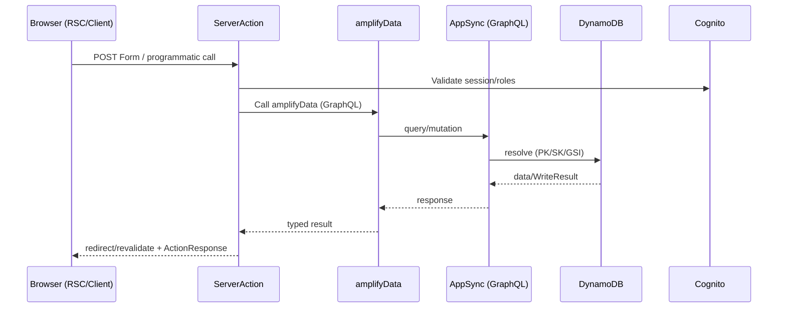

# DATA_FLOW - Sunday School App

## Document Version: 1.0
**Creation Date:** 23 December 2025  
**Last Update:** 23 December 2025  
**Project:** Sunday School App  
**Technologies:** Next.js 15.5.9 (App Router, Server/Client Components, Server Actions), React 19, AWS Amplify Gen 1, AWS AppSync (GraphQL), AWS DynamoDB, AWS Cognito, TypeScript

> [!NOTE]
> Документация основана на актуальных источниках:
> - Next.js 15.5.9 — официальная документация Vercel  
> - React 19 — официальная документация  
> - AWS Amplify Gen 1 — официальная документация AWS (не Gen 2)  
> - AWS AppSync + DynamoDB — AWS best practices

---

## 1. Обзор
- Цель: описать сквозные потоки данных от UI до DynamoDB и обратно, включая кеширование, обработку ошибок и оптимизацию.
- Охват: Next.js App Router (RSC/Client), Server Actions, amplifyData → AppSync → DynamoDB, Cognito авторизация, CDN/кеш.

### 1.1 Ключевые принципы
- Server-first: данные предпочитаем получать в Server Components/Server Actions.
- Валидируем и авторизуем на сервере; клиент минимально доверенный.
- Кеш по умолчанию, явная инвалидация (`revalidatePath`, `revalidateTag`).
- Отделяем UX-кеш (client) от данных истины (server/AppSync).

---

## 2. Сквозной поток (UI → DB → UI)

---

## 3. Клиентский поток (RSC/Client)
- RSC: получают данные напрямую через async fetch/`use()` или через Server Actions (load+mutate). Без клиента JS.
- Client Components: используют Server Actions для мутаций; для чтения — предпочтительно RSC-проброс props. Минимальный Zustand для UI-состояния.
- Формы: `<form action={serverAction}>` с прогрессивным улучшением; для сложных форм — React Hook Form + Zod в клиенте, валидация дублируется на сервере.

---

## 4. Server Actions → AppSync → DynamoDB
- Коллокация по доменам (`actions/*.ts`); каждый action проверяет роль (Cognito groups) и валидирует Zod-схемой.
- Access patterns: опираются на PK/SK и GSI из `DYNAMODB_SCHEMA.md`; минимизируем сканирование, используем queries по ключам/индексам.
- Транзакционность: используем условные выражения (AppSync/DynamoDB) для идемпотентности и оптимистичных обновлений.
- Revalidation: после мутаций вызываем `revalidatePath`/`revalidateTag` для связанных страниц/ресурсов.

---

## 5. Ответ и кеширование
- RSC кеш: по умолчанию кешируются; для динамики используем `cache: 'no-store'` или `revalidate`.
- Теги: помечаем выборки тегами (напр. `grades`, `lessons:${gradeId}`) и инвалидация через `revalidateTag`.
- CDN: статические ассеты через CloudFront/Amplify Hosting; HTML — SSR/ISR по маршруту.
- Client-side оптимизация: временный UI-кеш (Zustand) только для отзывчивости, не источник истины.

---

## 6. Ошибки и деградация
- ActionResponse: унифицированный формат (`success | error`, поле `fieldErrors` из Zod).
- UX: optimistic UI только если идемпотентно; на откат — отображать серверную ошибку.
- Сетевые сбои: повтор через формы (Progressive Enhancement), idempotency ключи для критичных операций.
- Логирование: ошибки AppSync/DynamoDB фиксируются в CloudWatch; фронт — Sentry (если подключен).

---

## 7. Оптимизация производительности
- Запросы группируем: батч по домену, избегаем N+1, используем агрегирующие запросы в AppSync, где возможно.
- Сокращаем передачу данных: селективные поля в GraphQL, пагинация + лимиты.
- Кеш прогрева: критичные страницы (Dashboard) могут иметь ISR с малым `revalidate`.
- Uploads: медиа через S3 pre-signed URLs (не через Server Action тело).

---

## 8. Типовые сценарии и диаграммы
- Просмотр списка уроков: RSC fetch lessons → Server Action mutate → revalidateTag `lessons:${gradeId}`.
- Проверка домашки: Client form → Server Action `homework.check` → AppSync mutation → DynamoDB → redirect + revalidatePath.
- Профиль ученика: RSC with `cache: 'no-store'` для актуального статуса, fallback на ISR для публичных частей.

---

## 9. Cross-reference
- Архитектура: `docs/architecture/ARCHITECTURE.md`
- Server Actions: `docs/api/SERVER_ACTIONS.md`
- Схема данных: `docs/database/DYNAMODB_SCHEMA.md`, `docs/database/GRAPHQL_SCHEMA.md`, `docs/database/DATA_MODELING.md`
- Компоненты: `docs/components/COMPONENT_LIBRARY.md`
- Безопасность: `docs/infrastructure/SECURITY.md`
- Деплой/кеш: `docs/deployment/DEPLOYMENT_GUIDE.md`

---

**Версия:** 1.0  
**Последнее обновление:** 23 December 2025  
**Автор:** AI Documentation Team

