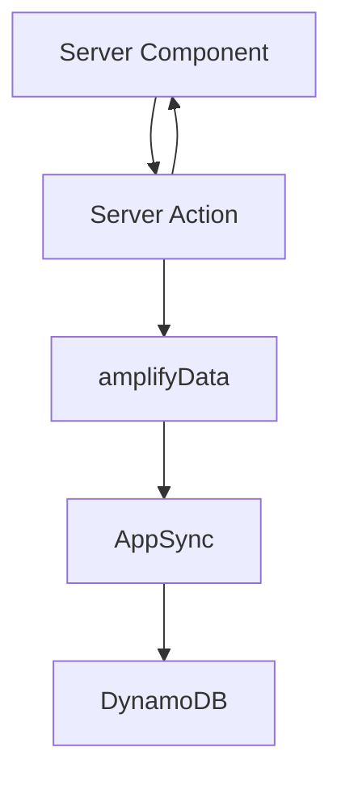

# SERVER_COMPONENTS - Sunday School App

## Document Version: 1.0
**Creation Date:** 23 December 2025  
**Last Update:** 23 December 2025  
**Project:** Sunday School App  
**Technologies:** Next.js 15.5.9 (Server Components, App Router, Server Actions), React 19, TypeScript, AWS Amplify Gen 1 (data via Server Actions), AppSync

> [!NOTE]
> Документация основана на актуальных источниках:
> - Next.js 15.5.9 — официальная документация Vercel  
> - React 19 — официальная документация  
> - AWS Amplify Gen 1 — официальная документация AWS

---

## 1. Обзор
- Цель: описать паттерны использования Server Components (RSC) в проекте, когда их выбирать, как выполнять загрузку данных и композировать с Client Components.
- Default-first: все страницы и компоненты — RSC, Client Components только для интерактивности.

---

## 2. Когда использовать Server Components
- SSR/SEO, чувствительные данные, тяжелые запросы (AppSync/DynamoDB).
- Страницы списков/деталей (lessons, pupils, dashboard).
- Предварительная агрегация/подсчет до клиента; минимизация bundle.
- Не подходят: UI, требующий `useState/useEffect` или браузерных API.

---

## 3. Паттерны загрузки данных
- Прямой fetch/AppSync вызовы внутри RSC (async компоненты) или через Server Actions для унификации логики.
- Предпочтительный подход: Server Action инкапсулирует валидацию/авторизацию → RSC вызывает и получает типизированные данные.
- Кеширование: использовать `fetch` с `revalidate`/`cache` или теги через Server Actions (`revalidateTag`).

---

## 4. Композиция и разделение ответственности
- Layout/Template — RSC: строят каркас страницы, передают данные вниз.
- Организмы (таблицы, списки) — RSC: получают данные, формируют props.
- Client Widgets — встраиваются точечно (например, фильтры, сортировка UI).
- Передача данных: явно через props; избегать дублирующих выборок на клиенте.

---

## 5. Производительность
- Меньше клиентского JS: всё, что можно, оставляем в RSC.
- Потоковая отдача: использовать Suspense boundaries для секций (React 19).
- Избегаем N+1: группируем запросы в Server Action или в одном RSC.
- Кеш прогрева: ISR/`revalidate` для страниц с высокой нагрузкой.

---

## 6. Анти-паттерны
- Не тянуть данные в Client Component, если можно в RSC.
- Не использовать `use client` без необходимости (глобально увеличивает bundle).
- Не выполнять побочные эффекты в RSC (только подготовка данных).
- Избегать дублирования fetch в дочерних RSC — поднимайте запрос выше.

---

## 7. Интеграция с Server Actions
- Мутации: вызываются из Client Components или форм `<form action={...}>`.
- После мутации — `revalidatePath`/`revalidateTag` для RSC-потребителей.
- Ошибки: RSC получают ActionResponse и формируют UI без повторного запроса.

---

## 8. Тестирование
- Снимайте снапшоты RSC (React Testing Library) с подменой данных.
- Контрактные тесты Server Actions: проверка схем/ролей отдельно (см. `SERVER_ACTIONS.md`).

---

## 9. Cross-reference
- Компонентная библиотека: `docs/components/COMPONENT_LIBRARY.md`
- Клиентские компоненты: `docs/components/CLIENT_COMPONENTS.md`
- Архитектура: `docs/architecture/ARCHITECTURE.md`
- Server Actions: `docs/api/SERVER_ACTIONS.md`
- Данные: `docs/database/DYNAMODB_SCHEMA.md`, `docs/database/GRAPHQL_SCHEMA.md`

---

**Версия:** 1.0  
**Последнее обновление:** 23 December 2025  
**Автор:** AI Documentation Team

