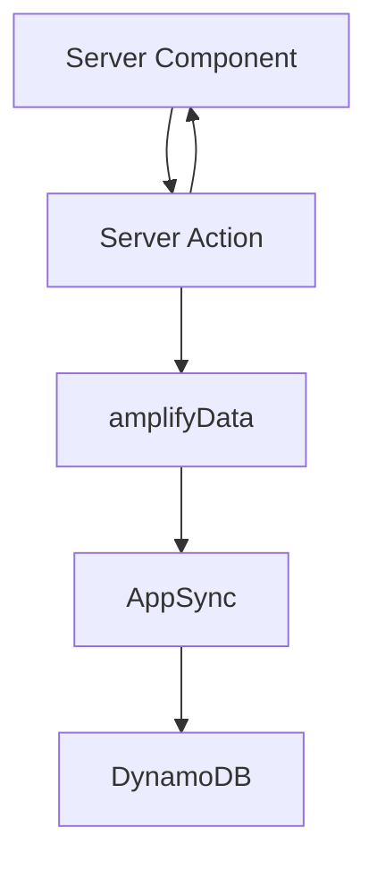

# SERVER_COMPONENTS - Sunday School App

## Document Version: 1.0
**Creation Date:** 23 December 2025  
**Last Update:** 23 December 2025  
**Project:** Sunday School App  
**Technologies:** Next.js 15.5.9 (Server Components, App Router, Server Actions), React 19, TypeScript, AWS Amplify Gen 1 (data via Server Actions), AppSync

> [!NOTE]
> Документация основана на актуальных источниках:
> - Next.js 15.5.9 — официальная документация Vercel  
> - React 19 — официальная документация  
> - AWS Amplify Gen 1 — официальная документация AWS

---

## 1. Обзор
- Цель: описать паттерны использования Server Components (RSC) в проекте, когда их выбирать, как выполнять загрузку данных и композировать с Client Components.
- Default-first: все страницы и компоненты — RSC, Client Components только для интерактивности.

---

## 2. Когда использовать Server Components
- SSR/SEO, чувствительные данные, тяжелые запросы (AppSync/DynamoDB).
- Страницы списков/деталей (lessons, pupils, dashboard).
- Предварительная агрегация/подсчет до клиента; минимизация bundle.
- Не подходят: UI, требующий `useState/useEffect` или браузерных API.

---

## 3. Паттерны загрузки данных
- Прямой fetch/AppSync вызовы внутри RSC (async компоненты) или через Server Actions для унификации логики.
- Предпочтительный подход: Server Action инкапсулирует валидацию/авторизацию → RSC вызывает и получает типизированные данные.
- Кеширование: использовать `fetch` с `revalidate`/`cache` или теги через Server Actions (`revalidateTag`).



---

## 4. Композиция и разделение ответственности
- Layout/Template — RSC: строят каркас страницы, передают данные вниз.
- Организмы (таблицы, списки) — RSC: получают данные, формируют props.
- Client Widgets — встраиваются точечно (например, фильтры, сортировка UI).
- Передача данных: явно через props; избегать дублирующих выборок на клиенте.

---

## 5. Производительность
- Меньше клиентского JS: всё, что можно, оставляем в RSC.
- Потоковая отдача: использовать Suspense boundaries для секций (React 19).
- Избегаем N+1: группируем запросы в Server Action или в одном RSC.
- Кеш прогрева: ISR/`revalidate` для страниц с высокой нагрузкой.

---

## 6. Loading States и Skeleton Components

### 6.1. Требование мгновенной отрисовки страниц

**⚠️ ОБЯЗАТЕЛЬНОЕ ТРЕБОВАНИЕ**: При клике на ссылку, ведущую на страницу приложения, эта страница **ДОЛЖНА** открываться сразу же, несмотря на то, что возможно еще не весь контент этой страницы загружен и отрендерен. Вместо такого контента должен быть отображен **skeleton placeholder** для каждого блока контента. Когда контент подгрузится, skeleton должен исчезнуть.

### 6.2. Использование loading.tsx с Server Components

Next.js App Router автоматически использует `loading.tsx` файлы для отображения loading states во время навигации:

```typescript
// app/(private)/grades/loading.tsx
import { GradeListSkeleton } from '@/components/molecules/grades/grade-list-skeleton';

export default function GradesLoading() {
  return (
    <div className="container mx-auto p-4 md:p-6 lg:p-8">
      <GradeListSkeleton />
    </div>
  );
}
```

**Как это работает:**
1. Пользователь кликает на ссылку → Next.js показывает `loading.tsx` **мгновенно**
2. Server Component (`page.tsx`) загружает данные на сервере
3. После загрузки данных Server Component заменяет `loading.tsx`

### 6.3. Suspense Boundaries для гранулярного контроля

Для более детального контроля над loading states используйте Suspense boundaries:

```typescript
import { Suspense } from 'react';
import { GradeDetailContent } from './grade-detail-content';
import { GradeDetailSkeleton } from '@/components/molecules/grades/grade-detail-skeleton';

export default function GradeDetailPage({ params }: { params: Promise<{ gradeId: string }> }) {
  return (
    <div className="container mx-auto max-w-5xl p-4 md:p-6 lg:p-8">
      <Suspense fallback={<GradeDetailSkeleton />}>
        <GradeDetailContent params={params} />
      </Suspense>
    </div>
  );
}
```

### 6.4. Skeleton Components для Server Components

Skeleton компоненты должны **точно повторять структуру** реального контента:

```typescript
// components/molecules/grades/grade-list-skeleton.tsx
import { Skeleton } from '@/components/ui/skeleton';
import { Card, CardHeader, CardContent } from '@/components/ui/card';

export const GradeListSkeleton = () => {
  return (
    <div className="grid grid-cols-1 gap-4 md:grid-cols-2 lg:grid-cols-3">
      {Array.from({ length: 6 }).map((_, index) => (
        <Card key={index}>
          <CardHeader>
            <Skeleton className="h-6 w-32" />
            <Skeleton className="h-4 w-full mt-2" />
          </CardHeader>
          <CardContent>
            <Skeleton className="h-4 w-24" />
          </CardContent>
        </Card>
      ))}
    </div>
  );
};
```

### 6.5. Интеграция с Server Actions

Server Actions могут триггерить revalidation, что автоматически покажет loading states:

```typescript
'use server';

export async function createGradeAction(data: GradeInput) {
  // ... логика создания
  revalidatePath('/grades'); // Триггерит revalidation
  // Next.js автоматически покажет loading.tsx во время revalidation
}
```

### 6.6. Best Practices

- ✅ **Создавайте loading.tsx** для каждого route, который загружает данные
- ✅ **Используйте skeleton компоненты**, которые точно повторяют структуру реального контента
- ✅ **Обеспечьте responsive design** для skeleton компонентов
- ✅ **Используйте Suspense boundaries** для гранулярного контроля
- ❌ **НЕ показывайте пустые страницы** во время загрузки
- ❌ **НЕ используйте generic "Loading..."** без skeleton

**См. также:**
- `docs/guidelines/nextjs/ai_loading_patterns.md` - подробное руководство по loading patterns
- `docs/guidelines/react/ai_component_guidelines.md` - раздел 10 (Loading States)

---

## 7. Анти-паттерны
- Не тянуть данные в Client Component, если можно в RSC.
- Не использовать `use client` без необходимости (глобально увеличивает bundle).
- Не выполнять побочные эффекты в RSC (только подготовка данных).
- Избегать дублирования fetch в дочерних RSC — поднимайте запрос выше.

---

## 8. Интеграция с Server Actions
- Мутации: вызываются из Client Components или форм `<form action={...}>`.
- После мутации — `revalidatePath`/`revalidateTag` для RSC-потребителей.
- Ошибки: RSC получают ActionResponse и формируют UI без повторного запроса.

---

## 9. Тестирование
- Снимайте снапшоты RSC (React Testing Library) с подменой данных.
- Контрактные тесты Server Actions: проверка схем/ролей отдельно (см. `SERVER_ACTIONS.md`).

---

## 10. Cross-reference
- Компонентная библиотека: `docs/components/COMPONENT_LIBRARY.md`
- Клиентские компоненты: `docs/components/CLIENT_COMPONENTS.md`
- Архитектура: `docs/architecture/ARCHITECTURE.md`
- Server Actions: `docs/api/SERVER_ACTIONS.md`
- Данные: `docs/database/DYNAMODB_SCHEMA.md`, `docs/database/GRAPHQL_SCHEMA.md`
- Loading Patterns: `docs/guidelines/nextjs/ai_loading_patterns.md`
- React Loading States: `docs/guidelines/react/ai_component_guidelines.md` (раздел 10)

---

**Версия:** 1.1  
**Последнее обновление:** 27 December 2025  
**Автор:** AI Documentation Team

