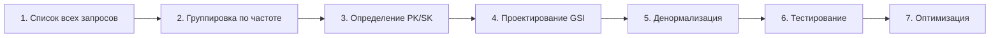

# Data Modeling - Sunday School App

## Версия документа: 1.1
**Дата создания:** 23 декабря 2025  
**Последнее обновление:** 24 декабря 2025  
**Проект:** Sunday School App  
**Технологии:** AWS DynamoDB, AWS AppSync, AWS Amplify Gen 1  
**Modeling Strategy:** Access Patterns First

> [!NOTE]
> Документация основана на актуальных источниках:
> - DynamoDB Data Modeling — AWS best practices
> - NoSQL Design Patterns — AWS официальная документация

---

## 1. Обзор

### 1.1. Особенности NoSQL моделирования

**Ключевое отличие от SQL:**

| Аспект | SQL (PostgreSQL) | NoSQL (DynamoDB) |
|--------|------------------|------------------|
| Дизайн | Data-first (нормализация) | Access Patterns-first |
| Запросы | Flexible (любые JOIN) | Fixed (PK/SK + GSI) |
| Изменения | Schema migrations | Гибкая схема |
| Joins | ✅ Поддерживаются | ❌ Денормализация |
| Performance | Зависит от индексов | Consistent (< 10ms) |

**Принцип NoSQL:**
> "Моделируйте данные для того, **как** вы их будете запрашивать, а не для того, **что** вы храните."

### 1.2. Отличия от реляционных БД

**SQL подход:**
```sql
-- 1. Создаем нормализованные таблицы
CREATE TABLE lessons (id, title, academic_year_id);
CREATE TABLE golden_verses (id, reference, text);
CREATE TABLE lesson_golden_verses (lesson_id, golden_verse_id);

-- 2. Делаем JOIN запросы
SELECT l.*, gv.*
FROM lessons l
JOIN lesson_golden_verses lgv ON l.id = lgv.lesson_id
JOIN golden_verses gv ON lgv.golden_verse_id = gv.id
WHERE l.academic_year_id = 'year-456';
```

**DynamoDB подход:**
```typescript
// 1. Определяем access patterns
// AP-1: Получить урок с золотыми стихами

// 2. Проектируем таблицы и GSI под паттерны
// Lessons table: PK = id
// GSI: academicYearId-lessonDate (для списка уроков года)

// 3. Денормализуем где нужно
// Можно хранить goldenVerseIds[] в Lesson

// 4. Делаем один Query
const lessons = await client.query({
  TableName: 'Lessons',
  IndexName: 'academicYearId-lessonDate-index',
  KeyConditionExpression: 'academicYearId = :yearId',
  ExpressionAttributeValues: { ':yearId': 'year-456' }
});

// 5. Batch Get для связанных данных
const verses = await client.batchGet({
  RequestItems: {
    'GoldenVerses': {
      Keys: lessons.Items.flatMap(l => l.goldenVerseIds.map(id => ({ id })))
    }
  }
});
```

### 1.3. Принцип "Access Patterns First"

**Процесс проектирования:**



**Пример:**

**Шаг 1: Запрос**
- "Получить все уроки группы за учебный год, отсортированные по дате"

**Шаг 2: Частота**
- Очень частый (каждый раз при открытии страницы группы)

**Шаг 3: Решение**
- GSI: `academicYearId-lessonDate-index`
- PK: academicYearId
- SK: lessonDate
- Результат: **1 Query**, отсортированный список

---

## 2. Access Patterns (Полный список)

### 2.1. Users & Authentication

| # | Pattern | Частота | Таблица | Index | Операция |
|---|---------|---------|---------|-------|----------|
| AP-1 | Получить пользователя по ID | Высокая | Users | PK: id | Query |
| AP-2 | Найти пользователя по email | Средняя | Users | GSI: email | Query |
| AP-3 | Список всех преподавателей | Низкая | Users | GSI: role-createdAt | Query |
| AP-4 | Список всех админов | Низкая | Users | GSI: role-createdAt | Query |
| AP-5 | Группы преподавателя | Высокая | UserGrades | GSI: userId | Query |
| AP-6 | Преподаватели группы | Средняя | UserGrades | GSI: gradeId | Query |

**Примеры запросов:**

**AP-1: Получить пользователя по ID**
```typescript
await amplifyData.get('User', { id: 'user-123' });
```

**AP-2: Найти пользователя по email**
```typescript
await client.query({
  TableName: 'Users',
  IndexName: 'email-index',
  KeyConditionExpression: 'email = :email',
  ExpressionAttributeValues: { ':email': 'maria@church.com' }
});
```

**AP-5: Группы преподавателя**
```typescript
await client.query({
  TableName: 'UserGrades',
  IndexName: 'userId-index',
  KeyConditionExpression: 'userId = :userId',
  ExpressionAttributeValues: { ':userId': 'user-123' }
});
```

---

### 2.2. Grades & Academic Years

| # | Pattern | Частота | Таблица | Index | Операция |
|---|---------|---------|---------|-------|----------|
| AP-7 | Получить группу по ID | Высокая | Grades | PK: id | Query |
| AP-8 | Список всех групп | Средняя | Grades | — | Scan |
| AP-9 | Список активных групп | Высокая | Grades | GSI: active-createdAt | Query |
| AP-10 | Годы группы | Высокая | AcademicYears | GSI: gradeId-startDate | Query |
| AP-11 | Активный год группы | Высокая | AcademicYears | GSI: status-gradeId + filter | Query |
| AP-12 | Все активные годы | Средняя | AcademicYears | GSI: status-gradeId | Query |

**Примеры запросов:**

**AP-9: Список активных групп**
```typescript
await client.query({
  TableName: 'Grades',
  IndexName: 'active-createdAt-index',
  KeyConditionExpression: 'active = :active',
  ExpressionAttributeValues: { ':active': 'true' }
});
```

**AP-11: Активный год группы**
```typescript
const result = await client.query({
  TableName: 'AcademicYears',
  IndexName: 'status-gradeId-index',
  KeyConditionExpression: 'status = :status',
  FilterExpression: 'gradeId = :gradeId',
  ExpressionAttributeValues: {
    ':status': 'ACTIVE',
    ':gradeId': 'grade-123'
  }
});
```

---

### 2.3. Lessons

| # | Pattern | Частота | Таблица | Index | Операция |
|---|---------|---------|---------|-------|----------|
| AP-13 | Получить урок по ID | Очень высокая | Lessons | PK: id | Query |
| AP-14 | Уроки учебного года | Очень высокая | Lessons | GSI: academicYearId-lessonDate | Query |
| AP-15 | Уроки группы | Высокая | Lessons | GSI: gradeId-lessonDate | Query |
| AP-16 | Уроки преподавателя | Средняя | Lessons | GSI: teacherId-createdAt | Query |
| AP-17 | Последние N уроков | Средняя | Lessons | GSI: gradeId-lessonDate + limit | Query |
| AP-18 | Уроки за период | Средняя | Lessons | GSI + filter | Query |

**Примеры запросов:**

**AP-14: Уроки учебного года**
```typescript
await client.query({
  TableName: 'Lessons',
  IndexName: 'academicYearId-lessonDate-index',
  KeyConditionExpression: 'academicYearId = :yearId',
  ExpressionAttributeValues: { ':yearId': 'year-456' },
  ScanIndexForward: true // ASC по дате
});
```

**AP-18: Уроки за период**
```typescript
await client.query({
  TableName: 'Lessons',
  IndexName: 'gradeId-lessonDate-index',
  KeyConditionExpression: 'gradeId = :gradeId AND lessonDate BETWEEN :start AND :end',
  ExpressionAttributeValues: {
    ':gradeId': 'grade-123',
    ':start': '2024-09-01',
    ':end': '2024-12-31'
  }
});
```

---

### 2.4. Golden Verses

| # | Pattern | Частота | Таблица | Index | Операция |
|---|---------|---------|---------|-------|----------|
| AP-19 | Получить стих по ID | Высокая | GoldenVerses | PK: id | Query |
| AP-20 | Поиск стиха по ссылке | Средняя | GoldenVerses | GSI: reference | Query |
| AP-21 | Стихи из книги | Низкая | GoldenVerses | GSI: bookId-chapter | Query |
| AP-22 | Все стихи (библиотека) | Низкая | GoldenVerses | — | Scan |
| AP-23 | Стихи урока | Очень высокая | LessonGoldenVerses | GSI: lessonId-order | Query |
| AP-24 | Статистика стиха | Низкая | LessonGoldenVerses | GSI: goldenVerseId + count | Query |
| AP-25 | Список стихов группы за учебный год | Средняя | Lessons + LessonGoldenVerses + GoldenVerses | GSI-1 (Lessons) + GSI-1 (LessonGoldenVerses) + Batch Get | Query |
| AP-26 | Аналитика сложности стихов | Средняя | HomeworkChecks + Lessons + LessonGoldenVerses | GSI-3 (HomeworkChecks) + GSI-1 (Lessons) + GSI-1 (LessonGoldenVerses) + GSI-2 (LessonGoldenVerses) | Query |

**Примеры запросов:**

**AP-20: Поиск стиха по ссылке**
```typescript
await client.query({
  TableName: 'GoldenVerses',
  IndexName: 'reference-index',
  KeyConditionExpression: 'reference = :ref',
  ExpressionAttributeValues: { ':ref': 'Иоанна 3:16' }
});
```

**AP-21: Стихи из книги**
```typescript
await client.query({
  TableName: 'GoldenVerses',
  IndexName: 'bookId-chapter-index',
  KeyConditionExpression: 'bookId = :bookId',
  ExpressionAttributeValues: { ':bookId': 'book-123' },
  ScanIndexForward: true // ASC по главе
});
```

**AP-23: Стихи урока**
```typescript
await client.query({
  TableName: 'LessonGoldenVerses',
  IndexName: 'lessonId-order-index',
  KeyConditionExpression: 'lessonId = :lessonId',
  ExpressionAttributeValues: { ':lessonId': 'lesson-789' },
  ScanIndexForward: true // Сортировка по order
});
```

**AP-25: Список стихов группы за учебный год**
```typescript
// 1. Получить все уроки учебного года
const lessons = await client.query({
  TableName: 'Lessons',
  IndexName: 'academicYearId-lessonDate-index',
  KeyConditionExpression: 'academicYearId = :yearId',
  ExpressionAttributeValues: { ':yearId': 'year-456' },
  ScanIndexForward: true // ASC по дате
});

// 2. Для каждого урока получить стихи
const lessonVerseIds = [];
for (const lesson of lessons.Items) {
  const lessonVerses = await client.query({
    TableName: 'LessonGoldenVerses',
    IndexName: 'lessonId-order-index',
    KeyConditionExpression: 'lessonId = :lessonId',
    ExpressionAttributeValues: { ':lessonId': lesson.id }
  });
  lessonVerseIds.push(...lessonVerses.Items.map(lv => lv.goldenVerseId));
}

// 3. Дедупликация и Batch Get стихов
const uniqueVerseIds = [...new Set(lessonVerseIds)];
const verses = await client.batchGet({
  RequestItems: {
    'GoldenVerses': {
      Keys: uniqueVerseIds.map(id => ({ id }))
    }
  }
});

// Результат: список уникальных стихов с reference и text
```

**AP-26: Аналитика сложности стихов**
```typescript
// 1. Получить все проверки группы за учебный год
const checks = await client.query({
  TableName: 'HomeworkChecks',
  IndexName: 'gradeId-createdAt-index',
  KeyConditionExpression: 'gradeId = :gradeId AND createdAt BETWEEN :start AND :end',
  ExpressionAttributeValues: {
    ':gradeId': 'grade-123',
    ':start': '2024-09-01T00:00:00Z',
    ':end': '2025-05-31T23:59:59Z'
  }
});

// 2. Для каждой проверки получить урок и стихи урока
const verseStats = new Map<string, { totalChecks: number; maxScoreCount: number; totalScore: number }>();

for (const check of checks.Items) {
  // Получить урок
  const lesson = await amplifyData.get('Lesson', { id: check.lessonId });
  
  // Получить стихи урока
  const lessonVerses = await client.query({
    TableName: 'LessonGoldenVerses',
    IndexName: 'lessonId-order-index',
    KeyConditionExpression: 'lessonId = :lessonId',
    ExpressionAttributeValues: { ':lessonId': check.lessonId },
    ScanIndexForward: true // ASC по order
  });
  
  // Сопоставить баллы со стихами
  lessonVerses.Items.forEach((lv, index) => {
    const score = index === 0 ? check.goldenVerse1Score : 
                  index === 1 ? check.goldenVerse2Score : 
                  check.goldenVerse3Score;
    
    if (!verseStats.has(lv.goldenVerseId)) {
      verseStats.set(lv.goldenVerseId, { totalChecks: 0, maxScoreCount: 0, totalScore: 0 });
    }
    
    const stats = verseStats.get(lv.goldenVerseId)!;
    stats.totalChecks++;
    stats.totalScore += score || 0;
    if (score === 2) stats.maxScoreCount++;
  });
}

// 3. Агрегация результатов
const difficultyAnalysis = Array.from(verseStats.entries()).map(([verseId, stats]) => ({
  goldenVerseId: verseId,
  totalChecks: stats.totalChecks,
  maxScoreCount: stats.maxScoreCount,
  successRate: (stats.maxScoreCount / stats.totalChecks) * 100,
  averageScore: stats.totalScore / stats.totalChecks,
  difficultyLevel: stats.maxScoreCount / stats.totalChecks > 0.8 ? 'легкий' :
                    stats.maxScoreCount / stats.totalChecks > 0.5 ? 'средний' : 'сложный'
}));

// Результат: список стихов с метриками сложности
```

---

### 2.5. Books (Книги Библии)

| # | Pattern | Частота | Таблица | Index | Операция |
|---|---------|---------|---------|-------|----------|
| AP-48 | Получить книгу по ID | Высокая | Books | PK: id | Query |
| AP-49 | Список всех книг | Средняя | Books | — | Scan |
| AP-50 | Книги по завету | Средняя | Books | GSI: testament-order | Query |
| AP-51 | Поиск книги по названию | Средняя | Books | GSI: shortName | Query |
| AP-52 | Книги в порядке Библии | Средняя | Books | GSI: testament-order | Query |

**Примеры запросов:**

**AP-48: Получить книгу по ID**
```typescript
await amplifyData.get('Book', { id: 'book-123' });
```

**AP-50: Книги по завету**
```typescript
await client.query({
  TableName: 'Books',
  IndexName: 'testament-order-index',
  KeyConditionExpression: 'testament = :testament',
  ExpressionAttributeValues: { ':testament': 'NEW' },
  ScanIndexForward: true // ASC по order
});
```

**AP-51: Поиск книги по названию**
```typescript
await client.query({
  TableName: 'Books',
  IndexName: 'shortName-index',
  KeyConditionExpression: 'shortName = :name',
  ExpressionAttributeValues: { ':name': 'Иоанна' }
});
```

---

### 2.7. Pupils

| # | Pattern | Частота | Таблица | Index | Операция |
|---|---------|---------|---------|-------|----------|
| AP-25 | Получить ученика по ID | Очень высокая | Pupils | PK: id | Query |
| AP-26 | Ученики группы | Очень высокая | Pupils | GSI: gradeId-lastName | Query |
| AP-27 | Активные ученики группы | Очень высокая | Pupils | GSI: active-gradeId + filter | Query |
| AP-28 | Все ученики (админ) | Низкая | Pupils | — | Scan |
| AP-29 | Поиск ученика по имени | Средняя | Pupils | Scan + filter | Scan |
| AP-30 | Баллы по показателям за учебный год | Высокая | HomeworkChecks | GSI-2: pupilId-createdAt | Query |
| AP-31 | Баллы по показателям за период дат | Высокая | HomeworkChecks | GSI-2: pupilId-createdAt | Query |

**Примеры запросов:**

**AP-26: Ученики группы**
```typescript
await client.query({
  TableName: 'Pupils',
  IndexName: 'gradeId-lastName-index',
  KeyConditionExpression: 'gradeId = :gradeId',
  ExpressionAttributeValues: { ':gradeId': 'grade-123' },
  ScanIndexForward: true // Сортировка по lastName
});
```

**AP-27: Активные ученики группы**
```typescript
await client.query({
  TableName: 'Pupils',
  IndexName: 'active-gradeId-index',
  KeyConditionExpression: 'active = :active',
  FilterExpression: 'gradeId = :gradeId',
  ExpressionAttributeValues: {
    ':active': 'true',
    ':gradeId': 'grade-123'
  }
});
```

**AP-30: Баллы по показателям за учебный год**
```typescript
// 1. Получить учебный год
const academicYear = await amplifyData.get('AcademicYear', { id: 'year-456' });

// 2. Получить все проверки ученика за период учебного года
const checks = await client.query({
  TableName: 'HomeworkChecks',
  IndexName: 'pupilId-createdAt-index',
  KeyConditionExpression: 'pupilId = :pupilId AND createdAt BETWEEN :start AND :end',
  ExpressionAttributeValues: {
    ':pupilId': 'pupil-222',
    ':start': academicYear.startDate + 'T00:00:00Z',
    ':end': academicYear.endDate + 'T23:59:59Z'
  },
  ScanIndexForward: true // ASC по дате
});

// 3. Агрегация показателей
const stats = {
  totalPoints: 0,
  lessonsCount: checks.Items.length,
  lessonsAttended: checks.Items.filter(c => c.points > 0).length,
  goldenVerseTotal: 0,
  testTotal: 0,
  notebookTotal: 0,
  singingCount: 0,
  attendanceRate: 0
};

checks.Items.forEach(check => {
  stats.totalPoints += check.points || 0;
  stats.goldenVerseTotal += (check.goldenVerse1Score || 0) + 
                            (check.goldenVerse2Score || 0) + 
                            (check.goldenVerse3Score || 0);
  stats.testTotal += check.testScore || 0;
  stats.notebookTotal += check.notebookScore || 0;
  if (check.singing) stats.singingCount++;
});

stats.attendanceRate = (stats.lessonsAttended / stats.lessonsCount) * 100;

// Результат: агрегированная статистика с посещаемостью и спевками
```

**AP-31: Баллы по показателям за период дат**
```typescript
// 1. Получить все проверки ученика за указанный период
const checks = await client.query({
  TableName: 'HomeworkChecks',
  IndexName: 'pupilId-createdAt-index',
  KeyConditionExpression: 'pupilId = :pupilId AND createdAt BETWEEN :start AND :end',
  ExpressionAttributeValues: {
    ':pupilId': 'pupil-222',
    ':start': '2024-09-01T00:00:00Z',
    ':end': '2024-12-31T23:59:59Z'
  },
  ScanIndexForward: true // ASC по дате
});

// 2. Агрегация показателей (аналогично AP-30)
const stats = {
  totalPoints: 0,
  lessonsCount: checks.Items.length,
  lessonsAttended: checks.Items.filter(c => c.points > 0).length,
  goldenVerseTotal: 0,
  testTotal: 0,
  notebookTotal: 0,
  singingCount: 0,
  attendanceRate: 0
};

checks.Items.forEach(check => {
  stats.totalPoints += check.points || 0;
  stats.goldenVerseTotal += (check.goldenVerse1Score || 0) + 
                            (check.goldenVerse2Score || 0) + 
                            (check.goldenVerse3Score || 0);
  stats.testTotal += check.testScore || 0;
  stats.notebookTotal += check.notebookScore || 0;
  if (check.singing) stats.singingCount++;
});

stats.attendanceRate = (stats.lessonsAttended / stats.lessonsCount) * 100;

// Результат: агрегированная статистика за период с посещаемостью и спевками
```

---

### 2.8. Homework Checks

> [!IMPORTANT]
> **Критически важно:** Для поддержки аналитики (AP-ANALYTICS-3, AP-ANALYTICS-4) в таблице HomeworkChecks необходимо поле `gradeId` (денормализация из Lesson.gradeId) и GSI-3 (gradeId-createdAt-index). Это должно быть реализовано на этапе MVP, даже если сам функционал аналитики будет реализован post-MVP.

| # | Pattern | Частота | Таблица | Index | Операция |
|---|---------|---------|---------|-------|----------|
| AP-30 | Получить проверку по ID | Средняя | HomeworkChecks | PK: id | Query |
| AP-31 | Проверки урока | Очень высокая | HomeworkChecks | GSI: lessonId-pupilId | Query |
| AP-32 | История ученика | Очень высокая | HomeworkChecks | GSI: pupilId-createdAt | Query |
| AP-33 | Проверка существования | Высокая | HomeworkChecks | GSI: lessonId-pupilId + filter | Query |
| AP-34 | Статистика ученика (баллы) | Высокая | HomeworkChecks | GSI: pupilId + aggregate | Query |
| AP-35 | Статистика баллов ученика | Средняя | HomeworkChecks | GSI: pupilId + aggregate | Query |

**Примеры запросов:**

**AP-31: Проверки урока**
```typescript
await client.query({
  TableName: 'HomeworkChecks',
  IndexName: 'lessonId-pupilId-index',
  KeyConditionExpression: 'lessonId = :lessonId',
  ExpressionAttributeValues: { ':lessonId': 'lesson-789' }
});
```

**AP-32: История ученика**
```typescript
await client.query({
  TableName: 'HomeworkChecks',
  IndexName: 'pupilId-createdAt-index',
  KeyConditionExpression: 'pupilId = :pupilId',
  ExpressionAttributeValues: { ':pupilId': 'pupil-222' },
  ScanIndexForward: false, // DESC (новые сначала)
  Limit: 50
});
```

**AP-34: Статистика ученика (баллы)**
```typescript
const checks = await client.query({
  TableName: 'HomeworkChecks',
  IndexName: 'pupilId-createdAt-index',
  KeyConditionExpression: 'pupilId = :pupilId',
  ExpressionAttributeValues: { ':pupilId': 'pupil-222' }
});

// Агрегация на стороне приложения
const totalPoints = checks.Items.reduce((sum, check) => sum + check.points, 0);
const averagePoints = totalPoints / checks.Items.length;
const pointsByCategory = {
  goldenVerses: checks.Items.reduce((sum, check) => 
    sum + (check.goldenVerse1Score || 0) + (check.goldenVerse2Score || 0) + (check.goldenVerse3Score || 0), 0),
  test: checks.Items.reduce((sum, check) => sum + (check.testScore || 0), 0),
  notebook: checks.Items.reduce((sum, check) => sum + (check.notebookScore || 0), 0),
  singing: checks.Items.filter(check => check.singing).length * gradeSettings.pointsSinging
};
```

**AP-35: Статистика баллов ученика**
```typescript
const checks = await client.query({
  TableName: 'HomeworkChecks',
  IndexName: 'pupilId-createdAt-index',
  KeyConditionExpression: 'pupilId = :pupilId',
  ExpressionAttributeValues: {
    ':pupilId': 'pupil-222'
  }
});

// Агрегация баллов по категориям для отображения разбивки
const stats = {
  totalPoints: checks.Items.reduce((sum, check) => sum + check.points, 0),
  pointsByCategory: {
    goldenVerses: checks.Items.reduce((sum, check) => 
      sum + (check.goldenVerse1Score || 0) + (check.goldenVerse2Score || 0) + (check.goldenVerse3Score || 0), 0),
    test: checks.Items.reduce((sum, check) => sum + (check.testScore || 0), 0),
    notebook: checks.Items.reduce((sum, check) => sum + (check.notebookScore || 0), 0),
    singing: checks.Items.filter(check => check.singing).length * gradeSettings.pointsSinging
  }
};
```

---

### 2.9. Achievements

| # | Pattern | Частота | Таблица | Index | Операция |
|---|---------|---------|---------|-------|----------|
| AP-36 | Получить достижение по ID | Средняя | Achievements | PK: id | Query |
| AP-37 | Все достижения | Средняя | Achievements | — | Scan |
| AP-38 | Поиск по названию | Низкая | Achievements | GSI: name | Query |
| AP-39 | Достижения ученика | Высокая | PupilAchievements | GSI: pupilId-awardedAt | Query |
| AP-40 | Статистика достижения | Низкая | PupilAchievements | GSI: achievementId + count | Query |

**Примеры запросов:**

**AP-39: Достижения ученика**
```typescript
await client.query({
  TableName: 'PupilAchievements',
  IndexName: 'pupilId-awardedAt-index',
  KeyConditionExpression: 'pupilId = :pupilId',
  ExpressionAttributeValues: { ':pupilId': 'pupil-222' },
  ScanIndexForward: false // Новые сначала
});
```

---

### 2.10. Families

| # | Pattern | Частота | Таблица | Index | Операция |
|---|---------|---------|---------|-------|----------|
| AP-41 | Получить семью по ID | Средняя | Families | PK: id | Query |
| AP-42 | Все семьи | Низкая | Families | — | Scan |
| AP-43 | Члены семьи | Средняя | FamilyMembers | GSI: familyId | Query |
| AP-44 | Семьи ученика | Средняя | FamilyMembers | GSI: pupilId | Query |

---

### 2.11. Grade Events & Settings

| # | Pattern | Частота | Таблица | Index | Операция |
|---|---------|---------|---------|-------|----------|
| AP-45 | События группы | Высокая | GradeEvents | GSI: gradeId-eventDate | Query |
| AP-46 | События за месяц | Высокая | GradeEvents | GSI: gradeId-eventDate + filter | Query |
| AP-47 | Настройки группы | Очень высокая | GradeSettings | GSI: gradeId | Query |

**Примеры запросов:**

**AP-46: События за месяц**
```typescript
await client.query({
  TableName: 'GradeEvents',
  IndexName: 'gradeId-eventDate-index',
  KeyConditionExpression: 'gradeId = :gradeId AND eventDate BETWEEN :start AND :end',
  ExpressionAttributeValues: {
    ':gradeId': 'grade-123',
    ':start': '2024-09-01',
    ':end': '2024-09-30'
  }
});
```

---

### 2.12. Analytics Access Patterns (Post-MVP функционал)

> [!IMPORTANT]
> **Критически важно:** Access patterns для аналитики определяют дизайн базы данных. GSI-3 для HomeworkChecks (gradeId-createdAt-index) должен быть создан на этапе MVP, даже если сам функционал аналитики будет реализован post-MVP. См. [ANALYTICS.md](ANALYTICS.md) для полной документации.

**Назначение:** Access patterns для генерации аналитических отчетов и графиков успеваемости учеников и групп.

| # | Pattern | Частота | Таблица | Index | Операция |
|---|---------|---------|---------|-------|----------|
| AP-ANALYTICS-1 | История успеваемости ученика за период | Высокая | HomeworkChecks | GSI-2: pupilId-createdAt | Query |
| AP-ANALYTICS-2 | Агрегированная статистика ученика | Высокая | HomeworkChecks | GSI-2 + агрегация | Query |
| AP-ANALYTICS-3 | История успеваемости группы за период | Высокая | HomeworkChecks | GSI-3: gradeId-createdAt | Query |
| AP-ANALYTICS-4 | Топ учеников группы | Средняя | HomeworkChecks | GSI-3 + сортировка | Query |
| AP-ANALYTICS-5 | Сравнительная статистика групп | Низкая | HomeworkChecks + Grades | Multiple queries | Query |

**Примеры запросов:**

**AP-ANALYTICS-1: История успеваемости ученика за период**
```typescript
await client.query({
  TableName: 'HomeworkChecks',
  IndexName: 'pupilId-createdAt-index',
  KeyConditionExpression: 'pupilId = :pupilId AND createdAt BETWEEN :start AND :end',
  ExpressionAttributeValues: {
    ':pupilId': 'pupil-123',
    ':start': '2024-09-01T00:00:00Z',
    ':end': '2024-12-31T23:59:59Z'
  },
  ScanIndexForward: true // ASC по дате
});
```

**AP-ANALYTICS-2: Агрегированная статистика ученика**
```typescript
// 1. Получить все проверки
const checks = await client.query({
  TableName: 'HomeworkChecks',
  IndexName: 'pupilId-createdAt-index',
  KeyConditionExpression: 'pupilId = :pupilId AND createdAt BETWEEN :start AND :end',
  ExpressionAttributeValues: {
    ':pupilId': 'pupil-123',
    ':start': '2024-09-01T00:00:00Z',
    ':end': '2024-12-31T23:59:59Z'
  }
});

// 2. Агрегация на клиенте
const stats = {
  totalPoints: checks.Items.reduce((sum, check) => sum + check.points, 0),
  averagePoints: checks.Items.reduce((sum, check) => sum + check.points, 0) / checks.Items.length,
  lessonsCount: checks.Items.length,
  // ... другие метрики
};
```

**AP-ANALYTICS-3: История успеваемости группы за период** ⭐ **Требует GSI-3**
```typescript
await client.query({
  TableName: 'HomeworkChecks',
  IndexName: 'gradeId-createdAt-index', // GSI-3 (должен быть создан на этапе MVP)
  KeyConditionExpression: 'gradeId = :gradeId AND createdAt BETWEEN :start AND :end',
  ExpressionAttributeValues: {
    ':gradeId': 'grade-123',
    ':start': '2024-09-01T00:00:00Z',
    ':end': '2024-12-31T23:59:59Z'
  },
  ScanIndexForward: true
});
```

**AP-ANALYTICS-4: Топ учеников группы**
```typescript
// 1. Получить все проверки группы
const checks = await client.query({
  TableName: 'HomeworkChecks',
  IndexName: 'gradeId-createdAt-index',
  KeyConditionExpression: 'gradeId = :gradeId AND createdAt BETWEEN :start AND :end',
  ExpressionAttributeValues: {
    ':gradeId': 'grade-123',
    ':start': '2024-09-01T00:00:00Z',
    ':end': '2024-12-31T23:59:59Z'
  }
});

// 2. Агрегация по ученикам и сортировка
const pupilStats = checks.Items.reduce((acc, check) => {
  if (!acc[check.pupilId]) {
    acc[check.pupilId] = { pupilId: check.pupilId, totalPoints: 0, lessonsCount: 0 };
  }
  acc[check.pupilId].totalPoints += check.points;
  acc[check.pupilId].lessonsCount += 1;
  return acc;
}, {});

// 3. Сортировка и топ-10
const topPupils = Object.values(pupilStats)
  .sort((a, b) => b.totalPoints - a.totalPoints)
  .slice(0, 10);
```

**AP-ANALYTICS-5: Сравнительная статистика групп**
```typescript
// Параллельные запросы для нескольких групп
const [group1Stats, group2Stats, group3Stats] = await Promise.all([
  getGroupStats('grade-123', startDate, endDate),
  getGroupStats('grade-456', startDate, endDate),
  getGroupStats('grade-789', startDate, endDate)
]);

// Сравнение
const comparison = {
  group1: group1Stats,
  group2: group2Stats,
  group3: group3Stats,
  average: calculateAverage([group1Stats, group2Stats, group3Stats])
};
```

**Стратегия агрегации:**

1. **Для небольших периодов (< 1 месяца):**
   - Агрегация на клиенте после Query
   - Не требуется дополнительная таблица

2. **Для больших периодов (> 3 месяцев):**
   - Использовать опциональную таблицу `AnalyticsAggregates` (кэширование)
   - Обновлять агрегаты при изменении данных
   - См. [ANALYTICS.md](ANALYTICS.md) для деталей

**Оптимизация производительности:**

- Ограничивать период запросов (максимум 1 год за раз)
- Использовать параллельные запросы для нескольких групп (Promise.all)
- Для часто запрашиваемых данных использовать кэширование (AnalyticsAggregates)

**Подробнее:** См. [ANALYTICS.md](ANALYTICS.md) для полной документации по аналитике, включая все показатели успеваемости, формулы расчета и примеры визуализации.

---

## 3. Single Table Design vs Multiple Tables

### 3.1. Обзор подходов

**Single Table Design:**
- Все данные в одной таблице
- Composite PK/SK для разных типов сущностей
- Меньше запросов, больше сложности

**Multiple Tables Design:**
- Отдельная таблица для каждой сущности
- Простой дизайн, больше запросов
- Легко добавлять новые сущности

### 3.2. Выбор для Sunday School App

**✅ Выбран: Multiple Tables Design**

**Обоснование:**

✅ **Преимущества для MVP:**
- Простота разработки
- Amplify автоматически создает таблицы из @model
- Легко понять и поддерживать
- Достаточная производительность для нашей нагрузки
- Проще отладка

❌ **Недостатки Single Table (почему НЕ выбран):**
- Сложность проектирования (steep learning curve)
- Amplify не поддерживает Single Table из коробки
- Сложно адаптировать под изменения
- Требует глубокого знания DynamoDB
- Избыточен для размера данных MVP

**Когда рассмотреть Single Table:**
- Если нагрузка превысит 10,000 req/sec
- Если нужны сложные транзакции
- Если стоимость запросов критична
- Если нужны cross-entity queries за 1 запрос

### 3.3. Сравнение

| Характеристика | Multiple Tables | Single Table |
|----------------|-----------------|--------------|
| Complexity | ✅ Низкая | ❌ Высокая |
| Learning Curve | ✅ Легкая | ❌ Сложная |
| Amplify Support | ✅ Отличная | ❌ Нет |
| Queries per page | ⚠️ 3-5 | ✅ 1-2 |
| Flexibility | ✅ Высокая | ⚠️ Средняя |
| Cost (MVP) | ✅ $0.50/mo | ✅ $0.50/mo |
| Scaling | ✅ До 10K req/s | ✅ > 100K req/s |

---

## 4. Стратегия ключей

### 4.1. Выбор Partition Keys

**Правило:** PK должен равномерно распределять данные по партициям.

**✅ Хорошие PK:**
- UUID (уникальный для каждой записи)
- User ID (если записи распределены по пользователям)
- Grade ID (если записи распределены по группам)

**❌ Плохие PK:**
- Дата (все записи одного дня в одной партиции → hot partition)
- Status (ACTIVE/FINISHED → только 2 партиции)
- Boolean (true/false → только 2 партиции)

**Примеры в проекте:**

| Таблица | PK | Обоснование |
|---------|----|----|
| Users | id (UUID) | ✅ Уникальный, равномерное распределение |
| Lessons | id (UUID) | ✅ Уникальный, равномерное распределение |
| HomeworkChecks | id (UUID) | ✅ Уникальный, равномерное распределение |

### 4.2. Выбор Sort Keys

**Правило:** SK используется для:
- Сортировки результатов
- Range queries (BETWEEN, <, >)
- Уникальности в рамках PK

**Примеры:**

| GSI | PK | SK | Use Case |
|-----|----|----|----------|
| academicYearId-lessonDate | academicYearId | lessonDate | Уроки года (отсортированные) |
| pupilId-createdAt | pupilId | createdAt | История ученика (новые сначала) |
| gradeId-lastName | gradeId | lastName | Ученики группы (по алфавиту) |

### 4.3. Composite Keys

**Когда использовать:**
- Для уникальности пары значений
- Для эффективных многоуровневых запросов

**Пример:**
```
PK: gradeId
SK: pupilId#lastName
→ Уникальная пара + сортировка по lastName
```

**В нашем проекте:**
- Простые ключи (не composite)
- Composite только для связующих таблиц (UserGrade, LessonGoldenVerse)

---

## 5. Global Secondary Indexes (GSI)

### 5.1. Когда создавать GSI

**✅ Создавать GSI когда:**
- Нужен альтернативный способ запроса данных
- Частый паттерн доступа (не Scan)
- Сортировка по полю отличному от PK/SK

**❌ НЕ создавать GSI когда:**
- Редкий запрос (можно Scan маленькой таблицы)
- Можно использовать filter на существующем GSI
- Таблица маленькая (< 1000 записей)

### 5.2. Проектирование GSI для access patterns

**Процесс:**

1. **Определить паттерн:**
   - "Получить все уроки учебного года, отсортированные по дате"

2. **Определить PK GSI:**
   - Что фильтруем: academicYearId

3. **Определить SK GSI:**
   - Как сортируем: lessonDate

4. **Создать GSI:**
   - Name: `academicYearId-lessonDate-index`
   - PK: academicYearId
   - SK: lessonDate
   - Projection: ALL (или KEYS_ONLY если достаточно)

5. **Тестировать:**
   ```typescript
   await client.query({
     TableName: 'Lessons',
     IndexName: 'academicYearId-lessonDate-index',
     KeyConditionExpression: 'academicYearId = :yearId',
     ExpressionAttributeValues: { ':yearId': 'year-456' }
   });
   ```

### 5.3. Примеры GSI в проекте

**Users:**
- GSI-1: email (для поиска по email)
- GSI-2: role-createdAt (для списков по роли)

**Lessons:**
- GSI-1: academicYearId-lessonDate (уроки года)
- GSI-2: gradeId-lessonDate (уроки группы)
- GSI-3: teacherId-createdAt (уроки преподавателя)

**HomeworkChecks:**
- GSI-1: lessonId-pupilId (проверки урока)
- GSI-2: pupilId-createdAt (история ученика)
- GSI-3: gradeId-createdAt (аналитика группы, история успеваемости, аналитика сложности стихов)

**Pupils:**
- GSI-1: gradeId-lastName (ученики группы)
- GSI-2: active-gradeId (активные ученики)

**Books:**
- GSI-1: shortName (поиск по сокращенному названию)
- GSI-2: testament-order (книги по завету, отсортированные)

**GoldenVerses:**
- GSI-1: reference (поиск по ссылке)
- GSI-2: bookId-chapter (стихи из книги, отсортированные по главе)

**LessonGoldenVerses:**
- GSI-1: lessonId-order (стихи урока, отсортированные)
- GSI-2: goldenVerseId (статистика использования стиха, аналитика сложности)
- **Опционально (post-MVP):** GSI-3: academicYearId-goldenVerseId (оптимизация для AP-25, требует денормализации academicYearId)

---

## 6. Оптимизация запросов

### 6.1. Избегать Scan operations

**Правило:** Scan читает всю таблицу → дорого и медленно.

**✅ Хорошо (Query):**
```typescript
await client.query({
  TableName: 'Lessons',
  IndexName: 'gradeId-lessonDate-index',
  KeyConditionExpression: 'gradeId = :gradeId',
  ExpressionAttributeValues: { ':gradeId': 'grade-123' }
});
// Cost: 1 RCU per 4 KB
// Time: < 10ms
```

**❌ Плохо (Scan):**
```typescript
await client.scan({
  TableName: 'Lessons',
  FilterExpression: 'gradeId = :gradeId',
  ExpressionAttributeValues: { ':gradeId': 'grade-123' }
});
// Cost: N RCU (вся таблица)
// Time: > 100ms
```

**Когда Scan допустим:**
- Маленькие таблицы (< 1000 записей): Achievements, GradeSettings
- Background jobs (export данных)
- Admin операции (редкие)

### 6.2. Batch операции

**BatchGetItem:**
```typescript
// Получить несколько учеников одним запросом
await client.batchGet({
  RequestItems: {
    'Pupils': {
      Keys: [
        { id: 'pupil-1' },
        { id: 'pupil-2' },
        { id: 'pupil-3' }
      ]
    }
  }
});
// До 100 items за раз
```

**BatchWriteItem:**
```typescript
// Создать несколько HomeworkChecks одним запросом
await client.batchWrite({
  RequestItems: {
    'HomeworkChecks': [
      { PutRequest: { Item: check1 } },
      { PutRequest: { Item: check2 } },
      { PutRequest: { Item: check3 } }
    ]
  }
});
// До 25 items за раз
```

**Когда использовать:**
- Массовая проверка ДЗ (создание checks для всех учеников)
- Загрузка данных для рейтинга (получить всех учеников)

### 6.3. Pagination для больших списков

**Проблема:** Большие таблицы (> 1000 записей) нельзя загрузить за раз.

**Решение:** NextToken pagination

```typescript
let nextToken = null;
const allLessons = [];

do {
  const result = await client.query({
    TableName: 'Lessons',
    IndexName: 'academicYearId-lessonDate-index',
    KeyConditionExpression: 'academicYearId = :yearId',
    ExpressionAttributeValues: { ':yearId': 'year-456' },
    Limit: 100,
    ExclusiveStartKey: nextToken
  });
  
  allLessons.push(...result.Items);
  nextToken = result.LastEvaluatedKey;
} while (nextToken);
```

**Для UI:**
- Использовать infinite scroll или pagination
- Загружать по 20-50 записей за раз
- Показывать "Load More" кнопку

### 6.4. Кеширование часто запрашиваемых данных

**Что кешировать:**
- GradeSettings (меняются редко)
- Список Achievements
- Список GoldenVerses

**Как:**

**Next.js cache:**
```typescript
import { cache } from 'react';

const getGradeSettings = cache(async (gradeId: string) => {
  return await amplifyData.get('GradeSettings', { gradeId });
});

// Revalidate каждые 60 секунд
export const revalidate = 60;
```

**In-memory cache:**
```typescript
const settingsCache = new Map<string, GradeSettings>();

async function getGradeSettings(gradeId: string) {
  if (settingsCache.has(gradeId)) {
    return settingsCache.get(gradeId);
  }
  
  const settings = await amplifyData.get('GradeSettings', { gradeId });
  settingsCache.set(gradeId, settings);
  return settings;
}
```

**AppSync Caching:**
- Настроить TTL для resolvers (60-300 секунд)
- Для часто запрашиваемых queries
- Автоматическая invalidation при mutations

---

## 7. Денормализация данных

### 7.1. Когда дублировать данные

**Правило:** Денормализация уместна когда:
- Избегаем дополнительных запросов
- Данные меняются редко
- Trade-off: storage vs performance

**Примеры в проекте:**

**Lesson.gradeId:**
- Хотя есть `Lesson → AcademicYear → Grade`
- Храним gradeId в Lesson для быстрого доступа
- **Плюс:** Один Query вместо двух
- **Минус:** Нужно обновлять при переносе урока (редко)

**HomeworkCheck.gradeId:**
- Хотя есть `HomeworkCheck → Lesson → Grade`
- Храним gradeId в HomeworkCheck для поддержки GSI-3 (аналитика)
- **Плюс:** Эффективные запросы истории успеваемости группы без дополнительных запросов к Lessons
- **Минус:** Нужно обновлять при изменении группы урока (редко)
- **Критически важно:** GSI-3 (gradeId-createdAt-index) необходим для аналитики и должен быть создан на этапе MVP

**HomeworkCheck (возможная денормализация):**
```typescript
type HomeworkCheck {
  id: string;
  lessonId: string;
  pupilId: string;
  // Денормализация для отображения без доп. запросов
  pupilFirstName: string; // ← из Pupil
  pupilLastName: string;  // ← из Pupil
  lessonTitle: string;    // ← из Lesson
  // ...
}
```

**Плюсы:**
- Отображение таблицы проверок без JOIN
- Faster rendering

**Минусы:**
- При изменении имени ученика нужно обновить все checks
- Больше storage

**Решение для MVP:** Не денормализуем имена, делаем batch get для Pupils при отображении

### 7.2. Trade-offs между storage и performance

| Аспект | Нормализация | Денормализация |
|--------|--------------|----------------|
| Storage | ✅ Меньше | ❌ Больше |
| Performance | ⚠️ Больше запросов | ✅ Меньше запросов |
| Consistency | ✅ Одно место правды | ❌ Нужно синхронизировать |
| Complexity | ✅ Простая | ❌ Сложная |

**Рекомендация для MVP:**
- Минимальная денормализация
- Только когда критично для производительности
- Четко документировать денормализованные поля

### 7.3. Примеры в проекте

**✅ Денормализуем:**
- `Lesson.gradeId` (хотя есть через AcademicYear)
- `HomeworkCheck.gradeId` (хотя есть через Lesson, необходимо для GSI-3 аналитики)

**❌ НЕ денормализуем (в MVP):**
- Имена учеников в HomeworkCheck
- Названия групп в AcademicYear
- Тексты стихов в Lesson

---

## 8. Обработка связей

### 8.1. One-to-Many relationships

**Паттерн:** Foreign Key в дочерней таблице + GSI

**Пример: Grade → Pupils**

```
Grades table: PK = id
Pupils table: PK = id, gradeId (FK)
Pupils GSI: gradeId-lastName
```

**Query:**
```typescript
// Получить всех учеников группы
await client.query({
  TableName: 'Pupils',
  IndexName: 'gradeId-lastName-index',
  KeyConditionExpression: 'gradeId = :gradeId',
  ExpressionAttributeValues: { ':gradeId': 'grade-123' }
});
```

### 8.2. Many-to-Many relationships

**Паттерн:** Промежуточная таблица (junction table)

**Пример: User ↔ Grade (через UserGrade)**

```
Users table: PK = id
Grades table: PK = id
UserGrades table: PK = id, userId (FK), gradeId (FK)
  GSI-1: userId (для получения групп пользователя)
  GSI-2: gradeId (для получения преподавателей группы)
```

**Queries:**
```typescript
// Группы преподавателя
const userGrades = await client.query({
  TableName: 'UserGrades',
  IndexName: 'userId-index',
  KeyConditionExpression: 'userId = :userId',
  ExpressionAttributeValues: { ':userId': 'user-123' }
});

// Batch Get для получения Grade объектов
const grades = await client.batchGet({
  RequestItems: {
    'Grades': {
      Keys: userGrades.Items.map(ug => ({ id: ug.gradeId }))
    }
  }
});
```

**Другие примеры M:M:**
- Lesson ↔ GoldenVerse (через LessonGoldenVerse)
- Pupil ↔ Achievement (через PupilAchievement)
- Pupil ↔ Family (через FamilyMember)

### 8.3. One-to-One relationships

**Паттерн:** Foreign Key + UNIQUE constraint

**Пример: Grade → GradeSettings**

```
Grades table: PK = id
GradeSettings table: PK = id, gradeId (FK, UNIQUE)
GradeSettings GSI: gradeId
```

**Query:**
```typescript
// Получить настройки группы
await client.query({
  TableName: 'GradeSettings',
  IndexName: 'gradeId-index',
  KeyConditionExpression: 'gradeId = :gradeId',
  ExpressionAttributeValues: { ':gradeId': 'grade-123' }
});
```

---

## 9. Best Practices

### 9.1. Uniform workload distribution

**Правило:** Избегать hot partitions (неравномерной нагрузки на партиции).

**✅ Хорошо:**
- PK = UUID (равномерное распределение)
- PK = userId (если пользователи запрашивают свои данные)

**❌ Плохо:**
- PK = date (все запросы к текущей дате → hot partition)
- PK = status (только 2 значения → 2 партиции)

### 9.2. Hot partitions avoidance

**Проблема:** Если все запросы идут к одной партиции, производительность падает.

**Решение:**
- Использовать уникальные PK (UUID)
- Для часто запрашиваемых данных создать GSI с распределенным PK
- Кешировать часто читаемые данные

### 9.3. Item size limits

**Лимит DynamoDB:** 400 KB на item

**Что делать:**
- Для больших полей (Lesson.content) использовать JSON compression
- Для очень больших данных использовать S3 + хранить URL в DynamoDB
- Разбивать на несколько записей если нужно

**Пример:**
```typescript
// Если Lesson.content > 400 KB
const contentS3Url = await uploadToS3(lesson.content);
const lesson = {
  ...lessonData,
  content: null,
  contentS3Url
};
```

### 9.4. Capacity planning

**Pay-per-request (MVP):**
- Нет планирования capacity
- Автоматическое масштабирование
- $1.25 per million writes, $0.25 per million reads

**Provisioned (для будущего):**
- Нужно планировать WCU/RCU
- Дешевле при постоянной нагрузке
- Auto-scaling доступен

**Расчет для MVP:**
- 500 pupils, 50 teachers
- ~10,000 requests/day
- ~300,000 requests/месяц
- **Cost:** ~$0.30/месяц (в рамках Free Tier бесплатно)

---

## Cross-reference

- См. также: [`docs/database/DYNAMODB_SCHEMA.md`](DYNAMODB_SCHEMA.md) — детальная схема таблиц
- См. также: [`docs/database/GRAPHQL_SCHEMA.md`](GRAPHQL_SCHEMA.md) — GraphQL типы и queries
- См. также: [`docs/database/ERD.md`](ERD.md) — визуализация сущностей
- См. также: [`docs/database/ANALYTICS.md`](ANALYTICS.md) — аналитика учебного процесса (Post-MVP)
- См. также: [`docs/architecture/ARCHITECTURE.md`](../architecture/ARCHITECTURE.md) — общая архитектура
- См. также: [`docs/api/SERVER_ACTIONS.md`](../api/SERVER_ACTIONS.md) — использование в Next.js

---

**Версия:** 1.0  
**Последнее обновление:** 27 декабря 2025  
**Автор:** AI Documentation Team

