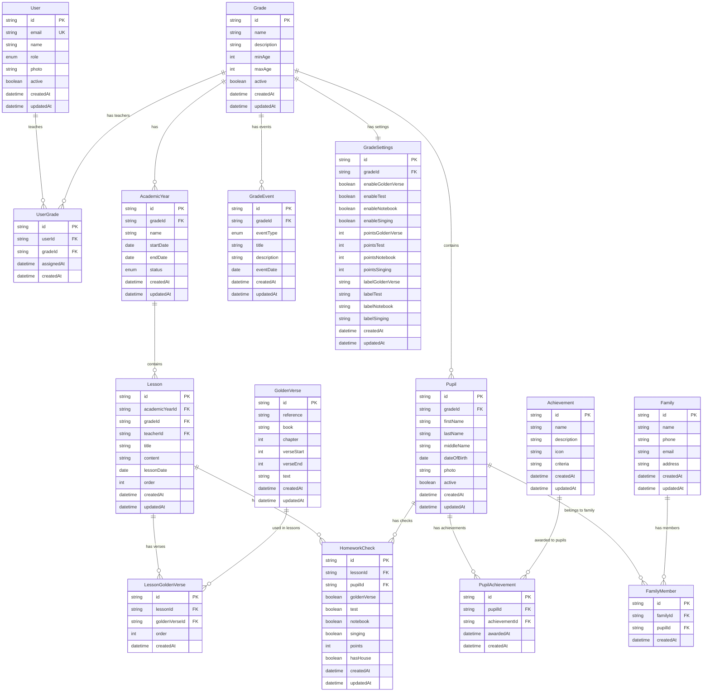
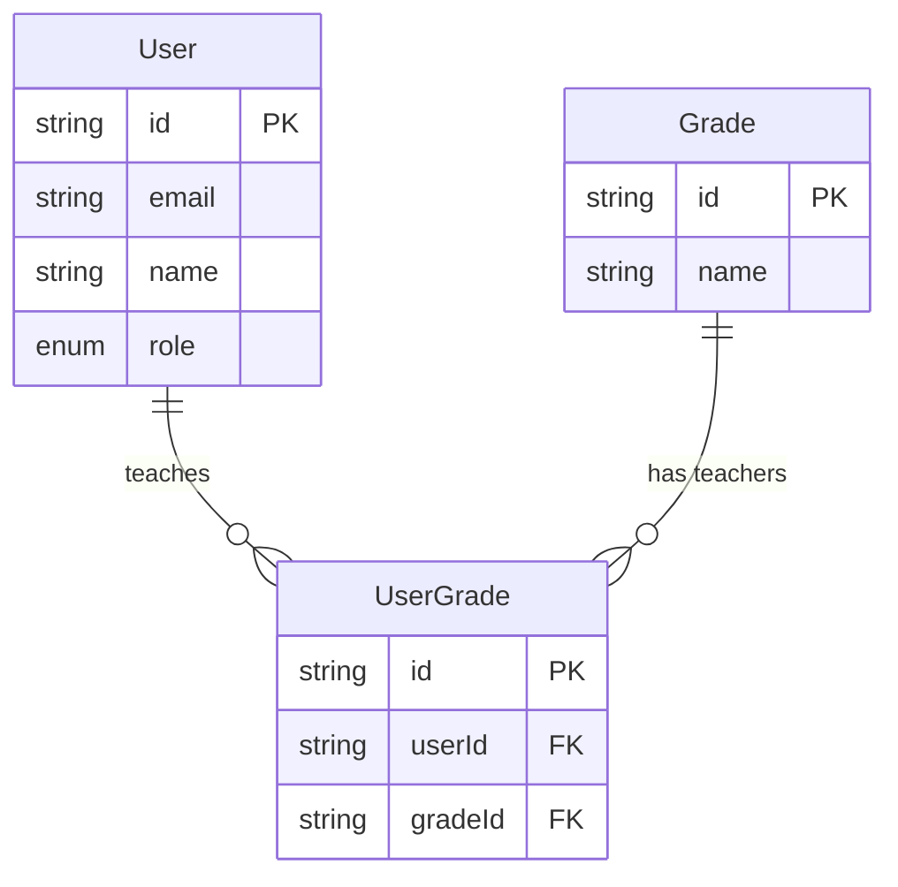
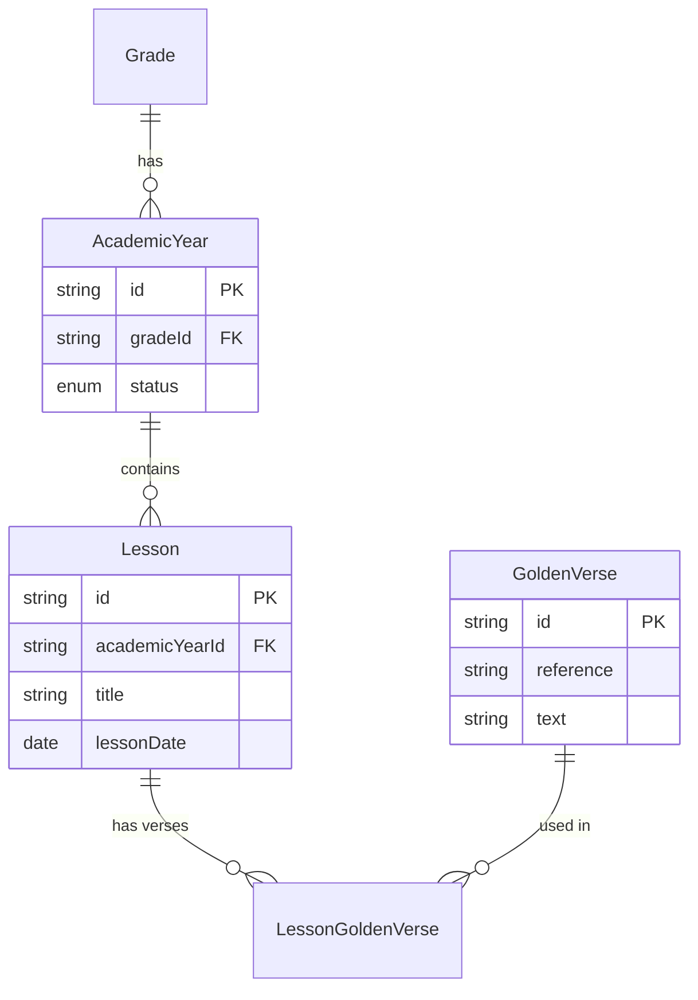
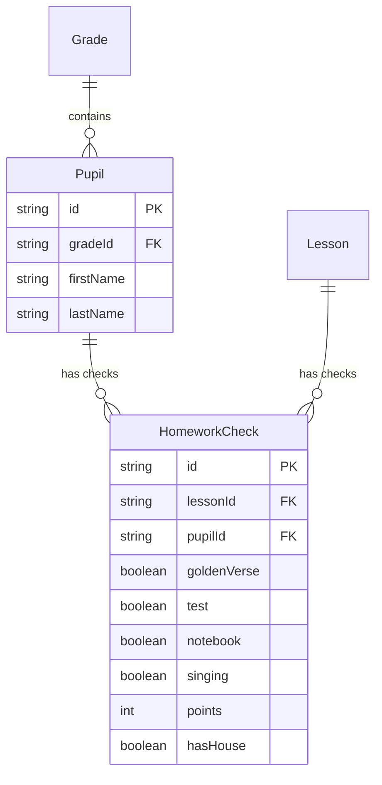
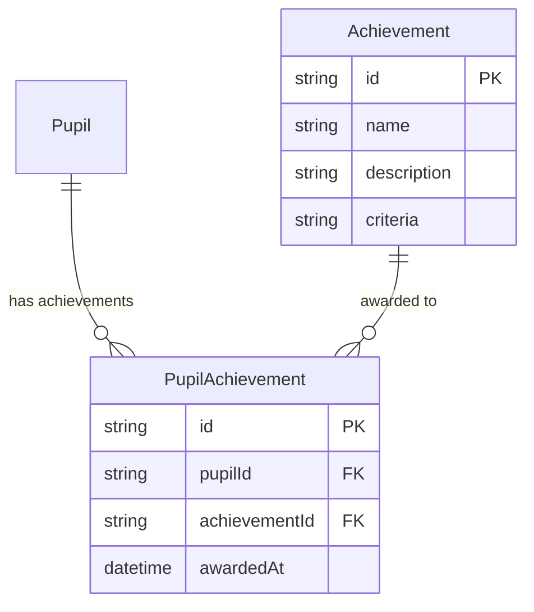

# Entity Relationship Diagram (ERD) - Sunday School App

## Версия документа: 1.0
**Дата создания:** 23 декабря 2025  
**Последнее обновление:** 23 декабря 2025  
**Проект:** Sunday School App  
**Технологии:** AWS DynamoDB, AWS AppSync (GraphQL), AWS Cognito  
**База данных:** AWS DynamoDB

> [!NOTE]
> Документация основана на актуальных источниках:
> - DynamoDB best practices — AWS документация
> - AWS AppSync GraphQL — официальная документация

---

## 1. Обзор

Данный документ описывает структуру базы данных для веб-приложения управления воскресной школой баптистской церкви. База данных спроектирована с учетом масштабируемости, производительности и специфики NoSQL (DynamoDB).

### 1.1. Основные принципы проектирования

- **NoSQL Design Patterns:** Использование Partition Keys и Sort Keys для эффективных запросов
- **Multiple Tables:** Отдельные таблицы для каждой сущности (не Single Table Design)
- **Масштабируемость:** Global Secondary Indexes (GSI) для альтернативных запросов
- **Интеграция с Cognito:** Пользователи хранятся в Cognito User Pools, метаданные в DynamoDB
- **Гибкость:** Поддержка различных ролей и настроек групп
- **Производительность:** Оптимизация запросов через правильный выбор ключей

### 1.2. Архитектурные решения

**Аутентификация:**
- Пользователи (User) управляются через AWS Cognito User Pools
- JWT токены выдаются Cognito
- Дополнительные метаданные пользователей хранятся в DynamoDB

**Авторизация:**
- Роли определены через Cognito Groups (TEACHER, ADMIN, SUPERADMIN)
- AppSync @auth директивы для контроля доступа
- Проверка прав в Server Actions

---

## 2. Главная диаграмма ERD



---

## 3. Детальное описание сущностей

### 3.1. User (Пользователи)

**Назначение:** Преподаватели и администраторы системы

**Хранение:**
- Основные данные (email, password): **AWS Cognito User Pool**
- Метаданные (photo, активность): **DynamoDB таблица Users**

**Таблица DynamoDB:** `Users`

| Поле | Тип | Описание | Ограничения |
|------|-----|----------|-------------|
| id | String (UUID) | Уникальный идентификатор (совпадает с Cognito sub) | PK |
| email | String | Email адрес (копия из Cognito) | UNIQUE |
| name | String | Полное имя пользователя | NOT NULL |
| role | String (Enum) | Роль: TEACHER, ADMIN, SUPERADMIN | NOT NULL |
| photo | String | URL аватара (S3) | Nullable |
| active | Boolean | Активен ли пользователь | DEFAULT true |
| createdAt | String (ISO 8601) | Дата создания | Auto-generated |
| updatedAt | String (ISO 8601) | Дата обновления | Auto-updated |

**DynamoDB Keys:**
- **Partition Key (PK):** `id`
- **Sort Key (SK):** Нет

**Global Secondary Indexes (GSI):**
- **GSI-1:** email (PK: email) — для поиска по email
- **GSI-2:** role-createdAt (PK: role, SK: createdAt) — для списков по роли

**Enum UserRole:**
- `TEACHER` — Преподаватель
- `ADMIN` — Администратор
- `SUPERADMIN` — Главный администратор
- `PARENT` — Родитель (Post-MVP)
- `PUPIL` — Ученик (Post-MVP)

**Связи:**
- `userGrades` → UserGrade[] (многие ко многим через UserGrade)
- Cognito User Pool (внешняя связь по id = sub)

**Бизнес-правила:**
- Email должен быть уникальным
- Роль TEACHER может создавать/редактировать уроки только в назначенных группах
- Роль ADMIN имеет полный доступ ко всем данным
- При деактивации (active = false) пользователь не может войти, но данные сохраняются

---

### 3.2. Grade (Группы учеников)

**Назначение:** Классы/группы в воскресной школе

**Таблица DynamoDB:** `Grades`

| Поле | Тип | Описание | Ограничения |
|------|-----|----------|-------------|
| id | String (UUID) | Уникальный идентификатор | PK |
| name | String | Название группы (например, "Младшая группа") | NOT NULL |
| description | String | Описание группы | Nullable |
| minAge | Number | Минимальный возраст учеников | Nullable |
| maxAge | Number | Максимальный возраст учеников | Nullable |
| active | Boolean | Активна ли группа | DEFAULT true |
| createdAt | String (ISO 8601) | Дата создания | Auto-generated |
| updatedAt | String (ISO 8601) | Дата обновления | Auto-updated |

**DynamoDB Keys:**
- **Partition Key (PK):** `id`
- **Sort Key (SK):** Нет

**Global Secondary Indexes (GSI):**
- **GSI-1:** active-createdAt (PK: active, SK: createdAt) — для списка активных групп

**Связи:**
- `teachers` → User[] (многие ко многим через UserGrade)
- `academicYears` → AcademicYear[] (один ко многим)
- `pupils` → Pupil[] (один ко многим)
- `events` → GradeEvent[] (один ко многим)
- `settings` → GradeSettings (один к одному)

**Бизнес-правила:**
- Группа должна иметь хотя бы одного назначенного преподавателя
- Перед удалением группы нужно перенести всех учеников в другие группы
- При деактивации группы (active = false) нельзя создавать новые уроки

---

### 3.3. UserGrade (Связь преподавателей и групп)

**Назначение:** Таблица связи многие-ко-многим между User и Grade

**Таблица DynamoDB:** `UserGrades`

| Поле | Тип | Описание | Ограничения |
|------|-----|----------|-------------|
| id | String (UUID) | Уникальный идентификатор | PK |
| userId | String | ID преподавателя | FK → Users.id |
| gradeId | String | ID группы | FK → Grades.id |
| assignedAt | String (ISO 8601) | Дата назначения | Auto-generated |
| createdAt | String (ISO 8601) | Дата создания записи | Auto-generated |

**DynamoDB Keys:**
- **Partition Key (PK):** `id`
- **Sort Key (SK):** Нет

**Global Secondary Indexes (GSI):**
- **GSI-1:** userId (PK: userId) — для получения всех групп преподавателя
- **GSI-2:** gradeId (PK: gradeId) — для получения всех преподавателей группы

**Бизнес-правила:**
- Уникальная пара (userId, gradeId) — один преподаватель не может быть назначен на группу дважды
- При удалении преподавателя или группы, связи удаляются (CASCADE)

---

### 3.4. AcademicYear (Учебные годы)

**Назначение:** Учебные годы для каждой группы

**Таблица DynamoDB:** `AcademicYears`

| Поле | Тип | Описание | Ограничения |
|------|-----|----------|-------------|
| id | String (UUID) | Уникальный идентификатор | PK |
| gradeId | String | ID группы | FK → Grades.id |
| name | String | Название года (например, "2024-2025") | NOT NULL |
| startDate | String (ISO 8601 Date) | Дата начала | NOT NULL |
| endDate | String (ISO 8601 Date) | Дата окончания | NOT NULL |
| status | String (Enum) | Статус года: ACTIVE, FINISHED | DEFAULT ACTIVE |
| createdAt | String (ISO 8601) | Дата создания | Auto-generated |
| updatedAt | String (ISO 8601) | Дата обновления | Auto-updated |

**DynamoDB Keys:**
- **Partition Key (PK):** `id`
- **Sort Key (SK):** Нет

**Global Secondary Indexes (GSI):**
- **GSI-1:** gradeId-startDate (PK: gradeId, SK: startDate) — для списка годов группы
- **GSI-2:** status-gradeId (PK: status, SK: gradeId) — для получения активных годов

**Enum AcademicYearStatus:**
- `ACTIVE` — Активный (текущий учебный год)
- `FINISHED` — Завершен

**Связи:**
- `grade` → Grade (многие к одному)
- `lessons` → Lesson[] (один ко многим)

**Бизнес-правила:**
- ✅ **КРИТИЧНО:** Уроки могут создаваться только для ACTIVE учебного года
- Только один ACTIVE год на группу одновременно
- При завершении года (Admin → "Завершить учебный год") статус меняется на FINISHED
- Даты не должны пересекаться для годов одной группы

---

### 3.5. Lesson (Уроки)

**Назначение:** Уроки в рамках учебного года

**Таблица DynamoDB:** `Lessons`

| Поле | Тип | Описание | Ограничения |
|------|-----|----------|-------------|
| id | String (UUID) | Уникальный идентификатор | PK |
| academicYearId | String | ID учебного года | FK → AcademicYears.id |
| gradeId | String | ID группы (денормализация) | FK → Grades.id |
| teacherId | String | ID создавшего преподавателя | FK → Users.id |
| title | String | Тема урока | NOT NULL, min 3 chars |
| content | String | Описание урока (JSON от BlockNote) | Nullable |
| lessonDate | String (ISO 8601 Date) | Дата проведения урока | NOT NULL |
| order | Number | Порядковый номер урока в году | Auto-generated |
| createdAt | String (ISO 8601) | Дата создания | Auto-generated |
| updatedAt | String (ISO 8601) | Дата обновления | Auto-updated |

**DynamoDB Keys:**
- **Partition Key (PK):** `id`
- **Sort Key (SK):** Нет

**Global Secondary Indexes (GSI):**
- **GSI-1:** academicYearId-lessonDate (PK: academicYearId, SK: lessonDate) — для списка уроков года
- **GSI-2:** gradeId-lessonDate (PK: gradeId, SK: lessonDate) — для списка уроков группы
- **GSI-3:** teacherId-createdAt (PK: teacherId, SK: createdAt) — для уроков преподавателя

**Связи:**
- `academicYear` → AcademicYear (многие к одному)
- `grade` → Grade (многие к одному)
- `teacher` → User (многие к одному)
- `goldenVerses` → GoldenVerse[] (многие ко многим через LessonGoldenVerse)
- `homeworkChecks` → HomeworkCheck[] (один ко многим)

**Бизнес-правила:**
- Урок создается только для ACTIVE учебного года
- Teacher может создавать уроки только в своих группах
- Admin может создавать уроки в любых группах
- Должен быть выбран хотя бы один золотой стих (минимум 1)
- При удалении урока удаляются все связанные HomeworkChecks (CASCADE)

---

### 3.6. GoldenVerse (Золотые стихи)

**Назначение:** Библейские стихи для запоминания

**Таблица DynamoDB:** `GoldenVerses`

| Поле | Тип | Описание | Ограничения |
|------|-----|----------|-------------|
| id | String (UUID) | Уникальный идентификатор | PK |
| reference | String | Ссылка (например, "Иоанна 3:16") | UNIQUE, NOT NULL |
| book | String | Книга Библии (например, "Иоанна") | NOT NULL |
| chapter | Number | Номер главы | NOT NULL |
| verseStart | Number | Начальный стих | NOT NULL |
| verseEnd | Number | Конечный стих (если диапазон) | Nullable |
| text | String | Текст стиха | NOT NULL |
| createdAt | String (ISO 8601) | Дата добавления | Auto-generated |
| updatedAt | String (ISO 8601) | Дата обновления | Auto-updated |

**DynamoDB Keys:**
- **Partition Key (PK):** `id`
- **Sort Key (SK):** Нет

**Global Secondary Indexes (GSI):**
- **GSI-1:** reference (PK: reference) — для поиска по ссылке
- **GSI-2:** book-chapter (PK: book, SK: chapter) — для фильтрации по книге

**Связи:**
- `lessons` → Lesson[] (многие ко многим через LessonGoldenVerse)

**Бизнес-правила:**
- reference должна быть уникальной (например, "Иоанна 3:16")
- Если диапазон стихов, verseEnd > verseStart
- Нельзя удалить стих, если он используется в уроках (проверка перед удалением)

---

### 3.7. LessonGoldenVerse (Связь уроков и стихов)

**Назначение:** Таблица связи многие-ко-многим между Lesson и GoldenVerse

**Таблица DynamoDB:** `LessonGoldenVerses`

| Поле | Тип | Описание | Ограничения |
|------|-----|----------|-------------|
| id | String (UUID) | Уникальный идентификатор | PK |
| lessonId | String | ID урока | FK → Lessons.id |
| goldenVerseId | String | ID золотого стиха | FK → GoldenVerses.id |
| order | Number | Порядок стиха в уроке | NOT NULL |
| createdAt | String (ISO 8601) | Дата добавления | Auto-generated |

**DynamoDB Keys:**
- **Partition Key (PK):** `id`
- **Sort Key (SK):** Нет

**Global Secondary Indexes (GSI):**
- **GSI-1:** lessonId-order (PK: lessonId, SK: order) — для списка стихов урока
- **GSI-2:** goldenVerseId (PK: goldenVerseId) — для статистики использования стиха

**Бизнес-правила:**
- Уникальная пара (lessonId, goldenVerseId) — один стих не может быть добавлен в урок дважды
- order начинается с 1 для каждого урока
- При удалении урока или стиха, связи удаляются (CASCADE)

---

### 3.8. Pupil (Ученики)

**Назначение:** Ученики воскресной школы

**Таблица DynamoDB:** `Pupils`

| Поле | Тип | Описание | Ограничения |
|------|-----|----------|-------------|
| id | String (UUID) | Уникальный идентификатор | PK |
| gradeId | String | ID группы | FK → Grades.id |
| firstName | String | Имя | NOT NULL, min 2 chars |
| lastName | String | Фамилия | NOT NULL, min 2 chars |
| middleName | String | Отчество | Nullable |
| dateOfBirth | String (ISO 8601 Date) | Дата рождения | NOT NULL |
| photo | String | URL фото (S3) | Nullable |
| active | Boolean | Активен ли ученик | DEFAULT true |
| createdAt | String (ISO 8601) | Дата создания | Auto-generated |
| updatedAt | String (ISO 8601) | Дата обновления | Auto-updated |

**DynamoDB Keys:**
- **Partition Key (PK):** `id`
- **Sort Key (SK):** Нет

**Global Secondary Indexes (GSI):**
- **GSI-1:** gradeId-lastName (PK: gradeId, SK: lastName) — для списка учеников группы
- **GSI-2:** active-gradeId (PK: active, SK: gradeId) — для фильтрации активных учеников

**Связи:**
- `grade` → Grade (многие к одному)
- `homeworkChecks` → HomeworkCheck[] (один ко многим)
- `achievements` → Achievement[] (многие ко многим через PupilAchievement)
- `families` → Family[] (многие ко многим через FamilyMember)

**Бизнес-правила:**
- Ученик может принадлежать только одной группе одновременно
- При переносе в другую группу изменяется gradeId
- При деактивации (active = false) ученик не отображается в списках, но история сохраняется
- Нельзя удалить ученика, если есть HomeworkChecks (только деактивация)

---

### 3.9. HomeworkCheck (Проверка домашних заданий)

**Назначение:** Результаты проверки ДЗ учеников за урок

**Таблица DynamoDB:** `HomeworkChecks`

| Поле | Тип | Описание | Ограничения |
|------|-----|----------|-------------|
| id | String (UUID) | Уникальный идентификатор | PK |
| lessonId | String | ID урока | FK → Lessons.id |
| pupilId | String | ID ученика | FK → Pupils.id |
| goldenVerse | Boolean | Выучил золотой стих | DEFAULT false |
| test | Boolean | Сделал тест | DEFAULT false |
| notebook | Boolean | Сделал тетрадь | DEFAULT false |
| singing | Boolean | Был на спевке | DEFAULT false |
| points | Number | Баллы за урок | DEFAULT 0 |
| hasHouse | Boolean | Получил домик (все параметры true) | AUTO |
| createdAt | String (ISO 8601) | Дата создания | Auto-generated |
| updatedAt | String (ISO 8601) | Дата обновления | Auto-updated |

**DynamoDB Keys:**
- **Partition Key (PK):** `id`
- **Sort Key (SK):** Нет

**Global Secondary Indexes (GSI):**
- **GSI-1:** lessonId-pupilId (PK: lessonId, SK: pupilId) — для проверок урока
- **GSI-2:** pupilId-createdAt (PK: pupilId, SK: createdAt) — для истории ученика

**Связи:**
- `lesson` → Lesson (многие к одному)
- `pupil` → Pupil (многие к одному)

**Бизнес-правила:**
- ✅ **КРИТИЧНО:** Уникальная пара (lessonId, pupilId) — одна проверка на ученика за урок
- hasHouse вычисляется автоматически: `hasHouse = goldenVerse && test && notebook && singing`
- points рассчитываются на основе GradeSettings группы
- При удалении урока или ученика, проверки удаляются (CASCADE)

**Расчет баллов:**
```typescript
points = 
  (goldenVerse ? settings.pointsGoldenVerse : 0) +
  (test ? settings.pointsTest : 0) +
  (notebook ? settings.pointsNotebook : 0) +
  (singing ? settings.pointsSinging : 0);
```

---

### 3.10. Achievement (Достижения)

**Назначение:** Достижения (badges) для учеников

**Таблица DynamoDB:** `Achievements`

| Поле | Тип | Описание | Ограничения |
|------|-----|----------|-------------|
| id | String (UUID) | Уникальный идентификатор | PK |
| name | String | Название достижения | NOT NULL, UNIQUE |
| description | String | Описание достижения | NOT NULL |
| icon | String | Emoji или URL иконки | Nullable |
| criteria | String | Критерии получения (JSON) | NOT NULL |
| createdAt | String (ISO 8601) | Дата создания | Auto-generated |
| updatedAt | String (ISO 8601) | Дата обновления | Auto-updated |

**DynamoDB Keys:**
- **Partition Key (PK):** `id`
- **Sort Key (SK):** Нет

**Global Secondary Indexes (GSI):**
- **GSI-1:** name (PK: name) — для поиска по названию

**Связи:**
- `pupils` → Pupil[] (многие ко многим через PupilAchievement)

**Примеры достижений:**
- "Отличник" — 10 домиков подряд
- "Постоянный ученик" — посещение 30 уроков подряд
- "Знаток Писания" — выучено 50 золотых стихов

**Бизнес-правила:**
- name должно быть уникальным
- criteria хранится в JSON формате для гибкости проверки

---

### 3.11. PupilAchievement (Связь учеников и достижений)

**Назначение:** Таблица связи многие-ко-многим между Pupil и Achievement

**Таблица DynamoDB:** `PupilAchievements`

| Поле | Тип | Описание | Ограничения |
|------|-----|----------|-------------|
| id | String (UUID) | Уникальный идентификатор | PK |
| pupilId | String | ID ученика | FK → Pupils.id |
| achievementId | String | ID достижения | FK → Achievements.id |
| awardedAt | String (ISO 8601) | Дата получения достижения | Auto-generated |
| createdAt | String (ISO 8601) | Дата создания записи | Auto-generated |

**DynamoDB Keys:**
- **Partition Key (PK):** `id`
- **Sort Key (SK):** Нет

**Global Secondary Indexes (GSI):**
- **GSI-1:** pupilId-awardedAt (PK: pupilId, SK: awardedAt) — для достижений ученика
- **GSI-2:** achievementId (PK: achievementId) — для статистики достижения

**Бизнес-правила:**
- Уникальная пара (pupilId, achievementId) — достижение можно получить только один раз
- awardedAt определяет момент получения (важно для хронологии)

---

### 3.12. Family (Семьи)

**Назначение:** Семьи учеников для связи и контактов

**Таблица DynamoDB:** `Families`

| Поле | Тип | Описание | Ограничения |
|------|-----|----------|-------------|
| id | String (UUID) | Уникальный идентификатор | PK |
| name | String | Фамилия семьи | NOT NULL |
| phone | String | Телефон контактного лица | Nullable |
| email | String | Email семьи | Nullable |
| address | String | Адрес (опционально) | Nullable |
| createdAt | String (ISO 8601) | Дата создания | Auto-generated |
| updatedAt | String (ISO 8601) | Дата обновления | Auto-updated |

**DynamoDB Keys:**
- **Partition Key (PK):** `id`
- **Sort Key (SK):** Нет

**Связи:**
- `members` → Pupil[] (многие ко многим через FamilyMember)

**Бизнес-правила:**
- Семья может включать несколько учеников
- Один ученик может принадлежать нескольким семьям (например, приемные семьи)

---

### 3.13. FamilyMember (Члены семей)

**Назначение:** Таблица связи многие-ко-многим между Family и Pupil

**Таблица DynamoDB:** `FamilyMembers`

| Поле | Тип | Описание | Ограничения |
|------|-----|----------|-------------|
| id | String (UUID) | Уникальный идентификатор | PK |
| familyId | String | ID семьи | FK → Families.id |
| pupilId | String | ID ученика | FK → Pupils.id |
| createdAt | String (ISO 8601) | Дата добавления | Auto-generated |

**DynamoDB Keys:**
- **Partition Key (PK):** `id`
- **Sort Key (SK):** Нет

**Global Secondary Indexes (GSI):**
- **GSI-1:** familyId (PK: familyId) — для членов семьи
- **GSI-2:** pupilId (PK: pupilId) — для семей ученика

**Бизнес-правила:**
- Уникальная пара (familyId, pupilId) — ученик не может быть добавлен в семью дважды

---

### 3.14. GradeEvent (События в расписании)

**Назначение:** События в календаре группы (уроки, мероприятия, отмены)

**Таблица DynamoDB:** `GradeEvents`

| Поле | Тип | Описание | Ограничения |
|------|-----|----------|-------------|
| id | String (UUID) | Уникальный идентификатор | PK |
| gradeId | String | ID группы | FK → Grades.id |
| eventType | String (Enum) | Тип события | NOT NULL |
| title | String | Название события | NOT NULL |
| description | String | Описание события | Nullable |
| eventDate | String (ISO 8601 Date) | Дата события | NOT NULL |
| createdAt | String (ISO 8601) | Дата создания | Auto-generated |
| updatedAt | String (ISO 8601) | Дата обновления | Auto-updated |

**DynamoDB Keys:**
- **Partition Key (PK):** `id`
- **Sort Key (SK):** Нет

**Global Secondary Indexes (GSI):**
- **GSI-1:** gradeId-eventDate (PK: gradeId, SK: eventDate) — для календаря группы

**Enum GradeEventType:**
- `LESSON` — Обычный урок (🔵 синий)
- `OUTDOOR_EVENT` — Выездное мероприятие (🟢 зеленый)
- `LESSON_SKIPPING` — Отмена урока (🔴 красный)

**Связи:**
- `grade` → Grade (многие к одному)

**Бизнес-правила:**
- Событие типа LESSON может быть связано с реальным Lesson (опционально)
- Календарь показывает события за выбранный месяц/период

---

### 3.15. GradeSettings (Настройки оценивания группы)

**Назначение:** Настройки параметров оценивания для каждой группы

**Таблица DynamoDB:** `GradeSettings`

| Поле | Тип | Описание | Ограничения |
|------|-----|----------|-------------|
| id | String (UUID) | Уникальный идентификатор | PK |
| gradeId | String | ID группы | FK → Grades.id, UNIQUE |
| enableGoldenVerse | Boolean | Использовать золотые стихи | DEFAULT true |
| enableTest | Boolean | Использовать тест | DEFAULT true |
| enableNotebook | Boolean | Использовать тетрадь | DEFAULT true |
| enableSinging | Boolean | Использовать спевку | DEFAULT true |
| pointsGoldenVerse | Number | Баллы за золотой стих | DEFAULT 10 |
| pointsTest | Number | Баллы за тест | DEFAULT 10 |
| pointsNotebook | Number | Баллы за тетрадь | DEFAULT 10 |
| pointsSinging | Number | Баллы за спевку | DEFAULT 10 |
| labelGoldenVerse | String | Кастомная метка для стихов | DEFAULT "Золотые стихи" |
| labelTest | String | Кастомная метка для теста | DEFAULT "Тест" |
| labelNotebook | String | Кастомная метка для тетради | DEFAULT "Тетрадь" |
| labelSinging | String | Кастомная метка для спевки | DEFAULT "Спевка" |
| createdAt | String (ISO 8601) | Дата создания | Auto-generated |
| updatedAt | String (ISO 8601) | Дата обновления | Auto-updated |

**DynamoDB Keys:**
- **Partition Key (PK):** `id`
- **Sort Key (SK):** Нет

**Global Secondary Indexes (GSI):**
- **GSI-1:** gradeId (PK: gradeId) — для быстрого доступа по группе

**Связи:**
- `grade` → Grade (один к одному)

**Бизнес-правила:**
- Каждая группа имеет ровно одну запись GradeSettings
- При создании группы автоматически создаются настройки с дефолтными значениями
- Изменение баллов не пересчитывает старые HomeworkChecks (только новые)
- Отключение параметра (enable = false) скрывает его в форме проверки ДЗ

---

## 4. Диаграммы по доменам

### 4.1. Домен: Users & Authentication



### 4.2. Домен: Lessons & Academic Years



### 4.3. Домен: Pupils & Homework



### 4.4. Домен: Achievements



---

## 5. Бизнес-правила

### 5.1. Правила создания уроков

1. ✅ **Урок создается только для ACTIVE учебного года**
   - Проверка в Server Action перед созданием
   - Если нет ACTIVE года, показать ошибку

2. ✅ **Teacher может создавать уроки только в своих группах**
   - Проверка через UserGrade связь
   - Admin может создавать везде

3. ✅ **Урок должен иметь минимум 1 золотой стих**
   - Валидация через Zod schema
   - Связь через LessonGoldenVerse

### 5.2. Правила проверки ДЗ

1. ✅ **Одна проверка на пару (Lesson, Pupil)**
   - Уникальность контролируется на уровне Server Action
   - При повторном сохранении — UPDATE, а не CREATE

2. ✅ **Автоматический расчет hasHouse**
   ```typescript
   hasHouse = goldenVerse && test && notebook && singing
   ```

3. ✅ **Автоматический расчет points**
   - На основе GradeSettings группы
   - Сумма баллов за выполненные параметры

### 5.3. Правила учебных годов

1. ✅ **Только один ACTIVE год на группу**
   - При создании нового года нужно завершить предыдущий
   - Admin функция "Завершить учебный год" меняет все ACTIVE → FINISHED

2. ✅ **Даты годов не пересекаются**
   - Валидация при создании нового года
   - startDate нового года > endDate предыдущего

### 5.4. Правила учеников

1. ✅ **Ученик принадлежит только одной группе**
   - При переносе — изменение gradeId
   - История HomeworkChecks сохраняется

2. ✅ **Деактивация вместо удаления**
   - При active = false ученик скрывается из списков
   - История полностью сохраняется

### 5.5. Правила групп

1. ✅ **Группа должна иметь хотя бы одного преподавателя**
   - Проверка при удалении связи UserGrade
   - Предупреждение Admin

2. ✅ **При создании группы создаются GradeSettings**
   - Автоматически с дефолтными значениями
   - Связь один к одному

---

## 6. Индексы и оптимизация

### 6.1. Часто запрашиваемые данные

**Список уроков группы:**
```
GSI: gradeId-lessonDate на таблице Lessons
```

**Список учеников группы:**
```
GSI: gradeId-lastName на таблице Pupils
```

**История ученика:**
```
GSI: pupilId-createdAt на таблице HomeworkChecks
```

**Проверки ДЗ для урока:**
```
GSI: lessonId-pupilId на таблице HomeworkChecks
```

### 6.2. Стратегии для быстрых запросов

1. **Использовать Query вместо Scan:**
   - Всегда используем GSI для фильтрации
   - Scan только для маленьких таблиц (Achievements, GradeSettings)

2. **Денормализация где нужно:**
   - gradeId в Lesson (хотя есть через AcademicYear)
   - Имя ученика можно добавить в HomeworkCheck для быстрого отображения

3. **Batch операции:**
   - BatchGetItem для загрузки нескольких учеников
   - BatchWriteItem для массовой проверки ДЗ

---

## Cross-reference

- См. также: [`docs/database/DYNAMODB_SCHEMA.md`](../database/DYNAMODB_SCHEMA.md) — детальная схема DynamoDB
- См. также: [`docs/database/GRAPHQL_SCHEMA.md`](../database/GRAPHQL_SCHEMA.md) — GraphQL типы и queries
- См. также: [`docs/database/DATA_MODELING.md`](../database/DATA_MODELING.md) — стратегии моделирования
- См. также: [`docs/architecture/ARCHITECTURE.md`](../architecture/ARCHITECTURE.md) — общая архитектура

---

**Версия:** 1.0  
**Последнее обновление:** 23 декабря 2025  
**Автор:** AI Documentation Team

