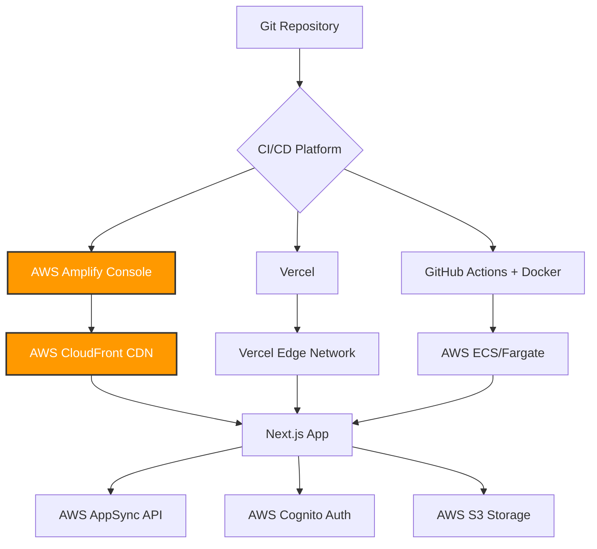

# Deployment Guide - Sunday School App

## Document Version: 1.0
**Creation Date:** 23 December 2025  
**Last Update:** 23 December 2025  
**Project:** Sunday School App  
**Technologies:** Next.js 15.5.9, AWS Amplify Gen 1, AWS Amplify Hosting, Vercel (alternative), Docker  
**Target Audience:** DevOps Engineers, Backend Developers, System Administrators

---

## 1. Overview

This document provides comprehensive deployment instructions for the Sunday School App, covering multiple deployment strategies:

1.  **AWS Amplify Hosting** (Recommended for Gen 1 backend integration)
2.  **Vercel** (Alternative for Next.js optimization)
3.  **Docker + AWS ECS/Fargate** (For containerized deployments)
4.  **Self-Hosted (VPS)** (For custom infrastructure)

### 1.1 Deployment Architecture



---

## 2. Prerequisites

### 2.1. General Requirements

-   **Node.js:** v20.x or later
-   **npm/yarn/pnpm:** Latest stable version
-   **Git:** For version control and CI/CD
-   **AWS CLI:** For backend resource management (Gen 1)
-   **Amplify CLI:** For backend deployments (`npm install -g @aws-amplify/cli`)

### 2.2. Environment Variables

**Required for all deployment methods:**

```plaintext
# Backend Configuration (Auto-generated by Amplify)
# These are embedded in amplifyconfiguration.json

# Application-Specific
NEXT_PUBLIC_APP_NAME=Sunday School App
NEXT_PUBLIC_APP_VERSION=1.0.0

# Environment
NODE_ENV=production

# Optional: External Integrations (Post-MVP)
# NEXT_PUBLIC_ANALYTICS_ID=UA-XXXXXXXXX-X
```

**For Server Actions (if using environment variables):**

```plaintext
# AWS Region (usually auto-detected)
AWS_REGION=us-east-1

# Cognito (if not using amplifyconfiguration.json)
# NEXT_PUBLIC_COGNITO_USER_POOL_ID=us-east-1_ABCDEFGHI
# NEXT_PUBLIC_COGNITO_CLIENT_ID=1234567890abcdefghijklmno
```

---

## 3. Deployment Method 1: AWS Amplify Hosting (Recommended)

### 3.1. Why AWS Amplify Hosting?

-   **Seamless Integration:** Works natively with Amplify Gen 1 backend.
-   **Automatic CI/CD:** Git-based deployments (push to deploy).
-   **SSR Support:** Full support for Next.js App Router and Server Components.
-   **CloudFront CDN:** Global content delivery for low latency.
-   **Managed SSL:** Automatic HTTPS with AWS Certificate Manager.
-   **Preview Environments:** Branch-based preview deployments.

---

### 3.2. Initial Setup

#### Step 1: Connect Repository

**Via Amplify CLI:**

```bash
amplify add hosting
```

**Prompts:**

```plaintext
? Select the plugin module to execute: Hosting with Amplify Console
? Choose a type: Continuous deployment (Git-based deployments)
```

**Result:** Opens Amplify Console in the browser.

---

**Via AWS Console (Manual):**

1.  **Navigate to Amplify Console:**
    -   AWS Console → **Amplify** → **All apps** → **New app** → **Host web app**.

2.  **Connect Repository:**
    -   Select **GitHub** / **GitLab** / **Bitbucket** / **AWS CodeCommit**.
    -   Authorize Amplify to access your repository.
    -   Select the repository and branch (e.g., `main`, `develop`).

3.  **Configure Build Settings:**
    -   Amplify auto-detects Next.js and generates a build configuration (`amplify.yml`).

---

#### Step 2: Configure Build Settings

**File:** `amplify.yml` (in project root)

```yaml
version: 1
backend:
  phases:
    build:
      commands:
        - amplifyPush --simple
frontend:
  phases:
    preBuild:
      commands:
        - npm ci
    build:
      commands:
        - npm run build
  artifacts:
    baseDirectory: .next
    files:
      - '**/*'
  cache:
    paths:
      - node_modules/**/*
      - .next/cache/**/*
```

**Explanation:**

-   **`backend.phases.build`**: Deploys Amplify backend resources (Auth, API, Storage).
-   **`frontend.phases.preBuild`**: Installs dependencies.
-   **`frontend.phases.build`**: Builds the Next.js application.
-   **`artifacts.baseDirectory`**: Directory containing the production build.
-   **`cache.paths`**: Caches `node_modules` and `.next/cache` for faster builds.

---

#### Step 3: Environment Variables (Optional)

**In Amplify Console:**

1.  Navigate to **App settings** → **Environment variables**.
2.  Add environment variables (e.g., `NEXT_PUBLIC_APP_NAME`, `NODE_ENV=production`).
3.  Variables are injected during the build process.

---

#### Step 4: Deploy

**Automatic Deployment:**

-   Push code to the connected Git branch.
-   Amplify Console automatically triggers a build and deployment.

**Manual Deployment:**

```bash
amplify publish
```

**Deployment URL:**

-   Amplify provides a unique URL: `https://main.d1234567890abc.amplifyapp.com`
-   Custom domains can be configured (see section 3.4).

---

### 3.3. Branch-Based Environments

**Setup Multiple Environments:**

1.  **Connect Additional Branches:**
    -   In Amplify Console, go to **App settings** → **General** → **Connect branch**.
    -   Select `develop`, `staging`, or any feature branch.

2.  **Branch-Specific Backend:**
    -   Each branch can have its own Amplify backend environment (e.g., `dev`, `prod`).
    -   Configure in `amplify.yml`:
        ```yaml
        backend:
          phases:
            build:
              commands:
                - amplifyPush --simple --environment ${AWS_BRANCH}
        ```

3.  **Preview URLs:**
    -   `https://main.d1234567890abc.amplifyapp.com` (production)
    -   `https://develop.d1234567890abc.amplifyapp.com` (development)

---

### 3.4. Custom Domain Setup

**Add Custom Domain:**

1.  **In Amplify Console:**
    -   Go to **Domain management** → **Add domain**.

2.  **Configure DNS:**
    -   **Option 1 (Recommended):** Use **Route 53** (AWS DNS).
        -   Amplify automatically configures DNS records.
    -   **Option 2:** Use external DNS provider (e.g., Cloudflare, Namecheap).
        -   Add CNAME record: `www.sundayschool.com` → `d1234567890abc.amplifyapp.com`.

3.  **SSL Certificate:**
    -   Amplify automatically provisions an SSL certificate via **AWS Certificate Manager**.

**Example Domain Configuration:**

-   `https://sundayschool.com` → main branch
-   `https://dev.sundayschool.com` → develop branch

---

### 3.5. Monitoring and Logs

**Build Logs:**

-   In Amplify Console, select a deployment → **View build logs**.

**Runtime Logs (Next.js Server):**

-   Currently limited in Amplify Hosting. For detailed logs, consider using **CloudWatch Logs** with Lambda@Edge (advanced).

**Performance Metrics:**

-   **CloudWatch Metrics:** Monitor traffic, response times, error rates.
-   **AWS X-Ray:** Trace API requests to AppSync and DynamoDB.

---

## 4. Deployment Method 2: Vercel (Alternative)

### 4.1. Why Vercel?

-   **Next.js Native:** Built by the creators of Next.js.
-   **Edge Functions:** Global serverless functions for low latency.
-   **Automatic Optimization:** Image optimization, caching, and prerendering.
-   **Fast Builds:** Incremental static regeneration (ISR) and dynamic rendering.

**Trade-offs:**

-   Requires manual Amplify backend deployment (backend and frontend are decoupled).
-   Not as seamless as Amplify Hosting for Gen 1 backend.

---

### 4.2. Setup

#### Step 1: Install Vercel CLI

```bash
npm install -g vercel
```

#### Step 2: Login to Vercel

```bash
vercel login
```

#### Step 3: Deploy Backend (Amplify)

**Ensure Amplify backend is deployed:**

```bash
amplify push
```

#### Step 4: Configure Environment Variables

**In Vercel Dashboard:**

1.  Go to **Project Settings** → **Environment Variables**.
2.  Add:
    -   `NODE_ENV=production`
    -   `NEXT_PUBLIC_APP_NAME=Sunday School App`

**For Amplify Configuration:**

-   Vercel reads `amplifyconfiguration.json` from the project root.

#### Step 5: Deploy to Vercel

**Via CLI:**

```bash
vercel --prod
```

**Via GitHub Integration:**

1.  Connect your GitHub repository to Vercel.
2.  Push to `main` branch to trigger automatic deployment.

---

### 4.3. Custom Domain

**In Vercel Dashboard:**

1.  Go to **Domains** → **Add Domain**.
2.  Configure DNS records (CNAME or A record).
3.  Vercel automatically provisions SSL.

---

## 5. Deployment Method 3: Docker + AWS ECS/Fargate

### 5.1. Why Docker?

-   **Portability:** Run on any cloud provider or self-hosted infrastructure.
-   **Scalability:** Horizontal scaling with container orchestration (ECS, Kubernetes).
-   **Custom Infrastructure:** Full control over runtime environment.

---

### 5.2. Dockerfile for Next.js

**File:** `Dockerfile`

```dockerfile
# Stage 1: Dependencies
FROM node:20-alpine AS deps
WORKDIR /app

# Copy package files
COPY package.json package-lock.json ./
RUN npm ci --only=production

# Stage 2: Build
FROM node:20-alpine AS builder
WORKDIR /app

# Copy dependencies from deps stage
COPY --from=deps /app/node_modules ./node_modules
COPY . .

# Build Next.js application
RUN npm run build

# Stage 3: Production
FROM node:20-alpine AS runner
WORKDIR /app

ENV NODE_ENV=production

# Copy built application
COPY --from=builder /app/public ./public
COPY --from=builder /app/.next/standalone ./
COPY --from=builder /app/.next/static ./.next/static

# Expose port
EXPOSE 3000

# Start application
CMD ["node", "server.js"]
```

---

### 5.3. Deploy to AWS ECS/Fargate

#### Step 1: Build and Push Docker Image

**Build Image:**

```bash
docker build -t sundayschoolapp:latest .
```

**Tag and Push to Amazon ECR:**

```bash
aws ecr get-login-password --region us-east-1 | docker login --username AWS --password-stdin 123456789012.dkr.ecr.us-east-1.amazonaws.com
docker tag sundayschoolapp:latest 123456789012.dkr.ecr.us-east-1.amazonaws.com/sundayschoolapp:latest
docker push 123456789012.dkr.ecr.us-east-1.amazonaws.com/sundayschoolapp:latest
```

---

#### Step 2: Create ECS Task Definition

**File:** `task-definition.json`

```json
{
  "family": "sundayschoolapp-task",
  "networkMode": "awsvpc",
  "requiresCompatibilities": ["FARGATE"],
  "cpu": "256",
  "memory": "512",
  "containerDefinitions": [
    {
      "name": "sundayschoolapp",
      "image": "123456789012.dkr.ecr.us-east-1.amazonaws.com/sundayschoolapp:latest",
      "portMappings": [
        {
          "containerPort": 3000,
          "protocol": "tcp"
        }
      ],
      "environment": [
        {
          "name": "NODE_ENV",
          "value": "production"
        }
      ],
      "logConfiguration": {
        "logDriver": "awslogs",
        "options": {
          "awslogs-group": "/ecs/sundayschoolapp",
          "awslogs-region": "us-east-1",
          "awslogs-stream-prefix": "ecs"
        }
      }
    }
  ]
}
```

**Register Task Definition:**

```bash
aws ecs register-task-definition --cli-input-json file://task-definition.json
```

---

#### Step 3: Create ECS Service

```bash
aws ecs create-service \
  --cluster sundayschool-cluster \
  --service-name sundayschoolapp-service \
  --task-definition sundayschoolapp-task \
  --desired-count 2 \
  --launch-type FARGATE \
  --network-configuration "awsvpcConfiguration={subnets=[subnet-abc123,subnet-def456],securityGroups=[sg-0123456789abcdef0],assignPublicIp=ENABLED}" \
  --load-balancers "targetGroupArn=arn:aws:elasticloadbalancing:us-east-1:123456789012:targetgroup/sundayschool-tg/abc123,containerName=sundayschoolapp,containerPort=3000"
```

---

#### Step 4: Configure Application Load Balancer (ALB)

1.  **Create ALB** with HTTPS listener (port 443).
2.  **Attach Target Group** to ECS service.
3.  **Configure SSL Certificate** via AWS Certificate Manager.

---

## 6. Deployment Method 4: Self-Hosted (VPS)

### 6.1. Requirements

-   **VPS Provider:** DigitalOcean, Linode, AWS EC2, etc.
-   **OS:** Ubuntu 22.04 LTS (recommended)
-   **Node.js:** v20.x
-   **Nginx:** Reverse proxy and SSL termination
-   **PM2:** Process manager for Node.js

---

### 6.2. Setup

#### Step 1: Install Dependencies

```bash
# Update system
sudo apt update && sudo apt upgrade -y

# Install Node.js
curl -fsSL https://deb.nodesource.com/setup_20.x | sudo -E bash -
sudo apt install -y nodejs

# Install PM2
sudo npm install -g pm2

# Install Nginx
sudo apt install -y nginx

# Install Certbot (for SSL)
sudo apt install -y certbot python3-certbot-nginx
```

---

#### Step 2: Deploy Application

**Clone Repository:**

```bash
cd /var/www
sudo git clone https://github.com/your-org/sundayschoolapp.git
cd sundayschoolapp
```

**Install Dependencies and Build:**

```bash
npm install
npm run build
```

**Start with PM2:**

```bash
pm2 start npm --name "sundayschoolapp" -- start
pm2 save
pm2 startup
```

---

#### Step 3: Configure Nginx Reverse Proxy

**File:** `/etc/nginx/sites-available/sundayschool`

```nginx
server {
    listen 80;
    server_name sundayschool.com www.sundayschool.com;

    location / {
        proxy_pass http://localhost:3000;
        proxy_http_version 1.1;
        proxy_set_header Upgrade $http_upgrade;
        proxy_set_header Connection 'upgrade';
        proxy_set_header Host $host;
        proxy_cache_bypass $http_upgrade;
    }
}
```

**Enable Site:**

```bash
sudo ln -s /etc/nginx/sites-available/sundayschool /etc/nginx/sites-enabled/
sudo nginx -t
sudo systemctl restart nginx
```

---

#### Step 4: Configure SSL with Let's Encrypt

```bash
sudo certbot --nginx -d sundayschool.com -d www.sundayschool.com
```

**Auto-Renewal:**

```bash
sudo certbot renew --dry-run
```

---

## 7. CI/CD Pipeline (GitHub Actions)

### 7.1. Example Workflow for Amplify Hosting

**File:** `.github/workflows/deploy.yml`

```yaml
name: Deploy to AWS Amplify

on:
  push:
    branches:
      - main

jobs:
  deploy:
    runs-on: ubuntu-latest

    steps:
      - name: Checkout code
        uses: actions/checkout@v3

      - name: Setup Node.js
        uses: actions/setup-node@v3
        with:
          node-version: 20

      - name: Install dependencies
        run: npm ci

      - name: Run linting
        run: npm run lint

      - name: Run tests
        run: npm test

      - name: Build application
        run: npm run build

      - name: Deploy to Amplify
        run: |
          npm install -g @aws-amplify/cli
          amplify push --yes
        env:
          AWS_ACCESS_KEY_ID: ${{ secrets.AWS_ACCESS_KEY_ID }}
          AWS_SECRET_ACCESS_KEY: ${{ secrets.AWS_SECRET_ACCESS_KEY }}
          AWS_REGION: us-east-1
```

---

## 8. Rollback Strategies

### 8.1. Amplify Hosting Rollback

**In Amplify Console:**

1.  Go to **Deployments**.
2.  Select a previous successful deployment.
3.  Click **Redeploy this version**.

---

### 8.2. Git Rollback

```bash
git revert <commit-hash>
git push origin main
```

-   Amplify/Vercel will automatically redeploy the reverted version.

---

## 9. Performance Optimization

### 9.1. Next.js Build Optimization

**Enable Static Generation:**

-   Use `export const dynamic = 'force-static'` for static pages.

**Image Optimization:**

-   Use `<Image>` component from `next/image` for automatic optimization.

**Bundle Analysis:**

```bash
npm install --save-dev @next/bundle-analyzer
```

**Configuration:**

```javascript
// next.config.js
const withBundleAnalyzer = require('@next/bundle-analyzer')({
  enabled: process.env.ANALYZE === 'true',
})

module.exports = withBundleAnalyzer({
  // ... other config
})
```

**Run Analysis:**

```bash
ANALYZE=true npm run build
```

---

### 9.2. CDN and Caching

-   **CloudFront (Amplify Hosting):** Automatically configured.
-   **Vercel Edge Network:** Automatically configured.
-   **Self-Hosted:** Use Cloudflare as a CDN proxy.

---

## 10. Security Best Practices

-   **Use HTTPS:** Enforce SSL/TLS for all traffic.
-   **Environment Variables:** Never commit secrets to Git. Use AWS Secrets Manager or Vercel Environment Variables.
-   **CORS Configuration:** Restrict AppSync API to your frontend domain.
-   **Security Headers:** Configure in `next.config.js`:
    ```javascript
    module.exports = {
      async headers() {
        return [
          {
            source: '/(.*)',
            headers: [
              { key: 'X-Content-Type-Options', value: 'nosniff' },
              { key: 'X-Frame-Options', value: 'DENY' },
              { key: 'X-XSS-Protection', value: '1; mode=block' },
            ],
          },
        ]
      },
    }
    ```

---

## 11. Cross-References

-   **→ [AWS_AMPLIFY.md](../infrastructure/AWS_AMPLIFY.md):** Backend infrastructure and Amplify CLI commands.
-   **→ [SECURITY.md](../infrastructure/SECURITY.md):** Authentication, authorization, and security policies.
-   **→ [ARCHITECTURE.md](../architecture/ARCHITECTURE.md):** System architecture overview.

---

## 12. Resources

-   **AWS Amplify Hosting Documentation:** https://docs.aws.amazon.com/amplify/latest/userguide/welcome.html
-   **Vercel Documentation:** https://vercel.com/docs
-   **Next.js Deployment:** https://nextjs.org/docs/deployment
-   **Docker Documentation:** https://docs.docker.com
-   **PM2 Documentation:** https://pm2.keymetrics.io

---

**End of Deployment Guide**

