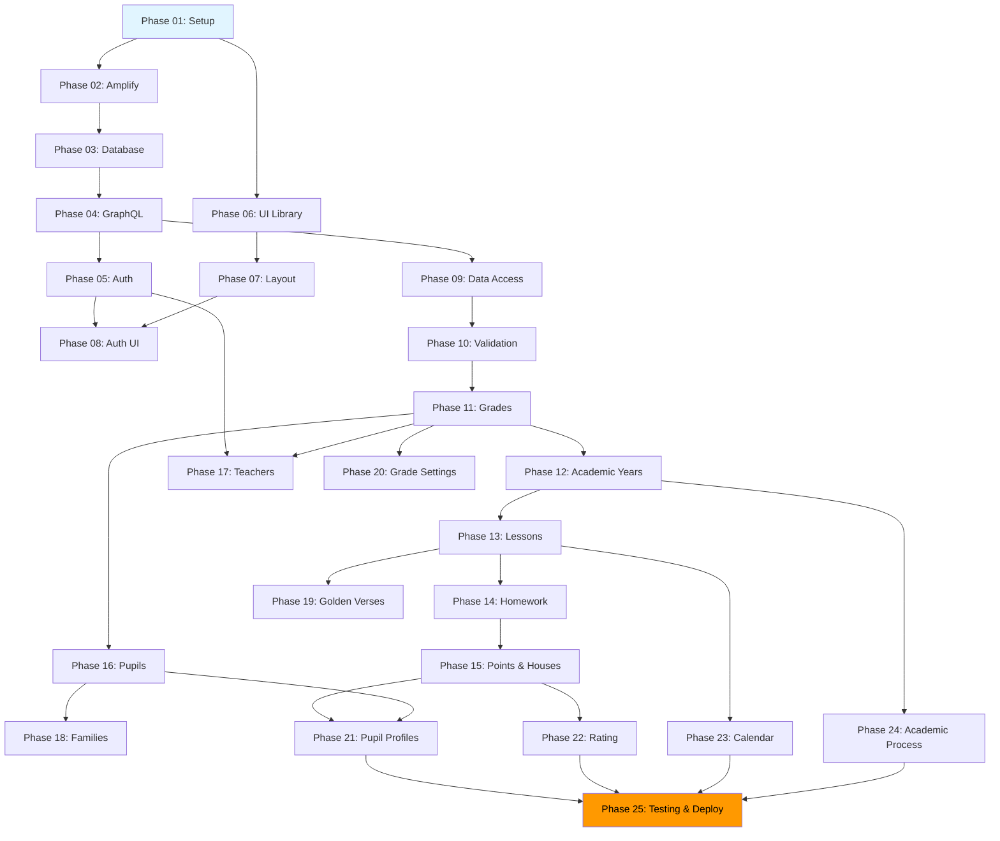

# Список фаз имплементации MVP - Sunday School App

## Версия документа: 1.0
**Дата создания:** 23 декабря 2025  
**Проект:** Sunday School App  
**Статус:** Планирование

---

## Обзор

Данный документ содержит полный список из 25 фаз имплементации MVP функционала Sunday School App. Каждая фаза детально описана в отдельном файле задач в каталоге `docs/implementation/mvp/tasks/`.

### Общая оценка времени
**Общая оценка:** 30-40 рабочих дней (6-8 недель)

### Структура фаз
- **Фазы 1-5:** Базовая инфраструктура и настройка (5-7 дней)
- **Фазы 6-10:** Базовые компоненты и инфраструктура UI (4-6 дней)
- **Фазы 11-15:** Основной функционал - Управление данными (8-10 дней)
- **Фазы 16-20:** Управление пользователями и контентом (6-8 дней)
- **Фазы 21-25:** Дополнительный функционал и финализация (7-9 дней)

---

## Релевантная документация

При выполнении задач фаз имплементации рекомендуется использовать следующую документацию:

- **[app_functionality.md](../../app_functionality.md)** - детальное описание функционала, бизнес-логики и элементов интерфейса (единственный источник истины для функциональных требований)
- **[USER_FLOW.md](../../user_flows/USER_FLOW.md)** - общие пользовательские сценарии и flow-диаграммы
- **[TEACHER_FLOWS.md](../../user_flows/TEACHER_FLOWS.md)** - детальные flow для преподавателей
- **[ADMIN_FLOWS.md](../../user_flows/ADMIN_FLOWS.md)** - детальные flow для администраторов
- **[WIREFRAMES.md](../../ui_ux/WIREFRAMES.md)** - визуальные макеты всех страниц

> [!NOTE]
> **Принцип единственного источника истины:** 
> - `app_functionality.md` является единственным источником истины для описания ролей пользователей, функциональных требований и типичных сценариев использования
> - Документы в `user_flows/` содержат детальные flow-диаграммы и пошаговые описания, ссылающиеся на `app_functionality.md` для базовой информации

---

## Фазы имплементации

### Фазы 1-5: Базовая инфраструктура и настройка

#### Phase 01: Настройка проекта и окружения
**Файл задач:** [phase_01_setup.md](tasks/phase_01_setup.md)

**Описание:** Инициализация Next.js 15.5.9 проекта, установка всех необходимых зависимостей, настройка TypeScript, ESLint и инструментов разработки.

**Зависимости:** Нет (первая фаза)

**Оценка времени:** 2-3 часа

**Ключевые задачи:**
- Инициализация Next.js 15.5.9 проекта с App Router
- Настройка TypeScript с строгой типизацией
- Установка зависимостей (React 19, Zustand, и др.)
- Настройка ESLint и Prettier
- Проверка совместимости с AWS Amplify Hosting

---

#### Phase 02: Настройка AWS Amplify Gen 1
**Файл задач:** [phase_02_amplify.md](tasks/phase_02_amplify.md)

**Описание:** Инициализация AWS Amplify Gen 1, настройка CLI, конфигурация окружений (dev/prod), создание Amplify app.

**Зависимости:** Phase 01

**Оценка времени:** 2-3 часа

**Ключевые задачи:**
- Установка AWS Amplify CLI
- Инициализация Amplify проекта (`amplify init`)
- Настройка AWS credentials
- Создание Amplify app
- Конфигурация окружений

---

#### Phase 03: Настройка базы данных DynamoDB
**Файл задач:** [phase_03_database.md](tasks/phase_03_database.md)

**Описание:** Создание DynamoDB таблиц на основе ERD, настройка Partition Keys, Sort Keys, Global Secondary Indexes (GSI).

**Зависимости:** Phase 02

**Оценка времени:** 4-6 часов

**Ключевые задачи:**
- Создание таблиц DynamoDB через Amplify
- Настройка Partition Keys и Sort Keys для всех сущностей
- Создание Global Secondary Indexes (GSI1, GSI2)
- Настройка access patterns
- Применение миграций

**Релевантная документация:**
- [DYNAMODB_SCHEMA.md](../../database/DYNAMODB_SCHEMA.md)
- [ERD.md](../../database/ERD.md)
- [DATA_MODELING.md](../../database/DATA_MODELING.md)

---

#### Phase 04: Настройка GraphQL API (AppSync)
**Файл задач:** [phase_04_graphql.md](tasks/phase_04_graphql.md)

**Описание:** Создание GraphQL schema для AWS AppSync, настройка resolvers, типов, queries, mutations, subscriptions, авторизация через @auth директивы.

**Зависимости:** Phase 03

**Оценка времени:** 6-8 часов

**Ключевые задачи:**
- Создание GraphQL schema на основе ERD
- Настройка типов и интерфейсов
- Реализация queries и mutations
- Настройка @auth директив для RBAC
- Интеграция с DynamoDB таблицами
- Тестирование GraphQL API

**Релевантная документация:**
- [GRAPHQL_SCHEMA.md](../../database/GRAPHQL_SCHEMA.md)
- [SERVER_ACTIONS.md](../../api/SERVER_ACTIONS.md)

---

#### Phase 05: Настройка аутентификации (Cognito)
**Файл задач:** [phase_05_auth.md](tasks/phase_05_auth.md)

**Описание:** Настройка AWS Cognito User Pools, создание групп (TEACHER, ADMIN, SUPERADMIN), настройка политик авторизации, интеграция с AppSync.

**Зависимости:** Phase 04

**Оценка времени:** 3-4 часа

**Ключевые задачи:**
- Создание Cognito User Pool через Amplify
- Настройка групп пользователей (TEACHER, ADMIN, SUPERADMIN)
- Конфигурация политик авторизации
- Настройка JWT токенов (ID/Access/Refresh)
- Интеграция Cognito с AppSync
- Создание тестовых пользователей

**Релевантная документация:**
- [SECURITY.md](../../infrastructure/SECURITY.md)
- [AWS_AMPLIFY.md](../../infrastructure/AWS_AMPLIFY.md)

---

### Фазы 6-10: Базовые компоненты и инфраструктура UI

#### Phase 06: Настройка UI библиотеки (Shadcn UI)
**Файл задач:** [phase_06_ui_library.md](tasks/phase_06_ui_library.md)

**Описание:** Установка и настройка Shadcn UI компонентов, настройка Tailwind CSS, темизация, интеграция с дизайн-системой.

**Зависимости:** Phase 01

**Оценка времени:** 3-4 часа

**Ключевые задачи:**
- Инициализация Shadcn UI
- Установка базовых компонентов (Button, Card, Form, Dialog, Table)
- Настройка Tailwind CSS конфигурации
- Применение дизайн-токенов из дизайн-системы
- Настройка темной темы (если требуется)
- Тестирование компонентов

**Релевантная документация:**
- [DESIGN_SYSTEM.md](../../ui_ux/DESIGN_SYSTEM.md)
- [COMPONENT_LIBRARY.md](../../components/COMPONENT_LIBRARY.md)

---

#### Phase 07: Создание базовых layout компонентов
**Файл задач:** [phase_07_layout_components.md](tasks/phase_07_layout_components.md)

**Описание:** Создание базовых layout компонентов: Header, Sidebar, Footer, Navigation, адаптивная навигация для мобильных устройств.

**Зависимости:** Phase 06

**Оценка времени:** 4-5 часов

**Ключевые задачи:**
- Создание Header компонента с навигацией
- Создание Sidebar с меню навигации
- Реализация адаптивного меню для мобильных
- Создание Footer компонента
- Настройка layout структуры приложения
- Интеграция с системой аутентификации

**Релевантная документация:**
- [WIREFRAMES.md](../../ui_ux/WIREFRAMES.md)
- [DESIGN_SYSTEM.md](../../ui_ux/DESIGN_SYSTEM.md)

---

#### Phase 08: Создание системы аутентификации UI
**Файл задач:** [phase_08_auth_ui.md](tasks/phase_08_auth_ui.md)

**Описание:** Создание UI для аутентификации: страница входа, middleware для защиты маршрутов, обработка сессий, редиректы.

**Зависимости:** Phase 05, Phase 07

**Оценка времени:** 4-5 часов

**Ключевые задачи:**
- Создание страницы входа (`/auth`)
- Реализация формы входа с валидацией
- Создание middleware (`proxy.ts`) для защиты маршрутов
- Реализация проверки авторизации
- Настройка редиректов для неавторизованных пользователей
- Обработка ошибок аутентификации

**Релевантная документация:**
- [USER_FLOW.md](../../user_flows/USER_FLOW.md)
- [SECURITY.md](../../infrastructure/SECURITY.md)

---

#### Phase 09: Создание Data Access Layer
**Файл задач:** [phase_09_data_access.md](tasks/phase_09_data_access.md)

**Описание:** Реализация Data Access Layer с использованием `amplifyData` из `@/lib/db/amplify`, утилиты для работы с AppSync GraphQL API.

**Зависимости:** Phase 04

**Оценка времени:** 3-4 часа

**Ключевые задачи:**
- Создание модуля `@/lib/db/amplify.ts`
- Реализация функций для работы с amplifyData
- Создание утилит для GraphQL queries
- Создание утилит для GraphQL mutations
- Обработка ошибок и типизация ответов
- Тестирование Data Access Layer

**Релевантная документация:**
- [ARCHITECTURE.md](../../architecture/ARCHITECTURE.md) - раздел Data Access Layer
- [AWS_AMPLIFY.md](../../infrastructure/AWS_AMPLIFY.md)

---

#### Phase 10: Создание системы валидации
**Файл задач:** [phase_10_validation.md](tasks/phase_10_validation.md)

**Описание:** Создание Zod схем валидации для всех сущностей, утилиты валидации, обработка ошибок валидации, интеграция с формами.

**Зависимости:** Phase 09

**Оценка времени:** 4-5 часов

**Ключевые задачи:**
- Создание Zod схем для всех сущностей
- Реализация валидации для форм
- Создание утилит для обработки ошибок валидации
- Интеграция валидации с React Hook Form
- Тестирование схем валидации

**Релевантная документация:**
- [VALIDATION.md](../../api/VALIDATION.md)
- [SERVER_ACTIONS.md](../../api/SERVER_ACTIONS.md)

---

### Фазы 11-15: Основной функционал - Управление данными

#### Phase 11: Управление группами (Grades)
**Файл задач:** [phase_11_grades.md](tasks/phase_11_grades.md)

**Описание:** Реализация CRUD операций для групп (Grades): создание, редактирование, просмотр, удаление. Server Actions, UI компоненты, проверка прав доступа.

**Зависимости:** Phase 10

**Оценка времени:** 5-6 часов

**Ключевые задачи:**
- Создание Server Actions для групп
- Реализация UI компонентов для списка групп
- Создание формы создания/редактирования группы
- Реализация проверки прав доступа (Teacher видит только свои группы)
- Интеграция с Data Access Layer
- Тестирование функционала

**Релевантная документация:**
- [SERVER_ACTIONS.md](../../api/SERVER_ACTIONS.md) - раздел Grades
- [USER_FLOW.md](../../user_flows/USER_FLOW.md) - раздел Teacher/Admin flows
- [ISR Optimization Guidelines](../../guidelines/nextjs/ai_isr_optimization_guidelines.md) - оптимизация производительности страниц через ISR

---

#### Phase 12: Управление учебными годами (Academic Years)
**Файл задач:** [phase_12_academic_years.md](tasks/phase_12_academic_years.md)

**Описание:** Реализация управления учебными годами: создание, завершение, автоматическое определение активного года, блокировка создания уроков без активного года.

**Зависимости:** Phase 11

**Оценка времени:** 4-5 часов

**Ключевые задачи:**
- Создание Server Actions для учебных годов
- Реализация логики определения активного года
- Создание UI для управления учебными годами
- Реализация глобального завершения учебного года (Admin)
- Блокировка создания уроков без активного года
- Тестирование функционала

**Релевантная документация:**
- [MVP_SCOPE.md](../../MVP_SCOPE.md) - раздел 2.2.2
- [SERVER_ACTIONS.md](../../api/SERVER_ACTIONS.md)

---

#### Phase 13: Управление уроками (Lessons)
**Файл задач:** [phase_13_lessons.md](tasks/phase_13_lessons.md)

**Описание:** Реализация управления уроками: создание, редактирование, просмотр, удаление. Интеграция с BlockNote редактором для описания урока, выбор золотых стихов.

**Зависимости:** Phase 12

**Оценка времени:** 8-10 часов

**Ключевые задачи:**
- Создание Server Actions для уроков
- Интеграция BlockNote редактора
- Реализация формы создания урока
- Реализация выбора золотых стихов (множественный выбор)
- Создание страницы просмотра урока
- Реализация списка уроков с фильтрацией и пагинацией
- Проверка прав доступа (Teacher - только своя группа)
- Тестирование функционала

**Релевантная документация:**
- [SERVER_ACTIONS.md](../../api/SERVER_ACTIONS.md) - раздел Lessons
- [WIREFRAMES.md](../../ui_ux/WIREFRAMES.md) - раздел Lesson pages
- [USER_FLOW.md](../../user_flows/USER_FLOW.md) - раздел Teacher flows

---

#### Phase 14: Проверка домашних заданий (Homework Checks)
**Файл задач:** [phase_14_homework.md](tasks/phase_14_homework.md)

**Описание:** Реализация массовой проверки домашних заданий: таблица проверки для всех учеников группы, сохранение результатов, расчет баллов на основе настроек группы.

**Зависимости:** Phase 13

**Оценка времени:** 6-8 часов

**Ключевые задачи:**
- Создание Server Actions для проверки ДЗ
- Реализация таблицы массовой проверки
- Реализация чекбоксов для параметров (золотые стихи, тест, тетрадь, спевка)
- Реализация автоматического расчета баллов
- Сохранение результатов проверки
- Реализация редактирования проверки ДЗ
- Тестирование функционала

**Релевантная документация:**
- [SERVER_ACTIONS.md](../../api/SERVER_ACTIONS.md) - раздел Homework
- [MVP_SCOPE.md](../../MVP_SCOPE.md) - раздел 2.4
- [WIREFRAMES.md](../../ui_ux/WIREFRAMES.md)

---

#### Phase 15: Система баллов и домиков
**Файл задач:** [phase_15_points_houses.md](tasks/phase_15_points_houses.md)

**Описание:** Реализация системы баллов и домиков: автоматический расчет баллов на основе настроек группы, логика получения домика (все параметры выполнены), визуализация домиков.

**Зависимости:** Phase 14

**Оценка времени:** 4-5 часов

**Ключевые задачи:**
- Реализация логики расчета баллов
- Реализация логики получения домика (все чекбоксы отмечены)
- Создание визуализации домиков
- Интеграция с проверкой ДЗ
- Сохранение истории домиков
- Тестирование функционала

**Релевантная документация:**
- [MVP_SCOPE.md](../../MVP_SCOPE.md) - раздел 2.6
- [SERVER_ACTIONS.md](../../api/SERVER_ACTIONS.md)

---

### Фазы 16-20: Управление пользователями и контентом

#### Phase 16: Управление учениками (Pupils)
**Файл задач:** [phase_16_pupils.md](tasks/phase_16_pupils.md)

**Описание:** Реализация CRUD операций для учеников: создание, редактирование, просмотр, деактивация. Привязка к группам и семьям, просмотр истории групп.

**Зависимости:** Phase 11

**Оценка времени:** 6-7 часов

**Ключевые задачи:**
- Создание Server Actions для учеников
- Реализация UI для списка учеников
- Создание формы создания/редактирования ученика
- Реализация назначения ученика на группу
- Реализация привязки к семье
- Реализация просмотра истории групп ученика
- Проверка прав доступа (Admin only)
- Тестирование функционала

**Релевантная документация:**
- [SERVER_ACTIONS.md](../../api/SERVER_ACTIONS.md) - раздел Pupils
- [USER_FLOW.md](../../user_flows/USER_FLOW.md) - раздел Admin flows

---

#### Phase 17: Управление преподавателями (Teachers)
**Файл задач:** [phase_17_teachers.md](tasks/phase_17_teachers.md)

**Описание:** Реализация CRUD операций для преподавателей: создание, редактирование, деактивация. Назначение преподавателей на группы, управление через Cognito.

**Зависимости:** Phase 05, Phase 11

**Оценка времени:** 5-6 часов

**Ключевые задачи:**
- Создание Server Actions для преподавателей
- Реализация создания пользователя в Cognito
- Реализация назначения на группы
- Создание UI для управления преподавателями
- Реализация деактивации преподавателя
- Проверка прав доступа (Admin only)
- Тестирование функционала

**Релевантная документация:**
- [SERVER_ACTIONS.md](../../api/SERVER_ACTIONS.md) - раздел Users/Teachers
- [SECURITY.md](../../infrastructure/SECURITY.md)

---

#### Phase 18: Управление семьями (Families)
**Файл задач:** [phase_18_families.md](tasks/phase_18_families.md)

**Описание:** Реализация CRUD операций для семей: создание, редактирование, удаление. Связывание учеников с семьями, управление контактами семьи.

**Зависимости:** Phase 16

**Оценка времени:** 4-5 часов

**Ключевые задачи:**
- Создание Server Actions для семей
- Реализация UI для списка семей
- Создание формы создания/редактирования семьи
- Реализация добавления/удаления учеников из семьи
- Реализация управления контактами (телефон, email, адрес)
- Проверка прав доступа (Admin only)
- Тестирование функционала

**Релевантная документация:**
- [SERVER_ACTIONS.md](../../api/SERVER_ACTIONS.md) - раздел Families
- [ERD.md](../../database/ERD.md)

---

#### Phase 19: Библиотека золотых стихов
**Файл задач:** [phase_19_golden_verses.md](tasks/phase_19_golden_verses.md)

**Описание:** Реализация библиотеки золотых стихов: просмотр списка всех стихов, поиск по тексту, фильтрация по книге/главе, статистика использования в уроках.

**Зависимости:** Phase 13

**Оценка времени:** 4-5 часов

**Ключевые задачи:**
- Создание Server Actions для золотых стихов
- Реализация UI для списка стихов
- Реализация поиска по тексту
- Реализация фильтрации (книга, глава)
- Реализация статистики использования
- Интеграция с выбором стихов в уроках
- Тестирование функционала

**Релевантная документация:**
- [SERVER_ACTIONS.md](../../api/SERVER_ACTIONS.md) - раздел Golden Verses
- [MVP_SCOPE.md](../../MVP_SCOPE.md) - раздел 2.9

---

#### Phase 20: Настройки оценивания групп
**Файл задач:** [phase_20_grade_settings.md](tasks/phase_20_grade_settings.md)

**Описание:** Реализация настроек оценивания для групп: включение/выключение параметров оценивания, настройка кастомных меток, настройка баллов за каждый параметр.

**Зависимости:** Phase 11

**Оценка времени:** 5-6 часов

**Ключевые задачи:**
- Создание Server Actions для настроек групп
- Реализация UI для редактирования настроек
- Реализация включения/выключения параметров (чекбоксы)
- Реализация кастомных меток для параметров
- Реализация настройки баллов за параметры
- Интеграция с проверкой ДЗ (автоматический расчет)
- Проверка прав доступа (Admin only)
- Тестирование функционала

**Релевантная документация:**
- [MVP_SCOPE.md](../../MVP_SCOPE.md) - раздел 2.11
- [SERVER_ACTIONS.md](../../api/SERVER_ACTIONS.md)

---

### Фазы 21-25: Дополнительный функционал и финализация

#### Phase 21: Личные карточки учеников
**Файл задач:** [phase_21_pupil_profiles.md](tasks/phase_21_pupil_profiles.md)

**Описание:** Реализация личных карточек учеников: профиль ученика, история всех уроков с результатами, статистика (баллы, средний балл, количество домиков, badges), график прогресса.

**Зависимости:** Phase 15, Phase 16

**Оценка времени:** 6-8 часов

**Ключевые задачи:**
- Создание страницы профиля ученика
- Реализация отображения основной информации
- Реализация таблицы истории уроков
- Реализация статистики (баллы, домики, badges)
- Реализация графика прогресса (библиотека для графиков)
- Реализация визуализации домиков и badges
- Тестирование функционала

**Релевантная документация:**
- [MVP_SCOPE.md](../../MVP_SCOPE.md) - раздел 2.5
- [WIREFRAMES.md](../../ui_ux/WIREFRAMES.md) - раздел Pupil Profile
- [USER_FLOW.md](../../user_flows/USER_FLOW.md)

---

#### Phase 22: Рейтинг группы
**Файл задач:** [phase_22_rating.md](tasks/phase_22_rating.md)

**Описание:** Реализация рейтинга группы: таблица рейтинга учеников с баллами, сортировка по баллам, медали для топ-3, фильтрация по периодам (месяц, год, кастомный период), визуализация прогресса.

**Зависимости:** Phase 15

**Оценка времени:** 5-6 часов

**Ключевые задачи:**
- Создание Server Actions для расчета рейтинга
- Реализация UI таблицы рейтинга
- Реализация сортировки по баллам
- Реализация медалей для топ-3 (🥇 🥈 🥉)
- Реализация фильтрации по периодам
- Реализация визуализации прогресса (progress bars)
- Отображение домиков и badges в рейтинге
- Тестирование функционала

**Релевантная документация:**
- [MVP_SCOPE.md](../../MVP_SCOPE.md) - раздел 2.7
- [USER_FLOW.md](../../user_flows/USER_FLOW.md)

---

#### Phase 23: Расписание группы (Calendar)
**Файл задач:** [phase_23_calendar.md](tasks/phase_23_calendar.md)

**Описание:** Реализация расписания группы: календарь с событиями (уроки, выездные мероприятия, отмена уроков), CRUD операции для событий, интеграция с уроками, цветовые индикаторы типов событий.

**Зависимости:** Phase 13

**Оценка времени:** 6-7 часов

**Ключевые задачи:**
- Выбор библиотеки календаря (или создание собственного)
- Создание Server Actions для событий расписания
- Реализация календаря с событиями
- Реализация цветовых индикаторов типов событий
- Реализация CRUD операций для событий
- Интеграция событий типа "Урок" с уроками
- Тестирование функционала

**Релевантная документация:**
- [MVP_SCOPE.md](../../MVP_SCOPE.md) - раздел 2.8
- [SERVER_ACTIONS.md](../../api/SERVER_ACTIONS.md) - раздел Grade Events

---

#### Phase 24: Управление учебным процессом (Admin)
**Файл задач:** [phase_24_academic_process.md](tasks/phase_24_academic_process.md)

**Описание:** Реализация управления учебным процессом для Admin: глобальное завершение учебного года, создание нового учебного года для выбранных групп, блокировка создания уроков после завершения года.

**Зависимости:** Phase 12

**Оценка времени:** 3-4 часа

**Ключевые задачи:**
- Создание Server Actions для управления учебным процессом
- Реализация UI для завершения учебного года
- Реализация глобального завершения (все активные годы)
- Реализация создания нового учебного года для групп
- Блокировка создания уроков после завершения года
- Проверка прав доступа (Admin only)
- Тестирование функционала

**Релевантная документация:**
- [MVP_SCOPE.md](../../MVP_SCOPE.md) - раздел 2.12
- [SERVER_ACTIONS.md](../../api/SERVER_ACTIONS.md)

---

#### Phase 25: Тестирование, оптимизация и деплой
**Файл задач:** [phase_25_testing_deployment.md](tasks/phase_25_testing_deployment.md)

**Описание:** Ручное тестирование всех функций, оптимизация производительности, исправление багов, деплой на AWS Amplify Hosting, настройка CI/CD, финальная проверка в production.

**Зависимости:** Все предыдущие фазы

**Оценка времени:** 5-7 дней

**Ключевые задачи:**
- Ручное тестирование всех user flows
- Тестирование на различных устройствах (Mobile, Tablet, Desktop)
- Оптимизация производительности (Lighthouse scores)
- Исправление найденных багов
- Настройка деплоя на AWS Amplify Hosting
- Настройка CI/CD pipeline
- Настройка environment variables
- Финальная проверка в production
- Документирование процесса деплоя

**Релевантная документация:**
- [DEPLOYMENT_GUIDE.md](../../deployment/DEPLOYMENT_GUIDE.md)
- [MVP_SCOPE.md](../../MVP_SCOPE.md) - раздел 4 (Критерии готовности MVP)

---

## Диаграмма зависимостей фаз

---

## Примечания

### Требования к AI Agent при выполнении задач

> [!IMPORTANT]
> При выполнении задач каждой фазы AI Agent должен:
> 
> 1. **Использовать актуальную документацию через Context7**
>    - Для Next.js 15.5.9 использовать документацию версии 15.5.9
>    - Для React 19 использовать актуальную документацию
>    - Для AWS Amplify Gen 1 использовать официальную документацию (НЕ Gen 2!)
> 
> 2. **Проверять совместимость с AWS Amplify**
>    - Перед использованием любого функционала Next.js проверять его поддержку в AWS Amplify Hosting
>    - Это высокоприоритетное требование
> 
> 3. **Следовать принципам из документации**
>    - Руководствоваться принципами из `docs/guidelines/prompts/general_prompt_guidelines.md`
>    - Использовать ссылки на релевантную документацию проекта

### Порядок выполнения фаз

Фазы должны выполняться последовательно с учетом зависимостей. Некоторые фазы могут выполняться параллельно (например, Phase 06 и Phase 09), но это должно быть согласовано.

### Отслеживание прогресса

Каждая задача в файлах задач имеет checkbox для отслеживания статуса выполнения. После завершения задачи checkbox должен быть отмечен.

---

**Версия:** 1.0  
**Последнее обновление:** 23 декабря 2025  
**Автор:** AI Documentation Team

