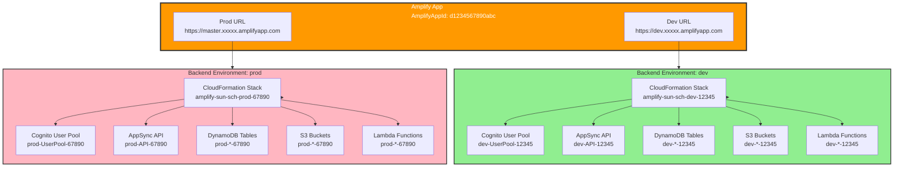
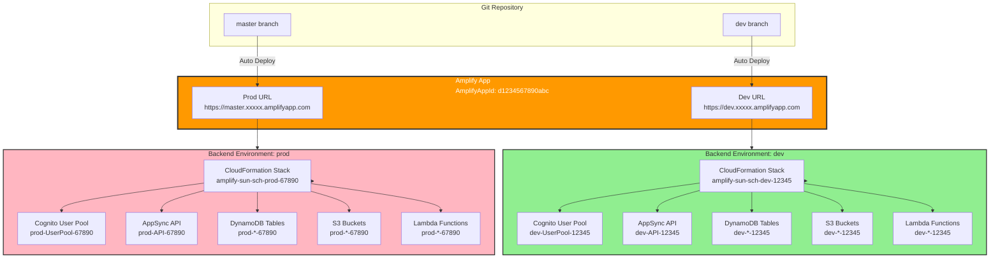

# AWS Amplify Gen 1 Configuration - Sunday School App

## Document Version: 1.0
**Creation Date:** 23 December 2025  
**Last Update:** 23 December 2025  
**Project:** Sunday School App  
**Technologies:** AWS Amplify Gen 1, AWS AppSync, AWS DynamoDB, AWS Cognito, AWS S3, AWS CloudFront  
**Target Audience:** DevOps Engineers, Backend Developers, System Administrators

---

## 1. Overview

This document provides a comprehensive guide to configuring **AWS Amplify Generation 1 (Gen 1)** for the Sunday School App. It covers initial setup, backend resource provisioning (Auth, API, Storage), configuration files, and deployment strategies.

### 1.1 What is AWS Amplify Gen 1?

-   **AWS Amplify Gen 1** is a mature, stable platform for building fullstack serverless applications.
-   Provides a CLI-driven workflow for provisioning AWS resources (Cognito, AppSync, DynamoDB, S3, etc.).
-   Generates configuration files (`amplifyconfiguration.json`) for seamless frontend-backend integration.
-   Offers a managed CI/CD pipeline via Amplify Console for automated deployments.

### 1.2 Why Gen 1 (Not Gen 2)?

-   **Stability:** Gen 1 is battle-tested and production-ready.
-   **Documentation:** Extensive documentation and community support.
-   **MVP Scope:** Gen 1 provides all features required for the MVP (Auth, API, Storage).
-   **Migration Path:** Gen 2 is newer but not necessary for this project's scope.

**⚠️ CRITICAL:** This project uses **Amplify Gen 1**, NOT Gen 2. All CLI commands and configurations follow Gen 1 conventions.

### 1.3 Next.js Compatibility

**Important:** Before deploying to AWS Amplify Hosting, verify Next.js compatibility. See [AMPLIFY_COMPATIBILITY.md](./AMPLIFY_COMPATIBILITY.md) for detailed compatibility information for Next.js 15.5.9 with AWS Amplify Hosting, including support for App Router, Server Actions, and Server Components.

---

## 2. Prerequisites

### 2.1. Install Amplify CLI

**Global Installation:**

```bash
npm install -g @aws-amplify/cli
```

**Verify Installation:**

```bash
amplify --version
```

**Expected Output:** `12.x.x` (or latest Gen 1 version)

---

### 2.2. Configure Amplify CLI with AWS Credentials

**Run Configuration:**

```bash
amplify configure
```

**Follow Prompts:**

1.  **Sign in to AWS Console:** Opens a browser window for AWS login.
2.  **Specify AWS Region:** Choose your preferred region (e.g., `us-east-1`, `eu-west-1`).
3.  **Specify IAM User Name:** Create a new IAM user (e.g., `amplify-dev`).
4.  **Set Permissions:** Attach **AdministratorAccess** policy (for development) or custom policies (for production).
5.  **Access Key ID & Secret Access Key:** Store these securely (e.g., 1Password, AWS Secrets Manager).

**Verification:**

```bash
aws configure list
```

---

## 3. Project Initialization

### 3.1. Initialize Amplify in Your Next.js Project

**Navigate to Project Root:**

```bash
cd sunday-school-app
```

**Initialize Amplify:**

```bash
amplify init
```

**Configuration Prompts:**

```plaintext
? Enter a name for the project: sundayschoolapp
? Initialize the project with the above configuration? No
? Enter a name for the environment: dev
? Choose your default editor: Visual Studio Code
? Choose the type of app that you're building: javascript
? What javascript framework are you using: react
? Source Directory Path: src
? Distribution Directory Path: .next
? Build Command: npm run build
? Start Command: npm run dev
? Do you want to use an AWS profile? Yes
? Please choose the profile you want to use: default (or amplify-dev)
```

**Result:**

-   Creates `amplify/` directory with backend configuration.
-   Creates `amplifyconfiguration.json` in the project root.
-   Initializes the `dev` environment in AWS.

---

### 3.2. Amplify Directory Structure

After initialization, your project will have:

```
amplify/
├── backend/
│   ├── auth/                  # Cognito configuration
│   ├── api/                   # AppSync + DynamoDB configuration
│   ├── storage/               # S3 configuration
│   ├── function/              # Lambda functions (if needed)
│   └── backend-config.json    # Overall backend config
├── team-provider-info.json    # Environment-specific settings (AWS resources)
└── .config/                   # CLI configuration

amplifyconfiguration.json       # Frontend configuration file
```

---

## 4. Adding Backend Resources

### 4.1. Authentication (AWS Cognito)

**Add Auth Resource:**

```bash
amplify add auth
```

**Configuration Prompts:**

```plaintext
? Do you want to use the default authentication and security configuration? Default configuration
? How do you want users to be able to sign in? Email
? Do you want to configure advanced settings? Yes, I want to make some additional changes.
? What attributes are required for signing up? Email
? Do you want to enable any of the following capabilities? (Press <space> to select, <enter> to continue)
  - Add User to Group
  - Email Verification Link with Redirect
  - Override ID Token Claims
```

**Advanced Configuration (Optional):**

-   **MFA (Multi-Factor Authentication):** Optional (Post-MVP)
-   **Password Policy:** Minimum 8 characters, require uppercase, lowercase, number
-   **Email Verification:** Required for account activation

**Deploy Auth:**

```bash
amplify push
```

**Result:**

-   Cognito User Pool created in AWS.
-   `amplifyconfiguration.json` updated with Cognito configuration.

---

### 4.2. GraphQL API (AWS AppSync + DynamoDB)

**Add API Resource:**

```bash
amplify add api
```

**Configuration Prompts:**

```plaintext
? Select from one of the below mentioned services: GraphQL
? Here is the GraphQL API that we will create. Select a setting to edit or continue: Continue
? Choose a schema template: Blank Schema
```

**Define GraphQL Schema:**

Amplify will open the schema file at `amplify/backend/api/<api-name>/schema.graphql`.

**For Sunday School App, use the schema from:**

-   **→ [GRAPHQL_SCHEMA.md](../database/GRAPHQL_SCHEMA.md)**

**Example Schema (Simplified):**

```graphql
# amplify/backend/api/sundayschoolapi/schema.graphql

type User @model @auth(rules: [
  { allow: owner, ownerField: "id" },
  { allow: groups, groups: ["ADMIN", "SUPERADMIN"] }
]) {
  id: ID!
  name: String!
  email: String!
  role: UserRole!
  active: Boolean!
}

enum UserRole {
  TEACHER
  ADMIN
  SUPERADMIN
  PARENT
  PUPIL
}

type Grade @model @auth(rules: [
  { allow: groups, groups: ["TEACHER", "ADMIN", "SUPERADMIN"], operations: [read] }
]) {
  id: ID!
  name: String!
  description: String
  minAge: Int
  maxAge: Int
  active: Boolean!
  pupils: [Pupil] @hasMany(indexName: "byGrade", fields: ["id"])
}

type Pupil @model @auth(rules: [
  { allow: groups, groups: ["TEACHER", "ADMIN", "SUPERADMIN"], operations: [read] }
]) {
  id: ID!
  gradeId: ID! @index(name: "byGrade", sortKeyFields: ["lastName", "firstName"])
  grade: Grade @belongsTo(fields: ["gradeId"])
  firstName: String!
  lastName: String!
  dateOfBirth: AWSDate!
  photo: String
  active: Boolean!
}

# Add more types from GRAPHQL_SCHEMA.md...
```

**Authorization Configuration:**

-   **Cognito User Pools:** Primary authorization mode
-   **API Key:** For public data (optional, not recommended for production)

**Deploy API:**

```bash
amplify push
```

**Result:**

-   AppSync GraphQL API created in AWS.
-   DynamoDB tables provisioned with single-table design (see `DYNAMODB_SCHEMA.md`).
-   `amplifyconfiguration.json` updated with API endpoint and auth configuration.

---

### 4.3. Storage (AWS S3)

**Add Storage Resource:**

```bash
amplify add storage
```

**Configuration Prompts:**

```plaintext
? Select from one of the below mentioned services: Content (Images, audio, video, etc.)
? Provide a friendly name for your resource that will be used to label this category in the project: s3storage
? Provide bucket name: sundayschoolapp-storage-<unique-id>
? Who should have access: Auth users only
? What kind of access do you want for Authenticated users?
  - create/update
  - read
  - delete
? Do you want to add a Lambda Trigger for your S3 Bucket? No
```

**Access Patterns:**

-   **Pupil Photos:** `public/pupils/{pupilId}/avatar.jpg`
-   **Lesson Attachments:** `protected/lessons/{lessonId}/attachment.pdf` (Post-MVP)

**Deploy Storage:**

```bash
amplify push
```

**Result:**

-   S3 bucket created with CORS configuration.
-   CloudFront distribution (optional, for CDN) configured.
-   `amplifyconfiguration.json` updated with S3 bucket name and region.

---

## 5. Configuration Files

### 5.1. `amplifyconfiguration.json`

**Location:** Project root

**Purpose:** Frontend configuration for Amplify libraries (Auth, API, Storage).

**Example:**

```json
{
  "UserAgent": "aws-amplify-cli/2.0",
  "Version": "1.0",
  "api": {
    "plugins": {
      "awsAPIPlugin": {
        "sundayschoolapi": {
          "endpointType": "GraphQL",
          "endpoint": "https://abcdefghijk.appsync-api.us-east-1.amazonaws.com/graphql",
          "region": "us-east-1",
          "authorizationType": "AMAZON_COGNITO_USER_POOLS"
        }
      }
    }
  },
  "auth": {
    "plugins": {
      "awsCognitoAuthPlugin": {
        "UserAgent": "aws-amplify-cli/0.1.0",
        "Version": "0.1.0",
        "IdentityManager": {
          "Default": {}
        },
        "CredentialsProvider": {
          "CognitoIdentity": {
            "Default": {
              "PoolId": "us-east-1:12345678-1234-1234-1234-123456789012",
              "Region": "us-east-1"
            }
          }
        },
        "CognitoUserPool": {
          "Default": {
            "PoolId": "us-east-1_ABCDEFGHI",
            "AppClientId": "1234567890abcdefghijklmno",
            "Region": "us-east-1"
          }
        },
        "Auth": {
          "Default": {
            "authenticationFlowType": "USER_SRP_AUTH",
            "OAuth": {
              "WebDomain": "sundayschoolapp-dev.auth.us-east-1.amazoncognito.com",
              "AppClientId": "1234567890abcdefghijklmno",
              "SignInRedirectURI": "http://localhost:3000/",
              "SignOutRedirectURI": "http://localhost:3000/",
              "Scopes": ["email", "openid", "profile"]
            }
          }
        }
      }
    }
  },
  "storage": {
    "plugins": {
      "awsS3StoragePlugin": {
        "bucket": "sundayschoolapp-storage-dev-12345",
        "region": "us-east-1",
        "defaultAccessLevel": "guest"
      }
    }
  }
}
```

**Usage in Next.js:**

```typescript
// lib/db/amplify.ts
import { Amplify } from 'aws-amplify'
import amplifyConfig from '../../amplifyconfiguration.json'

Amplify.configure(amplifyConfig, { ssr: true })

export default Amplify
```

---

### 5.2. `team-provider-info.json`

**Location:** `amplify/team-provider-info.json`

**Purpose:** Environment-specific AWS resource metadata (e.g., ARNs, stack names).

**Security:** Add to `.gitignore` if it contains sensitive information (e.g., API keys for external services).

**Example:**

```json
{
  "dev": {
    "awscloudformation": {
      "AuthRoleName": "amplify-sundayschoolapp-dev-12345-authRole",
      "UnauthRoleArn": "arn:aws:iam::123456789012:role/amplify-sundayschoolapp-dev-12345-unauthRole",
      "AuthRoleArn": "arn:aws:iam::123456789012:role/amplify-sundayschoolapp-dev-12345-authRole",
      "Region": "us-east-1",
      "DeploymentBucketName": "amplify-sundayschoolapp-dev-12345-deployment",
      "UnauthRoleName": "amplify-sundayschoolapp-dev-12345-unauthRole",
      "StackName": "amplify-sundayschoolapp-dev-12345",
      "StackId": "arn:aws:cloudformation:us-east-1:123456789012:stack/amplify-sundayschoolapp-dev-12345/abcd1234",
      "AmplifyAppId": "d1234567890abc"
    },
    "categories": {
      "auth": {
        "sundayschoolappauth": {
          "userPoolId": "us-east-1_ABCDEFGHI",
          "userPoolName": "sundayschoolappauth",
          "appClientId": "1234567890abcdefghijklmno"
        }
      },
      "api": {
        "sundayschoolapi": {
          "GraphQLAPIIdOutput": "abcdefghijk123456",
          "GraphQLAPIEndpointOutput": "https://abcdefghijk.appsync-api.us-east-1.amazonaws.com/graphql"
        }
      },
      "storage": {
        "s3storage": {
          "BucketName": "sundayschoolapp-storage-dev-12345",
          "Region": "us-east-1"
        }
      }
    }
  }
}
```

---

## 6. Data Access Layer

### 6.1. Amplify Client Initialization

**File:** `lib/db/amplify.ts`

```typescript
import { Amplify } from 'aws-amplify'
import { generateClient } from 'aws-amplify/api'
import amplifyConfig from '../../amplifyconfiguration.json'

// Configure Amplify for SSR (Next.js App Router)
Amplify.configure(amplifyConfig, { ssr: true })

// Generate a type-safe GraphQL client
export const amplifyClient = generateClient()

export default Amplify
```

---

### 6.2. Authentication Helper

**File:** `lib/auth/amplify-auth.ts`

```typescript
import { fetchAuthSession, getCurrentUser, signIn, signOut } from 'aws-amplify/auth'

export async function getAuthenticatedUser() {
  try {
    const user = await getCurrentUser()
    const session = await fetchAuthSession()

    return {
      userId: user.userId,
      username: user.username,
      email: user.signInDetails?.loginId,
      groups: session.tokens?.accessToken.payload['cognito:groups'] as string[] || [],
    }
  } catch (error) {
    console.error('Not authenticated:', error)
    return null
  }
}

export async function authenticateUser(email: string, password: string) {
  try {
    const { isSignedIn, nextStep } = await signIn({ username: email, password })
    return { success: true, isSignedIn, nextStep }
  } catch (error: any) {
    return { success: false, error: error.message }
  }
}

export async function logoutUser() {
  try {
    await signOut()
    return { success: true }
  } catch (error: any) {
    return { success: false, error: error.message }
  }
}
```

---

### 6.3. GraphQL Queries and Mutations

**File:** `lib/db/queries.ts`

```typescript
import { amplifyClient } from './amplify'

// Example: Fetch all lessons for an academic year
export async function getLessonsByAcademicYear(academicYearId: string) {
  try {
    const result = await amplifyClient.graphql({
      query: `
        query ListLessons($academicYearId: ID!) {
          lessonsByAcademicYear(academicYearId: $academicYearId) {
            items {
              id
              title
              lessonDate
              order
            }
          }
        }
      `,
      variables: { academicYearId },
    })

    return result.data.lessonsByAcademicYear.items
  } catch (error) {
    console.error('Error fetching lessons:', error)
    throw new Error('Failed to fetch lessons')
  }
}

// Example: Create a new lesson
export async function createLesson(input: {
  academicYearId: string
  title: string
  lessonDate: string
  content?: string
}) {
  try {
    const result = await amplifyClient.graphql({
      query: `
        mutation CreateLesson($input: CreateLessonInput!) {
          createLesson(input: $input) {
            id
            title
            lessonDate
          }
        }
      `,
      variables: { input },
    })

    return result.data.createLesson
  } catch (error) {
    console.error('Error creating lesson:', error)
    throw new Error('Failed to create lesson')
  }
}
```

---

## 7. Environment Management

### 7.1. Creating Multiple Environments

**Add a New Environment:**

```bash
amplify env add
```

**Prompts:**

```plaintext
? Enter a name for the environment: prod
? Do you want to use an existing service role for CloudFormation? No
? Choose the authentication method you want to use: AWS profile
? Please choose the profile you want to use: default
```

**Switch Between Environments:**

```bash
amplify env checkout dev   # Switch to dev
amplify env checkout prod  # Switch to prod
```

**List Environments:**

```bash
amplify env list
```

### 7.1.1. Multi-Region Setup

**Overview:**

Dev and prod environments can be deployed in different AWS regions. This is useful for:
- **Latency optimization:** Deploy prod closer to your target audience
- **Compliance:** Meet data residency requirements (e.g., GDPR)
- **Resilience:** Geographic redundancy

**Example: Creating prod environment in `eu-west-1`:**

1. **Configure AWS credentials for target region:**

   ```bash
   aws configure --profile prod-eu-west-1
   ```

   - Enter the same Access Key ID and Secret Access Key
   - Specify region: `eu-west-1`

2. **Create prod environment with region-specific profile:**

   ```bash
   amplify env add
   ```

   **Prompts:**

   ```plaintext
   ? Enter a name for the environment: prod
   ? Do you want to use an existing service role for CloudFormation? No
   ? Choose the authentication method you want to use: AWS profile
   ? Please choose the profile you want to use: prod-eu-west-1
   ```

3. **Verify region:**

   ```bash
   cat amplify/team-provider-info.json | grep -A 3 '"prod"'
   ```

   **Expected output:**

   ```json
   "prod": {
     "awscloudformation": {
       "Region": "eu-west-1",
       ...
     }
   }
   ```

**Important Notes:**

- Each environment has its own CloudFormation stack in its own region
- Backend resources (Cognito, AppSync, DynamoDB) are created in the environment's region
- Both environments share the same `AmplifyAppId` but have different stacks

**Architecture Diagram:**



### 7.1.2. Resource Isolation Between Environments

**Overview:**

Each backend environment created via `amplify env add` creates **completely isolated** AWS resources. This ensures that dev and prod data never mix, providing security and data integrity.

**Isolated Resources:**

When you create separate environments (dev and prod), each environment gets its own:

1. **CloudFormation Stack:**
   - Dev: `amplify-sun-sch-dev-12345`
   - Prod: `amplify-sun-sch-prod-67890`

2. **Cognito User Pool:**
   - Dev: `sun-sch-dev-UserPool-12345` (us-east-1)
   - Prod: `sun-sch-prod-UserPool-67890` (eu-west-1)
   - **Isolation:** Users registered in dev cannot access prod, and vice versa

3. **AppSync API:**
   - Dev: `sun-sch-dev-API-12345` (us-east-1)
   - Prod: `sun-sch-prod-API-67890` (eu-west-1)
   - **Isolation:** Separate GraphQL endpoints with separate schemas

4. **DynamoDB Tables:**
   - Dev: `Lesson-dev-12345`, `Pupil-dev-12345`, `Teacher-dev-12345`, etc. (us-east-1)
   - Prod: `Lesson-prod-67890`, `Pupil-prod-67890`, `Teacher-prod-67890`, etc. (eu-west-1)
   - **Isolation:** Complete data separation - dev data never appears in prod tables

5. **S3 Buckets:**
   - Dev: `sun-sch-dev-storage-12345`, `amplify-sun-sch-dev-12345-deployment` (us-east-1)
   - Prod: `sun-sch-prod-storage-67890`, `amplify-sun-sch-prod-67890-deployment` (eu-west-1)
   - **Isolation:** Separate storage buckets for files and deployment artifacts

6. **Lambda Functions (if used):**
   - Dev: `sun-sch-dev-function-12345` (us-east-1)
   - Prod: `sun-sch-prod-function-67890` (eu-west-1)
   - **Isolation:** Separate function instances with separate configurations

**Key Points:**

- **Complete Data Isolation:** Data in dev environment is completely separate from prod environment
- **No Data Mixing:** There is no way for dev data to accidentally appear in prod, or vice versa
- **Security:** Errors or issues in dev cannot affect prod data or resources
- **Independent Scaling:** Each environment can be scaled independently
- **Region-Specific:** Resources are created in their environment's region (dev in us-east-1, prod in eu-west-1)

**Example Resource Naming:**

**Dev Environment (us-east-1):**
```
CloudFormation Stack: amplify-sun-sch-dev-12345
Cognito User Pool: sun-sch-dev-UserPool-12345
AppSync API: sun-sch-dev-API-12345
DynamoDB Tables: Lesson-dev-12345, Pupil-dev-12345, Teacher-dev-12345
S3 Buckets: sun-sch-dev-storage-12345, amplify-sun-sch-dev-12345-deployment
Lambda Functions: sun-sch-dev-function-12345 (if used)
```

**Prod Environment (eu-west-1):**
```
CloudFormation Stack: amplify-sun-sch-prod-67890
Cognito User Pool: sun-sch-prod-UserPool-67890
AppSync API: sun-sch-prod-API-67890
DynamoDB Tables: Lesson-prod-67890, Pupil-prod-67890, Teacher-prod-67890
S3 Buckets: sun-sch-prod-storage-67890, amplify-sun-sch-prod-67890-deployment
Lambda Functions: sun-sch-prod-function-67890 (if used)
```

**Important:** Even though both environments share the same `AmplifyAppId`, all backend resources are completely isolated. This is the default behavior of Amplify Gen 1 when using multiple environments.

---

### 7.2. Environment-Specific Variables

**Use `team-provider-info.json` for environment-specific configuration:**

```json
{
  "dev": {
    "categories": {
      "function": {
        "myLambda": {
          "MY_ENV_VAR": "dev-value"
        }
      }
    }
  },
  "prod": {
    "categories": {
      "function": {
        "myLambda": {
          "MY_ENV_VAR": "prod-value"
        }
      }
    }
  }
}
```

---

## 8. Deployment

### 8.1. Deploy Backend Changes

**Push All Changes:**

```bash
amplify push
```

**Push Without Confirmation:**

```bash
amplify push --yes
```

**Review Changes Before Deploy:**

```bash
amplify status
```

---

### 8.2. Amplify Console CI/CD

**Connect Your Repository:**

1.  **Open Amplify Console:**
    ```bash
    amplify console
    ```

2.  **Connect GitHub/GitLab/Bitbucket:**
    -   Navigate to **Amplify Console** → **All apps** → **Connect app**.
    -   Select your repository and branch (e.g., `main`, `dev`).

3.  **Configure Build Settings:**
    ```yaml
    # amplify.yml
    version: 1
    backend:
      phases:
        build:
          commands:
            - |
              if [ "$AWS_BRANCH" = "master" ]; then
                amplifyPush --simple --environment prod
              elif [ "$AWS_BRANCH" = "dev" ]; then
                amplifyPush --simple --environment dev
              else
                amplifyPush --simple --environment dev
              fi
    frontend:
      phases:
        preBuild:
          commands:
            - npm ci
        build:
          commands:
            - npm run build
      artifacts:
        baseDirectory: .next
        files:
          - '**/*'
      cache:
        paths:
          - node_modules/**/*
          - .next/cache/**/*
    ```

4.  **Deploy:**
    -   Every push to the connected branch triggers an automatic build and deployment.

### 8.2.1. Branch-Based Environment Mapping

**Overview:**

You can map Git branches to specific backend environments in AWS Amplify Console. This allows automatic use of the correct backend environment when deploying from different branches.

**Configuration in AWS Amplify Console:**

1.  **Connect Multiple Branches:**
    -   Navigate to **Amplify Console** → **Your App** → **App settings** → **General**.
    -   Click **Connect branch** for each branch:
        -   **`dev` branch:** Connect to your Git repository
        -   **`master` branch:** Connect to your Git repository

2.  **Map Branches to Backend Environments:**
    -   For each branch, go to **App settings** → **Build settings**.
    -   Find **Backend environment** or **Environment variables** section.
    -   Set:
        -   **`dev` branch:** Backend environment = `dev`
        -   **`master` branch:** Backend environment = `prod`

**Example Configuration:**

-   **Dev branch (`dev`):**
    -   Backend environment: `dev`
    -   Region: `us-east-1` (or your dev region)
    -   Auto-deploys on push to `dev` branch

-   **Production branch (`master`):**
    -   Backend environment: `prod`
    -   Region: `eu-west-1` (or your prod region)
    -   Auto-deploys on push to `master` branch

**Important Notes:**

-   This configuration is done in **AWS Amplify Console**, not in code
-   No code changes are required in your project
-   The `amplify.yml` file can optionally include logic to automatically select the backend environment based on `${AWS_BRANCH}` (see example above)
-   Console settings take priority over `amplify.yml` configuration

**Benefits:**

-   Automatic environment selection based on Git branch
-   Separate backend resources for dev and prod
-   Multi-region support (dev and prod in different regions)
-   No manual environment switching required

### 8.2.2. Single Amplify App with Multiple URLs

**Overview:**

When using Approach 1 (single Amplify App with multiple backend environments), you create **one Amplify App** that provides **two separate URLs** for accessing dev and prod deployments.

**Architecture:**

- **One Amplify App:** Created with a single `AmplifyAppId` (e.g., `d1234567890abc`)
- **Two URLs:**
  - **Dev URL:** `https://dev.xxxxx.amplifyapp.com` (for `dev` branch)
  - **Prod URL:** `https://master.xxxxx.amplifyapp.com` or custom domain (for `master` branch)
- **Two Backend Environments:** Each URL is connected to its corresponding backend environment with completely isolated resources

**How It Works:**

1. **Amplify App Creation:**
   - One Amplify App is created via `amplify init` or AWS Console
   - This App has a single `AmplifyAppId` stored in `amplify/team-provider-info.json`

2. **Branch Connection:**
   - Connect `dev` branch to the Amplify App → creates dev URL
   - Connect `master` branch to the Amplify App → creates prod URL

3. **Backend Environment Mapping:**
   - Dev URL → Backend environment `dev` (us-east-1)
   - Prod URL → Backend environment `prod` (eu-west-1)

4. **Resource Isolation:**
   - Each URL uses its own isolated backend resources
   - Dev URL uses dev resources (Cognito, AppSync, DynamoDB, S3 in us-east-1)
   - Prod URL uses prod resources (Cognito, AppSync, DynamoDB, S3 in eu-west-1)

**Permanent URLs Structure:**

When using Approach 1, you have **one Amplify App with two permanent URLs** that exist continuously:

- **Structure:** One App → Two Branches → Two Permanent URLs
- **Both URLs are active simultaneously:** You can access both dev and prod URLs at the same time
- **Independent updates:** Push to `dev` branch updates only the dev URL; push to `master` branch updates only the prod URL
- **Each URL points to its own deployment:** Dev URL → dev backend environment; Prod URL → prod backend environment

**How URLs are Created:**

1. **Automatic Creation:**
   - When you connect a branch to Amplify App, a permanent URL is **automatically created**
   - URL format: `https://<branch-name>.<AmplifyAppId>.amplifyapp.com`
   - No additional configuration required

2. **First Branch Connection:**
   - Connect `dev` branch → Creates `https://dev.xxxxx.amplifyapp.com` (permanently active)
   - URL is available immediately, even before first deployment

3. **Second Branch Connection:**
   - Connect `master` branch → Creates `https://master.xxxxx.amplifyapp.com` (permanently active)
   - Both URLs now exist and work simultaneously

**Finding URLs in AWS Console:**

- Navigate to **Amplify Console** → **Your App** → **Branches** section
- Each branch displays its permanent URL
- URLs are visible immediately after connecting a branch

**Example URLs:**

After connecting both branches, you will have:

- **Dev Environment:**
  - Frontend URL: `https://dev.xxxxx.amplifyapp.com` (permanently active)
  - Backend: dev environment resources (us-east-1)
  - Users: dev Cognito User Pool
  - Data: dev DynamoDB tables

- **Production Environment:**
  - Frontend URL: `https://master.xxxxx.amplifyapp.com` (permanently active)
  - Custom domain: `https://sundayschool.com` (if configured, also permanently active)
  - Backend: prod environment resources (eu-west-1)
  - Users: prod Cognito User Pool
  - Data: prod DynamoDB tables

**Important Notes:**

- **Both URLs exist permanently:** Once branches are connected, both URLs remain active continuously
- **Custom domain adds to existing URL:** After setting up a custom domain, both the automatic URL and custom domain work simultaneously
- **URLs don't disappear:** URLs remain active as long as branches are connected to the App

**Important Notes:**

- **Single Management Point:** One Amplify App in AWS Console for managing both environments
- **Complete Resource Isolation:** Backend resources are completely isolated between dev and prod
- **No Data Mixing:** Data in dev never appears in prod, and vice versa
- **Independent Scaling:** Each environment can be scaled independently
- **Region-Specific:** Resources are created in their environment's region

**Architecture Diagram:**



---

### 8.3. Manual Frontend Deployment

**Build Next.js App:**

```bash
npm run build
```

**Deploy to Amplify Hosting:**

```bash
amplify publish
```

---

## 9. Monitoring and Troubleshooting

### 9.1. Viewing Logs

**AppSync Logs (CloudWatch):**

```bash
amplify console api
```

-   Navigate to **AppSync Console** → **Logs** → **CloudWatch Logs Insights**.

**Cognito Logs:**

```bash
amplify console auth
```

-   Navigate to **Cognito Console** → **User Pool** → **Monitoring**.

---

### 9.2. Common Issues

#### Issue 1: `amplify push` Fails with "Deployment Failed"

**Solution:**

-   Check CloudFormation stack events in AWS Console.
-   Common causes: IAM permission errors, resource limits, invalid schema.

#### Issue 2: "Unauthorized" Errors in GraphQL Queries

**Solution:**

-   Verify `@auth` directives in GraphQL schema.
-   Ensure user is in the correct Cognito User Group.
-   Check that `amplifyconfiguration.json` has the correct `authorizationType`.

#### Issue 3: "Module not found: aws-amplify"

**Solution:**

```bash
npm install aws-amplify
```

#### Issue 4: Next.js SSR App Returns 404 in Production

**Symptoms:**

-   App works in dev environment but returns 404 in production
-   CloudFront returns "Error from cloudfront" with `server: AmazonS3`
-   Build logs show: `CustomerError: It looks like you are attempting to deploy a Next.js SSR app, but your app's framework looks wrong`

**Root Cause:**

-   Amplify App is configured with wrong Platform (WEB instead of WEB_COMPUTE)
-   Branch Framework is not set to "Next.js - SSR"

**Solution:**

**Step 1: Update App Platform to WEB_COMPUTE**

```bash
# Replace <app-id> and <region> with your values
aws amplify update-app \
  --app-id <app-id> \
  --platform WEB_COMPUTE \
  --region <region>

# Example:
aws amplify update-app \
  --app-id d1a795g3snm344 \
  --platform WEB_COMPUTE \
  --region eu-west-1

aws amplify update-app --app-id d1a795g3snm344 --platform WEB_COMPUTE --region eu-west-1
aws amplify update-branch --app-id d1a795g3snm344 --branch-name master --framework "Next.js - SSR" --region eu-west-1  
```

**Step 2: Update Branch Framework to "Next.js - SSR"**

```bash
# Replace <app-id>, <branch-name>, and <region> with your values
aws amplify update-branch \
  --app-id <app-id> \
  --branch-name <branch-name> \
  --framework "Next.js - SSR" \
  --region <region>

# Example:
aws amplify update-branch \
  --app-id d1a795g3snm344 \
  --branch-name master \
  --framework "Next.js - SSR" \
  --region eu-west-1
```

**Step 3: Trigger a New Build**

```bash
# Replace <app-id>, <branch-name>, and <region> with your values
aws amplify start-job \
  --app-id <app-id> \
  --branch-name <branch-name> \
  --job-type RELEASE \
  --region <region>

# Example:
aws amplify start-job \
  --app-id d1a795g3snm344 \
  --branch-name master \
  --job-type RELEASE \
  --region eu-west-1
```

**Step 4: Check Build Status**

```bash
# Replace <app-id>, <branch-name>, <job-id>, and <region> with your values
aws amplify get-job \
  --app-id <app-id> \
  --branch-name <branch-name> \
  --job-id <job-id> \
  --region <region>

# Example:
aws amplify get-job \
  --app-id d1a795g3snm344 \
  --branch-name master \
  --job-id 6 \
  --region eu-west-1
```

**Alternative: Fix via AWS Console**

1. Open AWS Amplify Console: `https://<region>.console.aws.amazon.com/amplify/apps/<app-id>`
2. Go to **App settings** → **General**
3. Click **Edit**
4. Set **Platform** to `WEB_COMPUTE`
5. Set **Framework** to `Next.js - SSR`
6. Save and redeploy

#### Issue 5: Useful AWS CLI Commands for Amplify Hosting

**List All Amplify Apps:**

```bash
aws amplify list-apps --region <region>
```

**Get App Details:**

```bash
aws amplify get-app --app-id <app-id> --region <region>
```

**List Branches for an App:**

```bash
aws amplify list-branches --app-id <app-id> --region <region>
```

**Get Branch Details:**

```bash
aws amplify get-branch --app-id <app-id> --branch-name <branch-name> --region <region>
```

**List Jobs (Builds) for a Branch:**

```bash
aws amplify list-jobs --app-id <app-id> --branch-name <branch-name> --region <region>
```

**Stop a Running Build:**

```bash
aws amplify stop-job --app-id <app-id> --branch-name <branch-name> --job-id <job-id> --region <region>
```

**Delete a Branch:**

```bash
aws amplify delete-branch --app-id <app-id> --branch-name <branch-name> --region <region>
```

**Update Environment Variables:**

```bash
aws amplify update-branch \
  --app-id <app-id> \
  --branch-name <branch-name> \
  --environment-variables KEY1=value1,KEY2=value2 \
  --region <region>
```

#### Issue 6: Circular Dependency Between Resources in CloudFormation

**Симптомы:**

- `amplify push` завершается с ошибкой: `Circular dependency between resources: [PupilAchievement, CustomResourcesjson, HomeworkCheck, LessonGoldenVerse, GradeEvent]`
- Стек CloudFormation находится в состоянии `UPDATE_ROLLBACK_COMPLETE`
- Ошибка повторяется при каждом деплое

**Причина:**

AWS Amplify GraphQL Transformer переиспользует auth resolver функции между моделями с **идентичными @auth правилами**. Когда несколько моделей имеют одинаковые правила авторизации:

```graphql
@auth(rules: [
  { allow: groups, groups: ["TEACHER", "ADMIN", "SUPERADMIN"] }
])
```

Transformer пытается создать общие auth функции, что приводит к циклическим зависимостям между CloudFormation стеками.

**Проблемные модели:**

- `LessonGoldenVerse`
- `HomeworkCheck`
- `PupilAchievement`
- `GradeEvent`

**Решение:**

Разделить @auth правила на уникальные записи для каждой модели, чтобы предотвратить переиспользование auth функций:

**До (вызывает циклическую зависимость):**

```graphql
type HomeworkCheck
  @model
  @auth(rules: [
    { allow: groups, groups: ["TEACHER", "ADMIN", "SUPERADMIN"] }
  ]) {
  # ...
}
```

**После (устраняет циклическую зависимость):**

```graphql
type HomeworkCheck
  @model
  @auth(rules: [
    { allow: groups, groups: ["TEACHER"] },
    { allow: groups, groups: ["ADMIN"] },
    { allow: groups, groups: ["SUPERADMIN"] }
  ]) {
  # ...
}
```

**Альтернативные подходы:**

1. Разделение групп на отдельные правила (рекомендуется)
2. Изменение порядка групп в правилах
3. Добавление `operations` для создания уникальных правил

**Важные замечания:**

- Функциональность авторизации не изменяется - все группы сохраняют те же права доступа
- Это только изменение структуры правил для предотвращения переиспользования функций
- После исправления необходимо удалить кэш: `Remove-Item -Path "amplify\backend\api\<api-name>\build" -Recurse -Force`
- Перегенерировать стеки: `amplify api gql-compile`
- Выполнить деплой: `amplify push --force --yes`

**Проверка решения:**

```bash
# Проверить отсутствие циклических ссылок
grep -r "referencetotransformerroot.*HomeworkCheck\|referencetotransformerroot.*LessonGoldenVerse" amplify/backend/api/<api-name>/build/stacks/

# Должно вернуть пустой результат
```

**Связанные ресурсы:**

- AWS Amplify GraphQL Transformer Documentation
- CloudFormation Circular Dependency Resolution

---

## 10. Best Practices

### 10.1. Security

-   **Never commit `team-provider-info.json` with sensitive data** (add to `.gitignore`).
-   **Use environment variables** for secrets (e.g., third-party API keys).
-   **Enable MFA** for admin users in Cognito (Post-MVP).
-   **Regularly rotate AWS credentials** for CLI users.

### 10.2. Cost Optimization

-   **Use DynamoDB On-Demand Pricing** for unpredictable workloads (MVP).
-   **Enable S3 Lifecycle Policies** to archive old lesson attachments (Post-MVP).
-   **Monitor AppSync query costs** via CloudWatch metrics.

### 10.3. Schema Management

-   **Version your GraphQL schema** in the `amplify/backend/api/<api-name>/schema.graphql` file.
-   **Use `amplify update api`** to modify the schema incrementally.
-   **Test schema changes in `dev` environment** before deploying to `prod`.

---

## 11. Cross-References

-   **→ [GRAPHQL_SCHEMA.md](../database/GRAPHQL_SCHEMA.md):** Full GraphQL schema definition for AppSync.
-   **→ [DYNAMODB_SCHEMA.md](../database/DYNAMODB_SCHEMA.md):** DynamoDB table design and access patterns.
-   **→ [SECURITY.md](SECURITY.md):** Authentication and authorization details with Cognito.
-   **→ [DEPLOYMENT_GUIDE.md](../deployment/DEPLOYMENT_GUIDE.md):** Comprehensive deployment strategies.
-   **→ [AWS_COST_ESTIMATION.md](AWS_COST_ESTIMATION.md):** Monthly cost estimation for AWS infrastructure.

---

## 12. Related Documentation

### 12.1. Incident Management

- **[DUPLICATE_RESOURCES_INCIDENT.md](./DUPLICATE_RESOURCES_INCIDENT.md)** - Описание инцидента с дублированием ресурсов, причины и шаги предотвращения

### 12.2. Branch Setup

- **[BRANCH_SETUP_CHECKLIST.md](./BRANCH_SETUP_CHECKLIST.md)** - Чек-лист для правильного подключения Git веток к AWS Amplify App

### 12.3. Monitoring Scripts

- **`scripts/check-duplicate-resources.sh`** - Bash скрипт для проверки дублирующих AWS ресурсов
- **`scripts/check-duplicate-resources.ps1`** - PowerShell скрипт для проверки дублирующих AWS ресурсов

**Использование скриптов:**

```bash
# Bash (Linux/Mac)
./scripts/check-duplicate-resources.sh eu-west-1

# PowerShell (Windows)
.\scripts\check-duplicate-resources.ps1 eu-west-1
```

---

## 13. Resources

-   **Amplify Gen 1 Documentation:** https://docs.amplify.aws/gen1/
-   **Amplify CLI Reference:** https://docs.amplify.aws/cli/
-   **AppSync Documentation:** https://docs.aws.amazon.com/appsync/
-   **Cognito Documentation:** https://docs.aws.amazon.com/cognito/
-   **DynamoDB Best Practices:** https://docs.aws.amazon.com/amazondynamodb/latest/developerguide/best-practices.html

---

**End of AWS Amplify Gen 1 Configuration Documentation**

