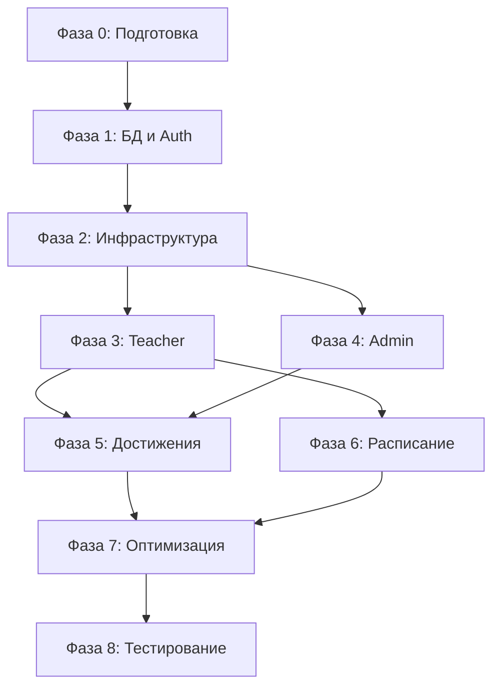

# План реализации - Sunday School App

## Версия документа: 1.0
**Дата создания:** 11 ноября 2025  
**Проект:** Sunday School App (Приложение для управления воскресной школой)  
**Технологии:** Next.js 16, TypeScript, Prisma ORM, Auth.js v5, Zustand, Shadcn UI, BlockNote  
**Общая оценка времени:** 30-40 рабочих дней (6-8 недель)

---

## 1. Обзор

Данный документ описывает детальный план реализации проекта Sunday School App, разбитый на фазы с указанием задач, зависимостей, приоритетов и оценок времени.

### 1.1. Структура плана

План разбит на 8 основных фаз:
- **Фаза 0:** Подготовка окружения (1-2 дня)
- **Фаза 1:** База данных и аутентификация (3-5 дней)
- **Фаза 2:** Базовая инфраструктура (3-4 дня)
- **Фаза 3:** Функционал Teacher (7-10 дней)
- **Фаза 4:** Функционал Admin (5-7 дней)
- **Фаза 5:** Система достижений и мотивации (3-4 дня)
- **Фаза 6:** Расписание и события (2-3 дня)
- **Фаза 7:** Оптимизация и полировка (3-4 дня)
- **Фаза 8:** Тестирование и deployment (2-3 дня)

### 1.2. Зависимости между фазами



### 1.3. Приоритеты

- 🔴 **Критический** - Блокирует другие задачи
- 🟡 **Высокий** - Важно для MVP
- 🟢 **Средний** - Можно отложить
- ⚪ **Низкий** - Nice to have

---

## 2. Фаза 0: Подготовка окружения

**Оценка времени:** 1-2 дня  
**Приоритет:** 🔴 Критический  
**Зависимости:** Нет

### 2.1. Задачи

#### 2.1.1. Настройка проекта Next.js 16

**Задачи:**
- [ ] Инициализация проекта Next.js 16 с App Router
- [ ] Настройка TypeScript конфигурации
- [ ] Настройка структуры директорий согласно ARCHITECTURE.md
- [ ] Создание базовых файлов: `layout.tsx`, `page.tsx`, `globals.css`
- [ ] Настройка `next.config.ts` с React Compiler

**Файлы для создания:**
```
src/
├── app/
│   ├── layout.tsx
│   ├── page.tsx
│   ├── globals.css
│   ├── error.tsx
│   ├── not-found.tsx
│   └── loading.tsx
├── components/
├── lib/
├── actions/
├── types/
└── proxy.ts
```

**Оценка времени:** 2-3 часа

#### 2.1.2. Установка зависимостей

**Задачи:**
- [ ] Установка основных зависимостей:
  - `next@16.0.1`
  - `react@19.2.0`
  - `react-dom@19.2.0`
  - `typescript@^5`
- [ ] Установка Prisma ORM:
  - `@prisma/client`
  - `prisma`
- [ ] Установка Auth.js v5:
  - `next-auth@beta`
  - `bcryptjs`
  - `@types/bcryptjs`
- [ ] Установка Shadcn UI:
  - `@radix-ui/*` (компоненты)
  - `tailwindcss@^4`
  - `class-variance-authority`
  - `clsx`
  - `tailwind-merge`
- [ ] Установка Zustand:
  - `zustand`
- [ ] Установка BlockNote:
  - `@blocknote/core`
  - `@blocknote/react`
- [ ] Установка утилит:
  - `zod` (валидация)
  - `date-fns` (работа с датами)
  - `lucide-react` (иконки)

**Команды:**
```bash
npm install next@16.0.1 react@19.2.0 react-dom@19.2.0
npm install -D typescript @types/node @types/react @types/react-dom
npm install @prisma/client prisma
npm install next-auth@beta bcryptjs @types/bcryptjs
npm install zustand zod date-fns lucide-react
npm install @blocknote/core @blocknote/react
```

**Оценка времени:** 1-2 часа

#### 2.1.3. Настройка TypeScript, ESLint, Prettier

**Задачи:**
- [ ] Настройка `tsconfig.json`:
  - Строгий режим
  - Path aliases (`@/`)
  - Исключение `any` типов
- [ ] Настройка ESLint:
  - Конфигурация Next.js
  - Правила для TypeScript
  - Правила для React
- [ ] Настройка Prettier (опционально):
  - Форматирование кода
  - Интеграция с ESLint

**Оценка времени:** 1 час

#### 2.1.4. Настройка React Compiler

**Задачи:**
- [ ] Установка `babel-plugin-react-compiler`
- [ ] Настройка в `next.config.ts`:
  ```typescript
  experimental: {
    reactCompiler: true,
  }
  ```
- [ ] Проверка работы компилятора

**Оценка времени:** 30 минут

#### 2.1.5. Создание `.env.local`

**Задачи:**
- [ ] Создание `.env.local` на основе `docs/secure_data.md`
- [ ] Настройка переменных окружения:
  - `DATABASE_URL` (Supabase connection pooling)
  - `DIRECT_URL` (Supabase direct connection)
  - `AUTH_SECRET`
  - `NEXTAUTH_URL`
  - Supabase Storage credentials
- [ ] Создание `.env.example` (без реальных значений)
- [ ] Проверка, что `.env.local` в `.gitignore`

**Оценка времени:** 30 минут

#### 2.1.6. Настройка Supabase подключения

**Задачи:**
- [ ] Проверка подключения к Supabase PostgreSQL
- [ ] Тестирование connection pooling (порт 6543)
- [ ] Тестирование direct connection (порт 5432)
- [ ] Настройка Supabase Storage (если нужно)

**Оценка времени:** 1 час

### 2.2. Критерии готовности

- ✅ Проект Next.js 16 инициализирован и запускается
- ✅ Все зависимости установлены
- ✅ TypeScript настроен без ошибок
- ✅ ESLint работает корректно
- ✅ React Compiler включен
- ✅ `.env.local` создан и подключение к Supabase работает
- ✅ Структура директорий соответствует ARCHITECTURE.md

### 2.3. Риски и митигация

**Риск:** Проблемы с подключением к Supabase  
**Митигация:** Проверить credentials в `docs/secure_data.md`, убедиться в правильности URL

**Риск:** Конфликты версий зависимостей  
**Митигация:** Использовать точные версии из package.json, проверить совместимость

---

## 3. Фаза 1: База данных и аутентификация

**Оценка времени:** 3-5 дней  
**Приоритет:** 🔴 Критический  
**Зависимости:** Фаза 0

### 3.1. Задачи

#### 3.1.1. Создание Prisma схемы

**Задачи:**
- [ ] Создание `prisma/schema.prisma` на основе ERD.md
- [ ] Определение всех моделей:
  - `User` (с ролями: TEACHER, ADMIN, SUPERADMIN, PARENT, PUPIL)
  - `Account`, `Session`, `VerificationToken` (Auth.js)
  - `Grade` (группы)
  - `AcademicYear` (учебные годы)
  - `Lesson` (уроки)
  - `GoldenVerse` (золотые стихи)
  - `LessonGoldenVerse` (связь урок-стих)
  - `Pupil` (ученики)
  - `Family` (семьи)
  - `FamilyMember` (члены семьи)
  - `HomeworkCheck` (проверка ДЗ)
  - `Achievement` (достижения)
  - `PupilAchievement` (достижения учеников)
  - `GradeEvent` (события в расписании)
  - `GradeSettings` (настройки оценивания)
  - `UserGrade` (связь преподаватель-группа)
- [ ] Настройка индексов
- [ ] Настройка Foreign Keys с каскадными операциями
- [ ] Определение Enum типов:
  - `UserRole`
  - `AcademicYearStatus`
  - `GradeEventType`
- [ ] Настройка CUID для всех ID

**Оценка времени:** 4-6 часов

#### 3.1.2. Генерация миграций

**Задачи:**
- [ ] Создание первой миграции:
  ```bash
  npx prisma migrate dev --name init
  ```
- [ ] Проверка миграции в Supabase
- [ ] Создание Prisma Client:
  ```bash
  npx prisma generate
  ```
- [ ] Настройка `src/lib/db/prisma.ts` (singleton pattern)

**Оценка времени:** 1-2 часа

#### 3.1.3. Seed скрипты

**Задачи:**
- [ ] Создание `prisma/seed.ts`
- [ ] Seed данных:
  - Тестовые пользователи (Teacher, Admin, Superadmin)
  - Тестовые группы
  - Тестовые учебные годы
  - Тестовые ученики
  - Тестовые семьи
  - Тестовые золотые стихи
  - Тестовые уроки
- [ ] Настройка в `package.json`:
  ```json
  "prisma": {
    "seed": "tsx prisma/seed.ts"
  }
  ```
- [ ] Запуск seed:
  ```bash
  npx prisma db seed
  ```

**Оценка времени:** 3-4 часа

#### 3.1.4. Настройка Auth.js v5

**Задачи:**
- [ ] Создание `src/lib/auth/auth.config.ts`:
  - Настройка Credentials provider
  - Валидация через Zod
  - Проверка пароля через bcrypt
  - Callbacks для JWT и session
- [ ] Создание `src/lib/auth/auth.ts`:
  - Экспорт `auth`, `signIn`, `signOut`, `handlers`
- [ ] Создание API route `src/app/api/auth/[...nextauth]/route.ts`:
  - Экспорт handlers
- [ ] Настройка типов в `src/types/next-auth.d.ts`:
  - Расширение типов User и Session
- [ ] Тестирование аутентификации

**Оценка времени:** 4-6 часов

#### 3.1.5. Реализация proxy.ts (middleware)

**Задачи:**
- [ ] Создание `src/proxy.ts`:
  - Защита приватных маршрутов
  - Проверка ролей для админ-маршрутов
  - Редиректы для неавторизованных пользователей
  - Редиректы для авторизованных на auth страницы
- [ ] Настройка matcher для маршрутов
- [ ] Тестирование защиты маршрутов

**Оценка времени:** 2-3 часа

#### 3.1.6. Создание страницы аутентификации

**Задачи:**
- [ ] Создание `src/app/(auth)/login/page.tsx`:
  - Форма входа (email, password)
  - Валидация через react-hook-form + Zod
  - Обработка ошибок
  - Интеграция с Auth.js
- [ ] Создание компонента формы входа
- [ ] Mobile-first адаптация
- [ ] Toast уведомления для ошибок
- [ ] Тестирование входа

**Оценка времени:** 3-4 часа

### 3.2. Критерии готовности

- ✅ Prisma схема создана и соответствует ERD.md
- ✅ Миграции применены к базе данных
- ✅ Seed данные созданы и загружены
- ✅ Auth.js v5 настроен и работает
- ✅ proxy.ts защищает маршруты
- ✅ Страница входа работает
- ✅ Можно войти в систему с тестовыми учетными данными

### 3.3. Риски и митигация

**Риск:** Ошибки в Prisma схеме  
**Митигация:** Тщательная проверка по ERD.md, тестирование миграций

**Риск:** Проблемы с Auth.js v5 (beta версия)  
**Митигация:** Следовать официальной документации, проверять breaking changes

---

## 4. Фаза 2: Базовая инфраструктура

**Оценка времени:** 3-4 дня  
**Приоритет:** 🔴 Критический  
**Зависимости:** Фаза 1

### 4.1. Задачи

#### 4.1.1. Настройка Shadcn UI

**Задачи:**
- [ ] Инициализация Shadcn UI:
  ```bash
  npx shadcn@latest init
  ```
- [ ] Настройка `components.json`
- [ ] Установи все базовые компоненты с помощью команды: `npx shadcn-ui@latest add --all`
- [ ] Настройка темы (цвета, шрифты)
- [ ] Проверка работы компонентов

**Оценка времени:** 2-3 часа

#### 4.1.2. Создание layouts

**Задачи:**
- [ ] Создание `src/app/(auth)/layout.tsx`:
  - Layout для страниц аутентификации
  - Центрирование формы
- [ ] Создание `src/app/(dashboard)/layout.tsx`:
  - Layout для dashboard (Teacher)
  - Навигация (опционально)
- [ ] Создание `src/app/(admin)/layout.tsx`:
  - Layout для админ-панели
  - Интеграция Sidebar
  - Интеграция Breadcrumbs
- [ ] Тестирование layouts

**Оценка времени:** 3-4 часа

#### 4.1.3. Реализация Sidebar для админки

**Задачи:**
- [ ] Создание `src/components/admin/AdminSidebar.tsx`:
  - Использование Shadcn UI Sidebar
  - Пункты меню с иконками (lucide-react)
  - Адаптивность (Desktop: постоянный, Mobile: Sheet)
- [ ] Интеграция в AdminLayout
- [ ] Настройка Zustand store для состояния sidebar
- [ ] Mobile адаптация (hamburger menu)
- [ ] Тестирование навигации

**Оценка времени:** 4-5 часов

#### 4.1.4. Реализация Breadcrumbs

**Задачи:**
- [ ] Создание `src/components/admin/AdminBreadcrumbs.tsx`:
  - Использование Shadcn UI Breadcrumb
  - Динамическая генерация на основе pathname
  - Маппинг маршрутов на русские названия
- [ ] Интеграция в AdminLayout
- [ ] Mobile адаптация
- [ ] Тестирование навигации

**Оценка времени:** 2-3 часа

#### 4.1.5. Создание базовых Server Components

**Задачи:**
- [ ] Создание утилит для Server Components:
  - `src/lib/utils/server.ts` (хелперы)
- [ ] Создание базовых компонентов:
  - `src/components/shared/Header.tsx`
  - `src/components/shared/Footer.tsx` (опционально)
  - `src/components/shared/LoadingSpinner.tsx`
  - `src/components/shared/ErrorMessage.tsx`
- [ ] Тестирование компонентов

**Оценка времени:** 2-3 часа

#### 4.1.6. Утилиты и хелперы

**Задачи:**
- [ ] Создание `src/lib/utils.ts`:
  - `cn()` для объединения классов
  - Другие утилиты
- [ ] Создание `src/lib/utils/format.ts`:
  - Форматирование дат
  - Форматирование чисел
  - Форматирование текста
- [ ] Создание `src/lib/utils/calculate.ts`:
  - Расчет баллов
  - Расчет рейтинга
  - Расчет домиков
- [ ] Создание `src/lib/validations/`:
  - Zod схемы для валидации
- [ ] Тестирование утилит

**Оценка времени:** 3-4 часа

#### 4.1.7. Error boundaries

**Задачи:**
- [ ] Настройка `src/app/error.tsx`:
  - Обработка ошибок на уровне страниц
  - Кнопка "Попробовать снова"
- [ ] Настройка `src/app/global-error.tsx`:
  - Обработка критических ошибок
- [ ] Создание компонента ErrorBoundary (опционально)
- [ ] Тестирование обработки ошибок

**Оценка времени:** 1-2 часа

### 4.2. Критерии готовности

- ✅ Shadcn UI настроен и компоненты работают
- ✅ Layouts созданы для всех route groups
- ✅ Sidebar работает на Desktop и Mobile
- ✅ Breadcrumbs отображаются на всех админ-страницах
- ✅ Базовые Server Components созданы
- ✅ Утилиты и хелперы готовы к использованию
- ✅ Error boundaries настроены

### 4.3. Риски и митигация

**Риск:** Проблемы с адаптивностью Sidebar  
**Митигация:** Тестирование на реальных устройствах, использование Shadcn UI Sheet

---

## 5. Фаза 3: Функционал Teacher

**Оценка времени:** 7-10 дней  
**Приоритет:** 🟡 Высокий  
**Зависимости:** Фаза 2

### 5.1. Задачи

#### 5.1.1. Страницы управления группой и учебными годами

**Задачи:**
- [ ] Создание `src/app/(dashboard)/grades/my/page.tsx`:
  - Редирект на первую группу или список групп
- [ ] Создание `src/app/(dashboard)/grades/[gradeId]/page.tsx`:
  - Отображение списка учебных годов группы
  - Показ активного года
  - Статистика по годам
  - Кнопки быстрых действий
- [ ] Создание Server Actions:
  - `src/actions/grades.ts` (getGradeById, getGradesByTeacher)
  - `src/actions/academic-years.ts` (getAcademicYearsByGrade)
- [ ] Создание компонентов:
  - `src/components/teacher/GradeDetails.tsx`
  - `src/components/teacher/AcademicYearCard.tsx`
- [ ] Mobile адаптация
- [ ] Тестирование

**Оценка времени:** 1-2 дня

#### 5.1.2. Список уроков

**Задачи:**
- [ ] Создание `src/app/(dashboard)/grades/[gradeId]/academic-years/[yearId]/lessons/page.tsx`:
  - Таблица/список уроков
  - Фильтры (поиск, даты)
  - Пагинация
- [ ] Создание Server Actions:
  - `src/actions/lessons.ts` (getLessonsByAcademicYear, searchLessons)
- [ ] Создание компонентов:
  - `src/components/teacher/LessonsTable.tsx`
  - `src/components/teacher/LessonsFilters.tsx`
- [ ] Mobile адаптация (карточки вместо таблицы)
- [ ] Тестирование

**Оценка времени:** 1-2 дня

#### 5.1.3. Создание и редактирование уроков

**Задачи:**
- [ ] Создание `src/app/(dashboard)/new-lesson/page.tsx`:
  - Форма создания урока
  - Выбор группы (автоматически для Teacher)
  - Выбор золотых стихов (множественный)
  - BlockNote редактор для описания
  - Валидация через Zod
- [ ] Создание `src/app/(dashboard)/lessons/[lessonId]/edit/page.tsx`:
  - Форма редактирования урока
  - Предзаполнение данных
- [ ] Создание Server Actions:
  - `src/actions/lessons.ts` (createLesson, updateLesson, deleteLesson)
  - Проверка активного учебного года
  - Валидация прав доступа
- [ ] Создание компонентов:
  - `src/components/teacher/LessonForm.tsx`
  - `src/components/teacher/GoldenVersesSelector.tsx`
- [ ] Интеграция BlockNote
- [ ] Mobile адаптация
- [ ] Тестирование

**Оценка времени:** 2-3 дня

#### 5.1.4. Детальная страница урока

**Задачи:**
- [ ] Создание `src/app/(dashboard)/lessons/[lessonId]/page.tsx`:
  - Информация об уроке
  - Список золотых стихов
  - Сводная таблица по ученикам
  - Кнопка "Проверить ДЗ"
- [ ] Создание Server Actions:
  - `src/actions/lessons.ts` (getLessonById)
- [ ] Создание компонентов:
  - `src/components/teacher/LessonDetails.tsx`
  - `src/components/teacher/LessonSummaryTable.tsx`
- [ ] Mobile адаптация
- [ ] Тестирование

**Оценка времени:** 1 день

#### 5.1.5. Массовая проверка домашних заданий

**Задачи:**
- [ ] Создание `src/app/(dashboard)/homework-check/[lessonId]/page.tsx`:
  - Таблица с учениками
  - Чекбоксы для каждого параметра (зол. стихи, тест, тетрадь, спевка)
  - Поле для баллов (автоматический расчет)
  - Индикатор домика (автоматически при всех чекбоксах)
  - Кнопки "Сохранить" и "Отменить"
- [ ] Создание Server Actions:
  - `src/actions/homework.ts` (checkHomework, updateHomeworkCheck)
  - Расчет баллов на основе настроек группы
  - Определение домика
- [ ] Создание компонентов:
  - `src/components/teacher/HomeworkCheckTable.tsx` (Desktop)
  - `src/components/teacher/HomeworkCheckCards.tsx` (Mobile)
- [ ] Mobile адаптация (карточки вместо таблицы)
- [ ] Валидация и обработка ошибок
- [ ] Тестирование

**Оценка времени:** 2-3 дня

#### 5.1.6. Личные карточки учеников

**Задачи:**
- [ ] Создание `src/app/(dashboard)/pupil-personal-data/[id]/page.tsx`:
  - Информация об ученике
  - Статистика (баллы, посещаемость)
  - История уроков
  - Достижения (домики, badges)
  - График прогресса
- [ ] Создание Server Actions:
  - `src/actions/pupils.ts` (getPupilById, getPupilHistory)
- [ ] Создание компонентов:
  - `src/components/teacher/PupilCard.tsx`
  - `src/components/teacher/PupilStats.tsx`
  - `src/components/teacher/PupilHistory.tsx`
  - `src/components/teacher/ProgressChart.tsx`
- [ ] Интеграция библиотеки для графиков (опционально)
- [ ] Mobile адаптация
- [ ] Тестирование

**Оценка времени:** 1-2 дня

#### 5.1.7. Рейтинг группы

**Задачи:**
- [ ] Создание `src/app/(dashboard)/grade-leaderboard/[gradeId]/page.tsx`:
  - Таблица рейтинга
  - Фильтрация по периодам (месяц, учебный год)
  - Отображение баллов, домиков, badges
  - Визуализация прогресса
- [ ] Создание Server Actions:
  - `src/actions/grades.ts` (getGradeLeaderboard)
  - Расчет рейтинга
- [ ] Создание компонентов:
  - `src/components/teacher/LeaderboardTable.tsx`
  - `src/components/teacher/LeaderboardFilters.tsx`
- [ ] Mobile адаптация
- [ ] Тестирование

**Оценка времени:** 1-2 дня

#### 5.1.8. Библиотека золотых стихов

**Задачи:**
- [ ] Создание `src/app/(dashboard)/golden-verses-library/page.tsx`:
  - Список всех золотых стихов
  - Поиск и фильтры (книга, глава)
  - Статистика использования
  - Пагинация
- [ ] Создание Server Actions:
  - `src/actions/golden-verses.ts` (getAllGoldenVerses, searchGoldenVerses)
- [ ] Создание компонентов:
  - `src/components/teacher/GoldenVersesList.tsx`
  - `src/components/teacher/GoldenVerseCard.tsx`
- [ ] Mobile адаптация
- [ ] Тестирование

**Оценка времени:** 1 день

### 5.2. Критерии готовности

- ✅ Все страницы Teacher функционала созданы
- ✅ Server Actions работают корректно
- ✅ Компоненты адаптированы для Mobile
- ✅ Валидация и обработка ошибок реализованы
- ✅ Можно создать урок, проверить ДЗ, просмотреть рейтинг

### 5.3. Риски и митигация

**Риск:** Сложность интеграции BlockNote  
**Митигация:** Изучить документацию, использовать примеры

**Риск:** Производительность при большом количестве данных  
**Митигация:** Использовать пагинацию, кеширование, оптимизировать запросы

---

## 6. Фаза 4: Функционал Admin

**Оценка времени:** 5-7 дней  
**Приоритет:** 🟡 Высокий  
**Зависимости:** Фаза 2, Фаза 3 (частично)

### 6.1. Задачи

#### 6.1.1. Dashboard со списком всех групп

**Задачи:**
- [ ] Создание `src/app/(admin)/grades-list/page.tsx`:
  - Карточки всех групп
  - Статистика по группам
  - Кнопки быстрых действий
- [ ] Создание Server Actions:
  - `src/actions/admin.ts` (getAllGrades, getGradeStats)
- [ ] Создание компонентов:
  - `src/components/admin/GradesDashboard.tsx`
  - `src/components/admin/GradeCard.tsx`
- [ ] Mobile адаптация
- [ ] Тестирование

**Оценка времени:** 1 день

#### 6.1.2. Управление преподавателями (CRUD)

**Задачи:**
- [ ] Создание `src/app/(admin)/teachers-management/page.tsx`:
  - Таблица преподавателей
  - Поиск и фильтры
  - Кнопки: Добавить, Редактировать, Удалить, Просмотр
- [ ] Создание модальных окон:
  - Добавление/редактирование преподавателя
  - Назначение на группы
- [ ] Создание Server Actions:
  - `src/actions/teachers.ts` (CRUD операции)
  - Создание пользователя с хешированием пароля
- [ ] Создание компонентов:
  - `src/components/admin/TeachersTable.tsx`
  - `src/components/admin/TeacherForm.tsx`
- [ ] Mobile адаптация
- [ ] Тестирование

**Оценка времени:** 1-2 дня

#### 6.1.3. Управление учениками (CRUD)

**Задачи:**
- [ ] Создание `src/app/(admin)/pupils-management/page.tsx`:
  - Таблица учеников
  - Поиск и фильтры (группа, статус)
  - Кнопки: Добавить, Редактировать, Удалить, Просмотр
- [ ] Создание модальных окон:
  - Добавление/редактирование ученика
  - Назначение на группу
  - Связывание с семьей
- [ ] Создание Server Actions:
  - `src/actions/pupils.ts` (CRUD операции)
- [ ] Создание компонентов:
  - `src/components/admin/PupilsTable.tsx`
  - `src/components/admin/PupilForm.tsx`
- [ ] Mobile адаптация
- [ ] Тестирование

**Оценка времени:** 1-2 дня

#### 6.1.4. Управление семьями (CRUD)

**Задачи:**
- [ ] Создание `src/app/(admin)/families-management/page.tsx`:
  - Список семей
  - Поиск
  - Кнопки: Добавить, Редактировать, Удалить, Просмотр
- [ ] Создание модальных окон:
  - Добавление/редактирование семьи
  - Связывание учеников с семьей
- [ ] Создание Server Actions:
  - `src/actions/families.ts` (CRUD операции)
- [ ] Создание компонентов:
  - `src/components/admin/FamiliesList.tsx`
  - `src/components/admin/FamilyCard.tsx`
  - `src/components/admin/FamilyForm.tsx`
- [ ] Mobile адаптация
- [ ] Тестирование

**Оценка времени:** 1 день

#### 6.1.5. Управление группами и настройками оценивания

**Задачи:**
- [ ] Создание `src/app/(admin)/grades/[gradeId]/settings/page.tsx`:
  - Настройки параметров оценивания
  - Включение/выключение параметров (чекбоксы)
  - Кастомные метки для параметров
  - Настройка баллов за каждый параметр
- [ ] Создание Server Actions:
  - `src/actions/grades.ts` (updateGradeSettings)
- [ ] Создание компонентов:
  - `src/components/admin/GradeSettingsForm.tsx`
- [ ] Валидация и обработка ошибок
- [ ] Mobile адаптация
- [ ] Тестирование

**Оценка времени:** 1 день

#### 6.1.6. Управление учебным процессом

**Задачи:**
- [ ] Создание `src/app/(admin)/school-process-management/page.tsx`:
  - Завершение текущего учебного года (глобально)
  - Создание нового учебного года
  - История учебных годов
- [ ] Создание модальных окон:
  - Создание нового учебного года
  - Подтверждение завершения года
- [ ] Создание Server Actions:
  - `src/actions/academic-years.ts` (finishAcademicYear, createAcademicYear)
  - Проверка, что нет активных уроков
- [ ] Создание компонентов:
  - `src/components/admin/SchoolProcessManagement.tsx`
  - `src/components/admin/AcademicYearForm.tsx`
- [ ] Валидация и обработка ошибок
- [ ] Mobile адаптация
- [ ] Тестирование

**Оценка времени:** 1-2 дня

### 6.2. Критерии готовности

- ✅ Все страницы Admin функционала созданы
- ✅ CRUD операции работают для всех сущностей
- ✅ Настройки групп работают
- ✅ Управление учебным процессом реализовано
- ✅ Все компоненты адаптированы для Mobile

### 6.3. Риски и митигация

**Риск:** Сложность логики завершения учебного года  
**Митигация:** Тщательное тестирование, проверка всех зависимостей

---

## 7. Фаза 5: Система достижений и мотивации

**Оценка времени:** 3-4 дня  
**Приоритет:** 🟡 Высокий  
**Зависимости:** Фаза 3, Фаза 4

### 7.1. Задачи

#### 7.1.1. Система баллов и домиков

**Задачи:**
- [ ] Реализация расчета баллов:
  - На основе настроек группы
  - Автоматический расчет при проверке ДЗ
  - Накопление по урокам
- [ ] Реализация системы домиков:
  - Условие: все параметры выполнены
  - Автоматическое определение при проверке ДЗ
  - Отображение в интерфейсе
- [ ] Обновление Server Actions:
  - `src/actions/homework.ts` (расчет баллов и домиков)
- [ ] Создание утилит:
  - `src/lib/utils/calculate.ts` (calculatePoints, calculateHouse)
- [ ] Тестирование

**Оценка времени:** 1-2 дня

#### 7.1.2. Badges/достижения

**Задачи:**
- [ ] Создание системы badges:
  - Типы достижений (Отличник, Постоянный ученик, Знаток Писания)
  - Критерии для начисления
  - Автоматическое начисление
- [ ] Создание Server Actions:
  - `src/actions/achievements.ts` (checkAndAwardAchievements)
- [ ] Создание компонентов:
  - `src/components/shared/AchievementBadge.tsx`
  - `src/components/teacher/AchievementsList.tsx`
- [ ] Интеграция в личные карточки учеников
- [ ] Тестирование

**Оценка времени:** 1 день

#### 7.1.3. Визуализация прогресса

**Задачи:**
- [ ] Создание графиков прогресса:
  - График баллов по урокам
  - График домиков
  - Прогресс-бары
- [ ] Интеграция библиотеки для графиков (опционально):
  - `recharts` или `chart.js`
- [ ] Создание компонентов:
  - `src/components/teacher/ProgressChart.tsx`
  - `src/components/teacher/ProgressBar.tsx`
- [ ] Интеграция в личные карточки и рейтинг
- [ ] Mobile адаптация
- [ ] Тестирование

**Оценка времени:** 1 день

#### 7.1.4. Рейтинг с игрофикацией

**Задачи:**
- [ ] Улучшение рейтинга:
  - Медали для топ-3
  - Визуализация прогресса
  - Отображение badges
- [ ] Обновление компонентов:
  - `src/components/teacher/LeaderboardTable.tsx`
- [ ] Mobile адаптация
- [ ] Тестирование

**Оценка времени:** 0.5 дня

### 7.2. Критерии готовности

- ✅ Система баллов работает корректно
- ✅ Домики определяются автоматически
- ✅ Badges начисляются по критериям
- ✅ Графики прогресса отображаются
- ✅ Рейтинг с игрофикацией работает

### 7.3. Риски и митигация

**Риск:** Производительность при расчете достижений  
**Митигация:** Кеширование результатов, оптимизация запросов

---

## 8. Фаза 6: Расписание и события

**Оценка времени:** 2-3 дня  
**Приоритет:** 🟡 Высокий  
**Зависимости:** Фаза 3

### 8.1. Задачи

#### 8.1.1. Календарь расписания группы

**Задачи:**
- [ ] Создание `src/app/(dashboard)/grades/[gradeId]/schedule/page.tsx`:
  - Календарь с событиями
  - Цветовые индикаторы типов событий
  - Выбор даты
- [ ] Создание Server Actions:
  - `src/actions/schedule.ts` (getGradeEvents, getEventsByDate)
- [ ] Создание компонентов:
  - `src/components/teacher/ScheduleCalendar.tsx`
  - Использование Shadcn UI Calendar
- [ ] Mobile адаптация
- [ ] Тестирование

**Оценка времени:** 1 день

#### 8.1.2. CRUD операции для событий

**Задачи:**
- [ ] Создание модальных окон:
  - Добавление/редактирование события
  - Типы: Урок, Выездное мероприятие, Отмена урока
- [ ] Создание Server Actions:
  - `src/actions/schedule.ts` (createEvent, updateEvent, deleteEvent)
- [ ] Создание компонентов:
  - `src/components/teacher/EventForm.tsx`
  - `src/components/teacher/EventList.tsx`
- [ ] Валидация и обработка ошибок
- [ ] Mobile адаптация
- [ ] Тестирование

**Оценка времени:** 1-2 дня

#### 8.1.3. Интеграция с уроками

**Задачи:**
- [ ] Связь событий типа "Урок" с уроками
- [ ] Автоматическое создание события при создании урока (опционально)
- [ ] Отображение урока в календаре
- [ ] Тестирование

**Оценка времени:** 0.5 дня

### 8.2. Критерии готовности

- ✅ Календарь отображает события
- ✅ Можно добавлять, редактировать, удалять события
- ✅ События связаны с уроками (где применимо)
- ✅ Mobile адаптация работает

### 8.3. Риски и митигация

**Риск:** Сложность интеграции календаря  
**Митигация:** Использовать Shadcn UI Calendar, следовать документации

---

## 9. Фаза 7: Оптимизация и полировка

**Оценка времени:** 3-4 дня  
**Приоритет:** 🟡 Высокий  
**Зависимости:** Фазы 3-6

### 9.1. Задачи

#### 9.1.1. Performance optimization

**Задачи:**
- [ ] Оптимизация запросов к БД:
  - Использование `include` вместо множественных запросов
  - Индексы на часто запрашиваемых полях
  - Кеширование через React cache
- [ ] Оптимизация изображений:
  - Использование `next/image`
  - Lazy loading
- [ ] Code splitting:
  - Динамические импорты для тяжелых компонентов
  - Оптимизация бандла
- [ ] Проверка Lighthouse scores:
  - FCP < 1.5s
  - LCP < 2.5s
  - TTI < 3.5s
  - CLS < 0.1

**Оценка времени:** 1-2 дня

#### 9.1.2. Mobile responsiveness

**Задачи:**
- [ ] Проверка всех страниц на мобильных устройствах:
  - iPhone (различные размеры)
  - Android (различные размеры)
- [ ] Исправление проблем с адаптивностью
- [ ] Оптимизация touch interactions
- [ ] Проверка производительности на мобильных

**Оценка времени:** 1 день

#### 9.1.3. Accessibility audit

**Задачи:**
- [ ] Проверка с помощью axe DevTools
- [ ] Проверка цветового контраста
- [ ] Проверка keyboard navigation
- [ ] Проверка screen reader support
- [ ] Исправление найденных проблем
- [ ] Цель: WCAG 2.1 AA compliance

**Оценка времени:** 1 день

#### 9.1.4. Error handling

**Задачи:**
- [ ] Улучшение обработки ошибок:
  - Информативные сообщения
  - Toast уведомления для ошибок
  - Error boundaries на всех уровнях
- [ ] Логирование ошибок (опционально)
- [ ] Тестирование различных сценариев ошибок

**Оценка времени:** 0.5 дня

#### 9.1.5. Loading states

**Задачи:**
- [ ] Добавление Skeleton loaders:
  - Для таблиц
  - Для карточек
  - Для форм
- [ ] Добавление Spinner для кнопок
- [ ] Улучшение UX при загрузке

**Оценка времени:** 0.5 дня

#### 9.1.6. Toast notifications

**Задачи:**
- [ ] Настройка Toast для всех действий:
  - Успешные операции
  - Ошибки
  - Информационные сообщения
- [ ] Правильное позиционирование
- [ ] Автоматическое закрытие
- [ ] Mobile адаптация

**Оценка времени:** 0.5 дня

### 9.2. Критерии готовности

- ✅ Lighthouse scores соответствуют требованиям
- ✅ Все страницы адаптированы для Mobile
- ✅ Accessibility соответствует WCAG 2.1 AA
- ✅ Обработка ошибок реализована везде
- ✅ Loading states добавлены
- ✅ Toast уведомления работают

### 9.3. Риски и митигация

**Риск:** Низкие Lighthouse scores  
**Митигация:** Постепенная оптимизация, использование best practices

---

## 10. Фаза 8: Тестирование и deployment

**Оценка времени:** 1-2 дня  
**Приоритет:** 🔴 Критический  
**Зависимости:** Фаза 7

### 10.1. Задачи

#### 10.1.1. Ручное тестирование

**Задачи:**
- [ ] Тестирование всех основных user flows:
  - Вход в систему
  - Создание урока
  - Проверка ДЗ
  - Управление пользователями (Admin)
  - Просмотр рейтинга
  - Расписание группы
- [ ] Тестирование на различных устройствах (Mobile, Tablet, Desktop)
- [ ] Тестирование различных браузеров (Chrome, Firefox, Safari)
- [ ] Тестирование edge cases
- [ ] Проверка обработки ошибок
- [ ] Проверка валидации форм

**Оценка времени:** 0.5-1 день

**⚠️ Примечание:** Автоматизированное тестирование (Unit tests, Integration tests, E2E tests) **не планируется в MVP** и будет реализовано на Post-MVP стадии проекта.

#### 10.1.4. Deployment на Vercel

**Задачи:**
- [ ] Подключение репозитория к Vercel
- [ ] Настройка Environment Variables в Vercel
- [ ] Настройка Build Command
- [ ] Запуск миграций:
  ```bash
  npx prisma migrate deploy
  ```
- [ ] Запуск seed (опционально):
  ```bash
  npx prisma db seed
  ```
- [ ] Проверка работы приложения в production

**Оценка времени:** 1 день

#### 10.1.5. Production testing

**Задачи:**
- [ ] Тестирование всех основных функций в production
- [ ] Проверка производительности
- [ ] Проверка безопасности
- [ ] Исправление найденных проблем

**Оценка времени:** 0.5 дня

### 10.2. Критерии готовности

- ✅ Ручное тестирование всех основных функций выполнено
- ✅ Все основные user flows протестированы
- ✅ Тестирование на различных устройствах и браузерах выполнено
- ✅ Приложение развернуто на Vercel
- ✅ Все функции работают в production
- ✅ Нет критических ошибок

**⚠️ Примечание:** Автоматизированное тестирование не входит в MVP и будет реализовано на Post-MVP стадии.

### 10.3. Риски и митигация

**Риск:** Проблемы при deployment  
**Митигация:** Тестирование на staging окружении, проверка всех переменных окружения

---

## 11. Общая оценка времени

### 11.1. Сводная таблица

| Фаза | Оценка времени | Приоритет |
|------|----------------|-----------|
| Фаза 0: Подготовка окружения | 1-2 дня | 🔴 Критический |
| Фаза 1: База данных и аутентификация | 3-5 дней | 🔴 Критический |
| Фаза 2: Базовая инфраструктура | 3-4 дня | 🔴 Критический |
| Фаза 3: Функционал Teacher | 7-10 дней | 🟡 Высокий |
| Фаза 4: Функционал Admin | 5-7 дней | 🟡 Высокий |
| Фаза 5: Система достижений | 3-4 дня | 🟡 Высокий |
| Фаза 6: Расписание и события | 2-3 дня | 🟡 Высокий |
| Фаза 7: Оптимизация и полировка | 3-4 дня | 🟡 Высокий |
| Фаза 8: Тестирование и deployment | 2-3 дня | 🔴 Критический |
| **ИТОГО** | **30-40 дней** | |

### 11.2. Временная шкала

```
Неделя 1: Фазы 0-1 (Подготовка + БД и Auth)
Неделя 2: Фаза 2 (Инфраструктура)
Неделя 3-4: Фаза 3 (Teacher функционал)
Неделя 5: Фаза 4 (Admin функционал)
Неделя 6: Фазы 5-6 (Достижения + Расписание)
Неделя 7: Фаза 7 (Оптимизация)
Неделя 8: Фаза 8 (Тестирование + Deployment)
```

### 11.3. Параллельная работа

Некоторые задачи можно выполнять параллельно:
- Фазы 3 и 4 (Teacher и Admin) - частично параллельно
- Фаза 5 и 6 (Достижения и Расписание) - параллельно

**⚠️ Примечание:** Автоматизированное тестирование не планируется в MVP, поэтому параллельная работа с тестами не требуется.

---

## 12. Зависимости и блокеры

### 12.1. Критические зависимости

1. **Фаза 1 блокирует все остальные фазы**
   - Без БД и аутентификации нельзя продолжать

2. **Фаза 2 блокирует Фазы 3-6**
   - Без инфраструктуры нельзя создавать функционал

3. **Фаза 3 частично блокирует Фазу 4**
   - Некоторые компоненты Teacher используются в Admin

### 12.2. Риски блокировки

**Риск:** Задержка в Фазе 1  
**Влияние:** Блокирует весь проект  
**Митигация:** Тщательное планирование, резерв времени

**Риск:** Проблемы с интеграцией библиотек  
**Влияние:** Может задержать Фазы 3-6  
**Митигация:** Раннее тестирование, поиск альтернатив

---

## 13. Критерии успеха MVP

### 13.1. Функциональные критерии

- ✅ Все функции из MVP Scope реализованы
- ✅ Все роли (Teacher, Admin, Superadmin) работают
- ✅ Все основные user flows протестированы
- ✅ Нет критических багов

### 13.2. Технические критерии

- ✅ TypeScript без ошибок
- ✅ ESLint без ошибок
- ✅ Lighthouse scores соответствуют требованиям
- ✅ WCAG 2.1 AA compliance
- ✅ Mobile-first реализован

### 13.3. Критерии качества

- ✅ Код следует best practices
- ✅ Компоненты переиспользуемые
- ✅ Документация актуальна
- ✅ Приложение развернуто и работает

---

## 14. Заключение

Данный план реализации обеспечивает:

- ✅ Поэтапную разработку с четкими зависимостями
- ✅ Реалистичные оценки времени
- ✅ Управление рисками
- ✅ Критерии готовности для каждой фазы
- ✅ Гибкость в планировании

**Следующие шаги:**
1. Начать с Фазы 0 (Подготовка окружения)
2. Следовать плану последовательно
3. Регулярно проверять критерии готовности
4. Адаптировать план при необходимости

---

**Версия:** 1.0  
**Последнее обновление:** 11 ноября 2025  
**Автор:** AI Senior Software Architect & Project Manager

