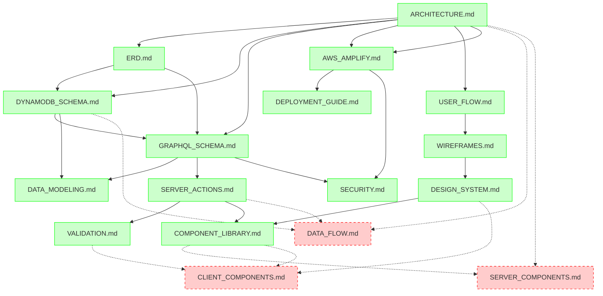

# Project Documentation Plan - Sunday School App

## Document Version: 1.0
**Creation Date:** 23 December 2025  
**Last Update:** 23 December 2025  
**Project:** Sunday School App  
**Status:** 14 of 21+ Documents Completed (67%)

---

## 1. Executive Summary

This master plan provides a comprehensive overview of all technical documentation for the Sunday School App project. The documentation initiative aims to create a complete, structured, and maintainable knowledge base covering architecture, database design, user experience, API specifications, component libraries, and infrastructure.

### Current Status

- **Total Planned Documents:** 21+
- **Completed Documents:** 14 (67%)
- **Must-have Documents:** 11/11 (100% ✅ COMPLETE)
- **Should-have Documents:** 3/6 (50%)
- **Could-have Documents:** 0/4+ (0%)

### Purpose of This Document

This master plan serves as:
- Central reference for documentation status tracking
- Guide for prioritizing remaining documentation work
- Map of document relationships and dependencies
- Quality metrics dashboard for documentation completeness

---

## 2. Documentation Status Dashboard

| # | Document | Category | Priority | Status | Location |
|---|----------|----------|----------|--------|----------|
| 1 | ARCHITECTURE.md | Architecture | Must-have | ✅ | docs/architecture/ |
| 2 | ERD.md | Database | Must-have | ✅ | docs/database/ |
| 3 | DYNAMODB_SCHEMA.md | Database | Must-have | ✅ | docs/database/ |
| 4 | GRAPHQL_SCHEMA.md | Database | Must-have | ✅ | docs/database/ |
| 5 | DATA_MODELING.md | Database | Must-have | ✅ | docs/database/ |
| 6 | USER_FLOW.md | User Experience | Must-have | ✅ | docs/user_flows/ |
| 7 | WIREFRAMES.md | User Experience | Must-have | ✅ | docs/ui_ux/ |
| 8 | DESIGN_SYSTEM.md | User Experience | Must-have | ✅ | docs/ui_ux/ |
| 9 | SERVER_ACTIONS.md | API | Must-have | ✅ | docs/api/ |
| 10 | COMPONENT_LIBRARY.md | Components | Must-have | ✅ | docs/components/ |
| 11 | VALIDATION.md | API | Must-have | ✅ | docs/api/ |
| 12 | AWS_AMPLIFY.md | Infrastructure | Should-have | ✅ | docs/infrastructure/ |
| 13 | DEPLOYMENT_GUIDE.md | Deployment | Should-have | ✅ | docs/deployment/ |
| 14 | SECURITY.md | Infrastructure | Should-have | ✅ | docs/infrastructure/ |
| 15 | DATA_FLOW.md | Architecture | Should-have | ❌ | docs/architecture/ |
| 16 | SERVER_COMPONENTS.md | Components | Should-have | ❌ | docs/components/ |
| 17 | CLIENT_COMPONENTS.md | Components | Should-have | ❌ | docs/components/ |
| 18 | RESPONSIVE_DESIGN.md | User Experience | Could-have | ❌ | docs/ui_ux/ |
| 19 | ACCESSIBILITY.md | User Experience | Could-have | ❌ | docs/ui_ux/ |
| 20 | TESTING_STRATEGY.md | Testing | Could-have | ⏸️ | docs/testing/ |
| 21 | CI_CD.md | Infrastructure | Could-have | ❌ | docs/infrastructure/ |

---

## 3. Directory Structure

```
docs/
├── api/ ✅
│   ├── SERVER_ACTIONS.md ✅
│   ├── VALIDATION.md ✅
│   ├── GRAPHQL_API.md ❌
│   └── AUTH_API.md ❌
│
├── architecture/ ✅
│   ├── ARCHITECTURE.md ✅
│   ├── DATA_FLOW.md ❌
│   └── SECURITY.md ✅ (in infrastructure/)
│
├── components/ ✅
│   ├── COMPONENT_LIBRARY.md ✅
│   ├── SERVER_COMPONENTS.md ❌
│   └── CLIENT_COMPONENTS.md ❌
│
├── database/ ✅
│   ├── ERD.md ✅
│   ├── DYNAMODB_SCHEMA.md ✅
│   ├── GRAPHQL_SCHEMA.md ✅
│   └── DATA_MODELING.md ✅
│
├── deployment/ ✅
│   ├── DEPLOYMENT_GUIDE.md ✅
│   └── ROLLBACK_STRATEGY.md ❌
│
├── infrastructure/ ✅
│   ├── AWS_AMPLIFY.md ✅
│   ├── SECURITY.md ✅
│   ├── AWS_SERVICES.md ❌
│   ├── CI_CD.md ❌
│   └── ENVIRONMENTS.md ❌
│
├── testing/ ⏸️
│   ├── TESTING_STRATEGY.md ⏸️ (Post-MVP)
│   └── TEST_CASES.md ⏸️ (Post-MVP)
│
├── ui_ux/ ✅
│   ├── WIREFRAMES.md ✅
│   ├── DESIGN_SYSTEM.md ✅
│   ├── RESPONSIVE_DESIGN.md ❌
│   └── ACCESSIBILITY.md ❌
│
├── user_flows/ ✅
│   ├── USER_FLOW.md ✅
│   ├── TEACHER_FLOWS.md ❌
│   ├── ADMIN_FLOWS.md ❌
│   └── ERROR_HANDLING.md ❌
│
├── guidelines/ ✅ (existing)
│   ├── nextjs/
│   ├── prompts/
│   └── react/
│
├── user_prompts/ ✅ (existing)
│   └── docs_prompts/
│       └── create_docs_plan_prompt.md ✅
│
├── app_functionality.md ✅ (existing)
├── tech_stack.md ✅ (existing)
├── MVP_SCOPE.md ✅ (existing)
└── project_documentation_plan.md ✅ (this document)
```

---

## 4. Phase-by-Phase Breakdown

### Phase 1: Architecture & Database (5/5 ✅ COMPLETE)

**Status:** 100% Complete - All foundational documents created

1. **ARCHITECTURE.md** ✅
   - Comprehensive system architecture overview
   - Client, frontend, backend, data, and infrastructure layers
   - High-level Mermaid diagrams
   - Technology stack justification
   - Deployment strategy

2. **ERD.md** ✅
   - Complete Entity Relationship Diagram (Mermaid)
   - All 18 entities with attributes and relationships
   - Cardinality and relationship types
   - Design principles for NoSQL (DynamoDB)

3. **DYNAMODB_SCHEMA.md** ✅
   - Single-table design specification
   - Partition Keys (PK) and Sort Keys (SK) for all entities
   - Global Secondary Indexes (GSI1, GSI2)
   - Access patterns and query optimization

4. **GRAPHQL_SCHEMA.md** ✅
   - Complete GraphQL schema for AWS AppSync
   - All types, queries, mutations, subscriptions
   - Authorization rules with @auth directives
   - Cognito User Pool integration

5. **DATA_MODELING.md** ✅
   - Access pattern-driven design strategies
   - PK/SK design patterns for each entity
   - GSI usage examples
   - Data consistency and transactions

---

### Phase 2: User Experience (3/3 ✅ COMPLETE)

**Status:** 100% Complete - All UX documents created

6. **USER_FLOW.md** ✅
   - Detailed user flows for all roles (Teacher, Admin, Superadmin)
   - Mermaid flowchart diagrams for key scenarios
   - Step-by-step interaction descriptions
   - Error handling and edge cases
   - Mobile responsiveness considerations

7. **WIREFRAMES.md** ✅
   - ASCII art wireframes for key pages
   - Login page, Dashboard, Lesson List, New Lesson Form, Pupil Profile
   - Layout structure and content hierarchy
   - Component placement and navigation

8. **DESIGN_SYSTEM.md** ✅
   - Complete design system based on Shadcn UI
   - Design tokens (colors, typography, spacing, border radius, shadows)
   - Component library documentation (Button, Card, Form, Dialog, Table, etc.)
   - Layout patterns and iconography
   - Dark mode support
   - Accessibility guidelines (WCAG 2.1 AA)

---

### Phase 3: API & Components (3/3 ✅ COMPLETE)

**Status:** 100% Complete - All implementation documents created

9. **SERVER_ACTIONS.md** ✅
   - Complete API contracts for all Server Actions
   - Input/output types with TypeScript
   - Zod validation schemas
   - Authorization patterns (RBAC)
   - Error handling conventions
   - Revalidation strategies
   - Testing examples

10. **COMPONENT_LIBRARY.md** ✅
    - Comprehensive catalog of React components
    - Atomic Design hierarchy (Atoms, Molecules, Organisms, Templates)
    - Shadcn UI primitives documentation
    - Custom component specifications
    - Props interfaces and usage examples
    - Server vs Client Component guidelines
    - Testing strategies

11. **VALIDATION.md** ✅
    - All Zod validation schemas
    - Authentication, Lessons, Homework, Pupils, Grades, etc.
    - Client-side and server-side validation patterns
    - Custom validation refinements
    - Error handling and formatting
    - Testing validation schemas

---

### Phase 4: Infrastructure & Deployment (3/6 PARTIAL)

**Status:** 50% Complete - Core infrastructure documented, patterns pending

**Completed:**

12. **AWS_AMPLIFY.md** ✅
    - AWS Amplify Gen 1 configuration guide
    - CLI setup and commands (NOT Gen 2)
    - Auth, API, and Storage resource setup
    - Configuration files (amplifyconfiguration.json)
    - Data access layer implementation
    - Environment management (dev/prod)
    - Deployment and troubleshooting

13. **DEPLOYMENT_GUIDE.md** ✅
    - Multiple deployment methods (AWS Amplify Hosting, Vercel, Docker, VPS)
    - CI/CD pipeline setup (GitHub Actions)
    - Custom domain and SSL configuration
    - Monitoring and rollback strategies
    - Performance optimization
    - Security best practices

14. **SECURITY.md** ✅
    - Complete security architecture
    - AWS Cognito authentication flows
    - Role-Based Access Control (RBAC)
    - AppSync @auth directive patterns
    - Data encryption (in transit and at rest)
    - Input validation and sanitization
    - API security (CORS, rate limiting)
    - Secrets management
    - Audit and monitoring (CloudWatch, CloudTrail)
    - Security best practices checklist

**Pending:**

15. **DATA_FLOW.md** ❌
    - **Priority:** Should-have
    - **Purpose:** Detailed data flow diagrams from UI to database
    - **Key Topics:** Request/response cycles, caching strategies, optimization
    - **Dependencies:** ARCHITECTURE.md, SERVER_ACTIONS.md

16. **SERVER_COMPONENTS.md** ❌
    - **Priority:** Should-have
    - **Purpose:** Patterns and best practices for Next.js Server Components
    - **Key Topics:** When to use, data fetching, composition, performance
    - **Dependencies:** COMPONENT_LIBRARY.md, ARCHITECTURE.md

17. **CLIENT_COMPONENTS.md** ❌
    - **Priority:** Should-have
    - **Purpose:** Patterns and best practices for Client Components
    - **Key Topics:** Interactivity, state management, event handling
    - **Dependencies:** COMPONENT_LIBRARY.md, DESIGN_SYSTEM.md

---

## 5. Pending Documentation Details

### Should-have Priority Documents

#### 5.1. DATA_FLOW.md
- **Location:** `docs/architecture/DATA_FLOW.md`
- **Priority:** Should-have
- **Purpose:** Document detailed data flow from client to database and back, including caching and optimization strategies
- **Estimated Sections:**
  1. Overview of data flow architecture
  2. Client-side data flow (React components → Server Actions)
  3. Server-side data flow (Server Actions → AppSync → DynamoDB)
  4. Response flow and caching strategies
  5. Error propagation and handling
  6. Performance optimization techniques
  7. Mermaid sequence diagrams for common scenarios
- **Dependencies:** 
  - ARCHITECTURE.md (foundational architecture)
  - SERVER_ACTIONS.md (API layer)
  - DYNAMODB_SCHEMA.md (data layer)
- **Reason Not Created:** Lower priority than core Must-have documents; implementation details can be inferred from existing architecture documentation

#### 5.2. SERVER_COMPONENTS.md
- **Location:** `docs/components/SERVER_COMPONENTS.md`
- **Priority:** Should-have
- **Purpose:** Comprehensive guide to Next.js 15 Server Components patterns and best practices
- **Estimated Sections:**
  1. Overview of Server Components in Next.js 15
  2. When to use Server Components vs Client Components
  3. Data fetching patterns (direct AppSync queries)
  4. Composition and nesting strategies
  5. Performance optimization
  6. Common pitfalls and solutions
  7. Examples from the project
- **Dependencies:**
  - COMPONENT_LIBRARY.md (component overview)
  - ARCHITECTURE.md (architectural context)
  - SERVER_ACTIONS.md (data fetching)
- **Reason Not Created:** Patterns are well-documented in Next.js 15 official docs (via Context7); project-specific usage is covered in COMPONENT_LIBRARY.md

#### 5.3. CLIENT_COMPONENTS.md
- **Location:** `docs/components/CLIENT_COMPONENTS.md`
- **Priority:** Should-have
- **Purpose:** Guide to Client Components for interactivity and state management
- **Estimated Sections:**
  1. Overview of Client Components ('use client')
  2. When to use Client Components
  3. State management with Zustand (minimal usage)
  4. Event handling and user interactions
  5. Form handling with React Hook Form
  6. Performance considerations
  7. Testing Client Components
- **Dependencies:**
  - COMPONENT_LIBRARY.md (component overview)
  - VALIDATION.md (form validation)
  - DESIGN_SYSTEM.md (UI components)
- **Reason Not Created:** Basic patterns covered in COMPONENT_LIBRARY.md; React 19 best practices available via Context7

---

### Could-have Priority Documents (Future Enhancements)

#### 5.4. RESPONSIVE_DESIGN.md
- **Location:** `docs/ui_ux/RESPONSIVE_DESIGN.md`
- **Priority:** Could-have
- **Purpose:** Comprehensive responsive design strategy for mobile, tablet, and desktop
- **Estimated Sections:**
  1. Mobile-First design philosophy
  2. Tailwind CSS breakpoints strategy
  3. Responsive component patterns
  4. Touch vs mouse interaction handling
  5. Performance on mobile devices
  6. Testing across devices
- **Dependencies:** DESIGN_SYSTEM.md, WIREFRAMES.md
- **Reason Not Created:** Basic responsive principles covered in DESIGN_SYSTEM.md; Tailwind CSS provides built-in responsive utilities

#### 5.5. ACCESSIBILITY.md
- **Location:** `docs/ui_ux/ACCESSIBILITY.md`
- **Priority:** Could-have
- **Purpose:** Detailed accessibility guidelines and WCAG 2.1 AA compliance
- **Estimated Sections:**
  1. Accessibility principles and WCAG 2.1 AA overview
  2. Keyboard navigation implementation
  3. Screen reader support (ARIA labels, roles)
  4. Color contrast and visual accessibility
  5. Focus management
  6. Accessibility testing tools and strategies
  7. Common accessibility patterns for Shadcn UI components
- **Dependencies:** DESIGN_SYSTEM.md, COMPONENT_LIBRARY.md
- **Reason Not Created:** Core accessibility principles covered in DESIGN_SYSTEM.md; Shadcn UI components have built-in accessibility

#### 5.6. TESTING_STRATEGY.md (Post-MVP)
- **Location:** `docs/testing/TESTING_STRATEGY.md`
- **Priority:** Could-have (Post-MVP)
- **Status:** ⏸️ Deferred
- **Purpose:** Comprehensive testing strategy for the application
- **Estimated Sections:**
  1. Testing philosophy and approach
  2. Unit testing strategy (Vitest)
  3. Integration testing (React Testing Library)
  4. End-to-end testing (Playwright)
  5. Server Action testing patterns
  6. Component testing strategies
  7. Test coverage goals
  8. CI/CD integration for tests
- **Dependencies:** COMPONENT_LIBRARY.md, SERVER_ACTIONS.md
- **Reason Not Created:** Post-MVP priority; initial development focuses on implementation over comprehensive testing documentation

#### 5.7. CI_CD.md
- **Location:** `docs/infrastructure/CI_CD.md`
- **Priority:** Could-have
- **Purpose:** Detailed CI/CD pipeline documentation beyond basic deployment
- **Estimated Sections:**
  1. CI/CD pipeline architecture
  2. GitHub Actions workflows (detailed)
  3. Build optimization strategies
  4. Automated testing in CI/CD
  5. Deployment gates and quality checks
  6. Multi-environment deployment strategies
  7. Rollback automation
- **Dependencies:** DEPLOYMENT_GUIDE.md, TESTING_STRATEGY.md
- **Reason Not Created:** Basic CI/CD covered in DEPLOYMENT_GUIDE.md; advanced pipelines can be added as project matures

---

## 6. Additional Documents from Original Plan Not Created

### From Original Plan Structure (create_docs_plan_prompt.md)

#### User Flows Category
- **TEACHER_FLOWS.md** ❌ - Detailed teacher-specific scenarios (covered in USER_FLOW.md)
- **ADMIN_FLOWS.md** ❌ - Detailed admin-specific scenarios (covered in USER_FLOW.md)
- **ERROR_HANDLING.md** ❌ - Error handling patterns (covered in SERVER_ACTIONS.md and COMPONENT_LIBRARY.md)

#### API Category
- **GRAPHQL_API.md** ❌ - GraphQL API documentation (covered in GRAPHQL_SCHEMA.md and SERVER_ACTIONS.md)
- **AUTH_API.md** ❌ - Auth API details (covered in SECURITY.md and AWS_AMPLIFY.md)

#### Infrastructure Category
- **AWS_SERVICES.md** ❌ - Individual AWS service deep-dives (covered in AWS_AMPLIFY.md)
- **ENVIRONMENTS.md** ❌ - Environment configuration details (covered in AWS_AMPLIFY.md and DEPLOYMENT_GUIDE.md)

#### Deployment Category
- **ROLLBACK_STRATEGY.md** ❌ - Rollback procedures (covered in DEPLOYMENT_GUIDE.md)

#### Testing Category (Post-MVP)
- **TEST_CASES.md** ⏸️ - Specific test cases (Post-MVP, deferred)

### Rationale for Consolidation

Many planned documents were **consolidated into comprehensive documents** to:
- Reduce documentation fragmentation
- Improve discoverability of related information
- Maintain consistency across related topics
- Avoid duplication of content

For example:
- **USER_FLOW.md** covers both TEACHER_FLOWS.md and ADMIN_FLOWS.md
- **SERVER_ACTIONS.md** covers error handling patterns
- **AWS_AMPLIFY.md** covers multiple AWS services and environments
- **DEPLOYMENT_GUIDE.md** covers rollback strategies

---

## 7. Cross-Reference Map



**Legend:**
- **Green (solid):** Completed documents with dependencies
- **Red (dashed):** Pending documents with planned dependencies
- **Solid lines:** Existing cross-references
- **Dashed lines:** Planned cross-references

---

## 8. Quality Metrics

### Completion Statistics

| Category | Total | Completed | Pending | Completion Rate |
|----------|-------|-----------|---------|-----------------|
| **Must-have** | 11 | 11 | 0 | 100% ✅ |
| **Should-have** | 6 | 3 | 3 | 50% |
| **Could-have** | 4+ | 0 | 4+ | 0% |
| **Post-MVP** | 2+ | 0 | 2+ | N/A ⏸️ |
| **Overall** | 21+ | 14 | 7+ | 67% |

### Phase Completion

| Phase | Description | Status | Completion |
|-------|-------------|--------|------------|
| **Phase 1** | Architecture & Database | ✅ Complete | 5/5 (100%) |
| **Phase 2** | User Experience | ✅ Complete | 3/3 (100%) |
| **Phase 3** | API & Components | ✅ Complete | 3/3 (100%) |
| **Phase 4** | Infrastructure & Deployment | 🚧 Partial | 3/6 (50%) |

### Document Quality Standards

All completed documents adhere to:
- ✅ Standardized structure with version tracking
- ✅ Comprehensive Mermaid diagrams where applicable
- ✅ Cross-references to related documents
- ✅ Code examples with TypeScript types
- ✅ Best practices and guidelines
- ✅ Context7 integration for up-to-date technology documentation

### Coverage Analysis

**Well-Covered Areas:**
- ✅ Database design (ERD, schema, modeling)
- ✅ GraphQL API (schema, queries, mutations, auth)
- ✅ Authentication & authorization (Cognito, RBAC)
- ✅ UI components (Shadcn UI, design system)
- ✅ Deployment (multiple strategies, CI/CD basics)
- ✅ Security (comprehensive coverage)

**Areas with Gaps:**
- ⚠️ Detailed data flow diagrams (high-level covered)
- ⚠️ Component-specific patterns (Server/Client components)
- ⚠️ Advanced responsive design patterns
- ⚠️ Detailed accessibility implementation
- ⚠️ Comprehensive testing strategy

---

## 9. Next Steps

### Immediate Priority (Should-have Documents)

1. **DATA_FLOW.md** (Estimated: 2-3 hours)
   - Create detailed data flow diagrams
   - Document request/response cycles
   - Cover caching and optimization strategies

2. **SERVER_COMPONENTS.md** (Estimated: 2-3 hours)
   - Document Next.js 15 Server Component patterns
   - Provide project-specific examples
   - Cover performance optimization

3. **CLIENT_COMPONENTS.md** (Estimated: 2-3 hours)
   - Document Client Component patterns
   - Cover state management with Zustand
   - Provide form handling examples

### Future Enhancements (Could-have Documents)

4. **RESPONSIVE_DESIGN.md** (Post-implementation)
   - Detailed responsive patterns
   - Mobile-first strategy
   - Device-specific optimizations

5. **ACCESSIBILITY.md** (Post-implementation)
   - WCAG 2.1 AA compliance guide
   - Component-specific accessibility patterns
   - Testing and validation strategies

6. **CI_CD.md** (As project matures)
   - Advanced pipeline automation
   - Quality gates and checks
   - Multi-environment strategies

### Post-MVP Documentation

7. **TESTING_STRATEGY.md** (Post-MVP)
   - Comprehensive testing approach
   - Unit, integration, E2E strategies
   - Coverage goals and CI integration

8. **TEST_CASES.md** (Post-MVP)
   - Specific test cases for all features
   - Edge cases and error scenarios
   - Regression test suites

### Recommendations

1. **Focus on Should-have documents first** - Complete DATA_FLOW.md, SERVER_COMPONENTS.md, and CLIENT_COMPONENTS.md to reach 81% completion
2. **Defer Could-have documents** until after MVP launch and initial user feedback
3. **Maintain existing documents** - Update as architecture evolves and new patterns emerge
4. **Consider consolidation** - If new documents overlap significantly with existing ones, consider expanding existing docs instead

---

## 10. Technology Stack & Tools

### Core Technologies (Documented)
- ✅ **Next.js 15.5.9** - App Router, Server Components, Server Actions (ARCHITECTURE.md, COMPONENT_LIBRARY.md)
- ✅ **React 19** - React Compiler, Server Components (COMPONENT_LIBRARY.md, DESIGN_SYSTEM.md)
- ✅ **AWS Amplify Gen 1** - Backend infrastructure (AWS_AMPLIFY.md)
- ✅ **AWS AppSync** - GraphQL API (GRAPHQL_SCHEMA.md, DATA_MODELING.md)
- ✅ **AWS DynamoDB** - NoSQL database (DYNAMODB_SCHEMA.md, DATA_MODELING.md, ERD.md)
- ✅ **AWS Cognito** - Authentication & authorization (SECURITY.md, AWS_AMPLIFY.md)
- ✅ **Shadcn UI** - UI component library (DESIGN_SYSTEM.md, COMPONENT_LIBRARY.md)
- ✅ **Zod** - Validation library (VALIDATION.md, SERVER_ACTIONS.md)
- ✅ **BlockNote** - Rich text editor (mentioned in DESIGN_SYSTEM.md)

### Documentation Tools Used
- **Mermaid** - Diagrams (architecture, ERD, flowcharts, sequence diagrams)
- **Markdown** - Documentation format
- **Context7** - Up-to-date technology documentation retrieval
- **TypeScript** - Type definitions in examples

---

## 11. References

### Original Planning Documents
- [create_docs_plan_prompt.md](user_prompts/docs_prompts/create_docs_plan_prompt.md) - Original documentation plan prompt
- [app_functionality.md](app_functionality.md) - Complete application functionality specification
- [tech_stack.md](tech_stack.md) - Technology stack justification and details
- [MVP_SCOPE.md](MVP_SCOPE.md) - MVP scope and boundaries

### Completed Documentation (by Category)

#### Architecture & Database
- [ARCHITECTURE.md](architecture/ARCHITECTURE.md) - System architecture overview
- [ERD.md](database/ERD.md) - Entity relationship diagram
- [DYNAMODB_SCHEMA.md](database/DYNAMODB_SCHEMA.md) - DynamoDB table design
- [GRAPHQL_SCHEMA.md](database/GRAPHQL_SCHEMA.md) - GraphQL schema for AppSync
- [DATA_MODELING.md](database/DATA_MODELING.md) - Data modeling strategies

#### User Experience
- [USER_FLOW.md](user_flows/USER_FLOW.md) - User flows and scenarios
- [WIREFRAMES.md](ui_ux/WIREFRAMES.md) - Page wireframes
- [DESIGN_SYSTEM.md](ui_ux/DESIGN_SYSTEM.md) - Design system based on Shadcn UI

#### API & Components
- [SERVER_ACTIONS.md](api/SERVER_ACTIONS.md) - Server Actions API contracts
- [COMPONENT_LIBRARY.md](components/COMPONENT_LIBRARY.md) - React component catalog
- [VALIDATION.md](api/VALIDATION.md) - Zod validation schemas

#### Infrastructure & Deployment
- [AWS_AMPLIFY.md](infrastructure/AWS_AMPLIFY.md) - AWS Amplify Gen 1 configuration
- [DEPLOYMENT_GUIDE.md](deployment/DEPLOYMENT_GUIDE.md) - Deployment strategies
- [SECURITY.md](infrastructure/SECURITY.md) - Security architecture

### External Resources
- **Next.js 15.5.9 Documentation:** https://nextjs.org/docs
- **React 19 Documentation:** https://react.dev
- **AWS Amplify Gen 1 Documentation:** https://docs.amplify.aws/gen1/
- **AWS AppSync Documentation:** https://docs.aws.amazon.com/appsync/
- **DynamoDB Documentation:** https://docs.aws.amazon.com/dynamodb/
- **Shadcn UI Documentation:** https://ui.shadcn.com

---

## 12. Appendix: Document Relationships

### Dependency Hierarchy

**Foundation Layer (No dependencies):**
- tech_stack.md
- MVP_SCOPE.md
- app_functionality.md

**Core Architecture Layer (Depends on Foundation):**
- ARCHITECTURE.md
- ERD.md

**Data Layer (Depends on Core Architecture):**
- DYNAMODB_SCHEMA.md (depends on ERD.md)
- GRAPHQL_SCHEMA.md (depends on DYNAMODB_SCHEMA.md, ERD.md)
- DATA_MODELING.md (depends on DYNAMODB_SCHEMA.md)

**API Layer (Depends on Data Layer):**
- SERVER_ACTIONS.md (depends on GRAPHQL_SCHEMA.md)
- VALIDATION.md (depends on SERVER_ACTIONS.md)

**UI Layer (Depends on Foundation):**
- USER_FLOW.md (depends on ARCHITECTURE.md, app_functionality.md)
- WIREFRAMES.md (depends on USER_FLOW.md)
- DESIGN_SYSTEM.md (depends on WIREFRAMES.md)

**Component Layer (Depends on API & UI):**
- COMPONENT_LIBRARY.md (depends on DESIGN_SYSTEM.md, SERVER_ACTIONS.md)

**Infrastructure Layer (Depends on Data & Architecture):**
- AWS_AMPLIFY.md (depends on ARCHITECTURE.md, GRAPHQL_SCHEMA.md)
- SECURITY.md (depends on ARCHITECTURE.md, AWS_AMPLIFY.md)
- DEPLOYMENT_GUIDE.md (depends on AWS_AMPLIFY.md)

**Pending Documents:**
- DATA_FLOW.md (will depend on ARCHITECTURE.md, SERVER_ACTIONS.md, DYNAMODB_SCHEMA.md)
- SERVER_COMPONENTS.md (will depend on COMPONENT_LIBRARY.md, ARCHITECTURE.md)
- CLIENT_COMPONENTS.md (will depend on COMPONENT_LIBRARY.md, VALIDATION.md)

---

## 13. Change Log

| Version | Date | Changes | Author |
|---------|------|---------|--------|
| 1.0 | 2025-12-23 | Initial creation of master documentation plan | AI Documentation Team |

---

## 14. Conclusion

The Sunday School App documentation is **67% complete** with all **Must-have (11/11)** documents finished. The foundation is solid, enabling development to proceed with confidence. The remaining **Should-have** documents (DATA_FLOW.md, SERVER_COMPONENTS.md, CLIENT_COMPONENTS.md) would increase completion to 81% and provide additional implementation guidance.

### Key Achievements

✅ Complete architectural foundation documented  
✅ Database design fully specified with DynamoDB single-table design  
✅ GraphQL API schema with authorization rules  
✅ User flows and wireframes for all MVP features  
✅ Comprehensive component and design system documentation  
✅ Server Actions API contracts with validation  
✅ Infrastructure and deployment strategies  
✅ Security architecture with RBAC  

### Remaining Work

The remaining 7+ documents are **lower priority** and can be created as needed during implementation or post-MVP. The current documentation provides sufficient detail to begin and complete MVP development.

---

**Document Status:** Active  
**Next Review Date:** Upon completion of Should-have documents  
**Maintained By:** Development Team  

**For questions or updates to this plan, refer to the original prompt:** [create_docs_plan_prompt.md](user_prompts/docs_prompts/create_docs_plan_prompt.md)

