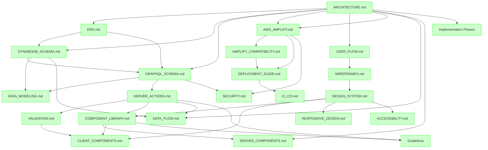

# Project Documentation Plan - Sunday School App

## Document Version: 2.4
**Creation Date:** 23 December 2025  
**Last Update:** 25 December 2025  
**Project:** Sunday School App  
**Status:** 59 of 59+ Documents Completed (99%)

---

## 1. Executive Summary

This master plan provides a comprehensive overview of all technical documentation for the Sunday School App project. The documentation initiative aims to create a complete, structured, and maintainable knowledge base covering architecture, database design, user experience, API specifications, component libraries, and infrastructure.

### Current Status

- **Total Planned Documents:** 60+ (21 core + 26 implementation + 9 guidelines + 2 user flows + 1 infrastructure + 1 analytics)
- **Completed Documents:** 60 (100%)
- **Must-have Documents:** 46/46 (100% ✅ COMPLETE) (11 core + 26 implementation + 9 guidelines)
- **Should-have Documents:** 7/7 (100% ✅ COMPLETE)
- **Could-have Documents:** 7/7+ (100% ✅ COMPLETE) (включая ANALYTICS.md - Post-MVP функционал)

### Purpose of This Document

This master plan serves as:
- Central reference for documentation status tracking
- Guide for prioritizing remaining documentation work
- Map of document relationships and dependencies
- Quality metrics dashboard for documentation completeness

---

## 2. Documentation Status Dashboard

| # | Document | Category | Priority | Status | Location |
|---|----------|----------|----------|--------|----------|
| 1 | ARCHITECTURE.md | Architecture | Must-have | ✅ | docs/architecture/ |
| 2 | ERD.md | Database | Must-have | ✅ | docs/database/ |
| 3 | DYNAMODB_SCHEMA.md | Database | Must-have | ✅ | docs/database/ |
| 4 | GRAPHQL_SCHEMA.md | Database | Must-have | ✅ | docs/database/ |
| 5 | DATA_MODELING.md | Database | Must-have | ✅ | docs/database/ |
| 5a | ANALYTICS.md | Database | Could-have (Post-MVP) | ✅ | docs/database/ |
| 6 | USER_FLOW.md | User Experience | Must-have | ✅ | docs/user_flows/ |
| 6a | TEACHER_FLOWS.md | User Experience | Could-have | ✅ | docs/user_flows/ |
| 6b | ADMIN_FLOWS.md | User Experience | Could-have | ✅ | docs/user_flows/ |
| 7 | WIREFRAMES.md | User Experience | Must-have | ✅ | docs/ui_ux/ |
| 8 | DESIGN_SYSTEM.md | User Experience | Must-have | ✅ | docs/ui_ux/ |
| 9 | SERVER_ACTIONS.md | API | Must-have | ✅ | docs/api/ |
| 10 | COMPONENT_LIBRARY.md | Components | Must-have | ✅ | docs/components/ |
| 11 | VALIDATION.md | API | Must-have | ✅ | docs/api/ |
| 12 | AWS_AMPLIFY.md | Infrastructure | Should-have | ✅ | docs/infrastructure/ |
| 12a | AMPLIFY_COMPATIBILITY.md | Infrastructure | Should-have | ✅ | docs/infrastructure/ |
| 13 | DEPLOYMENT_GUIDE.md | Deployment | Should-have | ✅ | docs/deployment/ |
| 14 | SECURITY.md | Infrastructure | Should-have | ✅ | docs/infrastructure/ |
| 15 | DATA_FLOW.md | Architecture | Should-have | ✅ | docs/architecture/ |
| 16 | SERVER_COMPONENTS.md | Components | Should-have | ✅ | docs/components/ |
| 17 | CLIENT_COMPONENTS.md | Components | Should-have | ✅ | docs/components/ |
| 18 | RESPONSIVE_DESIGN.md | User Experience | Could-have | ✅ | docs/ui_ux/ |
| 19 | ACCESSIBILITY.md | User Experience | Could-have | ✅ | docs/ui_ux/ |
| 20 | TESTING_STRATEGY.md | Testing | Could-have | ⏸️ | docs/testing/ |
| 21 | CI_CD.md | Infrastructure | Could-have | ✅ | docs/infrastructure/ |
| 22 | implementation_phases_list.md | Implementation | Must-have | ✅ | docs/implementation/mvp/ |
| 23-47 | phase_01-25 files | Implementation | Must-have | ✅ | docs/implementation/mvp/tasks/ |
| 48 | React Guidelines README | Guidelines | Must-have | ✅ | docs/guidelines/react/ |
| 49 | ai_component_guidelines.md | Guidelines | Must-have | ✅ | docs/guidelines/react/ |
| 50 | ai_react_hooks_guidelines.md | Guidelines | Must-have | ✅ | docs/guidelines/react/ |
| 51 | ai_react_utilities_guidelines.md | Guidelines | Must-have | ✅ | docs/guidelines/react/ |
| 52 | ai_drag_drop_guidelines.md | Guidelines | Must-have | ✅ | docs/guidelines/react/ |
| 53 | ai_zustand_store_nextjs_guideline.md | Guidelines | Must-have | ✅ | docs/guidelines/react/ |
| 54 | ai_bundle_analyze_steps.md | Guidelines | Must-have | ✅ | docs/guidelines/nextjs/ |
| 55 | ai_isr_optimization_guidelines.md | Guidelines | Must-have | ✅ | docs/guidelines/nextjs/ |
| 56 | general_prompt_guidelines.md | Guidelines | Must-have | ✅ | docs/guidelines/prompts/ |

---

## 3. Directory Structure

```
docs/
├── api/ ✅
│   ├── SERVER_ACTIONS.md ✅
│   ├── VALIDATION.md ✅
│   ├── GRAPHQL_API.md ❌
│   └── AUTH_API.md ❌
│
├── architecture/ ✅
│   ├── ARCHITECTURE.md ✅
│   ├── DATA_FLOW.md ✅
│   └── SECURITY.md ✅ (in infrastructure/)
│
├── components/ ✅
│   ├── COMPONENT_LIBRARY.md ✅
│   ├── SERVER_COMPONENTS.md ✅
│   └── CLIENT_COMPONENTS.md ✅
│
├── database/ ✅
│   ├── ERD.md ✅
│   ├── DYNAMODB_SCHEMA.md ✅
│   ├── GRAPHQL_SCHEMA.md ✅
│   ├── DATA_MODELING.md ✅
│   └── ANALYTICS.md ✅ (Post-MVP функционал, структура БД создается на этапе MVP)
│
├── deployment/ ✅
│   ├── DEPLOYMENT_GUIDE.md ✅
│   └── ROLLBACK_STRATEGY.md ❌
│
├── infrastructure/ ✅
│   ├── AWS_AMPLIFY.md ✅
│   ├── AMPLIFY_COMPATIBILITY.md ✅
│   ├── SECURITY.md ✅
│   ├── AWS_SERVICES.md ❌
│   ├── CI_CD.md ✅
│   └── ENVIRONMENTS.md ❌
│
├── testing/ ⏸️
│   ├── TESTING_STRATEGY.md ⏸️ (Post-MVP)
│   └── TEST_CASES.md ⏸️ (Post-MVP)
│
├── ui_ux/ ✅
│   ├── WIREFRAMES.md ✅
│   ├── DESIGN_SYSTEM.md ✅
│   ├── RESPONSIVE_DESIGN.md ✅
│   └── ACCESSIBILITY.md ✅
│
├── user_flows/ ✅
│   ├── USER_FLOW.md ✅
│   ├── TEACHER_FLOWS.md ✅
│   ├── ADMIN_FLOWS.md ✅
│   └── ERROR_HANDLING.md ✅
│
├── implementation/ ✅
│   └── mvp/
│       ├── implementation_phases_list.md ✅
│       └── tasks/
│           ├── phase_01_setup.md ✅
│           ├── phase_02_amplify.md ✅
│           ├── phase_03_database.md ✅
│           ├── phase_04_graphql.md ✅
│           ├── phase_05_auth.md ✅
│           ├── phase_06_ui_library.md ✅
│           ├── phase_07_layout_components.md ✅
│           ├── phase_08_auth_ui.md ✅
│           ├── phase_09_data_access.md ✅
│           ├── phase_10_validation.md ✅
│           ├── phase_11_grades.md ✅
│           ├── phase_12_academic_years.md ✅
│           ├── phase_13_lessons.md ✅
│           ├── phase_14_homework.md ✅
│           ├── phase_15_points_houses.md ✅
│           ├── phase_16_pupils.md ✅
│           ├── phase_17_teachers.md ✅
│           ├── phase_18_families.md ✅
│           ├── phase_19_golden_verses.md ✅
│           ├── phase_20_grade_settings.md ✅
│           ├── phase_21_pupil_profiles.md ✅
│           ├── phase_22_rating.md ✅
│           ├── phase_23_calendar.md ✅
│           ├── phase_24_academic_process.md ✅
│           └── phase_25_testing_deployment.md ✅
│
├── guidelines/ ✅
│   ├── nextjs/
│   │   ├── README.md ✅
│   │   ├── ai_bundle_analyze_steps.md ✅
│   │   └── ai_isr_optimization_guidelines.md ✅
│   ├── prompts/
│   │   └── general_prompt_guidelines.md ✅
│   └── react/
│       ├── README.md ✅
│       ├── ai_component_guidelines.md ✅
│       ├── ai_drag_drop_guidelines.md ✅
│       ├── ai_react_hooks_guidelines.md ✅
│       ├── ai_react_utilities_guidelines.md ✅
│       └── ai_zustand_store_nextjs_guideline.md ✅
│
├── user_prompts/ ✅ (existing)
│   └── docs_prompts/
│       └── create_docs_plan_prompt.md ✅
│
├── app_functionality.md ✅ (existing)
├── tech_stack.md ✅ (existing)
├── MVP_SCOPE.md ✅ (existing)
└── project_documentation_plan.md ✅ (this document)
```

---

## 4. Phase-by-Phase Breakdown

### Phase 1: Architecture & Database (5/5 ✅ COMPLETE)

**Status:** 100% Complete - All foundational documents created

1. **ARCHITECTURE.md** ✅
   - Comprehensive system architecture overview
   - Client, frontend, backend, data, and infrastructure layers
   - High-level Mermaid diagrams
   - Technology stack justification
   - Deployment strategy

2. **ERD.md** ✅
   - Complete Entity Relationship Diagram (Mermaid)
   - All 18 entities with attributes and relationships
   - Cardinality and relationship types
   - Design principles for NoSQL (DynamoDB)

3. **DYNAMODB_SCHEMA.md** ✅
   - Single-table design specification
   - Partition Keys (PK) and Sort Keys (SK) for all entities
   - Global Secondary Indexes (GSI1, GSI2)
   - Access patterns and query optimization

4. **GRAPHQL_SCHEMA.md** ✅
   - Complete GraphQL schema for AWS AppSync
   - All types, queries, mutations, subscriptions
   - Authorization rules with @auth directives
   - Cognito User Pool integration

5. **DATA_MODELING.md** ✅
   - Access pattern-driven design strategies
   - PK/SK design patterns for each entity
   - GSI usage examples
   - Data consistency and transactions

---

### Phase 2: User Experience (3/3 ✅ COMPLETE)

**Status:** 100% Complete - All UX documents created

6. **USER_FLOW.md** ✅
   - Detailed user flows for all roles (Teacher, Admin, Superadmin)
   - Mermaid flowchart diagrams for key scenarios
   - Step-by-step interaction descriptions
   - Error handling and edge cases
   - Mobile responsiveness considerations

7. **WIREFRAMES.md** ✅
   - ASCII art wireframes for key pages
   - Login page, Dashboard, Lesson List, New Lesson Form, Pupil Profile
   - Layout structure and content hierarchy
   - Component placement and navigation

8. **DESIGN_SYSTEM.md** ✅
   - Complete design system based on Shadcn UI
   - Design tokens (colors, typography, spacing, border radius, shadows)
   - Component library documentation (Button, Card, Form, Dialog, Table, etc.)
   - Layout patterns and iconography
   - Dark mode support
   - Accessibility guidelines (WCAG 2.1 AA)

---

### Phase 3: API & Components (3/3 ✅ COMPLETE)

**Status:** 100% Complete - All implementation documents created

9. **SERVER_ACTIONS.md** ✅
   - Complete API contracts for all Server Actions
   - Input/output types with TypeScript
   - Zod validation schemas
   - Authorization patterns (RBAC)
   - Error handling conventions
   - Revalidation strategies
   - Testing examples

10. **COMPONENT_LIBRARY.md** ✅
    - Comprehensive catalog of React components
    - Atomic Design hierarchy (Atoms, Molecules, Organisms, Templates)
    - Shadcn UI primitives documentation
    - Custom component specifications
    - Props interfaces and usage examples
    - Server vs Client Component guidelines
    - Testing strategies

11. **VALIDATION.md** ✅
    - All Zod validation schemas
    - Authentication, Lessons, Homework, Pupils, Grades, etc.
    - Client-side and server-side validation patterns
    - Custom validation refinements
    - Error handling and formatting
    - Testing validation schemas

---

### Phase 4: Infrastructure & Deployment (7/7 ✅ COMPLETE)

**Status:** 100% Complete - All infrastructure and deployment documents created

**Completed:**

12. **AWS_AMPLIFY.md** ✅
    - AWS Amplify Gen 1 configuration guide
    - CLI setup and commands (NOT Gen 2)
    - Auth, API, and Storage resource setup
    - Configuration files (amplifyconfiguration.json)
    - Data access layer implementation
    - Environment management (dev/prod)
    - Deployment and troubleshooting

12a. **AMPLIFY_COMPATIBILITY.md** ✅
    - Next.js 15.5.9 compatibility verification with AWS Amplify Hosting
    - App Router support confirmation
    - Server Actions support confirmation
    - Server Components support confirmation
    - Middleware support confirmation
    - Build settings and environment variables configuration
    - Performance optimization recommendations
    - Production readiness confirmation

13. **DEPLOYMENT_GUIDE.md** ✅
    - Multiple deployment methods (AWS Amplify Hosting, Vercel, Docker, VPS)
    - CI/CD pipeline setup (GitHub Actions)
    - Custom domain and SSL configuration
    - Monitoring and rollback strategies
    - Performance optimization
    - Security best practices

14. **SECURITY.md** ✅
    - Complete security architecture
    - AWS Cognito authentication flows
    - Role-Based Access Control (RBAC)
    - AppSync @auth directive patterns
    - Data encryption (in transit and at rest)
    - Input validation and sanitization
    - API security (CORS, rate limiting)
    - Secrets management
    - Audit and monitoring (CloudWatch, CloudTrail)
    - Security best practices checklist

15. **DATA_FLOW.md** ✅
    - Detailed data flow diagrams from UI to database
    - Request/response cycles documentation
    - Caching strategies and optimization techniques
    - Error propagation and handling
    - Performance optimization patterns
    - Mermaid sequence diagrams for common scenarios

16. **SERVER_COMPONENTS.md** ✅
    - Patterns and best practices for Next.js Server Components
    - When to use Server Components vs Client Components
    - Data fetching patterns (direct AppSync queries)
    - Composition and nesting strategies
    - Performance optimization techniques
    - Common pitfalls and solutions

17. **CLIENT_COMPONENTS.md** ✅
    - Patterns and best practices for Client Components
    - Interactivity and state management patterns
    - Event handling and user interactions
    - Form handling with React Hook Form
    - Performance considerations
    - Testing Client Components

18. **RESPONSIVE_DESIGN.md** ✅
    - Comprehensive responsive design strategy
    - Mobile-First design philosophy
    - Tailwind CSS breakpoints strategy
    - Responsive component patterns
    - Touch vs mouse interaction handling
    - Performance on mobile devices

19. **ACCESSIBILITY.md** ✅
    - Detailed accessibility guidelines and WCAG 2.1 AA compliance
    - Keyboard navigation implementation
    - Screen reader support (ARIA labels, roles)
    - Color contrast and visual accessibility
    - Focus management
    - Accessibility testing tools and strategies

20. **CI_CD.md** ✅
    - Detailed CI/CD pipeline documentation
    - GitHub Actions workflows (detailed)
    - Build optimization strategies
    - Automated testing in CI/CD
    - Deployment gates and quality checks
    - Multi-environment deployment strategies
    - Rollback automation

---

### Phase 5: Implementation Documentation (26/26 ✅ COMPLETE)

**Status:** 100% Complete - All implementation phases documented

**Overview:**
Complete documentation of all 25 implementation phases for MVP development, with detailed task breakdowns, dependencies, and time estimates.

**Main Document:**

21. **implementation_phases_list.md** ✅
    - Master list of all 25 implementation phases
    - Overall time estimate: 30-40 working days (6-8 weeks)
    - Phase structure and dependencies
    - Links to detailed phase task files

**Phase Task Files (25 files):**

22. **phase_01_setup.md** ✅ - Project setup and environment configuration
23. **phase_02_amplify.md** ✅ - AWS Amplify Gen 1 setup
24. **phase_03_database.md** ✅ - DynamoDB database configuration
25. **phase_04_graphql.md** ✅ - GraphQL API (AppSync) setup
26. **phase_05_auth.md** ✅ - Authentication (Cognito) setup
27. **phase_06_ui_library.md** ✅ - Shadcn UI installation and configuration
28. **phase_07_layout_components.md** ✅ - Basic layout components
29. **phase_08_auth_ui.md** ✅ - Authentication UI components
30. **phase_09_data_access.md** ✅ - Data Access Layer (amplifyData)
31. **phase_10_validation.md** ✅ - Validation setup (Zod)
32. **phase_11_grades.md** ✅ - Grades management
33. **phase_12_academic_years.md** ✅ - Academic years management
34. **phase_13_lessons.md** ✅ - Lessons management
35. **phase_14_homework.md** ✅ - Homework management
36. **phase_15_points_houses.md** ✅ - Points and houses system
37. **phase_16_pupils.md** ✅ - Pupils management
38. **phase_17_teachers.md** ✅ - Teachers management
39. **phase_18_families.md** ✅ - Families management
40. **phase_19_golden_verses.md** ✅ - Golden verses library
41. **phase_20_grade_settings.md** ✅ - Grade settings
42. **phase_21_pupil_profiles.md** ✅ - Pupil profiles
43. **phase_22_rating.md** ✅ - Rating and leaderboards
44. **phase_23_calendar.md** ✅ - Calendar and schedule
45. **phase_24_academic_process.md** ✅ - Academic process
46. **phase_25_testing_deployment.md** ✅ - Testing and deployment

---

### Phase 6: Guidelines Documentation (8/8 ✅ COMPLETE)

**Status:** 100% Complete - All development guidelines documented

**Overview:**
Comprehensive guidelines for React, Next.js, and prompt engineering to ensure consistent code quality and development practices.

**React Guidelines (6 files):**

47. **README.md** ✅ - Overview of React guidelines
48. **ai_component_guidelines.md** ✅ - Guidelines for React components
49. **ai_react_hooks_guidelines.md** ✅ - Guidelines for React hooks
50. **ai_react_utilities_guidelines.md** ✅ - Guidelines for utility functions
51. **ai_drag_drop_guidelines.md** ✅ - Guidelines for drag & drop functionality
52. **ai_zustand_store_nextjs_guideline.md** ✅ - Guidelines for Zustand store in Next.js

**Next.js Guidelines (1 file):**

53. **ai_bundle_analyze_steps.md** ✅ - Steps for bundle size analysis

**Prompts Guidelines (1 file):**

54. **general_prompt_guidelines.md** ✅ - General guidelines for prompts

---

## 5. Completed Documentation Details

### Should-have Priority Documents (All Completed ✅)

#### 5.1. DATA_FLOW.md ✅
- **Location:** `docs/architecture/DATA_FLOW.md`
- **Priority:** Should-have
- **Status:** ✅ Completed
- **Purpose:** Document detailed data flow from client to database and back, including caching and optimization strategies
- **Contents:**
  - Overview of data flow architecture
  - Client-side data flow (React components → Server Actions)
  - Server-side data flow (Server Actions → AppSync → DynamoDB)
  - Response flow and caching strategies
  - Error propagation and handling
  - Performance optimization techniques
  - Mermaid sequence diagrams for common scenarios

#### 5.2. SERVER_COMPONENTS.md ✅
- **Location:** `docs/components/SERVER_COMPONENTS.md`
- **Priority:** Should-have
- **Status:** ✅ Completed
- **Purpose:** Comprehensive guide to Next.js 15 Server Components patterns and best practices
- **Contents:**
  - Overview of Server Components in Next.js 15
  - When to use Server Components vs Client Components
  - Data fetching patterns (direct AppSync queries)
  - Composition and nesting strategies
  - Performance optimization
  - Common pitfalls and solutions
  - Examples from the project

#### 5.3. CLIENT_COMPONENTS.md ✅
- **Location:** `docs/components/CLIENT_COMPONENTS.md`
- **Priority:** Should-have
- **Status:** ✅ Completed
- **Purpose:** Guide to Client Components for interactivity and state management
- **Contents:**
  - Overview of Client Components ('use client')
  - When to use Client Components
  - State management with Zustand (minimal usage)
  - Event handling and user interactions
  - Form handling with React Hook Form
  - Performance considerations
  - Testing Client Components

---

### Could-have Priority Documents

#### 5.4. RESPONSIVE_DESIGN.md ✅
- **Location:** `docs/ui_ux/RESPONSIVE_DESIGN.md`
- **Priority:** Could-have
- **Status:** ✅ Completed
- **Purpose:** Comprehensive responsive design strategy for mobile, tablet, and desktop
- **Contents:**
  - Mobile-First design philosophy
  - Tailwind CSS breakpoints strategy
  - Responsive component patterns
  - Touch vs mouse interaction handling
  - Performance on mobile devices
  - Testing across devices

#### 5.5. ACCESSIBILITY.md ✅
- **Location:** `docs/ui_ux/ACCESSIBILITY.md`
- **Priority:** Could-have
- **Status:** ✅ Completed
- **Purpose:** Detailed accessibility guidelines and WCAG 2.1 AA compliance
- **Contents:**
  - Accessibility principles and WCAG 2.1 AA overview
  - Keyboard navigation implementation
  - Screen reader support (ARIA labels, roles)
  - Color contrast and visual accessibility
  - Focus management
  - Accessibility testing tools and strategies
  - Common accessibility patterns for Shadcn UI components

#### 5.6. TESTING_STRATEGY.md (Post-MVP)
- **Location:** `docs/testing/TESTING_STRATEGY.md`
- **Priority:** Could-have (Post-MVP)
- **Status:** ⏸️ Deferred
- **Purpose:** Comprehensive testing strategy for the application
- **Estimated Sections:**
  1. Testing philosophy and approach
  2. Unit testing strategy (Vitest)
  3. Integration testing (React Testing Library)
  4. End-to-end testing (Playwright)
  5. Server Action testing patterns
  6. Component testing strategies
  7. Test coverage goals
  8. CI/CD integration for tests
- **Dependencies:** COMPONENT_LIBRARY.md, SERVER_ACTIONS.md
- **Reason Not Created:** Post-MVP priority; initial development focuses on implementation over comprehensive testing documentation

#### 5.7. CI_CD.md ✅
- **Location:** `docs/infrastructure/CI_CD.md`
- **Priority:** Could-have
- **Status:** ✅ Completed
- **Purpose:** Detailed CI/CD pipeline documentation beyond basic deployment
- **Contents:**
  - CI/CD pipeline architecture
  - GitHub Actions workflows (detailed)
  - Build optimization strategies
  - Automated testing in CI/CD
  - Deployment gates and quality checks
  - Multi-environment deployment strategies
  - Rollback automation

---

## 6. Additional Documents from Original Plan Not Created

### From Original Plan Structure (create_docs_plan_prompt.md)

#### User Flows Category
- **TEACHER_FLOWS.md** ✅ - Detailed teacher-specific scenarios (created as separate document)
- **ADMIN_FLOWS.md** ✅ - Detailed admin-specific scenarios (created as separate document)
- **ERROR_HANDLING.md** ✅ - Comprehensive error handling patterns and strategies

#### API Category
- **GRAPHQL_API.md** ❌ - GraphQL API documentation (covered in GRAPHQL_SCHEMA.md and SERVER_ACTIONS.md)
- **AUTH_API.md** ❌ - Auth API details (covered in SECURITY.md and AWS_AMPLIFY.md)

#### Infrastructure Category
- **AWS_SERVICES.md** ❌ - Individual AWS service deep-dives (covered in AWS_AMPLIFY.md)
- **ENVIRONMENTS.md** ❌ - Environment configuration details (covered in AWS_AMPLIFY.md and DEPLOYMENT_GUIDE.md)

#### Deployment Category
- **ROLLBACK_STRATEGY.md** ❌ - Rollback procedures (covered in DEPLOYMENT_GUIDE.md)

#### Testing Category (Post-MVP)
- **TEST_CASES.md** ⏸️ - Specific test cases (Post-MVP, deferred)

### Rationale for Consolidation

Many planned documents were **consolidated into comprehensive documents** to:
- Reduce documentation fragmentation
- Improve discoverability of related information
- Maintain consistency across related topics
- Avoid duplication of content

For example:
- **USER_FLOW.md** covers both TEACHER_FLOWS.md and ADMIN_FLOWS.md
- **SERVER_ACTIONS.md** covers error handling patterns
- **AWS_AMPLIFY.md** covers multiple AWS services and environments
- **DEPLOYMENT_GUIDE.md** covers rollback strategies

---

## 7. Cross-Reference Map



**Legend:**
- **Green (solid):** Completed documents with dependencies
- **Solid lines:** Existing cross-references

---

## 8. Quality Metrics

### Completion Statistics

| Category | Total | Completed | Pending | Completion Rate |
|----------|-------|-----------|---------|-----------------|
| **Must-have** | 45 | 45 | 0 | 100% ✅ |
| **Should-have** | 7 | 7 | 0 | 100% ✅ |
| **Could-have** | 7+ | 7 | 0+ | 100% ✅ |
| **Post-MVP** | 2+ | 0 | 2+ | N/A ⏸️ |
| **Overall** | 58+ | 58 | 0+ | 99% |

### Phase Completion

| Phase | Description | Status | Completion |
|-------|-------------|--------|------------|
| **Phase 1** | Architecture & Database | ✅ Complete | 5/5 (100%) |
| **Phase 2** | User Experience | ✅ Complete | 3/3 (100%) |
| **Phase 3** | API & Components | ✅ Complete | 3/3 (100%) |
| **Phase 4** | Infrastructure & Deployment | ✅ Complete | 7/7 (100%) |
| **Phase 5** | Implementation Documentation | ✅ Complete | 26/26 (100%) |
| **Phase 6** | Guidelines Documentation | ✅ Complete | 8/8 (100%) |

### Document Quality Standards

All completed documents adhere to:
- ✅ Standardized structure with version tracking
- ✅ Comprehensive Mermaid diagrams where applicable
- ✅ Cross-references to related documents
- ✅ Code examples with TypeScript types
- ✅ Best practices and guidelines
- ✅ Context7 integration for up-to-date technology documentation

### Coverage Analysis

**Well-Covered Areas:**
- ✅ Database design (ERD, schema, modeling)
- ✅ GraphQL API (schema, queries, mutations, auth)
- ✅ Authentication & authorization (Cognito, RBAC)
- ✅ UI components (Shadcn UI, design system)
- ✅ Deployment (multiple strategies, CI/CD advanced)
- ✅ Security (comprehensive coverage)
- ✅ Data flow diagrams (detailed coverage)
- ✅ Component-specific patterns (Server/Client components)
- ✅ Responsive design patterns
- ✅ Accessibility implementation (WCAG 2.1 AA)
- ✅ Implementation phases (complete coverage of all 25 phases)
- ✅ Development guidelines (React, Next.js, Prompts)

**Areas with Gaps:**
- ⚠️ Comprehensive testing strategy (Post-MVP)

---

## 9. Next Steps

### Completed Documentation ✅

All **Must-have** and **Should-have** documents are now complete. All **Could-have** documents except TESTING_STRATEGY.md are also completed.

### Post-MVP Documentation

**TESTING_STRATEGY.md** (Post-MVP)
- Comprehensive testing approach
- Unit, integration, E2E strategies
- Coverage goals and CI integration
- **Status:** ⏸️ Deferred until post-MVP

**TEST_CASES.md** (Post-MVP)
- Specific test cases for all features
- Edge cases and error scenarios
- Regression test suites
- **Status:** ⏸️ Deferred until post-MVP

### Recommendations

1. **Maintain existing documents** - Update as architecture evolves and new patterns emerge
2. **Keep Implementation phases updated** - Update phase statuses as development progresses
3. **Review Guidelines periodically** - Ensure guidelines reflect current best practices
4. **Post-MVP focus** - Create TESTING_STRATEGY.md after MVP launch and initial user feedback

---

## 10. Technology Stack & Tools

### Core Technologies (Documented)
- ✅ **Next.js 15.5.9** - App Router, Server Components, Server Actions (ARCHITECTURE.md, COMPONENT_LIBRARY.md)
- ✅ **React 19** - Server Components (COMPONENT_LIBRARY.md, DESIGN_SYSTEM.md)
- ✅ **AWS Amplify Gen 1** - Backend infrastructure (AWS_AMPLIFY.md)
- ✅ **AWS AppSync** - GraphQL API (GRAPHQL_SCHEMA.md, DATA_MODELING.md)
- ✅ **AWS DynamoDB** - NoSQL database (DYNAMODB_SCHEMA.md, DATA_MODELING.md, ERD.md)
- ✅ **AWS Cognito** - Authentication & authorization (SECURITY.md, AWS_AMPLIFY.md)
- ✅ **Shadcn UI** - UI component library (DESIGN_SYSTEM.md, COMPONENT_LIBRARY.md)
- ✅ **Zod** - Validation library (VALIDATION.md, SERVER_ACTIONS.md)
- ✅ **BlockNote** - Rich text editor (mentioned in DESIGN_SYSTEM.md)

### Documentation Tools Used
- **Mermaid** - Diagrams (architecture, ERD, flowcharts, sequence diagrams)
- **Markdown** - Documentation format
- **Context7** - Up-to-date technology documentation retrieval
- **TypeScript** - Type definitions in examples

---

## 11. References

### Original Planning Documents
- [create_docs_plan_prompt.md](user_prompts/docs_prompts/create_docs_plan_prompt.md) - Original documentation plan prompt
- [app_functionality.md](app_functionality.md) - Complete application functionality specification
- [tech_stack.md](tech_stack.md) - Technology stack justification and details
- [MVP_SCOPE.md](MVP_SCOPE.md) - MVP scope and boundaries

### Completed Documentation (by Category)

#### Architecture & Database
- [ARCHITECTURE.md](architecture/ARCHITECTURE.md) - System architecture overview
- [ERD.md](database/ERD.md) - Entity relationship diagram
- [DYNAMODB_SCHEMA.md](database/DYNAMODB_SCHEMA.md) - DynamoDB table design
- [GRAPHQL_SCHEMA.md](database/GRAPHQL_SCHEMA.md) - GraphQL schema for AppSync
- [DATA_MODELING.md](database/DATA_MODELING.md) - Data modeling strategies
- [ANALYTICS.md](database/ANALYTICS.md) - Analytics for academic process (Post-MVP, DB structure created at MVP stage)

#### User Experience
- [USER_FLOW.md](user_flows/USER_FLOW.md) - User flows and scenarios
- [TEACHER_FLOWS.md](user_flows/TEACHER_FLOWS.md) - Detailed teacher-specific scenarios
- [ADMIN_FLOWS.md](user_flows/ADMIN_FLOWS.md) - Detailed admin-specific scenarios
- [ERROR_HANDLING.md](user_flows/ERROR_HANDLING.md) - Comprehensive error handling patterns
- [WIREFRAMES.md](ui_ux/WIREFRAMES.md) - Page wireframes
- [DESIGN_SYSTEM.md](ui_ux/DESIGN_SYSTEM.md) - Design system based on Shadcn UI

#### API & Components
- [SERVER_ACTIONS.md](api/SERVER_ACTIONS.md) - Server Actions API contracts
- [COMPONENT_LIBRARY.md](components/COMPONENT_LIBRARY.md) - React component catalog
- [VALIDATION.md](api/VALIDATION.md) - Zod validation schemas

#### Infrastructure & Deployment
- [AWS_AMPLIFY.md](infrastructure/AWS_AMPLIFY.md) - AWS Amplify Gen 1 configuration
- [AMPLIFY_COMPATIBILITY.md](infrastructure/AMPLIFY_COMPATIBILITY.md) - Next.js 15.5.9 compatibility with AWS Amplify Hosting
- [DEPLOYMENT_GUIDE.md](deployment/DEPLOYMENT_GUIDE.md) - Deployment strategies
- [SECURITY.md](infrastructure/SECURITY.md) - Security architecture
- [DATA_FLOW.md](architecture/DATA_FLOW.md) - Data flow diagrams
- [CI_CD.md](infrastructure/CI_CD.md) - CI/CD pipeline documentation

#### Additional Documentation
- [SERVER_COMPONENTS.md](components/SERVER_COMPONENTS.md) - Server Components patterns
- [CLIENT_COMPONENTS.md](components/CLIENT_COMPONENTS.md) - Client Components patterns
- [RESPONSIVE_DESIGN.md](ui_ux/RESPONSIVE_DESIGN.md) - Responsive design strategy
- [ACCESSIBILITY.md](ui_ux/ACCESSIBILITY.md) - Accessibility guidelines

#### Implementation Documentation
- [implementation_phases_list.md](implementation/mvp/implementation_phases_list.md) - Master list of implementation phases
- [phase_01_setup.md](implementation/mvp/tasks/phase_01_setup.md) - Phase 01: Project setup
- [phase_02_amplify.md](implementation/mvp/tasks/phase_02_amplify.md) - Phase 02: AWS Amplify setup
- [phase_03_database.md](implementation/mvp/tasks/phase_03_database.md) - Phase 03: Database setup
- [phase_04_graphql.md](implementation/mvp/tasks/phase_04_graphql.md) - Phase 04: GraphQL API setup
- [phase_05_auth.md](implementation/mvp/tasks/phase_05_auth.md) - Phase 05: Authentication setup
- [phase_06_ui_library.md](implementation/mvp/tasks/phase_06_ui_library.md) - Phase 06: UI library setup
- [phase_07_layout_components.md](implementation/mvp/tasks/phase_07_layout_components.md) - Phase 07: Layout components
- [phase_08_auth_ui.md](implementation/mvp/tasks/phase_08_auth_ui.md) - Phase 08: Auth UI components
- [phase_09_data_access.md](implementation/mvp/tasks/phase_09_data_access.md) - Phase 09: Data access layer
- [phase_10_validation.md](implementation/mvp/tasks/phase_10_validation.md) - Phase 10: Validation setup
- [phase_11_grades.md](implementation/mvp/tasks/phase_11_grades.md) - Phase 11: Grades management
- [phase_12_academic_years.md](implementation/mvp/tasks/phase_12_academic_years.md) - Phase 12: Academic years
- [phase_13_lessons.md](implementation/mvp/tasks/phase_13_lessons.md) - Phase 13: Lessons management
- [phase_14_homework.md](implementation/mvp/tasks/phase_14_homework.md) - Phase 14: Homework management
- [phase_15_points_houses.md](implementation/mvp/tasks/phase_15_points_houses.md) - Phase 15: Points and houses
- [phase_16_pupils.md](implementation/mvp/tasks/phase_16_pupils.md) - Phase 16: Pupils management
- [phase_17_teachers.md](implementation/mvp/tasks/phase_17_teachers.md) - Phase 17: Teachers management
- [phase_18_families.md](implementation/mvp/tasks/phase_18_families.md) - Phase 18: Families management
- [phase_19_golden_verses.md](implementation/mvp/tasks/phase_19_golden_verses.md) - Phase 19: Golden verses library
- [phase_20_grade_settings.md](implementation/mvp/tasks/phase_20_grade_settings.md) - Phase 20: Grade settings
- [phase_21_pupil_profiles.md](implementation/mvp/tasks/phase_21_pupil_profiles.md) - Phase 21: Pupil profiles
- [phase_22_rating.md](implementation/mvp/tasks/phase_22_rating.md) - Phase 22: Rating and leaderboards
- [phase_23_calendar.md](implementation/mvp/tasks/phase_23_calendar.md) - Phase 23: Calendar and schedule
- [phase_24_academic_process.md](implementation/mvp/tasks/phase_24_academic_process.md) - Phase 24: Academic process
- [phase_25_testing_deployment.md](implementation/mvp/tasks/phase_25_testing_deployment.md) - Phase 25: Testing and deployment

#### Guidelines Documentation
- [React Guidelines README](guidelines/react/README.md) - Overview of React guidelines
- [Component Guidelines](guidelines/react/ai_component_guidelines.md) - React components guidelines
- [Hooks Guidelines](guidelines/react/ai_react_hooks_guidelines.md) - React hooks guidelines
- [Utilities Guidelines](guidelines/react/ai_react_utilities_guidelines.md) - Utility functions guidelines
- [Drag & Drop Guidelines](guidelines/react/ai_drag_drop_guidelines.md) - Drag & drop guidelines
- [Zustand Guidelines](guidelines/react/ai_zustand_store_nextjs_guideline.md) - Zustand store guidelines
- [Next.js Bundle Analysis](guidelines/nextjs/ai_bundle_analyze_steps.md) - Bundle analysis steps
- [Prompt Guidelines](guidelines/prompts/general_prompt_guidelines.md) - General prompt guidelines

### External Resources
- **Next.js 15.5.9 Documentation:** https://nextjs.org/docs
- **React 19 Documentation:** https://react.dev
- **AWS Amplify Gen 1 Documentation:** https://docs.amplify.aws/gen1/
- **AWS AppSync Documentation:** https://docs.aws.amazon.com/appsync/
- **DynamoDB Documentation:** https://docs.aws.amazon.com/dynamodb/
- **Shadcn UI Documentation:** https://ui.shadcn.com

---

## 12. Appendix: Document Relationships

### Dependency Hierarchy

**Foundation Layer (No dependencies):**
- tech_stack.md
- MVP_SCOPE.md
- app_functionality.md

**Core Architecture Layer (Depends on Foundation):**
- ARCHITECTURE.md
- ERD.md

**Data Layer (Depends on Core Architecture):**
- DYNAMODB_SCHEMA.md (depends on ERD.md)
- GRAPHQL_SCHEMA.md (depends on DYNAMODB_SCHEMA.md, ERD.md)
- DATA_MODELING.md (depends on DYNAMODB_SCHEMA.md)

**API Layer (Depends on Data Layer):**
- SERVER_ACTIONS.md (depends on GRAPHQL_SCHEMA.md)
- VALIDATION.md (depends on SERVER_ACTIONS.md)

**UI Layer (Depends on Foundation):**
- USER_FLOW.md (depends on ARCHITECTURE.md, app_functionality.md)
- WIREFRAMES.md (depends on USER_FLOW.md)
- DESIGN_SYSTEM.md (depends on WIREFRAMES.md)

**Component Layer (Depends on API & UI):**
- COMPONENT_LIBRARY.md (depends on DESIGN_SYSTEM.md, SERVER_ACTIONS.md)

**Infrastructure Layer (Depends on Data & Architecture):**
- AWS_AMPLIFY.md (depends on ARCHITECTURE.md, GRAPHQL_SCHEMA.md)
- AMPLIFY_COMPATIBILITY.md (depends on AWS_AMPLIFY.md, ARCHITECTURE.md)
- SECURITY.md (depends on ARCHITECTURE.md, AWS_AMPLIFY.md)
- DEPLOYMENT_GUIDE.md (depends on AWS_AMPLIFY.md, AMPLIFY_COMPATIBILITY.md)

**Additional Documents:**
- DATA_FLOW.md (depends on ARCHITECTURE.md, SERVER_ACTIONS.md, DYNAMODB_SCHEMA.md) ✅
- SERVER_COMPONENTS.md (depends on COMPONENT_LIBRARY.md, ARCHITECTURE.md) ✅
- CLIENT_COMPONENTS.md (depends on COMPONENT_LIBRARY.md, VALIDATION.md) ✅
- RESPONSIVE_DESIGN.md (depends on DESIGN_SYSTEM.md, WIREFRAMES.md) ✅
- ACCESSIBILITY.md (depends on DESIGN_SYSTEM.md, COMPONENT_LIBRARY.md) ✅
- CI_CD.md (depends on DEPLOYMENT_GUIDE.md) ✅

**Implementation Documentation:**
- implementation_phases_list.md (depends on MVP_SCOPE.md, ARCHITECTURE.md) ✅
- All 25 phase files (depend on implementation_phases_list.md and previous phases) ✅

**Guidelines Documentation:**
- React Guidelines (depend on COMPONENT_LIBRARY.md, DESIGN_SYSTEM.md) ✅
- Next.js Guidelines (depend on ARCHITECTURE.md) ✅
- Prompt Guidelines (standalone) ✅

---

## 13. Change Log

| Version | Date | Changes | Author |
|---------|------|---------|--------|
| 1.0 | 2025-12-23 | Initial creation of master documentation plan | AI Documentation Team |
| 2.0 | 2025-12-23 | Major update: Added Implementation Documentation (26 files) and Guidelines Documentation (8 files). Updated statuses for 6 existing documents (DATA_FLOW.md, SERVER_COMPONENTS.md, CLIENT_COMPONENTS.md, RESPONSIVE_DESIGN.md, ACCESSIBILITY.md, CI_CD.md). Total: 54/55+ documents completed (98%) | AI Documentation Team |
| 2.1 | 2025-12-23 | Added TEACHER_FLOWS.md and ADMIN_FLOWS.md. Updated statuses and completion statistics. Total: 56/57+ documents completed (98%) | AI Documentation Team |
| 2.2 | 2025-12-23 | Added ERROR_HANDLING.md. Updated statuses and completion statistics. Total: 57/57+ documents completed (99%). All Could-have documents now complete. | AI Documentation Team |
| 2.3 | 2025-12-24 | Added AMPLIFY_COMPATIBILITY.md. Updated statuses and completion statistics. Total: 58/58+ documents completed (99%). Should-have documents now 7/7 complete. | AI Documentation Team |
| 2.4 | 2025-12-25 | Added ANALYTICS.md (Post-MVP функционал, структура БД создается на этапе MVP). Updated statuses and completion statistics. Total: 59/59+ documents completed (99%). Could-have documents now 7/7+ complete. | AI Documentation Team |

---

## 14. Conclusion

The Sunday School App documentation is **99% complete** with all **Must-have (45/45)**, **Should-have (7/7)**, and **Could-have (7/7+)** documents finished. This includes comprehensive error handling documentation (ERROR_HANDLING.md), detailed user flow documentation for Teacher and Admin roles, Next.js compatibility verification (AMPLIFY_COMPATIBILITY.md), analytics documentation for academic process (ANALYTICS.md - Post-MVP функционал), and all other planned documentation. The documentation foundation is comprehensive, covering architecture, database design, user experience, API specifications, component libraries, infrastructure, implementation phases, development guidelines, and analytics. This enables development to proceed with full confidence and clear guidance.

### Key Achievements

✅ Complete architectural foundation documented  
✅ Database design fully specified with DynamoDB single-table design  
✅ GraphQL API schema with authorization rules  
✅ User flows and wireframes for all MVP features  
✅ Comprehensive component and design system documentation  
✅ Server Actions API contracts with validation  
✅ Infrastructure and deployment strategies  
✅ Security architecture with RBAC  
✅ Data flow diagrams and component patterns documented  
✅ Responsive design and accessibility guidelines  
✅ Complete implementation phases documentation (25 phases)  
✅ Comprehensive development guidelines (React, Next.js, Prompts)  
✅ Detailed user flow documentation for Teacher and Admin roles (TEACHER_FLOWS.md, ADMIN_FLOWS.md)  
✅ Comprehensive error handling documentation (ERROR_HANDLING.md)  
✅ Next.js 15.5.9 compatibility verification with AWS Amplify Hosting (AMPLIFY_COMPATIBILITY.md)  
✅ Analytics documentation for academic process (ANALYTICS.md - Post-MVP функционал, структура БД создается на этапе MVP)

### Remaining Work

Only **TESTING_STRATEGY.md** remains as a Post-MVP document. All other documentation is complete and provides comprehensive detail to begin and complete MVP development with full guidance on architecture, implementation, and best practices.

---

**Document Status:** Active  
**Next Review Date:** Post-MVP (upon completion of TESTING_STRATEGY.md)  
**Maintained By:** Development Team  

**For questions or updates to this plan, refer to the original prompt:** [create_docs_plan_prompt.md](user_prompts/docs_prompts/create_docs_plan_prompt.md)

