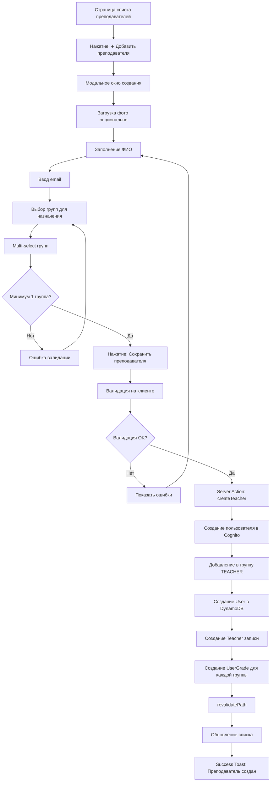
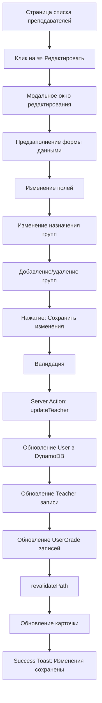
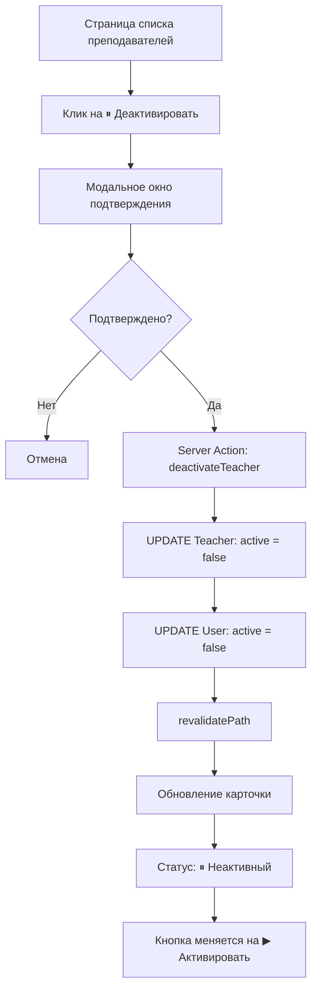
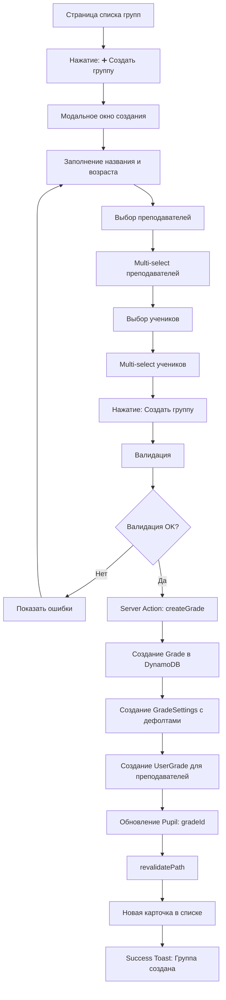
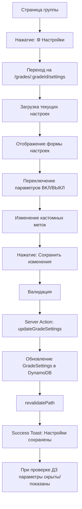
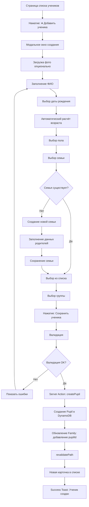
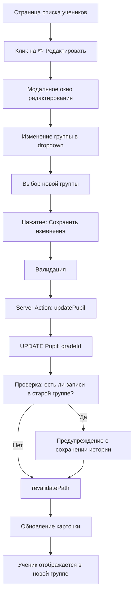
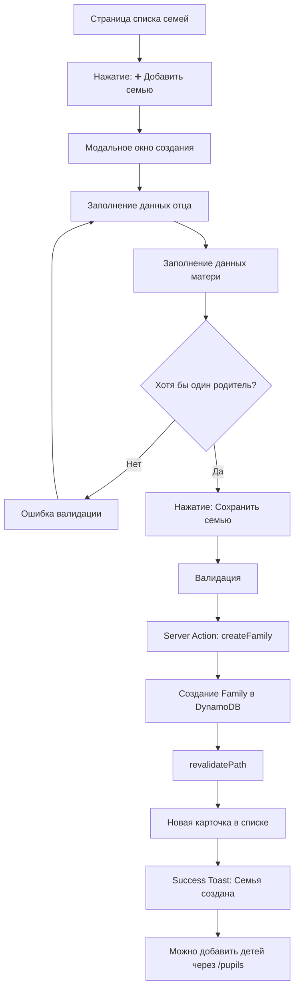
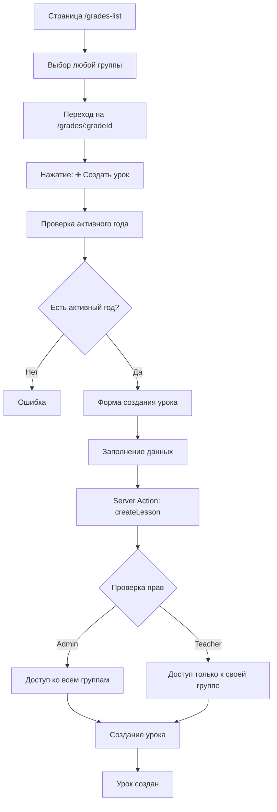

# Admin Flows (Пользовательские сценарии для администраторов) - Sunday School App

## Версия документа: 1.0
**Дата создания:** 23 декабря 2025  
**Последнее обновление:** 23 декабря 2025  
**Проект:** Sunday School App  
**Технологии:** Next.js 15.5.9, React 19, AWS Amplify Gen 1, AWS Cognito, Shadcn UI  
**Целевая аудитория:** Администраторы воскресной школы

> [!NOTE]
> Документация основана на актуальных источниках:
> - Next.js 15 App Router — официальная документация
> - AWS Cognito User Pools — best practices
> - Детальное описание функционала из `app_functionality.md`

---

## 1. Обзор

Данный документ описывает детальные пользовательские сценарии (User Flow) для роли **Admin (Администратор)** в веб-приложении управления воскресной школой. Документ дополняет общий `USER_FLOW.md` более подробными flow-диаграммами и пошаговыми описаниями административных операций.

### 1.1. Роль Admin

**Описание:** Администратор воскресной школы с полным доступом к управлению

**Основные возможности:**
- ✅ Все возможности Teacher для всех групп
- ✅ Управление преподавателями (CRUD)
- ✅ Управление учениками (CRUD)
- ✅ Управление семьями (CRUD)
- ✅ Управление группами и настройками оценивания
- ✅ Завершение учебного года и создание нового
- ✅ Просмотр статистики по всем группам

**Расширенные права:**
- ✅ Доступ ко всем группам и урокам
- ✅ CRUD операции для всех сущностей (учителя, ученики, семьи, группы)
- ✅ Конфигурация параметров оценивания
- ✅ Управление глобальными настройками (учебный год)

**Роль в Cognito Groups:** `ADMIN`

### 1.2. Структура документа

- **Раздел 2:** Управление преподавателями
- **Раздел 3:** Управление группами
- **Раздел 4:** Управление учениками
- **Раздел 5:** Управление семьями
- **Раздел 6:** Управление учебным процессом
- **Раздел 7:** Все возможности Teacher (для всех групп)
- **Раздел 8:** Типичные сценарии месяца
- **Раздел 9:** Edge cases и обработка ошибок

---

## 2. Управление преподавателями

### 2.1. Создание нового преподавателя

**Цель:** Администратор создает нового преподавателя и назначает его на группы

**URL:** `/teachers`

**Диаграмма потока:**



**Детальный сценарий:**

**Шаг 1: Открытие формы**
1. Администратор на странице `/teachers`
2. Видит список всех преподавателей в карточках
3. Нажимает кнопку "➕ Добавить преподавателя"
4. Открывается модальное окно создания

**Шаг 2: Заполнение данных**
5. Загружает фото преподавателя (опционально, drag & drop или выбор файла)
6. Заполняет ФИО:
   - Имя: "Мария" (обязательно)
   - Фамилия: "Иванова" (обязательно)
   - Отчество: "Васильевна" (опционально)
7. Вводит email: "maria.ivanova@church.com" (обязательно, должен быть уникальным)

**Шаг 3: Назначение на группы**
8. В поле "Назначение групп" начинает вводить название группы
9. Видит выпадающий список доступных групп
10. Выбирает "Младшая группа (6-8 лет)"
11. Добавляется чип с группой
12. **Добавляет ещё "Средняя группа (9-11 лет)"** (один преподаватель может преподавать в нескольких группах одновременно)
13. Видит оба чипа в списке выбранных групп

**Шаг 4: Сохранение**
14. Оставляет статус "Активный" (по умолчанию)
15. Нажимает "Сохранить преподавателя"
16. Валидация на клиенте:
    - Email уникален
    - Минимум одна группа назначена
    - ФИО заполнены
17. Если валидация не прошла → показ ошибок
18. Если валидация прошла → Server Action `createTeacher`

**Шаг 5: Server Action обработка**
19. Server Action выполняет:
    - Создание пользователя в AWS Cognito User Pool
    - Генерация временного пароля
    - Добавление пользователя в группу `TEACHER` в Cognito
    - Создание записи User в DynamoDB
    - Создание записи Teacher в DynamoDB
    - Создание записей UserGrade для каждой назначенной группы
20. revalidatePath для обновления UI
21. Модальное окно закрывается
22. Новая карточка преподавателя появляется в списке
23. На карточке указаны обе группы: "Младшая (6-8), Средняя (9-11)"
24. Success Toast: "Преподаватель успешно создан"
25. Система отправляет email с временным паролем (Post-MVP)

**Обработка ошибок:**
- ❌ Email уже существует → "Пользователь с таким email уже зарегистрирован"
- ❌ Не выбрана ни одна группа → "Выберите хотя бы одну группу"
- ❌ Ошибка создания в Cognito → "Ошибка при создании пользователя. Попробуйте еще раз."

**Ссылки:**
- См. также: [`app_functionality.md`](../../app_functionality.md) - раздел 5.1 Управление преподавателями
- См. также: [`USER_FLOW.md`](USER_FLOW.md) - раздел 5.1 Управление преподавателями

---

### 2.2. Редактирование преподавателя

**Цель:** Администратор изменяет данные существующего преподавателя

**URL:** `/teachers` → модальное окно редактирования

**Диаграмма потока:**



**Детальный сценарий:**

1. Администратор на странице `/teachers`
2. Находит нужного преподавателя в списке
3. Нажимает кнопку "✏️ Редактировать" на карточке
4. Открывается модальное окно с предзаполненными данными
5. Может изменить:
   - Фото (загрузить новое)
   - ФИО
   - Email (если уникален)
   - Назначение групп (добавить или удалить группы)
   - Статус (Активный/Неактивный)
6. Нажимает "Сохранить изменения"
7. Server Action обновляет данные в DynamoDB
8. Обновляются связи UserGrade (добавляются новые, удаляются старые)
9. Карточка обновляется в списке
10. Success Toast: "Изменения сохранены"

**Ссылки:**
- См. также: [`app_functionality.md`](../../app_functionality.md) - раздел 5.1 Управление преподавателями

---

### 2.3. Деактивация преподавателя

**Цель:** Администратор деактивирует преподавателя (мягкое удаление)

**URL:** `/teachers`

**Диаграмма потока:**



**Детальный сценарий:**

1. Администратор на странице `/teachers`
2. Находит преподавателя, которого нужно деактивировать
3. Нажимает кнопку "⏸ Деактивировать"
4. Открывается модальное окно подтверждения:
   - "Вы уверены, что хотите деактивировать преподавателя?"
   - "Преподаватель не сможет войти в систему"
   - "Данные сохранятся, но будут скрыты"
5. Подтверждает действие
6. Server Action устанавливает `active = false` для Teacher и User
7. Карточка обновляется: статус меняется на "⏸ Неактивный"
8. Кнопка меняется на "▶ Активировать"
9. Преподаватель не может войти в систему (проверка в middleware)

**Ссылки:**
- См. также: [`app_functionality.md`](../../app_functionality.md) - раздел 5.1 Управление преподавателями

---

## 3. Управление группами

### 3.1. Создание новой группы

**Цель:** Администратор создает новую группу с назначением преподавателей и учеников

**URL:** `/grades-list`

**Диаграмма потока:**



**Детальный сценарий:**

**Шаг 1: Открытие формы**
1. Администратор на странице `/grades-list`
2. Видит список всех групп в карточках
3. Нажимает кнопку "➕ Создать группу"
4. Открывается модальное окно создания

**Шаг 2: Заполнение основных данных**
5. Заполняет название группы: "Младшая группа" (обязательно)
6. Заполняет возрастной диапазон: "6-8 лет" (обязательно)
7. Заполняет описание (опционально): "Группа для детей младшего школьного возраста"

**Шаг 3: Назначение преподавателей**
8. В поле "Назначить преподавателей" начинает вводить имя
9. Видит выпадающий список преподавателей
10. Выбирает "Иванова М.В." и "Козлов А.В."
11. Видит чипы с выбранными преподавателями

**Шаг 4: Добавление учеников**
12. В поле "Добавить учеников" начинает вводить имя или фамилию
13. Видит выпадающий список учеников (без группы или из других групп)
14. Выбирает учеников по одному или несколько сразу
15. Видит список выбранных учеников с возрастом

**Шаг 5: Сохранение**
16. Оставляет статус "Активная" (по умолчанию)
17. Нажимает "Создать группу"
18. Валидация:
    - Название обязательно
    - Возрастной диапазон обязательно
    - Минимум один преподаватель назначен
19. Server Action `createGrade`:
    - Создание записи Grade в DynamoDB
    - Автоматическое создание GradeSettings с дефолтными значениями (все параметры включены)
    - Создание записей UserGrade для каждого преподавателя
    - Обновление поля `gradeId` для каждого выбранного ученика
20. revalidatePath
21. Новая карточка группы появляется в списке
22. На карточке отображается:
    - Количество учеников: 12
    - Преподаватели: Иванова М.В., Козлов А.В.
    - Статус: ✅ Активная
23. Success Toast: "Группа успешно создана"
24. Может сразу открыть группу и начать создавать уроки

**Обработка ошибок:**
- ❌ Название не заполнено → "Название группы обязательно"
- ❌ Не выбран ни один преподаватель → "Выберите хотя бы одного преподавателя"
- ❌ Ошибка создания → "Ошибка при создании группы. Попробуйте еще раз."

**Ссылки:**
- См. также: [`app_functionality.md`](../../app_functionality.md) - раздел 5.2 Управление группами

---

### 3.2. Настройка параметров оценивания группы

**Цель:** Администратор настраивает, какие параметры оценивания будут использоваться в группе

**URL:** `/grades/:gradeId/settings`

**Диаграмма потока:**



**Детальный сценарий:**

1. Администратор на странице группы `/grades/:gradeId`
2. Нажимает кнопку "⚙️ Настройки"
3. Переходит на `/grades/:gradeId/settings`
4. Видит форму настроек оценивания с 4 параметрами:
   - **Золотые стихи** (по умолчанию включено)
   - **Оценка за тест** (по умолчанию включено)
   - **Оценка за тетрадь** (по умолчанию включено)
   - **Посещение спевки** (по умолчанию включено)
5. Для каждого параметра видит:
   - Название параметра
   - Описание параметра
   - Переключатель ВКЛ/ВЫКЛ
   - Поле для кастомной метки (опционально)
6. Решает отключить "Посещение спевки" для младшей группы
7. Переключает toggle в положение ВЫКЛ
8. Изменяет метку "Тест" на "Письменная работа"
9. Нажимает "Сохранить изменения"
10. Server Action обновляет GradeSettings в DynamoDB
11. Success Toast: "Настройки сохранены"
12. При проверке ДЗ для этой группы:
    - Поле "Спевка" не отображается
    - Поле "Тест" отображается с меткой "Письменная работа"

**Ссылки:**
- См. также: [`app_functionality.md`](../../app_functionality.md) - раздел 4.3 Настройки группы

---

## 4. Управление учениками

### 4.1. Создание нового ученика

**Цель:** Администратор создает нового ученика и назначает его в группу

**URL:** `/pupils`

**Диаграмма потока:**



**Детальный сценарий:**

**Шаг 1: Открытие формы**
1. Администратор на странице `/pupils`
2. Видит список всех учеников в карточках
3. Нажимает кнопку "➕ Добавить ученика"
4. Открывается модальное окно создания

**Шаг 2: Заполнение личных данных**
5. Загружает фото ученика (опционально)
6. Заполняет ФИО:
   - Имя: "Виктория" (обязательно)
   - Фамилия: "Попова" (обязательно)
   - Отчество: "Андреевна" (опционально)
7. Выбирает дату рождения: 15.01.2014
8. Система автоматически рассчитывает возраст: 10 лет
9. Выбирает пол: Женский

**Шаг 3: Выбор семьи**
10. В поле "Семья" начинает вводить фамилию
11. Не находит нужную семью в списке
12. Нажимает кнопку "➕ Создать новую семью"
13. Открывается вложенное модальное окно создания семьи
14. Заполняет данные родителей:
    - Отец: Андрей Викторович Попов, телефон
    - Мать: Елена Сергеевна Попова, телефон
15. Нажимает "Сохранить семью"
16. Семья создаётся и автоматически выбирается в форме ученика

**Шаг 4: Выбор группы**
17. В поле "Группа" выбирает "Младшая группа (6-8 лет)"
18. Оставляет статус "Активный" (по умолчанию)

**Шаг 5: Сохранение**
19. Нажимает "Сохранить ученика"
20. Валидация:
    - Дата рождения: возраст 3-18 лет
    - Семья обязательна
    - Группа обязательна
21. Server Action `createPupil`:
    - Создание записи Pupil в DynamoDB
    - Обновление Family: добавление pupilId в список детей
    - Установка gradeId для ученика
22. revalidatePath
23. Новая карточка ученика появляется в списке
24. Success Toast: "Ученик успешно создан"

**Обработка ошибок:**
- ❌ Возраст вне диапазона 3-18 лет → "Возраст ученика должен быть от 3 до 18 лет"
- ❌ Семья не выбрана → "Выберите семью или создайте новую"
- ❌ Группа не выбрана → "Выберите группу для ученика"

**Ссылки:**
- См. также: [`app_functionality.md`](../../app_functionality.md) - раздел 5.3 Управление учениками

---

### 4.2. Перемещение ученика между группами

**Цель:** Администратор перемещает ученика из одной группы в другую

**URL:** `/pupils` → редактирование

**Диаграмма потока:**



**Детальный сценарий:**

1. Администратор на странице `/pupils`
2. Находит ученика, которого нужно переместить
3. Нажимает "✏️ Редактировать"
4. В модальном окне редактирования видит текущую группу
5. Изменяет группу в dropdown (например, с "Младшая группа" на "Средняя группа")
6. Нажимает "Сохранить изменения"
7. Server Action обновляет `gradeId` для ученика
8. Если у ученика есть записи (LessonRecord) в старой группе:
   - История сохраняется (не удаляется)
   - Ученик видит историю из обеих групп в личной карточке
9. Ученик теперь отображается в новой группе
10. При проверке ДЗ новая группа видит этого ученика

**Ссылки:**
- См. также: [`app_functionality.md`](../../app_functionality.md) - раздел 5.3 Управление учениками

---

## 5. Управление семьями

### 5.1. Создание новой семьи

**Цель:** Администратор создает новую семью с данными родителей

**URL:** `/families`

**Диаграмма потока:**



**Детальный сценарий:**

1. Администратор на странице `/families`
2. Нажимает кнопку "➕ Добавить семью"
3. Открывается модальное окно создания
4. Заполняет данные отца:
   - Имя: "Андрей"
   - Фамилия: "Попов"
   - Телефон: "+7 (912) 345-67-89" (с маской ввода)
5. Заполняет данные матери:
   - Имя: "Елена"
   - Фамилия: "Попова"
   - Телефон: "+7 (912) 345-67-90"
6. Нажимает "Сохранить семью"
7. Валидация:
   - Хотя бы один родитель должен быть указан
8. Server Action создаёт запись Family в DynamoDB
9. Новая карточка семьи появляется в списке
10. На карточке отображается:
    - Данные родителей
    - Список детей (пока пустой)
    - Статус: ✅ Активная
11. Success Toast: "Семья успешно создана"
12. Администратор может перейти на `/pupils` и добавить детей, выбрав эту семью

**Ссылки:**
- См. также: [`app_functionality.md`](../../app_functionality.md) - раздел 5.4 Управление семьями

---

## 6. Управление учебным процессом

### 6.1. Завершение учебного года

**Цель:** Администратор завершает текущий учебный год для всей школы и создает новый

**URL:** `/school-process-management`

**Диаграмма потока:**

```mermaid
flowchart TD
    A[Страница управления процессом] --> B[Просмотр текущего года]
    B --> C[Нажатие: Завершить текущий год]
    C --> D[Модальное окно подтверждения]
    D --> E{Подтверждено?}
    E -->|Нет| F[Отмена]
    E -->|Да| G[Server Action: finishCurrentYear]
    G --> H[Получение всех ACTIVE годов]
    H --> I[Цикл по годам]
    I --> J[UPDATE AcademicYear: status = FINISHED]
    J --> K[Создание нового года для каждой группы]
    K --> L[CREATE AcademicYear: status = ACTIVE]
    L --> M[revalidatePath]
    M --> N[Обновление интерфейса]
    N --> O[Кнопка "Завершить" неактивна]
    O --> P[Кнопка "Создать новый год" активна]
    P --> Q[Success Toast: Год завершён]
```

**Детальный сценарий:**

**Шаг 1: Просмотр текущего состояния**
1. Администратор на странице `/school-process-management`
2. Видит информацию:
   - "Текущий активный год: 2024-2025 (01.09.2024 — 31.05.2025)"
   - "Статус: 🟢 ACTIVE"
3. Видит две кнопки:
   - "Завершить текущий год 2024-2025" (активна)
   - "Создать новый год 2025-2026" (неактивна, пока год не завершён)

**Шаг 2: Завершение года**
4. Нажимает "Завершить текущий год 2024-2025"
5. Открывается модальное окно подтверждения:
   - "Вы уверены, что хотите завершить учебный год?"
   - "Все группы перейдут на статус FINISHED"
   - "Уроки станут read-only"
   - "Требуется создать новый год для продолжения работы"
6. Подтверждает действие
7. Server Action `finishCurrentYearAndCreateNew`:
   - Получение всех AcademicYear со статусом ACTIVE
   - Для каждого года: UPDATE status = FINISHED
   - Для каждой группы создание нового AcademicYear:
     - name: "2025-2026" (автоматически)
     - startDate: "2025-09-01" (автоматически)
     - endDate: "2026-05-31" (автоматически)
     - status: ACTIVE
8. revalidatePath
9. Интерфейс обновляется:
   - Статус меняется на "🟡 FINISHED"
   - Кнопка "Завершить" становится неактивной
   - Кнопка "Создать новый год" активируется
10. Success Toast: "Учебный год завершён. Новый год создан для всех групп."

**Шаг 3: Создание нового года (если не создан автоматически)**
11. Если автоматическое создание не настроено, администратор нажимает "Создать новый год 2025-2026"
12. Открывается форма с автозаполнением:
    - Название: "2025-2026"
    - Дата начала: "01.09.2025"
    - Дата окончания: "31.05.2026"
13. Подтверждает создание
14. Создаётся запись AcademicYear для каждой группы со статусом ACTIVE
15. Все учителя могут теперь создавать уроки в новом году

**Правила:**
- Одновременно для всей школы может быть только один год в статусе ACTIVE
- Создавать уроки можно только в рамках года со статусом ACTIVE
- При завершении года все уроки становятся read-only
- История уроков сохраняется и доступна для просмотра

**Ссылки:**
- См. также: [`app_functionality.md`](../../app_functionality.md) - раздел 5.0 Управление учебным процессом
- См. также: [`USER_FLOW.md`](USER_FLOW.md) - раздел 5.2 Завершение учебного года

---

## 7. Все возможности Teacher

### 7.1. Создание уроков для любой группы

**Цель:** Администратор создает уроки для любой группы (не только своей)

**Описание:** Администратор имеет все возможности Teacher, но для всех групп, а не только назначенных. Процесс создания урока идентичен процессу для Teacher, но без ограничения на свою группу.

**Диаграмма потока:**



**Особенности для Admin:**
- Может выбрать любую группу из `/grades-list`
- Не ограничен только назначенными группами
- Может создавать уроки для всех групп одновременно
- Остальной процесс идентичен Teacher flow

**Ссылки:**
- См. также: [`TEACHER_FLOWS.md`](TEACHER_FLOWS.md) - раздел 3.1 Создание нового урока

---

### 7.2. Проверка ДЗ для любой группы

**Цель:** Администратор проверяет домашние задания для любой группы

**Описание:** Администратор может проверять ДЗ для всех групп, процесс идентичен Teacher flow, но без ограничения на свою группу.

**Особенности для Admin:**
- Может открыть любой урок любой группы
- Может проверять ДЗ для всех групп
- Остальной процесс идентичен Teacher flow

**Ссылки:**
- См. также: [`TEACHER_FLOWS.md`](TEACHER_FLOWS.md) - раздел 4.1 Последовательная проверка ДЗ

---

## 8. Типичные сценарии месяца

### 8.1. Полный сценарий месяца

**Цель:** Описание типичного месяца работы администратора

**Источник:** [`app_functionality.md`](../../app_functionality.md) - раздел 6.2 Типичный месяц Admin

**Начало учебного года (сентябрь):**

1. Admin входит в систему
2. Попадает на Dashboard `/grades-list`
3. Проверяет, что все группы активны
4. Переходит в `/teachers`
5. Проверяет список преподавателей
6. Замечает, что Козлов А.В. ушёл → деактивирует его
7. Нужно добавить нового преподавателя → нажимает "➕ Добавить"
8. Заполняет данные нового учителя: Смирнов Д.И.
9. Загружает фото
10. Назначает на Младшую группу
11. Создаёт учителя
12. Система генерирует account с email и временным паролем

13. Переходит в `/pupils`
14. Добавляет новых учеников (3 новых ребёнка)
15. Для одного из них создаёт новую семью прямо в форме
16. Назначает учеников на группы

17. Переходит на `/grades-list`
18. Открывает Младшую группу
19. Попадает на `/grades/:gradeId`
20. Видит, что нет учебного года 2024-2025
21. Создаёт новый учебный год: 01.09.2024 - 31.05.2025

22. Переходит в настройки группы `/grades/:gradeId/settings`
23. Для Младшей группы отключает "Посещение спевки" (они ещё малы)
24. Сохраняет настройки

**В течение года:**

25. Раз в неделю заходит проверить, что учителя вносят данные
26. Смотрит статистику по группам
27. Просматривает личные карточки учеников
28. Помогает родителям, если нужен доступ к данным детей
29. Периодически экспортирует отчёты для руководства церкви

**Середина года (январь):**

30. Один из учеников переезжает → Admin деактивирует его
31. Приходит новая семья с 2 детьми:
    - Создаёт семью Сидоровых
    - Создаёт ученика Сидоров М. (10 лет) → Младшая группа
    - Создаёт ученика Сидорова А. (7 лет) → Младшая группа

**Конец года (май-июнь):**

32. Проверяет, что все уроки за год проведены
33. Экспортирует сводную статистику по всем группам
34. Готовит отчёт для церкви:
    - Количество учеников: 37
    - Средняя посещаемость: 89%
    - Проведено уроков: 108 (по всем группам)
35. Переводит учеников из Младшей в Среднюю группу (если они выросли)
36. Планирует новый учебный год
37. Завершает текущий год через `/school-process-management`
38. Создаёт новый учебный год для всех групп

---

## 9. Edge cases и обработка ошибок

### 9.1. Обработка ошибок при создании пользователей

**Проблема:** Ошибка при создании пользователя в Cognito

**Решение:**
- Проверка уникальности email перед созданием
- Обработка ошибок Cognito (пользователь уже существует, неверные данные)
- Откат изменений в DynamoDB при ошибке в Cognito
- Понятные сообщения об ошибках для пользователя

**Пример обработки:**
```typescript
try {
  // Создание в Cognito
  const cognitoUser = await adminCreateUser({...});
  
  // Создание в DynamoDB
  const user = await amplifyData.create('User', {...});
  
} catch (error) {
  if (error.code === 'UsernameExistsException') {
    return { error: 'Пользователь с таким email уже зарегистрирован' };
  }
  // Откат изменений
  // Логирование ошибки
  return { error: 'Ошибка при создании пользователя. Попробуйте еще раз.' };
}
```

---

### 9.2. Валидация данных

**Проблема:** Пользователь ввел некорректные данные

**Решение:**
- Валидация на клиенте (Zod + React Hook Form)
- Валидация на сервере (Server Action)
- Показ ошибок под полями формы
- Toast уведомления для общих ошибок

---

### 9.3. Обработка конфликтов

**Проблема:** Конфликты при одновременном редактировании

**Примеры:**
- Два администратора одновременно редактируют одного преподавателя
- Попытка удалить группу, в которой есть активные ученики

**Решение:**
- Optimistic locking (проверка updatedAt перед обновлением)
- Предупреждения при попытке удалить сущность с зависимостями
- Мягкое удаление (деактивация) вместо физического удаления

---

## Cross-reference

- См. также: [`USER_FLOW.md`](USER_FLOW.md) — общие пользовательские сценарии
- См. также: [`TEACHER_FLOWS.md`](TEACHER_FLOWS.md) — сценарии для преподавателей
- См. также: [`app_functionality.md`](../../app_functionality.md) — детальное описание функционала
- См. также: [`WIREFRAMES.md`](../ui_ux/WIREFRAMES.md) — wireframes страниц
- См. также: [`DESIGN_SYSTEM.md`](../ui_ux/DESIGN_SYSTEM.md) — дизайн-система
- См. также: [`SERVER_ACTIONS.md`](../api/SERVER_ACTIONS.md) — API контракты
- См. также: [`ARCHITECTURE.md`](../architecture/ARCHITECTURE.md) — общая архитектура

---

**Версия:** 1.0  
**Последнее обновление:** 23 декабря 2025  
**Автор:** AI Documentation Team

