# Teacher Flows (Пользовательские сценарии для преподавателей) - Sunday School App

## Версия документа: 1.0
**Дата создания:** 23 декабря 2025  
**Последнее обновление:** 23 декабря 2025  
**Проект:** Sunday School App  
**Технологии:** Next.js 15.5.9, React 19, AWS Amplify Gen 1, AWS Cognito, Shadcn UI  
**Целевая аудитория:** Преподаватели воскресной школы

> [!NOTE]
> Документация основана на актуальных источниках:
> - Next.js 15 App Router — официальная документация
> - AWS Cognito User Pools — best practices
> - Детальное описание функционала из `app_functionality.md`

---

## 1. Обзор

Данный документ описывает детальные пользовательские сценарии (User Flow) для роли **Teacher (Преподаватель)** в веб-приложении управления воскресной школой. Документ дополняет общий `USER_FLOW.md` более подробными flow-диаграммами и пошаговыми описаниями специфичных для преподавателей операций.

### 1.1. Роль Teacher

**Описание:** Преподаватель воскресной школы, ведущий одну или несколько групп

**Основные возможности:**
- ✅ Создание и редактирование уроков для своей группы
- ✅ Массовая проверка домашних заданий
- ✅ Просмотр личных карточек учеников
- ✅ Управление расписанием группы
- ✅ Просмотр рейтинга группы
- ✅ Просмотр статистики по золотым стихам

**Ограничения:**
- ❌ Доступ только к назначенным группам
- ❌ Не может управлять пользователями
- ❌ Не может настраивать параметры оценивания группы
- ❌ Не имеет доступа к административным страницам

**Роль в Cognito Groups:** `TEACHER`

### 1.2. Структура документа

- **Раздел 2:** Ежедневные сценарии (вход, навигация, подготовка к уроку)
- **Раздел 3:** Создание и управление уроками
- **Раздел 4:** Проверка домашних заданий
- **Раздел 5:** Работа с учениками
- **Раздел 6:** Расписание группы
- **Раздел 7:** Рейтинг и мотивация
- **Раздел 8:** Золотые стихи
- **Раздел 9:** Типичные сценарии недели

---

## 2. Ежедневные сценарии

### 2.1. Вход в систему и навигация

**Цель:** Преподаватель входит в систему и попадает на страницу своей группы

**Диаграмма потока:**

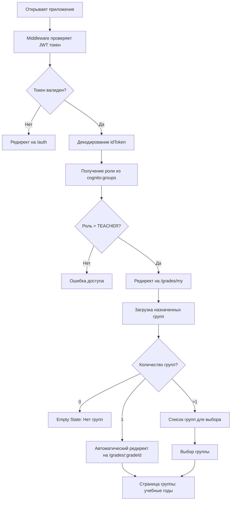

**Детальный сценарий:**

1. Преподаватель открывает приложение в браузере
2. Middleware проверяет наличие JWT токена в cookies
3. Если токена нет → редирект на `/auth`
4. Если токен есть → верификация токена
5. Из токена извлекается роль `TEACHER`
6. Автоматический редирект на `/grades/my`
7. Система загружает группы, назначенные преподавателю
8. Если одна группа → автоматический редирект на `/grades/:gradeId`
9. Если несколько групп → отображение списка для выбора
10. Преподаватель видит страницу группы с учебными годами

**Ссылки:**
- См. также: [`USER_FLOW.md`](USER_FLOW.md) - раздел 3.1 Аутентификация
- См. также: [`app_functionality.md`](../../app_functionality.md) - раздел 2.1 Teacher

---

### 2.2. Просмотр расписания группы

**Цель:** Преподаватель просматривает календарь расписания своей группы

**URL:** `/grades/:gradeId/schedule`

**Диаграмма потока:**

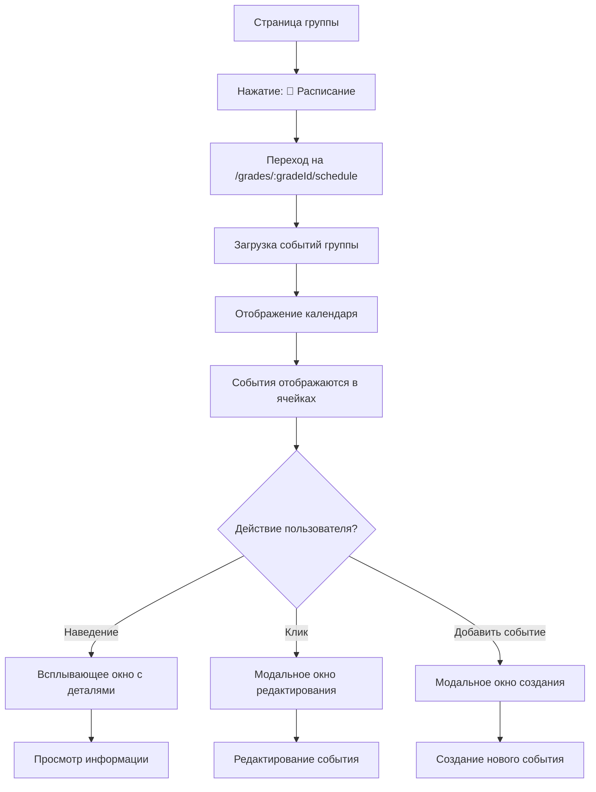

**Детальный сценарий:**

1. Преподаватель на странице группы `/grades/:gradeId`
2. Нажимает кнопку "📅 Расписание"
3. Переходит на `/grades/:gradeId/schedule`
4. Видит календарную сетку текущего месяца
5. События отображаются цветными индикаторами:
   - 🟦 Синий — Урок (LESSON)
   - 🟩 Зелёный — Выездное мероприятие (OUTDOOR_EVENT)
   - 🟥 Красный — Отмена урока (LESSON_SKIPPING)
6. При наведении на событие видит всплывающее окно с деталями
7. При клике на событие открывается модальное окно редактирования
8. Может добавить новое событие через кнопку "➕ Добавить событие"

**Ссылки:**
- См. также: [`app_functionality.md`](../../app_functionality.md) - раздел 4.3.1 Расписание группы

---

### 2.3. Подготовка к уроку

**Цель:** Преподаватель просматривает тему урока и золотые стихи перед проведением урока

**URL:** `/lessons/:lessonId`

**Диаграмма потока:**

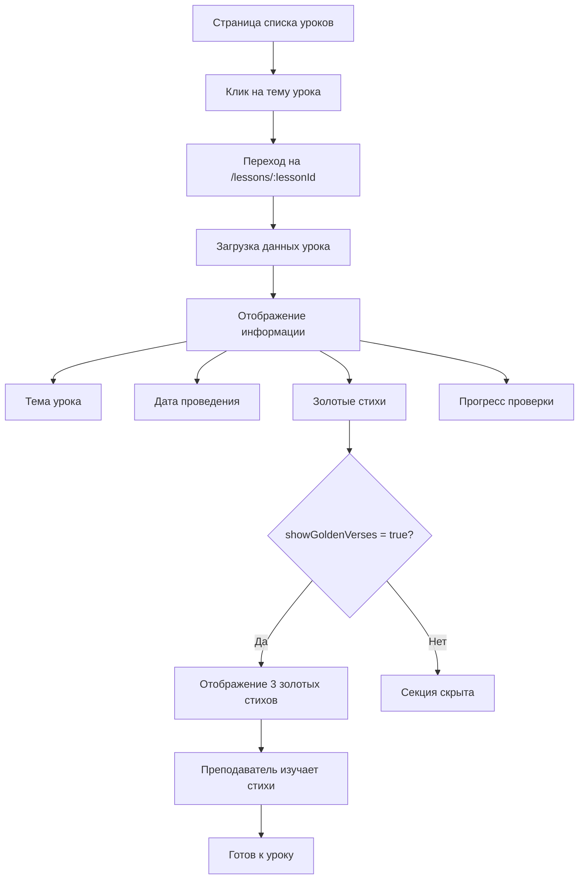

**Детальный сценарий:**

1. Преподаватель на странице списка уроков `/grades/:gradeId/academic-years/:yearId/lessons`
2. Находит сегодняшний урок в списке
3. Кликает на тему урока (например, "Жертвоприношение Авраама")
4. Переходит на `/lessons/:lessonId`
5. Видит полную информацию об уроке:
   - Номер и тема урока
   - Дата проведения
   - Ответственный преподаватель
6. Если `grade.settings.showGoldenVerses = true`:
   - Видит блок "📚 Золотые стихи" с 3 стихами
   - Каждый стих отображается с ссылкой (например, "Быт. 22:14") и полным текстом
7. Видит прогресс проверки (например, "12 из 15 проверено (80%)")
8. Изучает золотые стихи для напоминания перед уроком
9. Готов к проведению урока

**Ссылки:**
- См. также: [`app_functionality.md`](../../app_functionality.md) - раздел 4.6 Обзор урока

---

## 3. Создание и управление уроками

### 3.1. Создание нового урока

**Цель:** Преподаватель создает новый урок с темой, датой и золотыми стихами

**URL:** `/new-lesson`

**Диаграмма потока:**

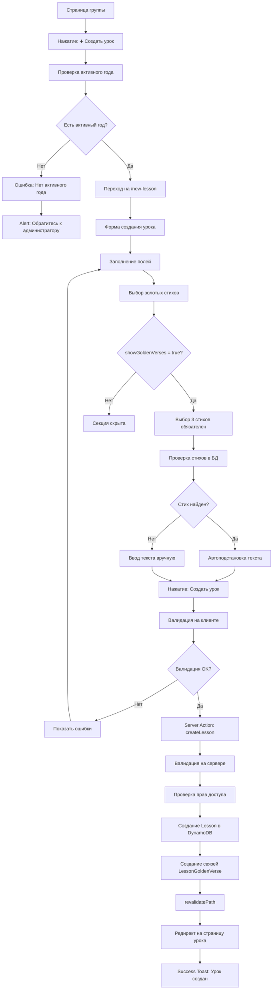

**Детальный сценарий:**

**Шаг 1: Переход к форме создания**
1. Преподаватель на странице группы `/grades/:gradeId`
2. Нажимает кнопку "➕ Создать урок"
3. Система проверяет наличие активного (ACTIVE) учебного года для группы
4. Если активного года нет:
   - Отображается Alert с сообщением: "Для создания урока необходимо наличие активного учебного года. Обратитесь к администратору."
   - Форма не отображается или кнопка "Создать урок" неактивна
5. Если активный год есть → переход на `/new-lesson`

**Шаг 2: Заполнение формы**
6. Система автоматически определяет активный академический год
7. Номер урока автозаполняется (следующий по порядку)
8. Преподаватель выбирает дату урока (date picker)
9. Вводит тему урока (обязательное поле, минимум 3 символа)
10. Выбирает себя как ответственного преподавателя из dropdown

**Шаг 3: Выбор золотых стихов**
11. Если `grade.settings.showGoldenVerses = true`:
    - Отображается секция "📖 Золотые стихи" с 3 блоками
    - Для каждого стиха:
      - Выбирает книгу из dropdown (Быт., Ин., Рим., и т.д.)
      - Вводит номер главы (1-150)
      - Вводит номер стиха (1-176)
      - Система проверяет БД по reference (bookNumber, chapter, verse)
      - Если стих найден: текст автоподставляется, поле заблокировано (можно разблокировать для редактирования)
      - Если стих не найден: поле текста пустое, обязательно для заполнения
12. Если `grade.settings.showGoldenVerses = false`:
    - Секция золотых стихов полностью скрыта

**Шаг 4: Описание урока (опционально)**
13. Преподаватель может заполнить описание урока через BlockNote редактор
14. Контент сохраняется в формате JSON

**Шаг 5: Сохранение**
15. Нажимает кнопку "Создать урок"
16. Валидация на клиенте (Zod):
    - Дата урока в пределах активного учебного года
    - Тема урока: 3-200 символов
    - Если showGoldenVerses = true: ровно 3 стиха выбраны
    - Преподаватель обязателен
17. Если валидация не прошла → показ ошибок под полями
18. Если валидация прошла → Server Action `createLesson`
19. Server Action:
    - Валидация на сервере
    - Проверка прав доступа (Teacher имеет доступ к группе)
    - Проверка активного года
    - Создание Lesson в DynamoDB
    - Создание связей LessonGoldenVerse для каждого стиха
    - revalidatePath для обновления UI
20. Редирект на `/lessons/:lessonId`
21. Success Toast: "Урок успешно создан"

**Обработка ошибок:**
- ❌ Нет активного года → Alert с инструкцией обратиться к администратору
- ❌ Дата вне диапазона учебного года → "Дата урока должна быть в пределах учебного года"
- ❌ Не выбраны 3 стиха (если showGoldenVerses = true) → "Выберите 3 золотых стиха"
- ❌ Недостаточно прав → "Недостаточно прав для создания урока в этой группе"

**Ссылки:**
- См. также: [`app_functionality.md`](../../app_functionality.md) - раздел 4.4 Создание урока
- См. также: [`USER_FLOW.md`](USER_FLOW.md) - раздел 4.2 Создание нового урока

---

### 3.2. Редактирование урока

**Цель:** Преподаватель изменяет данные существующего урока

**URL:** `/lessons/:lessonId/edit`

**Диаграмма потока:**

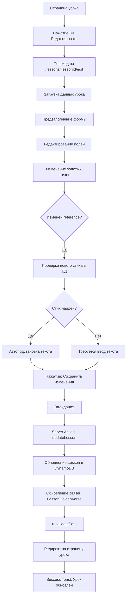

**Детальный сценарий:**

1. Преподаватель на странице урока `/lessons/:lessonId`
2. Нажимает кнопку "✏️ Редактировать"
3. Переходит на `/lessons/:lessonId/edit`
4. Форма предзаполнена текущими данными урока
5. Может изменить любые поля:
   - Тему урока
   - Дату урока
   - Описание урока
   - Золотые стихи
6. При изменении reference золотого стиха:
   - Система проверяет БД на новый стих
   - Если найден → текст автоподставляется
   - Если не найден → требуется ввод текста
7. Может отредактировать текст существующего стиха (обновит стих в БД)
8. Нажимает "Сохранить изменения"
9. Валидация и сохранение через Server Action `updateLesson`
10. Редирект на страницу урока
11. Success Toast: "Урок обновлён"

**Ссылки:**
- См. также: [`app_functionality.md`](../../app_functionality.md) - раздел 4.5 Редактирование урока

---

### 3.3. Просмотр списка уроков

**Цель:** Преподаватель просматривает все уроки учебного года

**URL:** `/grades/:gradeId/academic-years/:yearId/lessons`

**Диаграмма потока:**

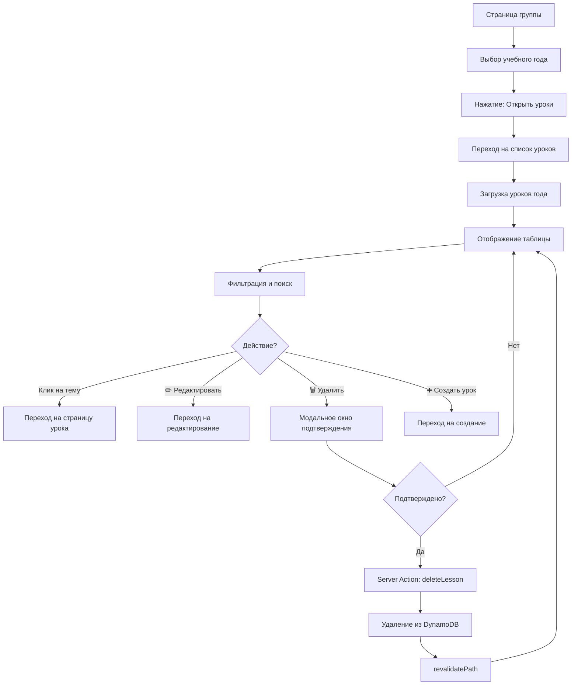

**Детальный сценарий:**

1. Преподаватель на странице группы `/grades/:gradeId`
2. Видит карточки учебных годов
3. Выбирает активный год (например, "2024-2025")
4. Нажимает "Открыть уроки"
5. Переходит на `/grades/:gradeId/academic-years/:yearId/lessons`
6. Видит таблицу со всеми уроками года:
   - № (порядковый номер)
   - Дата урока
   - Тема урока (кликабельна)
   - Преподаватель
   - Действия (✏️ Редактировать, 🗑️ Удалить)
7. Может использовать фильтры:
   - Поиск по теме (live search)
   - Фильтр по преподавателю
   - Сортировка (по дате, по номеру)
8. При клике на тему урока → переход на `/lessons/:lessonId`
9. При клике на ✏️ → переход на `/lessons/:lessonId/edit`
10. При клике на 🗑️ → модальное окно подтверждения удаления
11. После подтверждения → удаление урока через Server Action

**Ссылки:**
- См. также: [`app_functionality.md`](../../app_functionality.md) - раздел 4.2 Список уроков за учебный год

---

## 4. Проверка домашних заданий

### 4.1. Последовательная проверка ДЗ

**Цель:** Преподаватель проверяет домашние задания всех учеников последовательно

**URL:** `/lessons/:lessonId/checking-homework`

**Диаграмма потока:**

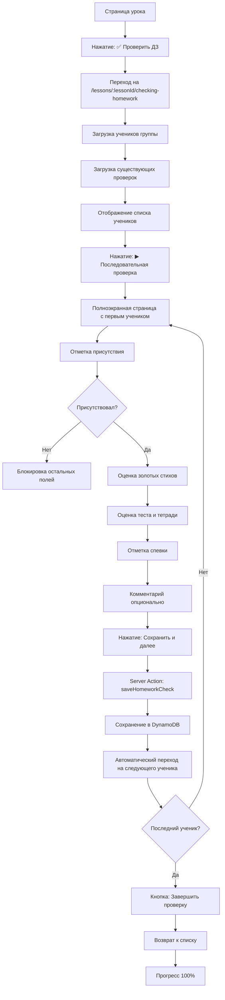

**Детальный сценарий:**

**Шаг 1: Начало проверки**
1. Преподаватель на странице урока `/lessons/:lessonId`
2. Видит прогресс проверки (например, "12 из 15 проверено (80%)")
3. Нажимает кнопку "✅ Проверить домашние задания" или "Начать проверку"
4. Переходит на `/lessons/:lessonId/checking-homework`
5. Видит список всех учеников группы с индикацией статуса:
   - ✅ Проверен
   - ⚠️ Не проверен
   - ❌ Отсутствовал

**Шаг 2: Последовательная проверка**
6. Нажимает кнопку "▶ Последовательная проверка"
7. Открывается полноэкранная страница с первым непроверенным учеником
8. Видит контекст урока вверху страницы
9. Видит индикатор прогресса (например, "12 из 15 (80%)")

**Шаг 3: Заполнение данных для ученика**
10. **Секция "Присутствие":**
    - Выбирает "✓ Присутствовал" или "Отсутствовал"
    - Если "Отсутствовал" → остальные поля блокируются, баллы = 0
11. **Секция "Золотые стихи"** (если `grade.settings.showGoldenVerses = true`):
    - Для каждого из 3 стихов видит текст стиха
    - Нажимает кнопки 0/1/2:
      - 0 — не знает
      - 1 — с подсказкой
      - 2 — наизусть
    - Может использовать клавиатуру (цифры 0, 1, 2)
12. **Секция "Домашнее задание":**
    - Баллы за тест: нажимает кнопку с числом 0-10
    - Баллы за тетрадь: нажимает кнопку с числом 0-10
    - Может использовать клавиатуру (0-9, Shift+0 для 10)
13. **Секция "Спевка"** (если `grade.settings.showSinging = true`):
    - Выбирает "✓ Был(а)" или "Не был(а)"
14. **Комментарий** (опционально):
    - Вводит комментарий преподавателя

**Шаг 4: Сохранение и переход**
15. Нажимает кнопку "Сохранить и далее"
16. Server Action сохраняет данные в DynamoDB
17. Интерфейс автоматически переключается на следующего ученика
18. Фокус автоматически переходит на секцию "Присутствие"
19. Прогресс-индикатор обновляется (13 из 15, 14 из 15...)

**Шаг 5: Завершение проверки**
20. После последнего ученика кнопка "Следующий →" меняется на "Завершить проверку"
21. Нажимает "Завершить проверку"
22. Возвращается к списку учеников
23. Видит прогресс 15/15 (100%)
24. Все ученики помечены как ✅ Проверен

**Особенности:**
- Навигация: кнопки "← Предыдущий" и "Следующий →" вверху и внизу экрана
- При первом ученике кнопка "Предыдущий" отключена
- При попытке выхода с несохранёнными изменениями показывается предупреждение
- Отключённые параметры (например, золотые стихи) скрываются полностью

**Ссылки:**
- См. также: [`app_functionality.md`](../../app_functionality.md) - раздел 4.8 Проверка домашних заданий
- См. также: [`USER_FLOW.md`](USER_FLOW.md) - раздел 4.3 Массовая проверка домашних заданий

---

### 4.2. Просмотр сводной таблицы

**Цель:** Преподаватель просматривает все оценки учеников по уроку в табличном формате

**URL:** `/lessons/:lessonId/complete-table`

**Диаграмма потока:**

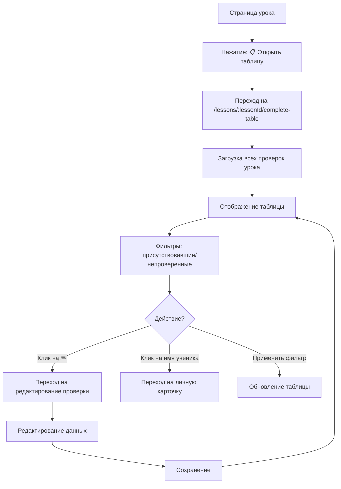

**Детальный сценарий:**

1. Преподаватель на странице урока `/lessons/:lessonId`
2. Нажимает кнопку "📋 Открыть полную сводную таблицу"
3. Переходит на `/lessons/:lessonId/complete-table`
4. Видит таблицу со всеми учениками и их оценками:
   - № (порядковый номер)
   - Ученик (аватар + ФИО, кликабельно)
   - При. (присутствие: ✅/❌/⚠️)
   - ЗС1, ЗС2, ЗС3 (оценки за золотые стихи, если включено)
   - Тест (баллы 0-10)
   - Тетрадь (баллы 0-10)
   - Спевка (✅/❌)
   - Итого (автоматически рассчитанные баллы)
   - Действия (✏️ Редактировать)
5. Может использовать фильтры:
   - "Показать только присутствовавших"
   - "Показать только непроверенных"
6. При клике на имя ученика → переход на `/pupil-personal-data/:id`
7. При клике на ✏️ → переход на страницу редактирования проверки
8. Видит цветовое кодирование:
   - Строка с отсутствующим учеником — серый фон
   - Строка с непроверенным учеником — жёлтый фон
   - Ячейка с низкой оценкой (0-4) — красный оттенок
   - Ячейка с хорошей оценкой (8-10) — зелёный оттенок

**Ссылки:**
- См. также: [`app_functionality.md`](../../app_functionality.md) - раздел 4.7 Полная сводная таблица урока

---

## 5. Работа с учениками

### 5.1. Просмотр личной карточки ученика

**Цель:** Преподаватель просматривает полную информацию об ученике

**URL:** `/pupil-personal-data/:id`

**Диаграмма потока:**

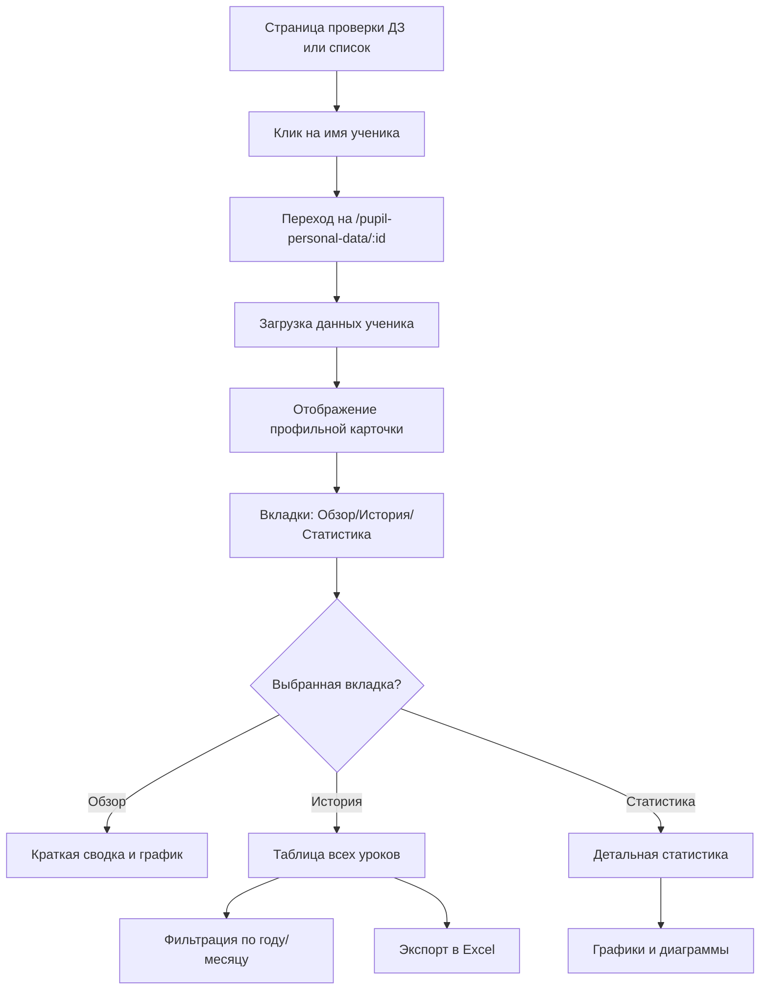

**Детальный сценарий:**

1. Преподаватель на странице проверки ДЗ или сводной таблице
2. Кликает на имя ученика (например, "Попова Виктория")
3. Переходит на `/pupil-personal-data/:id`
4. Видит профильную карточку ученика:
   - Аватар (если загружен)
   - ФИО полностью
   - Дата рождения и возраст
   - Текущая группа
   - Информация о семье (родители, телефоны)
   - Ссылка "📅 Расписание группы"
5. Видит три вкладки:
   - **Обзор** — краткая сводка и график успеваемости
   - **История уроков** — полная таблица всех уроков
   - **Статистика** — детальная статистика по разным параметрам

**Вкладка "Обзор":**
6. Статистика за текущий год:
   - Присутствие: 34 из 36 (94%)
   - Золотые стихи: средний 5.2/6 (87%) — если включено
   - Средний балл: Тест 8.3, Тетрадь 7.8
7. **Блок "Баллы и кирпичики":**
   - Суммарное количество баллов за текущий учебный год (например, 420 баллов)
   - Количество набранных кирпичиков (равно количеству баллов, например, 420 кирпичиков)
   - Количество выданных кирпичиков (например, 380 кирпичиков)
   - Разбивка баллов по категориям:
     - 📖 Золотые стихи: X баллов (X кирпичиков)
     - 📝 Тест: X баллов (X кирпичиков)
     - 📓 Тетрадь: X баллов (X кирпичиков)
     - 🎵 Спевка: X баллов (X кирпичиков)
   - Кнопка "🧱 Выдать кирпичики" для перехода к интерфейсу выдачи кирпичиков
8. График успеваемости (последние 10 уроков)

**Вкладка "История уроков":**
8. Таблица со всеми уроками:
   - №, Дата, Тема урока
   - При. (присутствие)
   - ЗС (золотые стихи, если включено)
   - Тест, Тетрадь, Спевка
9. Фильтры:
   - Учебный год
   - Месяц
   - Поиск по теме
10. Кнопка "📥 Экспорт в Excel"

**Вкладка "Статистика":**
11. Посещаемость по месяцам
12. Распределение оценок за золотые стихи
13. Средние баллы за тест и тетрадь
14. Посещение спевок

**Ссылки:**
- См. также: [`app_functionality.md`](../../app_functionality.md) - раздел 4.9 Личные данные ученика

---

### 5.2. Выдача кирпичиков ученикам

**Цель:** Преподаватель отмечает выдачу кирпичиков ученикам группы за набранные баллы

**URL:** `/grades/:gradeId/issue-bricks`

**Диаграмма потока:**

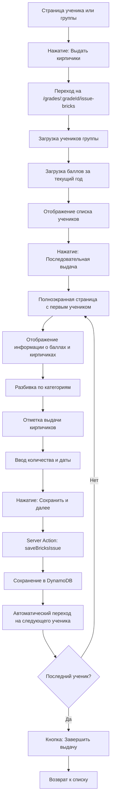

**Детальный сценарий:**

**Шаг 1: Начало выдачи кирпичиков**
1. Преподаватель на странице ученика `/pupil-personal-data/:id` или странице группы `/grades/:gradeId`
2. Видит кнопку "🧱 Выдать кирпичики" в блоке "Баллы и кирпичики" или в меню группы
3. Нажимает кнопку "Выдать кирпичики"
4. Переходит на `/grades/:gradeId/issue-bricks`
5. Видит список всех учеников группы с информацией:
   - Количество набранных баллов (кирпичиков) за текущий учебный год
   - Количество уже выданных кирпичиков
   - Остаток невыданных кирпичиков

**Шаг 2: Последовательная выдача**
6. Нажимает кнопку "▶ Последовательная выдача"
7. Открывается полноэкранная страница с первым учеником
8. Видит контекст группы и текущий учебный год вверху страницы
9. Видит индикатор прогресса (например, "5 из 15 (33%)")

**Шаг 3: Отображение информации для ученика**
10. **Секция "Информация об ученике":**
    - Аватар и ФИО ученика
    - Текущая группа
11. **Секция "Баллы и кирпичики за текущий учебный год":**
    - Суммарное количество баллов (например, 420 баллов)
    - Количество набранных кирпичиков (равно количеству баллов, например, 420 кирпичиков)
    - Количество уже выданных кирпичиков (например, 380 кирпичиков)
    - Остаток невыданных кирпичиков (например, 40 кирпичиков)
12. **Секция "Разбивка по категориям":**
    - 📖 Золотые стихи: 120 баллов (120 кирпичиков) — выдано: 110, остаток: 10
    - 📝 Тест: 150 баллов (150 кирпичиков) — выдано: 150, остаток: 0
    - 📓 Тетрадь: 100 баллов (100 кирпичиков) — выдано: 90, остаток: 10
    - 🎵 Спевка: 50 баллов (50 кирпичиков) — выдано: 30, остаток: 20

**Шаг 4: Отметка выдачи кирпичиков**
13. **Секция "Выдача кирпичиков":**
    - Поле "Количество кирпичиков для выдачи" (числовое поле, максимум = остаток невыданных)
    - Поле "Дата выдачи" (date picker, по умолчанию текущая дата)
    - Кнопка "Сохранить и далее →"
14. Преподаватель вводит количество кирпичиков для выдачи (например, 40)
15. Выбирает дату выдачи (или оставляет текущую дату)
16. Нажимает "Сохранить и далее"

**Шаг 5: Сохранение и переход**
17. Server Action сохраняет информацию о выдаче в DynamoDB:
    - Количество выданных кирпичиков
    - Дата выдачи
    - Связь с учеником и учебным годом
18. Интерфейс автоматически переключается на следующего ученика
19. Фокус автоматически переходит на поле "Количество кирпичиков для выдачи"
20. Прогресс-индикатор обновляется (6 из 15, 7 из 15...)

**Шаг 6: Завершение выдачи**
21. После последнего ученика кнопка "Следующий →" меняется на "Завершить выдачу"
22. Нажимает "Завершить выдачу"
23. Возвращается к списку учеников
24. Видит обновленную информацию о выданных кирпичиках для всех учеников

**Особенности:**
- Навигация: кнопки "← Предыдущий" и "Следующий →" вверху и внизу экрана
- При первом ученике кнопка "Предыдущий" отключена
- При попытке выхода с несохранёнными изменениями показывается предупреждение
- Количество для выдачи не может превышать остаток невыданных кирпичиков
- Дата выдачи не может быть в будущем (валидация)

**Ссылки:**
- См. также: [`app_functionality.md`](../../app_functionality.md) - раздел 4.9 Личные данные ученика
- См. также: Раздел 4.1 Последовательная проверка ДЗ (аналогичный интерфейс)

---

## 6. Расписание группы

### 6.1. Добавление события в расписание

**Цель:** Преподаватель добавляет событие в календарь расписания группы

**URL:** `/grades/:gradeId/schedule`

**Диаграмма потока:**

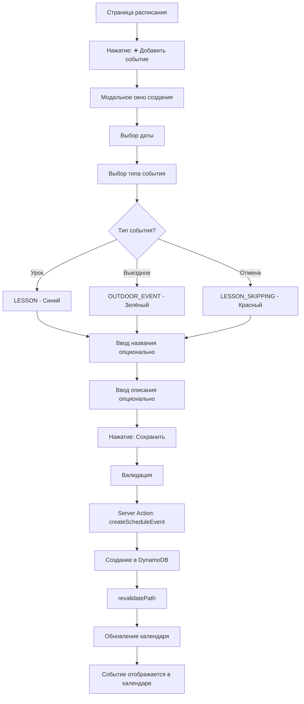

**Детальный сценарий:**

1. Преподаватель на странице расписания `/grades/:gradeId/schedule`
2. Нажимает кнопку "➕ Добавить событие"
3. Открывается модальное окно создания события
4. Выбирает дату (date picker)
5. Выбирает тип события:
   - 🔵 Урок (LESSON) — обычный урок
   - 🟢 Выездное мероприятие (OUTDOOR_EVENT) — экскурсия, поездка
   - 🔴 Отмена урока (LESSON_SKIPPING) — праздник, каникулы
6. Вводит название (опционально, максимум 200 символов)
7. Вводит описание (опционально, максимум 1000 символов)
8. Нажимает "Сохранить"
9. Валидация:
   - Дата обязательна
   - Тип события обязателен
10. Server Action создаёт событие в DynamoDB
11. Календарь обновляется
12. Событие отображается в ячейке календаря с соответствующим цветом

**Ссылки:**
- См. также: [`app_functionality.md`](../../app_functionality.md) - раздел 4.3.1 Расписание группы

---

## 7. Рейтинг и мотивация

### 7.1. Просмотр рейтинга группы

**Цель:** Преподаватель просматривает рейтинг учеников с баллами и достижениями

**URL:** `/grade-leaderboard/:gradeId`

**Диаграмма потока:**

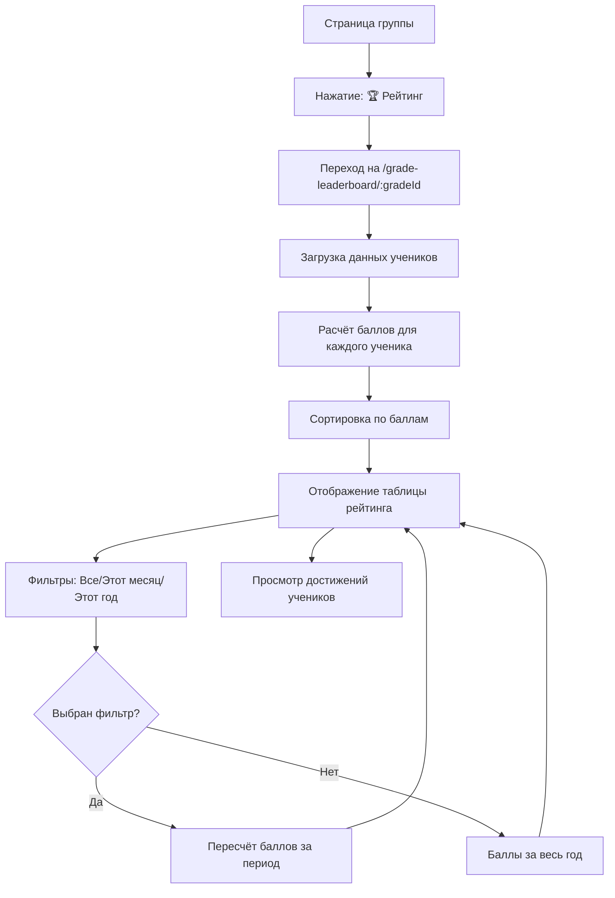

**Детальный сценарий:**

1. Преподаватель на странице группы `/grades/:gradeId`
2. Нажимает кнопку "🏆 Рейтинг" или переходит на `/grade-leaderboard/:gradeId`
3. Видит таблицу рейтинга:
   - # (ранг: 🥇🥈🥉 для топ-3, цифры для остальных)
   - Ученик (аватар + имя)
   - Баллы (текущие суммарные баллы)
   - Достижения (иконки заработанных наград)
4. Может выбрать фильтр периода:
   - Все ученики (с начала года)
   - Этот месяц
   - Этот год
5. При выборе фильтра баллы пересчитываются за выбранный период
6. Видит средний балл по группе
7. Видит ленту последних достижений
8. Может кликнуть на достижение ученика для просмотра деталей

**Формула расчёта баллов:**
- Присутствие: 1 балл
- Золотые стихи: 0/1/2 балла × 3 = 0-6 баллов (если включено)
- Тест: 0-10 баллов
- Тетрадь: 0-10 × 0.5 = 0-5 баллов
- Спевка: 1 балл (если включено)
- **ИТОГО: до 23 баллов за урок**

**Ссылки:**
- См. также: [`app_functionality.md`](../../app_functionality.md) - раздел 4.10 Рейтинг группы

---

## 8. Золотые стихи

### 8.1. Просмотр библиотеки золотых стихов

**Цель:** Преподаватель просматривает библиотеку всех золотых стихов

**URL:** `/golden-verses`

**Диаграмма потока:**

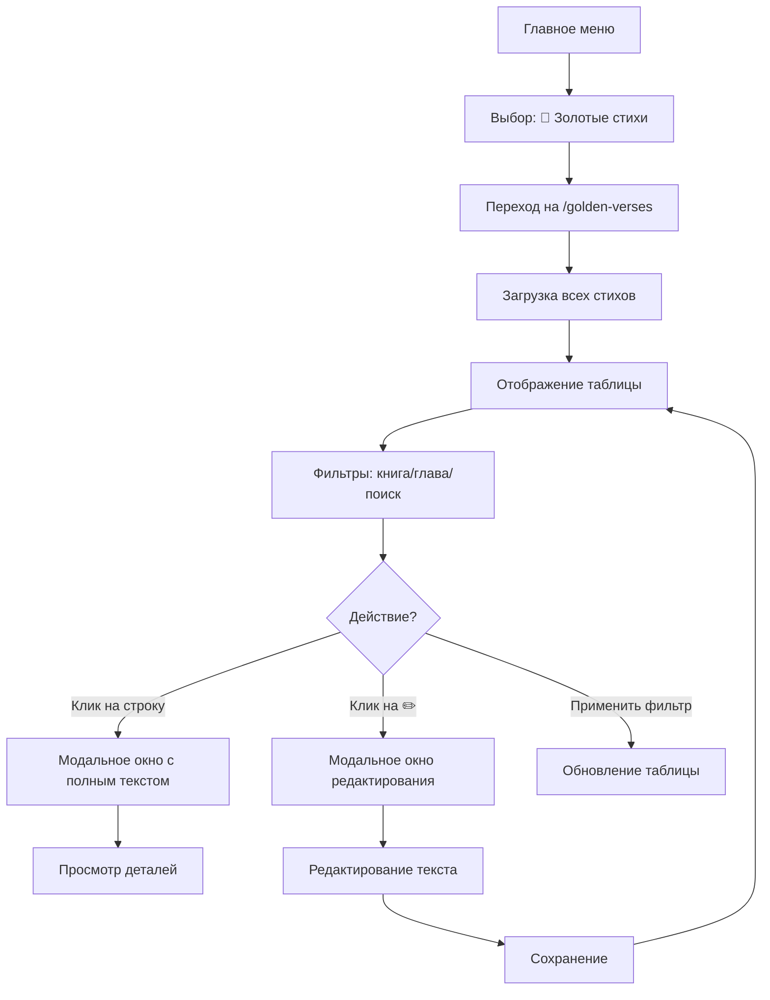

**Детальный сценарий:**

1. Преподаватель в главном меню выбирает "📖 Золотые стихи"
2. Переходит на `/golden-verses`
3. Видит таблицу со всеми золотыми стихами:
   - Ссылка (например, "Быт. 22:14")
   - Текст (превью первых 50 символов)
   - Уроков (количество уроков, где используется)
   - Дата создания
   - Редактировать (✏️)
4. Может использовать фильтры:
   - Книга: dropdown с выбором книги
   - Глава: диапазон "от-до"
   - Поиск по ссылке (автокомплит)
5. При клике на строку → модальное окно с полным текстом стиха
6. При клике на ✏️ → модальное окно редактирования текста
7. Может перейти на статистику через кнопку "📊 Статистика"

**Ссылки:**
- См. также: [`app_functionality.md`](../../app_functionality.md) - раздел 4.12 Список золотых стихов

---

### 8.2. Просмотр статистики по золотым стихам

**Цель:** Преподаватель анализирует, как ученики учат золотые стихи

**URL:** `/golden-verses/statistics`

**Диаграмма потока:**

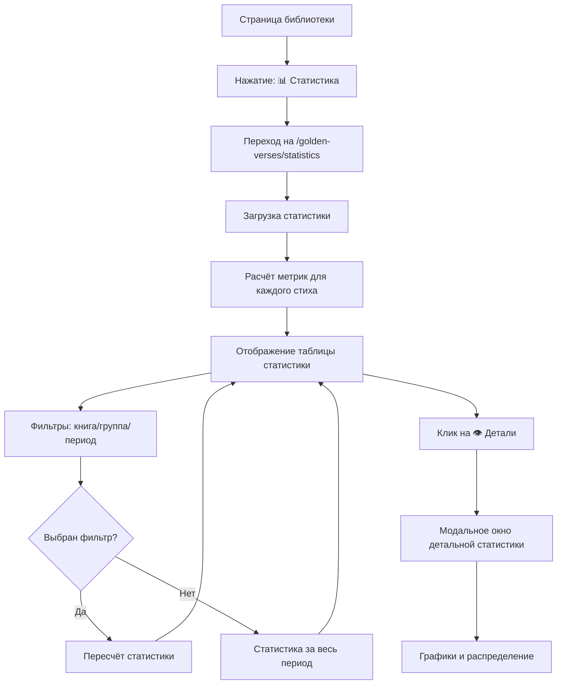

**Детальный сценарий:**

1. Преподаватель на странице библиотеки золотых стихов
2. Нажимает кнопку "📊 Статистика"
3. Переходит на `/golden-verses/statistics`
4. Видит таблицу статистики:
   - Ссылка на стих
   - Попыток (общее количество проверок)
   - На "2" (идеальных ответов)
   - % (процент идеальных ответов)
   - Ср.балл (средний балл 0-2)
   - Группы (где использовался стих)
   - 📊 (кнопка деталей)
5. Может использовать фильтры:
   - Книга
   - Группа (для Teacher — только своя группа)
   - Период (date range)
6. При клике на 👁️ → модальное окно с детальной статистикой:
   - Общая статистика (распределение по оценкам)
   - Статистика по группам
   - График по времени

**Ссылки:**
- См. также: [`app_functionality.md`](../../app_functionality.md) - раздел 4.13 Статистика по золотым стихам

---

## 9. Типичные сценарии недели

### 9.1. Полный сценарий недели

**Цель:** Описание типичной недели работы преподавателя

**Источник:** [`app_functionality.md`](../../app_functionality.md) - раздел 6.1 Типичная неделя Teacher

**Понедельник-суббота (подготовка):**
- Подготовка к уроку: изучение темы, подбор материалов
- Проверка, что урок создан в системе (тема, дата, золотые стихи)

**Воскресенье (до урока):**
1. Teacher приходит в церковь
2. Открывает приложение на планшете/ноутбуке
3. Входит в систему (email + пароль)
4. Автоматически попадает на страницу своей группы
5. Видит список академических годов
6. Открывает текущий год 2024-2025
7. Видит список всех уроков
8. Находит сегодняшний урок #6 "Жертвоприношение Авраама"
9. Кликает на тему урока
10. Попадает на страницу обзора урока
11. Видит золотые стихи для напоминания
12. Видит, что прогресс 0/15 (ещё никто не проверен)
13. Откладывает устройство, идёт вести урок

**Воскресенье (после урока):**
14. Возвращается с планшетом
15. Открывает урок #6
16. Нажимает "Начать проверку"
17. Видит список всех 15 учеников
18. Нажимает "▶ Последовательная проверка"
19. Открывается полноэкранная страница с первым учеником (Иванов Пётр)
20. Отмечает "Присутствовал"
21. Проверяет знание золотых стихов, нажимая кнопки 0/1/2:
    - Стих 1: 2 балла
    - Стих 2: 2 балла
    - Стих 3: 2 балла
22. Выбирает оценку за тест → нажимает кнопку `9`
23. Выбирает оценку за тетрадь → нажимает кнопку `8`
24. Отмечает, что Петя был на спевке
25. Нажимает "Сохранить и далее"
26. Экран автоматически переключается на Петрову Анну, прогресс обновляется
27. Повторяет процесс для всех 15 учеников, при отсутствии ученика сразу ставит "Отсутствовал"
28. После последнего ученика кнопка "Следующий →" меняется на "Завершить проверку"
29. Завершает проверку и видит прогресс 15/15 (100%)
30. Закрывает приложение, уходит домой

**В течение недели (если нужно):**
31. Может зайти и посмотреть сводную таблицу урока
32. При необходимости делится данными через скриншот/таблицу
33. Может посмотреть личную карточку любого ученика
34. Может увидеть статистику и тренды

---

## Cross-reference

- См. также: [`USER_FLOW.md`](USER_FLOW.md) — общие пользовательские сценарии
- См. также: [`app_functionality.md`](../../app_functionality.md) — детальное описание функционала
- См. также: [`WIREFRAMES.md`](../ui_ux/WIREFRAMES.md) — wireframes страниц
- См. также: [`DESIGN_SYSTEM.md`](../ui_ux/DESIGN_SYSTEM.md) — дизайн-система
- См. также: [`SERVER_ACTIONS.md`](../api/SERVER_ACTIONS.md) — API контракты
- См. также: [`ARCHITECTURE.md`](../architecture/ARCHITECTURE.md) — общая архитектура

---

**Версия:** 1.0  
**Последнее обновление:** 23 декабря 2025  
**Автор:** AI Documentation Team

