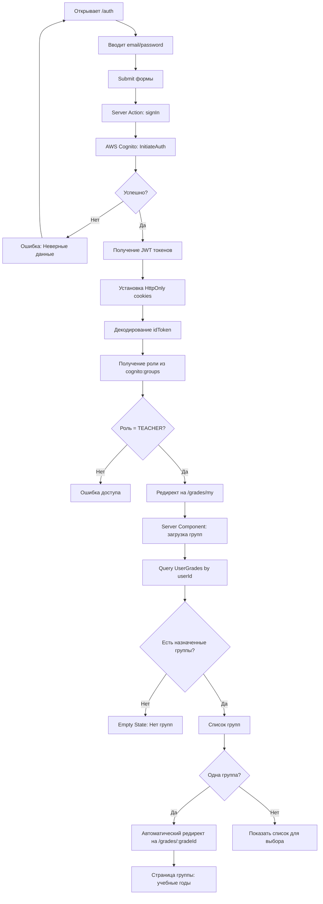
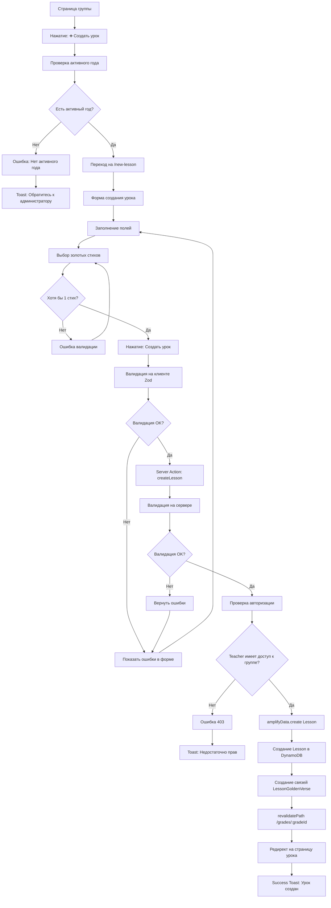
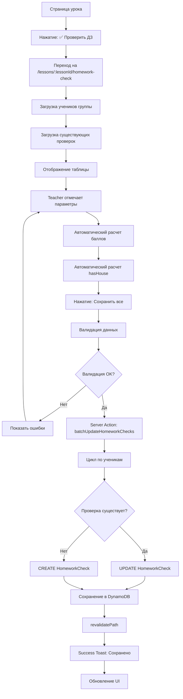
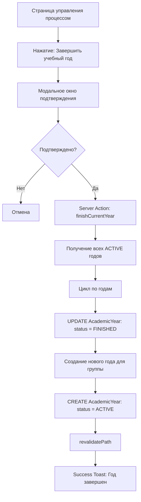

# User Flow (Пользовательские сценарии) - Sunday School App

## Версия документа: 1.0
**Дата создания:** 23 декабря 2025  
**Последнее обновление:** 23 декабря 2025  
**Проект:** Sunday School App  
**Технологии:** Next.js 15.5.9, React 19, AWS Amplify Gen 1, AWS Cognito, Shadcn UI  
**Целевая аудитория:** Преподаватели, Администраторы

> [!NOTE]
> Документация основана на актуальных источниках:
> - Next.js 15 App Router — официальная документация
> - AWS Cognito User Pools — best practices

---

## 1. Обзор

Данный документ описывает детальные пользовательские сценарии (User Flow) для веб-приложения управления воскресной школой баптистской церкви. Документ охватывает все основные потоки взаимодействия пользователей с системой, включая аутентификацию, создание уроков, проверку домашних заданий, управление пользователями и административные функции.

### 1.1. Структура документа

- **Раздел 2:** Типы пользователей и их роли
- **Раздел 3:** Общие flow (Аутентификация, Навигация)
- **Раздел 4:** User Flow для роли Teacher (Преподаватель)
- **Раздел 5:** User Flow для роли Admin (Администратор)
- **Раздел 6:** Edge Cases и обработка ошибок
- **Раздел 7:** Особенности мобильной версии

---

## 2. Типы пользователей и их роли

### 2.1. Teacher (Преподаватель)

**Описание:** Преподаватель воскресной школы, ведущий одну или несколько групп

**Основные возможности:**
- ✅ Создание и редактирование уроков для своей группы
- ✅ Массовая проверка домашних заданий
- ✅ Просмотр личных карточек учеников
- ✅ Управление расписанием группы
- ✅ Просмотр рейтинга группы
- ✅ Просмотр статистики по золотым стихам

**Ограничения:**
- ❌ Доступ только к назначенным группам
- ❌ Не может управлять пользователями
- ❌ Не может настраивать параметры оценивания группы
- ❌ Не имеет доступа к административным страницам

**Роль в Cognito Groups:** `TEACHER`

---

### 2.2. Admin (Администратор)

**Описание:** Администратор воскресной школы с полным доступом к управлению

**Основные возможности:**
- ✅ Все возможности Teacher для всех групп
- ✅ Управление преподавателями (CRUD)
- ✅ Управление учениками (CRUD)
- ✅ Управление семьями (CRUD)
- ✅ Управление группами и настройками оценивания
- ✅ Завершение учебного года и создание нового
- ✅ Просмотр статистики по всем группам

**Роль в Cognito Groups:** `ADMIN`

---

### 2.3. Superadmin (Главный администратор)

**Описание:** Главный администратор с максимальными правами

**Основные возможности:**
- ✅ Все возможности Admin
- ⏳ Управление ролями пользователей (Post-MVP)
- ⏳ Системные настройки (Post-MVP)

**Роль в Cognito Groups:** `SUPERADMIN`

**В MVP:** функционал идентичен Admin

---

## 3. Общие flow

### 3.1. Аутентификация через AWS Cognito

**Цель:** Безопасный вход пользователя в систему с проверкой JWT токена

**Диаграмма потока:**

```mermaid
flowchart TD
    A[Пользователь открывает приложение] --> B[Next.js Middleware proxy.ts]
    B --> C{JWT токен в cookies?}
    C -->|Нет| D[Редирект на /auth]
    C -->|Да| E[Верификация JWT токена]
    E --> F{Токен валиден?}
    F -->|Нет| D
    F -->|Да| G[Получение роли из токена]
    G --> H{Роль проверена?}
    H -->|Да| I[Доступ к защищенной странице]
    H -->|Нет| D
    
    D --> J[Страница входа /auth]
    J --> K[Ввод email и пароля]
    K --> L[Submit формы]
    L --> M[Server Action: signIn]
    M --> N[AWS Cognito: InitiateAuth]
    N --> O{Успешно?}
    O -->|Нет| P[Ошибка аутентификации]
    P --> J
    O -->|Да| Q[Получение JWT токенов]
    Q --> R[Установка HttpOnly cookies]
    R --> S[Редирект по роли]
    S --> T{Роль?}
    T -->|TEACHER| U[/grades/my]
    T -->|ADMIN| V[/grades-list]
    T -->|SUPERADMIN| V
```

**Детальный сценарий:**

**1. Открытие приложения (незалогиненный пользователь)**

```
User → Browser → https://app.com
→ Next.js Middleware (proxy.ts)
→ Проверка cookies['cognito-id-token']
→ Нет токена → redirect('/auth')
```

**2. Страница входа `/auth`**

```tsx
// Server Component (default)
export default async function AuthPage() {
  // Проверка: если уже залогинен → redirect
  const session = await getSession();
  if (session) redirect('/grades/my');
  
  return <SignInForm />;
}

// Client Component (форма)
'use client';
function SignInForm() {
  const [isPending, startTransition] = useTransition();
  
  async function handleSubmit(formData: FormData) {
    startTransition(async () => {
      const result = await signIn(formData);
      if (result.error) {
        toast.error(result.error);
      }
      // Redirect happens in Server Action
    });
  }
  
  return (
    <form action={handleSubmit}>
      <Input name="email" type="email" required />
      <Input name="password" type="password" required />
      <Button type="submit" disabled={isPending}>
        {isPending ? 'Вход...' : 'Войти'}
      </Button>
    </form>
  );
}
```

**3. Server Action: signIn**

```typescript
// app/actions/auth.ts
'use server';

import { signIn as cognitoSignIn } from 'aws-amplify/auth';
import { cookies } from 'next/headers';
import { redirect } from 'next/navigation';

export async function signIn(formData: FormData) {
  const email = formData.get('email') as string;
  const password = formData.get('password') as string;
  
  // Валидация
  const validated = SignInSchema.safeParse({ email, password });
  if (!validated.success) {
    return { error: 'Некорректные данные' };
  }
  
  try {
    // AWS Cognito: InitiateAuth
    const { isSignedIn, nextStep } = await cognitoSignIn({
      username: email,
      password,
    });
    
    if (!isSignedIn) {
      return { error: 'Неверный email или пароль' };
    }
    
    // Получение токенов из Cognito
    const session = await fetchAuthSession();
    const idToken = session.tokens?.idToken?.toString();
    const accessToken = session.tokens?.accessToken?.toString();
    const refreshToken = session.tokens?.refreshToken?.toString();
    
    // Установка HttpOnly cookies (защита от XSS)
    cookies().set('cognito-id-token', idToken, {
      httpOnly: true,
      secure: true,
      sameSite: 'strict',
      maxAge: 60 * 60 * 24 * 30, // 30 дней
    });
    
    cookies().set('cognito-refresh-token', refreshToken, {
      httpOnly: true,
      secure: true,
      sameSite: 'strict',
      maxAge: 60 * 60 * 24 * 30,
    });
    
    // Получение роли из JWT токена
    const decoded = jwt.verify(idToken, process.env.COGNITO_PUBLIC_KEY);
    const groups = decoded['cognito:groups'] || [];
    const role = groups[0]; // TEACHER | ADMIN | SUPERADMIN
    
    // Редирект по роли
    if (role === 'TEACHER') {
      redirect('/grades/my');
    } else if (role === 'ADMIN' || role === 'SUPERADMIN') {
      redirect('/grades-list');
    }
    
  } catch (error) {
    console.error('Sign in error:', error);
    return { error: 'Ошибка входа. Попробуйте еще раз.' };
  }
}
```

**4. Middleware защита маршрутов**

```typescript
// app/middleware.ts (или proxy.ts)
import { NextResponse } from 'next/server';
import type { NextRequest } from 'next/server';

export async function middleware(request: NextRequest) {
  const idToken = request.cookies.get('cognito-id-token')?.value;
  
  // Защита приватных маршрутов
  if (request.nextUrl.pathname.startsWith('/grades')) {
    if (!idToken) {
      return NextResponse.redirect(new URL('/auth', request.url));
    }
    
    // Верификация JWT токена
    try {
      const decoded = await verifyJWT(idToken);
      const groups = decoded['cognito:groups'] || [];
      
      // Проверка роли для админских страниц
      if (
        request.nextUrl.pathname.startsWith('/teachers') ||
        request.nextUrl.pathname.startsWith('/pupils') ||
        request.nextUrl.pathname.startsWith('/families')
      ) {
        if (!groups.includes('ADMIN') && !groups.includes('SUPERADMIN')) {
          return NextResponse.redirect(new URL('/grades/my', request.url));
        }
      }
      
    } catch (error) {
      // Токен невалиден → logout
      return NextResponse.redirect(new URL('/auth', request.url));
    }
  }
  
  return NextResponse.next();
}

export const config = {
  matcher: ['/grades/:path*', '/teachers/:path*', '/pupils/:path*', '/families/:path*'],
};
```

**Обработка ошибок:**
- ❌ Неверный email или пароль → `toast.error("Неверный email или пароль")`
- ❌ Пользователь не найден в Cognito → `"Пользователь с таким email не зарегистрирован"`
- ❌ Пользователь деактивирован в DynamoDB → После входа проверка `user.active` → logout
- ❌ Нет интернета → `"Ошибка подключения. Проверьте интернет"`

**Мобильная версия:**
- Форма адаптирована для touch
- Автозаполнение email/пароля через браузер
- Кнопка "Войти" увеличена (min-height: 48px)

---

### 3.2. Навигация в приложении

**Главное меню (Desktop):**

```
┌─────────────────────────────────────┐
│ Sunday School App      👤 Мария     │
├─────────────────────────────────────┤
│                                     │
│ 📚 Мои группы                       │
│ 📅 Расписание                       │
│ 📖 Золотые стихи                    │
│ 👥 Преподаватели (Admin only)      │
│ 👨‍👩‍👧‍👦 Ученики (Admin only)           │
│ 🏠 Семьи (Admin only)               │
│ ⚙️ Настройки                        │
│ 🚪 Выход                            │
└─────────────────────────────────────┘
```

**Главное меню (Mobile):**
- Бургер-меню (☰)
- Slide-out navigation
- Overlay при открытии

**Breadcrumbs:**
```
Главная › Младшая группа › 2024-2025 › Уроки
```

---

## 4. User Flow для роли Teacher

### 4.1. Первый вход в систему

**Цель:** Преподаватель впервые входит в систему после создания учетной записи администратором

**Диаграмма потока:**



**Детальный сценарий:**

**Шаг 1: Вход в систему**
- Администратор создал учетную запись с email `maria.ivanova@church.com` и временным паролем
- Преподаватель получил email с учетными данными
- Открывает приложение → автоматически /auth
- Вводит email и пароль
- Нажимает "Войти"

**Шаг 2: Аутентификация через Cognito**
```
POST /auth/signin (Server Action)
↓
AWS Cognito: InitiateAuth
↓
Response: {
  idToken: "eyJhbGciOiJSUzI1...",
  accessToken: "eyJhbGciOiJSUzI1...",
  refreshToken: "eyJhbGciOiJSUzI1..."
}
↓
Decode idToken:
{
  "sub": "a1b2c3d4-e5f6-7890-abcd-ef1234567890",
  "cognito:groups": ["TEACHER"],
  "email": "maria.ivanova@church.com",
  "name": "Иванова Мария Владимировна"
}
```

**Шаг 3: Установка cookies и редирект**
```typescript
cookies().set('cognito-id-token', idToken, { httpOnly: true, ... });
redirect('/grades/my'); // для TEACHER
```

**Шаг 4: Страница /grades/my**

```tsx
// Server Component
async function MyGradesPage() {
  const userId = await getCurrentUserId(); // из JWT токена
  
  // Query: UserGrades by userId
  const userGrades = await amplifyData.list('UserGrade', {
    filter: { userId: { eq: userId } }
  });
  
  if (userGrades.length === 0) {
    return (
      <EmptyState 
        title="Нет назначенных групп"
        description="Вы не назначены ни на одну группу. Обратитесь к администратору."
      />
    );
  }
  
  // Если одна группа → автоматический редирект
  if (userGrades.length === 1) {
    redirect(`/grades/${userGrades[0].gradeId}`);
  }
  
  // Несколько групп → список
  return <GradesList grades={userGrades.map(ug => ug.grade)} />;
}
```

**Шаг 5: Страница группы /grades/:gradeId**
- Загружаются учебные годы группы
- Показывается активный (ACTIVE) год
- Список уроков года
- Кнопки: "➕ Новый урок", "📅 Расписание", "📊 Рейтинг"

---

### 4.2. Создание нового урока

**Цель:** Преподаватель создает новый урок с темой, датой и золотыми стихами

**Диаграмма потока:**



**Детальный сценарий:**

**Шаг 1: Проверка активного года**

```tsx
// Server Component
async function NewLessonPage({ params }: { params: { gradeId: string } }) {
  const { gradeId } = params;
  
  // Проверка активного года
  const activeYear = await amplifyData.list('AcademicYear', {
    filter: {
      and: [
        { gradeId: { eq: gradeId } },
        { status: { eq: 'ACTIVE' } }
      ]
    }
  });
  
  if (activeYear.length === 0) {
    return (
      <Alert variant="destructive">
        <AlertTitle>Нет активного учебного года</AlertTitle>
        <AlertDescription>
          Для создания урока необходим активный учебный год. 
          Обратитесь к администратору для создания нового года.
        </AlertDescription>
      </Alert>
    );
  }
  
  const goldenVerses = await amplifyData.list('GoldenVerse');
  
  return <LessonForm academicYearId={activeYear[0].id} goldenVerses={goldenVerses} />;
}
```

**Шаг 2: Форма создания урока**

```tsx
'use client';

function LessonForm({ academicYearId, goldenVerses }: Props) {
  const form = useForm({
    resolver: zodResolver(CreateLessonSchema),
    defaultValues: {
      title: '',
      lessonDate: new Date().toISOString().split('T')[0],
      content: '',
      goldenVerseIds: [],
    }
  });
  
  async function onSubmit(data: z.infer<typeof CreateLessonSchema>) {
    const result = await createLesson({
      ...data,
      academicYearId,
      gradeId,
      teacherId: userId, // из контекста
    });
    
    if (result.error) {
      toast.error(result.error);
    } else {
      toast.success('Урок успешно создан!');
      router.push(`/lessons/${result.data.id}`);
    }
  }
  
  return (
    <Form {...form}>
      <form onSubmit={form.handleSubmit(onSubmit)}>
        <FormField
          control={form.control}
          name="title"
          render={({ field }) => (
            <FormItem>
              <FormLabel>Тема урока *</FormLabel>
              <FormControl>
                <Input placeholder="Введите тему урока" {...field} />
              </FormControl>
              <FormMessage />
            </FormItem>
          )}
        />
        
        <FormField
          control={form.control}
          name="lessonDate"
          render={({ field }) => (
            <FormItem>
              <FormLabel>Дата урока *</FormLabel>
              <FormControl>
                <Input type="date" {...field} />
              </FormControl>
              <FormMessage />
            </FormItem>
          )}
        />
        
        <FormField
          control={form.control}
          name="content"
          render={({ field }) => (
            <FormItem>
              <FormLabel>Описание урока</FormLabel>
              <FormControl>
                <BlockNoteEditor value={field.value} onChange={field.onChange} />
              </FormControl>
              <FormMessage />
            </FormItem>
          )}
        />
        
        <FormField
          control={form.control}
          name="goldenVerseIds"
          render={({ field }) => (
            <FormItem>
              <FormLabel>Золотые стихи * (минимум 1)</FormLabel>
              <FormControl>
                <MultiSelect
                  options={goldenVerses.map(v => ({
                    value: v.id,
                    label: `${v.reference} — ${v.text.substring(0, 50)}...`
                  }))}
                  value={field.value}
                  onChange={field.onChange}
                />
              </FormControl>
              <FormMessage />
            </FormItem>
          )}
        />
        
        <Button type="submit" disabled={form.formState.isSubmitting}>
          {form.formState.isSubmitting ? 'Создание...' : 'Создать урок'}
        </Button>
      </form>
    </Form>
  );
}
```

**Шаг 3: Server Action: createLesson**

```typescript
'use server';

export async function createLesson(input: CreateLessonInput) {
  // 1. Валидация
  const validated = CreateLessonSchema.safeParse(input);
  if (!validated.success) {
    return { error: formatZodErrors(validated.error) };
  }
  
  // 2. Проверка авторизации
  const userId = await getCurrentUserId();
  const hasAccess = await checkTeacherAccess(userId, input.gradeId);
  if (!hasAccess) {
    return { error: 'Недостаточно прав для создания урока в этой группе' };
  }
  
  // 3. Проверка активного года
  const academicYear = await amplifyData.get('AcademicYear', { id: input.academicYearId });
  if (academicYear.status !== 'ACTIVE') {
    return { error: 'Урок можно создать только для активного учебного года' };
  }
  
  // 4. Получение порядкового номера
  const lessons = await amplifyData.list('Lesson', {
    filter: { academicYearId: { eq: input.academicYearId } }
  });
  const order = lessons.length + 1;
  
  try {
    // 5. Создание урока
    const lesson = await amplifyData.create('Lesson', {
      ...validated.data,
      order,
      createdAt: new Date().toISOString(),
      updatedAt: new Date().toISOString(),
    });
    
    // 6. Создание связей с золотыми стихами
    await Promise.all(
      validated.data.goldenVerseIds.map((goldenVerseId, index) =>
        amplifyData.create('LessonGoldenVerse', {
          lessonId: lesson.id,
          goldenVerseId,
          order: index + 1,
          createdAt: new Date().toISOString(),
        })
      )
    );
    
    // 7. Revalidate для обновления UI
    revalidatePath(`/grades/${input.gradeId}`);
    
    return { data: lesson };
  } catch (error) {
    console.error('Error creating lesson:', error);
    return { error: 'Ошибка при создании урока. Попробуйте еще раз.' };
  }
}
```

**Обработка ошибок:**
- ❌ Пустое название → "Название урока обязательно"
- ❌ Нет золотых стихов → "Выберите хотя бы один золотой стих"
- ❌ Нет активного года → Alert с инструкцией
- ❌ Недостаточно прав → "Недостаточно прав для создания урока"

---

### 4.3. Массовая проверка домашних заданий

**Цель:** Преподаватель проверяет ДЗ всех учеников группы за урок

**Диаграмма потока:**



**Детальный сценарий:**

**Шаг 1: Загрузка данных**

```tsx
// Server Component
async function HomeworkCheckPage({ params }: { params: { lessonId: string } }) {
  const { lessonId } = params;
  
  // Получение урока
  const lesson = await amplifyData.get('Lesson', { id: lessonId });
  
  // Получение группы и настроек
  const grade = await amplifyData.get('Grade', { id: lesson.gradeId });
  const settings = await amplifyData.list('GradeSettings', {
    filter: { gradeId: { eq: lesson.gradeId } }
  });
  const gradeSettings = settings[0];
  
  // Получение учеников группы
  const pupils = await amplifyData.list('Pupil', {
    filter: {
      and: [
        { gradeId: { eq: lesson.gradeId } },
        { active: { eq: true } }
      ]
    }
  });
  
  // Получение существующих проверок
  const existingChecks = await amplifyData.list('HomeworkCheck', {
    filter: { lessonId: { eq: lessonId } }
  });
  
  return (
    <HomeworkCheckTable 
      lesson={lesson}
      pupils={pupils}
      existingChecks={existingChecks}
      settings={gradeSettings}
    />
  );
}
```

**Шаг 2: Таблица проверки ДЗ**

```tsx
'use client';

function HomeworkCheckTable({ lesson, pupils, existingChecks, settings }: Props) {
  const [checks, setChecks] = useState<HomeworkCheckState[]>(
    pupils.map(pupil => {
      const existingCheck = existingChecks.find(c => c.pupilId === pupil.id);
      return existingCheck || {
        pupilId: pupil.id,
        lessonId: lesson.id,
        goldenVerse: false,
        test: false,
        notebook: false,
        singing: false,
        points: 0,
        hasHouse: false,
      };
    })
  );
  
  function updateCheck(pupilId: string, field: string, value: boolean) {
    setChecks(prev => prev.map(check => {
      if (check.pupilId !== pupilId) return check;
      
      const updated = { ...check, [field]: value };
      
      // Автоматический расчет баллов
      updated.points = 
        (updated.goldenVerse && settings.enableGoldenVerse ? settings.pointsGoldenVerse : 0) +
        (updated.test && settings.enableTest ? settings.pointsTest : 0) +
        (updated.notebook && settings.enableNotebook ? settings.pointsNotebook : 0) +
        (updated.singing && settings.enableSinging ? settings.pointsSinging : 0);
      
      // Автоматический расчет hasHouse
      updated.hasHouse = 
        (settings.enableGoldenVerse ? updated.goldenVerse : true) &&
        (settings.enableTest ? updated.test : true) &&
        (settings.enableNotebook ? updated.notebook : true) &&
        (settings.enableSinging ? updated.singing : true);
      
      return updated;
    }));
  }
  
  async function handleSave() {
    const result = await batchUpdateHomeworkChecks(checks);
    if (result.error) {
      toast.error(result.error);
    } else {
      toast.success('Проверки сохранены!');
    }
  }
  
  return (
    <div>
      <Table>
        <TableHeader>
          <TableRow>
            <TableHead>Ученик</TableHead>
            {settings.enableGoldenVerse && <TableHead>{settings.labelGoldenVerse}</TableHead>}
            {settings.enableTest && <TableHead>{settings.labelTest}</TableHead>}
            {settings.enableNotebook && <TableHead>{settings.labelNotebook}</TableHead>}
            {settings.enableSinging && <TableHead>{settings.labelSinging}</TableHead>}
            <TableHead>Баллы</TableHead>
            <TableHead>Домик</TableHead>
          </TableRow>
        </TableHeader>
        <TableBody>
          {pupils.map((pupil, index) => (
            <TableRow key={pupil.id}>
              <TableCell>{pupil.lastName} {pupil.firstName}</TableCell>
              
              {settings.enableGoldenVerse && (
                <TableCell>
                  <Checkbox
                    checked={checks[index].goldenVerse}
                    onCheckedChange={(v) => updateCheck(pupil.id, 'goldenVerse', v)}
                  />
                </TableCell>
              )}
              
              {settings.enableTest && (
                <TableCell>
                  <Checkbox
                    checked={checks[index].test}
                    onCheckedChange={(v) => updateCheck(pupil.id, 'test', v)}
                  />
                </TableCell>
              )}
              
              {settings.enableNotebook && (
                <TableCell>
                  <Checkbox
                    checked={checks[index].notebook}
                    onCheckedChange={(v) => updateCheck(pupil.id, 'notebook', v)}
                  />
                </TableCell>
              )}
              
              {settings.enableSinging && (
                <TableCell>
                  <Checkbox
                    checked={checks[index].singing}
                    onCheckedChange={(v) => updateCheck(pupil.id, 'singing', v)}
                  />
                </TableCell>
              )}
              
              <TableCell className="font-bold">{checks[index].points}</TableCell>
              
              <TableCell>
                {checks[index].hasHouse && <span className="text-2xl">🏠</span>}
              </TableCell>
            </TableRow>
          ))}
        </TableBody>
      </Table>
      
      <Button onClick={handleSave} size="lg" className="mt-4">
        💾 Сохранить все проверки
      </Button>
    </div>
  );
}
```

**Шаг 3: Server Action: batchUpdateHomeworkChecks**

```typescript
'use server';

export async function batchUpdateHomeworkChecks(checks: HomeworkCheckInput[]) {
  try {
    // Валидация всех проверок
    const validated = checks.map(check => {
      const result = HomeworkCheckSchema.safeParse(check);
      if (!result.success) {
        throw new Error(`Ошибка валидации для ученика ${check.pupilId}`);
      }
      return result.data;
    });
    
    // Batch операция: UPDATE или CREATE
    const results = await Promise.all(
      validated.map(async (check) => {
        // Проверка существования
        const existing = await amplifyData.list('HomeworkCheck', {
          filter: {
            and: [
              { lessonId: { eq: check.lessonId } },
              { pupilId: { eq: check.pupilId } }
            ]
          }
        });
        
        if (existing.length > 0) {
          // UPDATE
          return await amplifyData.update('HomeworkCheck', {
            id: existing[0].id,
            ...check,
            updatedAt: new Date().toISOString(),
          });
        } else {
          // CREATE
          return await amplifyData.create('HomeworkCheck', {
            ...check,
            createdAt: new Date().toISOString(),
            updatedAt: new Date().toISOString(),
          });
        }
      })
    );
    
    // Revalidate
    revalidatePath(`/lessons/${checks[0].lessonId}`);
    
    return { data: results };
  } catch (error) {
    console.error('Error saving homework checks:', error);
    return { error: 'Ошибка при сохранении проверок. Попробуйте еще раз.' };
  }
}
```

**Особенности:**
- ✅ Автоматический расчет баллов на клиенте (instant feedback)
- ✅ Автоматический расчет hasHouse
- ✅ Отображение только включенных параметров (настройки группы)
- ✅ Batch операция для быстрого сохранения
- ✅ Optimistic updates (UI обновляется мгновенно)

---

### 4.4. Просмотр личной карточки ученика

**Цель:** Просмотр полной информации об ученике: статистика, история уроков, достижения

**URL:** `/pupils/:pupilId`

**Компоненты:**
- 📊 Статистика (баллы, домики, процент выполнения)
- 💯 Баллы и кирпичики (суммарное количество баллов за текущий учебный год, разбивка по категориям, набранные и выданные кирпичики)
- 📜 История уроков (последние 20 уроков)
- 🏆 Достижения (badges)
- 📈 График прогресса

**Загрузка данных (Server Component):**

```tsx
async function PupilCardPage({ params }: { params: { pupilId: string } }) {
  const { pupilId } = params;
  
  // Получение ученика
  const pupil = await amplifyData.get('Pupil', { id: pupilId });
  
  // Получение истории проверок
  const homeworkChecks = await amplifyData.list('HomeworkCheck', {
    filter: { pupilId: { eq: pupilId } },
    sortDirection: 'DESC',
    limit: 50,
  });
  
  // Получение достижений
  const pupilAchievements = await amplifyData.list('PupilAchievement', {
    filter: { pupilId: { eq: pupilId } }
  });
  
  // Получение активного учебного года для группы ученика
  const grade = await amplifyData.get('Grade', { id: pupil.gradeId });
  const activeYear = await amplifyData.list('AcademicYear', {
    filter: {
      and: [
        { gradeId: { eq: grade.id } },
        { status: { eq: 'ACTIVE' } }
      ]
    }
  });
  
  // Получение проверок только за текущий учебный год
  const currentYearChecks = homeworkChecks.filter(check => {
    // Фильтрация по учебному году через связь с уроком
    return check.lesson?.academicYearId === activeYear[0]?.id;
  });
  
  // Расчет статистики
  const totalPoints = homeworkChecks.reduce((sum, check) => sum + check.points, 0);
  const totalHouses = homeworkChecks.filter(check => check.hasHouse).length;
  const completionRate = homeworkChecks.length > 0
    ? (homeworkChecks.filter(check => check.hasHouse).length / homeworkChecks.length * 100).toFixed(1)
    : 0;
  
  // Расчет баллов по категориям за текущий учебный год
  const pointsByCategory = {
    goldenVerses: currentYearChecks.reduce((sum, check) => 
      sum + (check.goldenVerse1Score || 0) + (check.goldenVerse2Score || 0) + (check.goldenVerse3Score || 0), 0),
    test: currentYearChecks.reduce((sum, check) => sum + (check.testScore || 0), 0),
    notebook: currentYearChecks.reduce((sum, check) => sum + (check.notebookScore || 0), 0),
    singing: currentYearChecks.filter(check => check.singing).length,
  };
  const totalPointsCurrentYear = currentYearChecks.reduce((sum, check) => sum + check.points, 0);
  
  // Получение истории выдачи кирпичиков за текущий учебный год
  const bricksHistory = await amplifyData.list('BricksIssue', {
    filter: {
      and: [
        { pupilId: { eq: pupilId } },
        { academicYearId: { eq: activeYear[0]?.id } }
      ]
    }
  });
  const totalIssuedBricks = bricksHistory.reduce((sum, issue) => sum + issue.quantity, 0);
  
  return (
    <div>
      <PupilHeader pupil={pupil} />
      <StatsCards totalPoints={totalPoints} totalHouses={totalHouses} completionRate={completionRate} />
      <PointsAndBricksDisplay 
        totalPoints={totalPointsCurrentYear}
        pointsByCategory={pointsByCategory}
        totalBricks={totalPointsCurrentYear}
        issuedBricks={totalIssuedBricks}
        academicYearId={activeYear[0]?.id}
      />
      <AchievementsList achievements={pupilAchievements} />
      <HomeworkHistory checks={homeworkChecks} />
      <ProgressChart checks={homeworkChecks} />
    </div>
  );
}
```

---

## 5. User Flow для роли Admin

### 5.1. Управление преподавателями

**URL:** `/teachers`

**Операции:**
- ➕ Создать преподавателя (регистрация в Cognito + создание в DynamoDB)
- ✏️ Редактировать преподавателя (метаданные)
- 🔗 Назначить на группу (создание UserGrade)
- ❌ Деактивировать преподавателя (active = false)

**Создание преподавателя (Server Action):**

```typescript
'use server';

export async function createTeacher(input: CreateTeacherInput) {
  try {
    // 1. Создание в Cognito
    const cognitoUser = await adminCreateUser({
      userPoolId: process.env.COGNITO_USER_POOL_ID!,
      username: input.email,
      userAttributes: [
        { Name: 'email', Value: input.email },
        { Name: 'name', Value: input.name },
      ],
      temporaryPassword: generateTempPassword(),
    });
    
    // 2. Добавление в группу TEACHER
    await adminAddUserToGroup({
      userPoolId: process.env.COGNITO_USER_POOL_ID!,
      username: input.email,
      groupName: 'TEACHER',
    });
    
    // 3. Создание метаданных в DynamoDB
    const user = await amplifyData.create('User', {
      id: cognitoUser.User.Username, // Cognito sub
      email: input.email,
      name: input.name,
      role: 'TEACHER',
      photo: null,
      active: true,
      createdAt: new Date().toISOString(),
      updatedAt: new Date().toISOString(),
    });
    
    // 4. Назначение на группы (если выбраны)
    if (input.gradeIds && input.gradeIds.length > 0) {
      await Promise.all(
        input.gradeIds.map(gradeId =>
          amplifyData.create('UserGrade', {
            userId: user.id,
            gradeId,
            assignedAt: new Date().toISOString(),
            createdAt: new Date().toISOString(),
          })
        )
      );
    }
    
    revalidatePath('/teachers');
    return { data: user };
  } catch (error) {
    console.error('Error creating teacher:', error);
    return { error: 'Ошибка при создании преподавателя' };
  }
}
```

---

### 5.2. Завершение учебного года (глобально)

**URL:** `/school-process-management`

**Операция:** Завершить текущий учебный год для всех групп и создать новый

**Диаграмма потока:**



**Server Action:**

```typescript
'use server';

export async function finishCurrentYearAndCreateNew() {
  try {
    // Только Admin и Superadmin
    const userRole = await getUserRole();
    if (!['ADMIN', 'SUPERADMIN'].includes(userRole)) {
      return { error: 'Недостаточно прав' };
    }
    
    // 1. Получение всех ACTIVE годов
    const activeYears = await amplifyData.list('AcademicYear', {
      filter: { status: { eq: 'ACTIVE' } }
    });
    
    // 2. Завершение всех активных годов
    await Promise.all(
      activeYears.map(year =>
        amplifyData.update('AcademicYear', {
          id: year.id,
          status: 'FINISHED',
          updatedAt: new Date().toISOString(),
        })
      )
    );
    
    // 3. Создание новых годов для каждой группы
    const currentYear = new Date().getFullYear();
    const nextYear = currentYear + 1;
    
    await Promise.all(
      activeYears.map(year =>
        amplifyData.create('AcademicYear', {
          gradeId: year.gradeId,
          name: `${currentYear}-${nextYear}`,
          startDate: `${currentYear}-09-01`,
          endDate: `${nextYear}-05-31`,
          status: 'ACTIVE',
          createdAt: new Date().toISOString(),
          updatedAt: new Date().toISOString(),
        })
      )
    );
    
    revalidatePath('/school-process-management');
    return { data: { success: true } };
  } catch (error) {
    console.error('Error finishing year:', error);
    return { error: 'Ошибка при завершении учебного года' };
  }
}
```

---

## 6. Edge Cases и обработка ошибок

### 6.1. Потеря соединения

**Проблема:** Пользователь потерял интернет во время работы

**Решение:**
- Offline detection: `window.addEventListener('offline')`
- Toast уведомление: "Нет подключения к интернету"
- Блокировка форм (disabled)
- Auto-retry при восстановлении соединения

```tsx
'use client';

function OfflineDetector() {
  useEffect(() => {
    function handleOffline() {
      toast.error('Нет подключения к интернету', { duration: Infinity });
    }
    
    function handleOnline() {
      toast.success('Соединение восстановлено');
    }
    
    window.addEventListener('offline', handleOffline);
    window.addEventListener('online', handleOnline);
    
    return () => {
      window.removeEventListener('offline', handleOffline);
      window.removeEventListener('online', handleOnline);
    };
  }, []);
  
  return null;
}
```

---

### 6.2. Валидационные ошибки

**Проблема:** Пользователь ввел некорректные данные

**Решение:**
- Валидация на клиенте (Zod + React Hook Form)
- Валидация на сервере (Server Action)
- Показ ошибок под полями формы
- Toast уведомления для общих ошибок

---

### 6.3. Недостаточно прав доступа

**Проблема:** Teacher пытается создать урок в чужой группе

**Решение:**
- Проверка в Server Action: `checkTeacherAccess(userId, gradeId)`
- Возврат ошибки 403
- Toast: "Недостаточно прав для выполнения этого действия"

---

### 6.4. Пустые состояния (Empty States)

**Проблема:** У преподавателя нет назначенных групп

**Решение:**
- Empty State компонент с иконкой
- Понятное сообщение
- Кнопка действия (если применимо)

```tsx
<EmptyState
  icon={<Users size={48} />}
  title="Нет назначенных групп"
  description="Вы не назначены ни на одну группу. Обратитесь к администратору для назначения."
/>
```

---

## 7. Особенности мобильной версии

### 7.1. Touch-friendly элементы

**Минимальные размеры:**
- Кнопки: min-height 48px
- Input fields: min-height 48px
- Checkbox: min-size 24px
- Touch targets: min 44x44px

**Spacing:**
- Увеличенные отступы между элементами
- Padding для комфортного нажатия

---

### 7.2. Адаптированная навигация

**Mobile:**
- Бургер-меню (☰) вместо sidebar
- Bottom navigation (опционально)
- Swipe gestures (опционально)

**Tablet:**
- Collapsed sidebar
- Иконки + текст (уменьшенный)

---

### 7.3. Адаптация таблиц

**Desktop:** Полная таблица со всеми колонками

**Mobile:** 
- Карточки вместо таблицы
- Collapse/Expand для деталей
- Horizontal scroll для таблиц (если критично)

```tsx
<div className="hidden md:block">
  <Table>...</Table>
</div>

<div className="block md:hidden">
  {pupils.map(pupil => (
    <PupilCard key={pupil.id} pupil={pupil} />
  ))}
</div>
```

---

## Cross-reference

- См. также: [`docs/ui_ux/WIREFRAMES.md`](../ui_ux/WIREFRAMES.md) — детальные wireframes страниц
- См. также: [`docs/ui_ux/DESIGN_SYSTEM.md`](../ui_ux/DESIGN_SYSTEM.md) — дизайн-система
- См. также: [`docs/api/SERVER_ACTIONS.md`](../api/SERVER_ACTIONS.md) — API контракты
- См. также: [`docs/architecture/ARCHITECTURE.md`](../architecture/ARCHITECTURE.md) — общая архитектура

---

**Версия:** 1.0  
**Последнее обновление:** 23 декабря 2025  
**Автор:** AI Documentation Team

