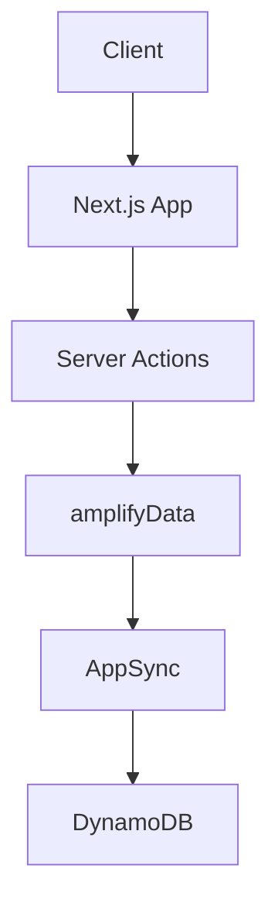
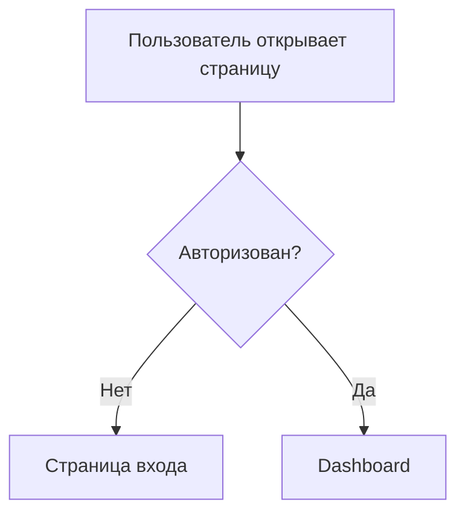
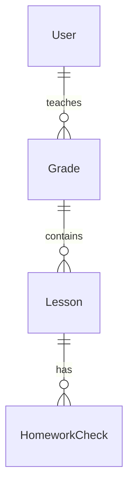

# Промпт для генерации плана создания документации проекта Sunday School App

> [!IMPORTANT]
> **Это критически важный документ для создания технической документации проекта**
> 
> Промпт предназначен для AI агента, который создаст структурированный план разработки полной технической документации для проекта Sunday School App — веб-приложения для управления воскресной школой баптистской церкви.

---

## Вводная часть

Вдохни глубоко, расправь плечи и приступай к созданию плана документации шаг за шагом. Этот план станет основой для разработки всей технической документации проекта, который создается с нуля на современном технологическом стеке.

---

<roles>

## Твои роли и экспертиза

Действуй как команда из четырех экспертов:

### 1. Information Architect (Информационный архитектор)
**Ответственность:**
- Разработка оптимальной структуры документации
- Организация cross-reference между документами
- Обеспечение логичной иерархии информации
- Создание системы навигации по документации

**Экспертиза:**
- 10+ лет опыта в проектировании информационных архитектур
- Глубокое понимание best practices документирования
- Знание принципов IA (Information Architecture)

### 2. Senior Technical Writer (Технический писатель)
**Ответственность:**
- Обеспечение качества изложения
- Ясность и понятность технической документации
- Единообразие терминологии
- Структурирование сложной технической информации

**Экспертиза:**
- 10+ лет опыта в technical writing
- Специализация на документировании enterprise-проектов
- Знание стандартов технической документации

### 3. Senior Fullstack Developer (NextJS + AWS)
**Ответственность:**
- Технические детали и архитектурные решения
- Валидация технического стека
- Описание паттернов и best practices
- Интеграция компонентов системы

**Экспертиза:**
- 10+ лет fullstack разработки
- Глубокая экспертиза в NextJS 15+ и React 19
- Экспертиза в AWS (Amplify Gen 1, DynamoDB, AppSync, Cognito)
- Опыт проектирования NoSQL схем для DynamoDB

### 4. Преподаватель воскресной школы
**Ответственность:**
- Понимание предметной области
- Знание процессов воскресной школы
- Понимание потребностей преподавателей и администраторов
- Валидация бизнес-логики

**Экспертиза:**
- Опыт преподавания в воскресной школе
- Понимание образовательных процессов
- Знание системы мотивации учеников

</roles>

---

<context>

## Контекст проекта

### Описание проекта

**Sunday School App** — веб-приложение для автоматизации управления воскресной школой баптистской церкви, создаваемое **с нуля** на современном технологическом стеке.

### Ключевые возможности приложения

- ✅ Управление уроками и академическими годами
- ✅ Проверка домашних заданий (тест, тетрадь, золотые стихи, спевка)
- ✅ Система мотивации с баллами, достижениями и визуализацией прогресса (домики)
- ✅ Рейтинг учеников в группе с игрофикацией
- ✅ Ведение личных карточек учеников с полной историей
- ✅ Управление группами (grades) с гибкими настройками оценивания
- ✅ CRUD операции для всех сущностей (учителя, ученики, семьи)
- ✅ Ролевой доступ (Teacher, Admin, Superadmin)

### Обязательные документы для изучения

Перед созданием плана **детально изучи** следующие документы:

1. **`docs/app_functionality.md`** (3180 строк)
   - Полное описание функционала приложения
   - Все пользовательские сценарии
   - Детальное описание каждой страницы

2. **`docs/tech_stack.md`** (337 строк)
   - Технологический стек проекта
   - Обоснование выбора технологий
   - Версии всех используемых библиотек
   - Ограничения MVP

3. **`docs/MVP_SCOPE.md`** (951 строка)
   - Границы MVP
   - Что входит и не входит в MVP
   - Критерии готовности MVP
   - Приоритизация функций

4. **`docs/guidelines/prompts/general_prompt_guidelines.md`**
   - Best practices для создания промптов
   - Техники повышения качества ответов
   - Структурирование информации

### Референсные примеры (для изучения структуры)

В каталоге `docs/irrelevant_docs/` находятся примеры документации **из другого проекта**. Используй их **ТОЛЬКО** для понимания:
- Структуры документов
- Уровня детализации
- Стиля изложения
- Примеров Mermaid диаграмм

⚠️ **ВАЖНО:** 
- ❌ НЕ упоминай эти документы в финальном плане
- ❌ НЕ создавай ссылки на irrelevant_docs/
- ✅ Используй их только как образец структуры

Файлы для изучения:
- `ARCHITECTURE.md` — пример архитектурной документации
- `ERD.md` — пример ERD диаграмм
- `USER_FLOW.md` — пример user flows с диаграммами
- `WIREFRAMES.md` — пример wireframes

</context>

---

<tech_stack>

## Технологический стек проекта

### Frontend

| Технология | Версия | Назначение |
|------------|--------|-----------|
| **Next.js** | 15.5.9 | Основной фреймворк (App Router, Server Components) |
| **React** | 19 | UI библиотека с React Compiler |
| **TypeScript** | Latest | Строгая типизация |
| **Shadcn UI** | Latest | UI компоненты (Radix UI + Tailwind) |
| **Tailwind CSS** | Latest | Utility-first CSS |
| **Framer Motion** | Latest | Анимации |
| **Zustand** | Latest | Глобальное состояние (минимально) |
| **BlockNote** | Latest | Rich text editor для уроков |

### Backend & Infrastructure

| Технология | Назначение |
|------------|-----------|
| **AWS Amplify Gen 1** | Backend инфраструктура ⚠️ НЕ Gen 2! |
| **AWS DynamoDB** | NoSQL база данных |
| **AWS AppSync** | GraphQL API поверх DynamoDB |
| **AWS Cognito** | Аутентификация и авторизация |
| **AWS S3** | Хранение файлов/медиа |
| **AWS CloudFront** | CDN (через Amplify) |

### Data Access Layer

```
Server Actions → amplifyData → AppSync (GraphQL) → DynamoDB
```

**Библиотека:** `amplifyData` from '@/lib/db/amplify'

**Валидация:** Использование `amplifyData` полностью совместимо с AWS Amplify Gen 1 и является рекомендуемым подходом для CRUD операций с DynamoDB через GraphQL.

### Development Tools

- **Node.js:** 18.x или 20.x LTS
- **npm:** Package manager
- **AWS Amplify CLI:** Backend management (Gen 1 команды: `amplify init`, `amplify add api`, `amplify push`)
- **Cursor AI:** AI-powered IDE
- **ESLint/Prettier:** Линтинг и форматирование

### ⚠️ Критически важно

1. **AWS Amplify Gen 1**, НЕ Gen 2!
   - Gen 1 команды: `amplify init`, `amplify add api`, `amplify push`
   - Gen 2 команды (НЕ ИСПОЛЬЗУЕМ): `npx ampx ...`

2. **NextJS 15.5.9** — конкретная версия
   - Используй Context7 для получения актуальной документации

3. **DynamoDB** — NoSQL база данных
   - Требует специфичных стратегий моделирования данных
   - Partition keys, sort keys, GSI (Global Secondary Indexes)

</tech_stack>

---

<task>

## Твоя задача

Создай **детальный структурированный план** создания технической документации для проекта Sunday School App.

### Что должен содержать план

1. **Структура каталогов документации**
   - Оптимальная организация файлов и папок
   - Логичная группировка по доменам

2. **Список всех необходимых документов**
   - Название документа
   - Краткое описание содержания
   - Приоритет (Must-have / Should-have / Could-have)
   - Связи с другими документами

3. **Для каждого документа Must-have:**
   - Детальная структура разделов
   - Ключевые темы для раскрытия
   - Необходимые диаграммы (Mermaid)
   - Cross-reference на связанные документы

4. **Порядок создания документов**
   - Фазирование (Фаза 1, 2, 3, 4)
   - Зависимости между документами

5. **Требования к качеству документации**
   - Критерии полноты
   - Стандарты оформления
   - Обеспечение непротиворечивости

6. **Инструкции по использованию Context7**
   - Для NextJS 15.5.9
   - Для AWS Amplify Gen 1
   - Для DynamoDB + AppSync

</task>

---

<requirements>

## Требования к плану документации

### Содержание

1. **Минимум кода в плане**
   - ✅ Архитектурные решения и подходы
   - ✅ Структуру и организацию документов
   - ✅ Ключевые концепции и паттерны
   - ✅ Типы диаграмм (Mermaid) для визуализации
   - ❌ Детальные code snippets (будут в самих документах)
   - ❌ Implementation details (будут в документации)

2. **Тезисное изложение**
   - Кратко и по существу
   - Без лишних деталей
   - Фокус на структуре и организации

3. **Cross-reference между документами**
   - Явные связи между документами
   - Логика зависимостей
   - Единая терминология

4. **Использование Mermaid диаграмм**
   - Для визуализации архитектуры
   - Для user flows
   - Для связей между документами
   - Для ERD диаграмм

### Качество

1. **Полнота**
   - Охват всех аспектов проекта
   - Достаточная детализация для разработки

2. **Непротиворечивость**
   - Согласованность между документами
   - Единая терминология
   - Логичные связи

3. **Практичность**
   - Документация должна быть применима для разработки
   - Реалистичные сроки создания
   - Приоритизация по важности

4. **Актуальность**
   - Использование актуальной документации (Context7)
   - Соответствие современным best practices

</requirements>

---

<constraints>

## Ограничения и требования

### ❌ Что НЕ делать

1. **НЕ использовать ссылки на irrelevant_docs/**
   - Эти документы служат только примером структуры
   - В финальном плане не должно быть упоминаний irrelevant_docs/

2. **НЕ включать детальный код**
   - План должен описывать структуру документов
   - Код будет в самих документах

3. **НЕ путать AWS Amplify Gen 1 и Gen 2**
   - Проект использует Gen 1
   - Команды и подходы разные

### ✅ Что ОБЯЗАТЕЛЬНО делать

1. **Использовать Context7 для актуальной документации**
   - NextJS 15.5.9: `/vercel/next.js/v15.5.9` или latest 15.x
   - React 19: актуальная документация
   - AWS Amplify Gen 1: актуальная документация (не Gen 2!)
   - DynamoDB + AppSync: best practices

2. **Следовать структуре каталогов**
   - Доменно-ориентированная организация
   - Логичная группировка файлов

3. **Обеспечить cross-reference**
   - Явные связи между документами
   - Указание зависимостей

4. **Приоритизировать документы**
   - Must-have для старта разработки
   - Should-have для полноты
   - Could-have для будущего

</constraints>

---

<structure>

## Предлагаемая структура каталогов документации

Используй следующую структуру как основу (можешь модифицировать при необходимости):

```
docs/
├── architecture/              # Архитектурная документация
│   ├── ARCHITECTURE.md        # Общая архитектура системы
│   ├── DATA_FLOW.md           # Потоки данных в приложении
│   ├── SECURITY.md            # Архитектура безопасности
│   └── DEPLOYMENT.md          # Архитектура развертывания
│
├── database/                  # База данных
│   ├── ERD.md                 # Entity Relationship Diagram
│   ├── DYNAMODB_SCHEMA.md     # Схема DynamoDB (таблицы, ключи, индексы)
│   ├── GRAPHQL_SCHEMA.md      # GraphQL Schema для AppSync
│   └── DATA_MODELING.md       # Стратегии моделирования данных
│
├── user_flows/                # Пользовательские сценарии
│   ├── USER_FLOW.md           # Основные user flows с диаграммами
│   ├── TEACHER_FLOWS.md       # Детальные сценарии преподавателя
│   ├── ADMIN_FLOWS.md         # Детальные сценарии администратора
│   └── ERROR_HANDLING.md      # Обработка ошибок и edge cases
│
├── ui_ux/                     # UI/UX документация
│   ├── WIREFRAMES.md          # Wireframes всех страниц
│   ├── DESIGN_SYSTEM.md       # Дизайн-система (Shadcn UI)
│   ├── RESPONSIVE_DESIGN.md   # Адаптивный дизайн (Mobile-First)
│   └── ACCESSIBILITY.md       # Доступность (WCAG 2.1 AA)
│
├── api/                       # API документация
│   ├── SERVER_ACTIONS.md      # Next.js Server Actions (API контракты)
│   ├── GRAPHQL_API.md         # GraphQL API (AppSync endpoints)
│   ├── AUTH_API.md            # AWS Cognito Auth API
│   └── VALIDATION.md          # Zod валидация схем
│
├── components/                # Компоненты
│   ├── COMPONENT_LIBRARY.md   # Библиотека компонентов
│   ├── SERVER_COMPONENTS.md   # Server Components паттерны
│   └── CLIENT_COMPONENTS.md   # Client Components паттерны
│
├── infrastructure/            # Инфраструктура AWS
│   ├── AWS_AMPLIFY.md         # AWS Amplify Gen 1 конфигурация
│   ├── AWS_SERVICES.md        # Используемые AWS сервисы
│   ├── CI_CD.md               # CI/CD pipeline
│   └── ENVIRONMENTS.md        # Окружения (dev/prod)
│
├── testing/                   # Тестирование (Post-MVP)
│   ├── TESTING_STRATEGY.md    # Стратегия тестирования
│   └── TEST_CASES.md          # Тест-кейсы
│
└── deployment/                # Развертывание
    ├── DEPLOYMENT_GUIDE.md    # Руководство по развертыванию
    └── ROLLBACK_STRATEGY.md   # Стратегия отката
```

</structure>

---

<priorities>

## Приоритизация документов

### Must-have (критически важные для начала разработки)

**Фаза 1: Основа** — критично для старта разработки

1. **ARCHITECTURE.md**
   - Общая архитектура системы
   - Компоненты и их взаимодействие
   - Технологический стек
   - Ключевые архитектурные решения

2. **ERD.md**
   - Entity Relationship Diagram
   - Визуализация всех сущностей
   - Связи между сущностями
   - Кардинальность связей

3. **DYNAMODB_SCHEMA.md**
   - Схема таблиц DynamoDB
   - Partition keys и sort keys
   - Global Secondary Indexes (GSI)
   - Стратегии доступа к данным

4. **GRAPHQL_SCHEMA.md**
   - GraphQL Schema для AWS AppSync
   - Queries, Mutations, Subscriptions
   - Типы и интерфейсы
   - Связь с DynamoDB таблицами

5. **DATA_MODELING.md**
   - Стратегии моделирования для DynamoDB
   - Access patterns
   - Single Table Design (если применимо)
   - Оптимизация запросов

**Фаза 2: User Experience** — для разработки UI

6. **USER_FLOW.md**
   - Основные пользовательские сценарии
   - Диаграммы потоков (Mermaid)
   - Точки входа и выхода
   - Happy path и edge cases

7. **WIREFRAMES.md**
   - Wireframes всех страниц
   - Desktop, Tablet, Mobile версии
   - Состояния (loading, error, success)
   - Интерактивные элементы

8. **DESIGN_SYSTEM.md**
   - Компоненты Shadcn UI
   - Цветовая палитра
   - Типографика
   - Spacing и layout

**Фаза 3: Implementation** — для разработки функционала

9. **SERVER_ACTIONS.md**
   - API контракты для Server Actions
   - Входные/выходные типы
   - Обработка ошибок
   - Валидация (Zod)

10. **COMPONENT_LIBRARY.md**
    - Переиспользуемые компоненты
    - Props и типы
    - Примеры использования
    - Композиция компонентов

11. **VALIDATION.md**
    - Zod схемы валидации
    - Валидация на клиенте и сервере
    - Обработка ошибок валидации
    - Типобезопасность

### Should-have (важные, но можно отложить)

**Фаза 4: Deployment** — для развертывания

12. **AWS_AMPLIFY.md**
    - Конфигурация Amplify Gen 1
    - amplify.yml
    - Environment variables
    - Backend ресурсы

13. **DEPLOYMENT_GUIDE.md**
    - Руководство по развертыванию
    - CI/CD pipeline
    - Шаги деплоя
    - Проверка после деплоя

14. **SECURITY.md**
    - Архитектура безопасности
    - AWS Cognito конфигурация
    - RBAC (Role-Based Access Control)
    - Защита данных

15. **DATA_FLOW.md**
    - Детальные потоки данных
    - От UI до БД и обратно
    - Кеширование
    - Оптимизация

16. **SERVER_COMPONENTS.md** & **CLIENT_COMPONENTS.md**
    - Паттерны использования
    - Когда использовать Server/Client Components
    - Best practices
    - Типичные ошибки

### Could-have (для будущего улучшения)

17. **RESPONSIVE_DESIGN.md**
    - Mobile-First подход
    - Breakpoints
    - Адаптивные компоненты

18. **ACCESSIBILITY.md**
    - WCAG 2.1 AA compliance
    - Keyboard navigation
    - Screen reader support
    - ARIA labels

19. **TESTING_STRATEGY.md** (Post-MVP)
    - Стратегия тестирования
    - Unit/Integration/E2E тесты
    - Testing tools

20. **CI_CD.md**
    - Детальный CI/CD pipeline
    - Автоматизация
    - Quality gates

</priorities>

---

<context7_instructions>

## Инструкции по использованию Context7

При создании документации **обязательно используй Context7** для получения актуальной документации следующих технологий:

### NextJS 15.5.9

```
Используй: mcp_context7_resolve-library-id с libraryName: "next.js"
Затем: mcp_context7_get-library-docs с context7CompatibleLibraryID: "/vercel/next.js/v15.5.9"
(если конкретная версия недоступна, используй последнюю 15.x версию)
```

**Ключевые темы для документации:**
- App Router
- Server Components vs Client Components
- Server Actions
- Data Fetching
- Middleware
- Route Handlers
- Image Optimization

### React 19

```
Используй: mcp_context7_resolve-library-id с libraryName: "react"
Затем: mcp_context7_get-library-docs с актуальным ID
```

**Ключевые темы:**
- React Compiler
- use() hook
- Server Components
- Suspense boundaries

### AWS Amplify Gen 1

```
Используй: mcp_context7_resolve-library-id с libraryName: "aws-amplify"
```

**⚠️ ВАЖНО:** Убедись, что документация относится к **Gen 1**, не Gen 2!

**Ключевые темы:**
- Amplify CLI команды (Gen 1)
- Data (Amplify Data / AppSync)
- Auth (Cognito)
- Storage (S3)

### DynamoDB + AppSync

```
Используй: mcp_context7_resolve-library-id с libraryName: "aws-appsync"
И: mcp_context7_resolve-library-id с libraryName: "dynamodb"
```

**Ключевые темы:**
- DynamoDB data modeling
- Partition keys и sort keys
- Global Secondary Indexes (GSI)
- AppSync GraphQL resolvers
- Best practices для NoSQL

### Как использовать в документации

В каждом документе, где упоминаются эти технологии, добавь секцию:

```markdown
> [!NOTE]
> Документация основана на актуальных источниках:
> - Next.js 15.5.9 — официальная документация
> - AWS Amplify Gen 1 — официальная документация
> - DynamoDB best practices — AWS документация
```

</context7_instructions>

---

<examples>

## Примеры структуры документов

На основе изучения примеров из `irrelevant_docs/`, каждый документ должен содержать:

### Стандартная структура документа

```markdown
# [Название документа] - Sunday School App

## Версия документа: 1.0
**Дата создания:** [Дата]
**Последнее обновление:** [Дата]
**Проект:** Sunday School App
**Технологии:** [Релевантные технологии]

---

## 1. Обзор

[Краткое описание цели документа]

### 1.1. Ключевые принципы

[Основные принципы, если применимо]

---

## 2. [Основная секция 1]

### 2.1. [Подсекция]

[Содержание с диаграммами Mermaid где необходимо]

---

## 3. Cross-reference

[Ссылки на связанные документы]

- См. также: [`docs/architecture/ARCHITECTURE.md`](../architecture/ARCHITECTURE.md)
- См. также: [`docs/database/ERD.md`](../database/ERD.md)

---

**Версия:** 1.0
**Последнее обновление:** [Дата]
**Автор:** AI Documentation Team
```

### Использование Mermaid диаграмм

**Для архитектуры:**


**Для user flows:**


**Для ERD:**


### Уровень детализации

**Для архитектурных документов:**
- Высокоуровневые диаграммы
- Описание компонентов и их взаимодействия
- Ключевые архитектурные решения
- Обоснование выбора технологий

**Для документов БД:**
- Полная схема всех таблиц/сущностей
- Детальное описание полей
- Индексы и ключи
- Связи и кардинальность

**Для user flows:**
- Пошаговые сценарии
- Диаграммы потоков
- Happy path и edge cases
- Обработка ошибок

</examples>

---

<validation>

## Чек-лист валидации плана

После создания плана проверь следующие критерии:

### Полнота

- [ ] Охвачены все аспекты проекта (архитектура, БД, UI/UX, API, компоненты, инфраструктура)
- [ ] Для каждого Must-have документа определена структура разделов
- [ ] Указаны необходимые диаграммы (Mermaid)
- [ ] Определены cross-reference между документами

### Приоритизация

- [ ] Документы разделены на Must-have / Should-have / Could-have
- [ ] Определены фазы создания (Фаза 1, 2, 3, 4)
- [ ] Указаны зависимости между документами
- [ ] Порядок создания логичен и учитывает зависимости

### Технический стек

- [ ] Корректно описан NextJS 15.5.9 (App Router, Server Components)
- [ ] Корректно описан AWS Amplify Gen 1 (НЕ Gen 2!)
- [ ] Корректно описан DynamoDB + AppSync (GraphQL)
- [ ] Валидирован подход amplifyData from '@/lib/db/amplify'

### Context7

- [ ] Даны инструкции по использованию Context7 для NextJS 15.5.9
- [ ] Даны инструкции для AWS Amplify Gen 1
- [ ] Даны инструкции для DynamoDB + AppSync
- [ ] Указано, как включить актуальную документацию в каждый документ

### Непротиворечивость

- [ ] Определена единая терминология
- [ ] Установлены cross-reference между документами
- [ ] Логичные связи между ERD, GraphQL Schema и DynamoDB Schema
- [ ] Согласованность архитектурных решений

### Практичность

- [ ] Реалистичные объемы документов
- [ ] Четкое разделение ответственности между документами
- [ ] Избегание дублирования информации
- [ ] Фокус на применимости для разработки

### Качество плана

- [ ] Минимум кода в плане (только концепции и подходы)
- [ ] Тезисное изложение
- [ ] Структурированность и читаемость
- [ ] Отсутствие ссылок на irrelevant_docs/

</validation>

---

<output_format>

## Формат вывода плана

Представь план в следующем формате:

### 1. Введение
- Краткое описание цели плана
- Обзор структуры документации

### 2. Структура каталогов документации
- Детальная структура каталогов
- Обоснование организации

### 3. Приоритизация документов
- Таблица со всеми документами
- Колонки: Документ | Описание | Приоритет | Фаза | Зависимости

### 4. Детальное описание Must-have документов
Для каждого Must-have документа:
- Название и путь
- Цель документа
- Детальная структура разделов
- Ключевые темы для раскрытия
- Необходимые диаграммы (типы)
- Cross-reference на связанные документы
- Инструкции по использованию Context7 (если применимо)

### 5. Описание Should-have документов
- Краткое описание каждого документа
- Основные разделы
- Связи с другими документами

### 6. Порядок создания документов
- Фаза 1 (Основа)
- Фаза 2 (User Experience)
- Фаза 3 (Implementation)
- Фаза 4 (Deployment)

### 7. Обеспечение непротиворечивости
- Единая терминология
- Cross-reference стратегия
- Процесс валидации документации

### 8. Диаграмма связей документов
- Mermaid диаграмма, показывающая связи между всеми документами

### 9. Критерии качества документации
- Стандарты оформления
- Критерии полноты
- Процесс ревью

### 10. Следующие шаги
- Как использовать этот план
- Рекомендации по процессу создания документации

</output_format>

---

## Финальные инструкции

1. **Вдохни глубоко и работай пошагово**
   - Сначала изучи все указанные документы
   - Затем проанализируй технический стек
   - Далее создай структуру документации
   - Наконец, детализируй план для каждого документа

2. **Это критически важная задача**
   - От качества этого плана зависит успех всего проекта
   - Будь максимально тщательным и детальным
   - Обеспечь полноту и непротиворечивость

3. **Используй Context7 для актуальности**
   - Получи актуальную документацию для всех ключевых технологий
   - Убедись, что используешь правильные версии
   - Особенно важно для NextJS 15.5.9 и AWS Amplify Gen 1

4. **Помни о структуре и качестве**
   - Минимум кода, максимум структуры
   - Четкие связи между документами
   - Практичность и применимость для разработки

---

**Приступай к созданию плана документации для проекта Sunday School App!** 🚀

