# User Flow (Пользовательские сценарии) - Sunday School App

## Версия документа: 1.0
**Дата создания:** 11 ноября 2025  
**Проект:** Sunday School App (Воскресная школа)  
**Технологии:** Next.js 16, TypeScript, Prisma, Auth.js v5, Zustand, Shadcn UI  
**Целевая аудитория:** Преподаватели, Администраторы, Родители (Post-MVP), Ученики (Post-MVP)

---

## 1. Обзор

Данный документ описывает детальные пользовательские сценарии (User Flow) для веб-приложения управления воскресной школой баптистской церкви. Документ охватывает все основные потоки взаимодействия пользователей с системой, включая аутентификацию, создание уроков, проверку домашних заданий, управление пользователями и административные функции.

### 1.1 Структура документа

- **Раздел 2:** Типы пользователей и их роли
- **Раздел 3:** User Flow для роли Teacher (Преподаватель)
- **Раздел 4:** User Flow для роли Admin (Администратор)
- **Раздел 5:** User Flow для роли Superadmin (Главный администратор)
- **Раздел 6:** User Flow для роли Parent (Родитель) — Post-MVP
- **Раздел 7:** User Flow для роли Pupil (Ученик) — Post-MVP
- **Раздел 8:** Обработка ошибок и edge cases
- **Раздел 9:** Особенности мобильной версии

---

## 2. Типы пользователей и их роли

### 2.1. Teacher (Преподаватель)

**Описание:** Преподаватель воскресной школы, ведущий одну или несколько групп

**Основные возможности:**
- Создание и редактирование уроков для своей группы
- Массовая проверка домашних заданий
- Просмотр личных карточек учеников
- Управление расписанием группы
- Просмотр рейтинга группы
- Просмотр статистики по золотым стихам

**Ограничения:**
- Доступ только к своей группе (группам)
- Не может управлять пользователями
- Не может настраивать параметры оценивания группы
- Не имеет доступа к административным страницам

**Роль в системе:** `TEACHER`

---

### 2.2. Admin (Администратор)

**Описание:** Администратор воскресной школы с полным доступом к управлению

**Основные возможности:**
- Все возможности Teacher для всех групп
- Управление преподавателями (CRUD)
- Управление учениками (CRUD)
- Управление семьями (CRUD)
- Управление группами и настройками оценивания
- Завершение учебного года и создание нового
- Просмотр статистики по всем группам

**Роль в системе:** `ADMIN`

---

### 2.3. Superadmin (Главный администратор)

**Описание:** Главный администратор с максимальными правами

**Основные возможности:**
- Все возможности Admin
- Управление ролями пользователей (Post-MVP)
- Системные настройки (Post-MVP)

**Роль в системе:** `SUPERADMIN`

**В MVP:** функционал идентичен Admin

---

### 2.4. Parent (Родитель) — Post-MVP

**Описание:** Родитель ученика, имеющий доступ к данным своих детей

**Основные возможности:**
- Просмотр данных своих детей (только чтение)
- Просмотр расписания группы детей
- Просмотр рейтинга группы
- Получение email уведомлений об успеваемости

**Роль в системе:** `PARENT`

---

### 2.5. Pupil (Ученик) — Post-MVP

**Описание:** Ученик воскресной школы, имеющий доступ к своим данным

**Основные возможности:**
- Просмотр собственных данных (только чтение)
- Просмотр своих оценок и достижений
- Просмотр предстоящих уроков
- Просмотр своего рейтинга

**Роль в системе:** `PUPIL`

---

## 3. User Flow для роли Teacher (Преподаватель)

### 3.1. Первый вход в систему

**Цель:** Преподаватель впервые входит в систему после получения учетных данных

**Диаграмма потока:**

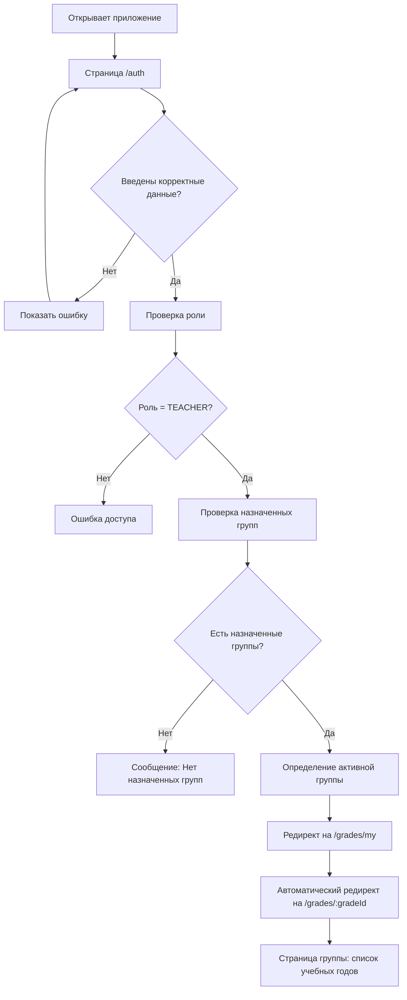

**Детальный сценарий:**

1. **Открытие приложения**
   - Пользователь открывает браузер и переходит на URL приложения
   - Видит страницу аутентификации `/auth`

2. **Ввод учетных данных**
   - Вводит email (например, `maria.ivanova@church.com`)
   - Вводит пароль (полученный от администратора)
   - Нажимает кнопку "Войти в систему"

3. **Валидация и аутентификация**
   - Система проверяет формат email
   - Система проверяет пароль (bcrypt)
   - Если данные неверны → показывается ошибка "Неверный email или пароль"

4. **Проверка роли и прав доступа**
   - Система определяет роль пользователя из базы данных
   - Проверяется, что роль = `TEACHER`
   - Если роль не соответствует → ошибка доступа

5. **Определение назначенных групп**
   - Система ищет все группы, где пользователь назначен преподавателем (таблица `UserGrade`)
   - Если групп нет → показывается сообщение: "Вы не назначены ни на одну группу. Обратитесь к администратору."

6. **Редирект на страницу группы**
   - Если группа одна → автоматический редирект на `/grades/:gradeId`
   - Если групп несколько → показывается список групп для выбора
   - По умолчанию выбирается первая активная группа

7. **Отображение страницы группы**
   - Пользователь видит список учебных годов для своей группы
   - Отображается активный (ACTIVE) учебный год
   - Доступны кнопки: "➕ Новый урок", "📅 Расписание", "⚙️ Настройки" (только просмотр)

**Обработка ошибок:**
- ❌ Неверный email или пароль → красное сообщение над формой
- ❌ Пользователь не найден → "Пользователь с таким email не найден"
- ❌ Пользователь деактивирован → "Ваш аккаунт деактивирован. Обратитесь к администратору."
- ❌ Нет назначенных групп → информационное сообщение с инструкцией

**Мобильная версия:**
- Форма входа адаптирована для мобильных устройств
- Кнопки увеличены для удобного нажатия
- Автоматическое заполнение email/пароля через браузер (если сохранено)

---

### 3.2. Создание нового урока

**Цель:** Преподаватель создает новый урок с темой и золотыми стихами для своей группы

**Диаграмма потока:**

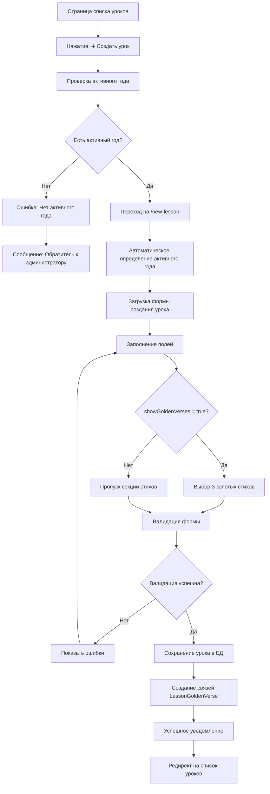

**Детальный сценарий:**

1. **Начальная точка**
   - Преподаватель находится на странице `/grades/:gradeId/academic-years/:yearId/lessons`
   - Видит список уроков за текущий учебный год

2. **Инициация создания урока**
   - Нажимает кнопку "➕ Создать урок"
   - Система проверяет наличие активного (ACTIVE) академического года для группы

3. **Проверка активного года**
   - Если активного года нет → отображается ошибка: "Для создания урока необходимо наличие активного учебного года. Обратитесь к администратору."
   - Если активный год есть → переход на `/new-lesson`

4. **Загрузка формы**
   - Система автоматически определяет активный академический год для группы
   - Форма предзаполняется:
     - Группа: выбрана автоматически
     - Академический год: активный год (скрыто, не редактируется)
     - Номер урока: следующий по порядку (автоматически)
     - Дата урока: сегодняшняя дата (по умолчанию)

5. **Заполнение основных полей**
   - **Дата урока:** Выбирает дату из date picker (должна быть в пределах [startDate, endDate] активного года)
   - **Тема урока:** Вводит тему (например, "Авраам и Исаак")
   - **Преподаватель:** Выбирает из списка преподавателей группы (по умолчанию — сам)

6. **Выбор золотых стихов (если включено)**
   - Если `grade.settings.showGoldenVerses = true`:
     - Отображается секция "📖 Золотые стихи"
     - Требуется выбрать ровно 3 стиха
     - Для каждого стиха:
       - Выбирает книгу из dropdown (Быт., Ин., Рим., и т.д.)
       - Вводит номер главы (1-150)
       - Вводит номер стиха (1-200)
       - Система проверяет БД на наличие стиха
       - Если стих найден → текст автоподставляется
       - Если стих не найден → требуется ввести текст вручную
   - Если `showGoldenVerses = false`:
     - Секция золотых стихов скрыта

7. **Описание урока (опционально)**
   - Может добавить описание урока через BlockNote редактор
   - Текст сохраняется в формате JSON

8. **Валидация формы**
   - Проверяется наличие активного года
   - Проверяется, что дата урока в пределах учебного года
   - Проверяется, что тема урока заполнена (min 3 символа, max 200)
   - Если `showGoldenVerses = true` → проверяется наличие 3 стихов
   - Если `showGoldenVerses = false` → проверяется отсутствие стихов

9. **Сохранение урока**
   - При нажатии "Создать урок":
     - Создается запись в таблице `Lesson` с `academicYearId` = активный год
     - Если есть золотые стихи → создаются записи в `LessonGoldenVerse`
     - Если стих не найден в БД → создается новая запись в `GoldenVerse`
   - Отображается уведомление: "Урок успешно создан"

10. **Редирект**
    - Автоматический редирект на `/grades/:gradeId/academic-years/:yearId/lessons`
    - Новый урок отображается в списке

**Обработка ошибок:**
- ❌ Нет активного года → блокировка создания с информационным сообщением
- ❌ Дата урока вне пределов учебного года → ошибка валидации
- ❌ Тема урока слишком короткая/длинная → ошибка под полем
- ❌ Если `showGoldenVerses = true` и выбрано не 3 стиха → ошибка валидации
- ❌ Ошибка сохранения в БД → общее сообщение об ошибке

**Мобильная версия:**
- Форма адаптирована для мобильных устройств
- Date picker открывается в нативном формате устройства
- Dropdown для выбора книг оптимизирован для touch-интерфейса
- Блоки выбора стихов расположены вертикально для удобства

---

### 3.3. Проверка домашних заданий

**Цель:** Преподаватель проверяет домашние задания всех учеников группы после урока

**Диаграмма потока:**

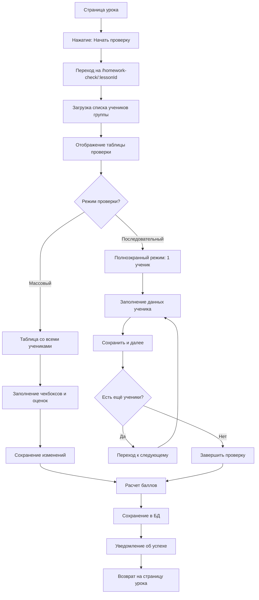

**Детальный сценарий:**

1. **Начальная точка**
   - Преподаватель находится на странице урока `/lessons/:lessonId`
   - Видит информацию об уроке и кнопку "Начать проверку"

2. **Инициация проверки**
   - Нажимает "Начать проверку"
   - Переходит на `/homework-check/:lessonId`
   - Система загружает список всех активных учеников группы

3. **Выбор режима проверки**
   - **Массовый режим:** Таблица со всеми учениками (удобно для быстрой проверки)
   - **Последовательный режим:** Полноэкранный режим по одному ученику (удобно для детальной проверки)

4. **Массовый режим проверки**
   - Отображается таблица:
     - Колонка "Ученик" (аватар + ФИО)
     - Колонка "Присутствие" (чекбокс)
     - Колонки для параметров (зависят от `GradeSettings`):
       - Золотые стихи (если `showGoldenVerses = true`): 3 колонки с оценками 0/1/2
       - Тест (если `showTest = true`): чекбокс + оценка 0-5
       - Тетрадь (если `showNotebook = true`): чекбокс + оценка 0-5
       - Спевка (если `showSinging = true`): чекбокс
     - Колонка "Баллы" (автоматический расчет)
   - Преподаватель заполняет данные для каждого ученика
   - Может сохранить изменения частично (кнопка "Сохранить изменения")

5. **Последовательный режим проверки**
   - Отображается полноэкранная форма для одного ученика:
     - Аватар и ФИО ученика
     - Чекбокс "Присутствовал"
     - Поля для параметров (аналогично массовому режиму)
     - Кнопки "◄ Назад" и "Сохранить и далее →"
   - После сохранения автоматически переходит к следующему ученику
   - Прогресс отображается вверху (например, "5/15")

6. **Расчет баллов**
   - Система автоматически рассчитывает баллы на основе:
     - Выполненных параметров (чекбоксы)
     - Оценок (для стихов, теста, тетради)
     - Настроек `GradeSettings.customPoints`
   - Если все параметры выполнены → ученик получает "домик" (визуализация)

7. **Сохранение в БД**
   - Создаются/обновляются записи в таблице `HomeworkCheck`
   - Для каждого ученика создается одна запись с данными проверки
   - Если ученик отсутствовал (`isPresent = false`), все параметры = false

8. **Завершение проверки**
   - После проверки всех учеников отображается уведомление: "Проверка завершена успешно"
   - Прогресс на странице урока обновляется (например, "15/15")
   - Возврат на страницу урока

**Обработка ошибок:**
- ❌ Нет активных учеников в группе → сообщение "В группе нет активных учеников"
- ❌ Ошибка сохранения → показывается ошибка, данные не теряются (автосохранение)
- ❌ Некорректные оценки → валидация на клиенте (0-2 для стихов, 0-5 для теста/тетради)

**Мобильная версия:**
- Последовательный режим предпочтителен для мобильных устройств
- Кнопки оценки увеличены для удобного нажатия
- Swipe-жесты для перехода между учениками (опционально)
- Автосохранение при переходе к следующему ученику

---

### 3.4. Просмотр рейтинга группы

**Цель:** Преподаватель просматривает рейтинг учеников своей группы для мотивации

**Диаграмма потока:**

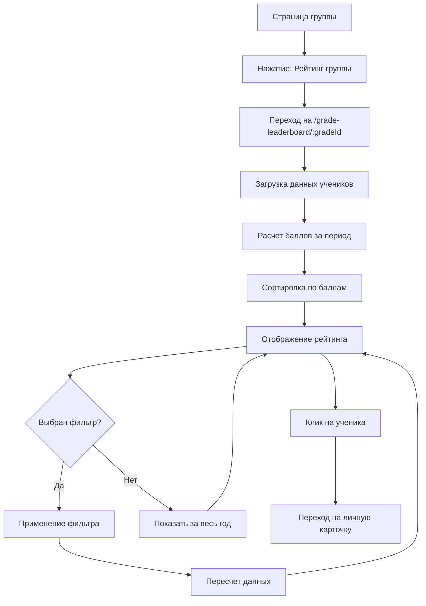

**Детальный сценарий:**

1. **Начальная точка**
   - Преподаватель находится на странице группы `/grades/:gradeId`
   - Видит кнопку "Рейтинг группы" или переходит через меню

2. **Загрузка рейтинга**
   - Переход на `/grade-leaderboard/:gradeId`
   - Система загружает всех активных учеников группы
   - Рассчитывает баллы для каждого ученика за выбранный период

3. **Фильтрация по периоду**
   - Доступны фильтры:
     - "Весь учебный год" (по умолчанию)
     - "Текущий месяц"
     - "Прошлый месяц"
     - "Кастомный период" (date range picker)

4. **Отображение рейтинга**
   - Таблица с колонками:
     - **Место** (1, 2, 3...)
     - **Ученик** (аватар + ФИО)
     - **Баллы** (общая сумма)
     - **Домики** (количество уроков, где все параметры выполнены)
     - **Достижения** (badges/иконки)
   - Сортировка по баллам (по убыванию)

5. **Визуализация прогресса**
   - Домики отображаются как иконки (🏠)
   - Количество домиков = количество уроков с полным выполнением
   - Badges отображаются как иконки достижений

6. **Детальная информация**
   - Клик на ученика → переход на `/pupil-personal-data/:id`
   - Можно увидеть детальную статистику по ученику

**Обработка ошибок:**
- ❌ Нет данных за период → сообщение "Нет данных за выбранный период"
- ❌ Ошибка загрузки → общее сообщение об ошибке с кнопкой "Повторить"

**Мобильная версия:**
- Таблица адаптирована для мобильных устройств
- Карточки учеников вместо таблицы (на маленьких экранах)
- Swipe для просмотра деталей

---

### 3.5. Управление расписанием группы

**Цель:** Преподаватель добавляет события в расписание группы (уроки, мероприятия, отмены)

**Диаграмма потока:**

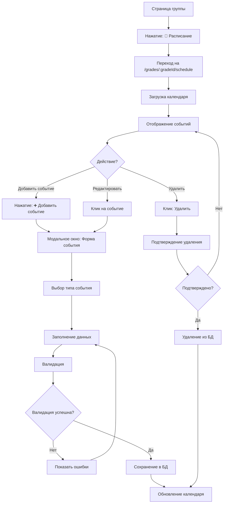

**Детальный сценарий:**

1. **Начальная точка**
   - Преподаватель находится на странице группы `/grades/:gradeId`
   - Нажимает кнопку "📅 Расписание"

2. **Отображение календаря**
   - Переход на `/grades/:gradeId/schedule`
   - Отображается календарь с событиями группы
   - События отображаются цветами:
     - 🔵 Синий — Урок (LESSON)
     - 🟢 Зеленый — Выездное мероприятие (OUTDOOR_EVENT)
     - 🔴 Красный — Отмена урока (LESSON_SKIPPING)

3. **Добавление события**
   - Нажимает "➕ Добавить событие"
   - Открывается модальное окно с формой:
     - **Тип события:** Dropdown (LESSON, OUTDOOR_EVENT, LESSON_SKIPPING)
     - **Название:** Текстовое поле (обязательное)
     - **Описание:** Текстовое поле (опционально)
     - **Дата:** Date picker (обязательное)
     - **Время начала:** Time picker (опционально)
     - **Время окончания:** Time picker (опционально)

4. **Валидация и сохранение**
   - Проверяется заполнение обязательных полей
   - Если указано время → проверяется, что endTime > startTime
   - При сохранении создается запись в таблице `GradeEvent`

5. **Редактирование события**
   - Клик на событие в календаре
   - Открывается модальное окно с предзаполненными данными
   - Можно изменить любые поля
   - Сохранение обновляет запись в БД

6. **Удаление события**
   - Клик на кнопку "Удалить" у события
   - Подтверждение удаления
   - После подтверждения → удаление из БД

**Обработка ошибок:**
- ❌ Некорректная дата → ошибка валидации
- ❌ endTime < startTime → ошибка валидации
- ❌ Ошибка сохранения → общее сообщение об ошибке

**Мобильная версия:**
- Календарь адаптирован для мобильных устройств
- Модальное окно на весь экран
- Swipe для навигации по месяцам

---

### 3.6. Просмотр статистики ученика

**Цель:** Преподаватель просматривает детальную статистику конкретного ученика

**Диаграмма потока:**

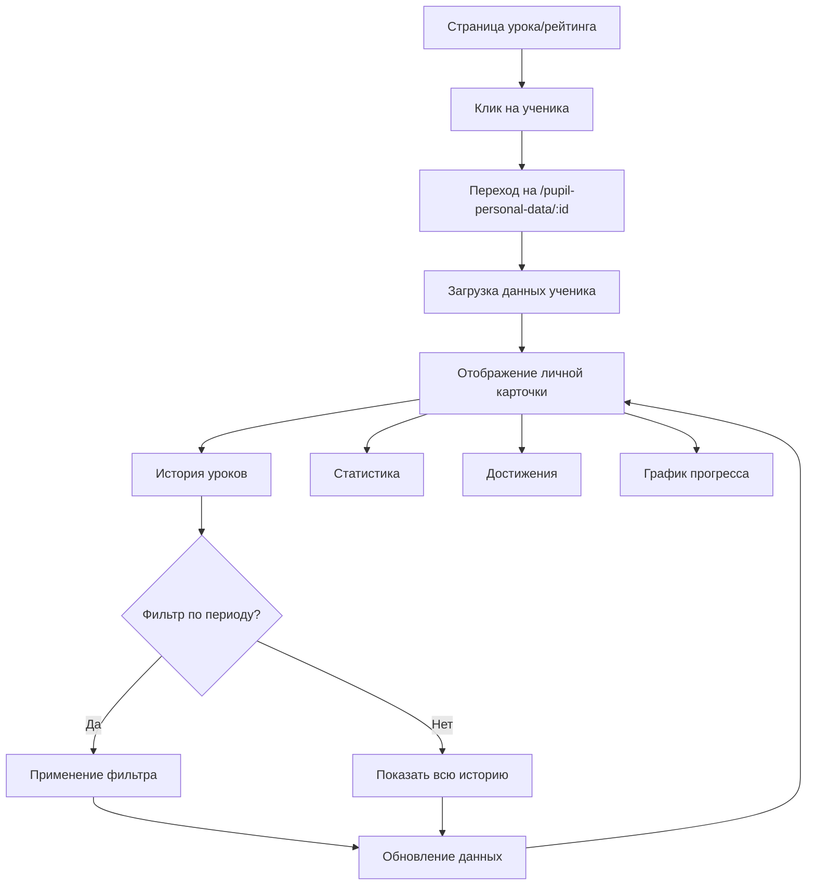

**Детальный сценарий:**

1. **Начальная точка**
   - Преподаватель находится на странице урока, рейтинга или списка учеников
   - Кликает на ученика (аватар или ФИО)

2. **Загрузка данных**
   - Переход на `/pupil-personal-data/:id`
   - Система загружает:
     - Основную информацию об ученике (ФИО, фото, группа)
     - Историю всех уроков с проверками
     - Статистику (посещаемость, средние баллы)
     - Достижения (badges)
     - График прогресса

3. **Отображение личной карточки**
   - **Шапка:** Аватар, ФИО, группа
   - **Вкладки:**
     - История уроков
     - Статистика
     - Достижения
     - График прогресса

4. **История уроков**
   - Таблица с уроками:
     - Дата урока
     - Тема урока
     - Присутствие
     - Параметры проверки (стихи, тест, тетрадь, спевка)
     - Баллы
     - Домик (если все выполнено)
   - Фильтрация по периоду

5. **Статистика**
   - Общая посещаемость (%)
   - Средние баллы по параметрам
   - Общее количество баллов
   - Количество домиков

6. **Достижения**
   - Отображение всех badges ученика
   - Дата получения каждого достижения

7. **График прогресса**
   - Визуализация прогресса по времени
   - График баллов по урокам

**Обработка ошибок:**
- ❌ Ученик не найден → 404 страница
- ❌ Нет данных → сообщение "Нет данных для отображения"

**Мобильная версия:**
- Карточка адаптирована для мобильных устройств
- Вкладки в виде bottom navigation
- График адаптирован для маленьких экранов

---

## 4. User Flow для роли Admin (Администратор)

### 4.1. Первый вход в систему

**Цель:** Администратор впервые входит в систему

**Диаграмма потока:**

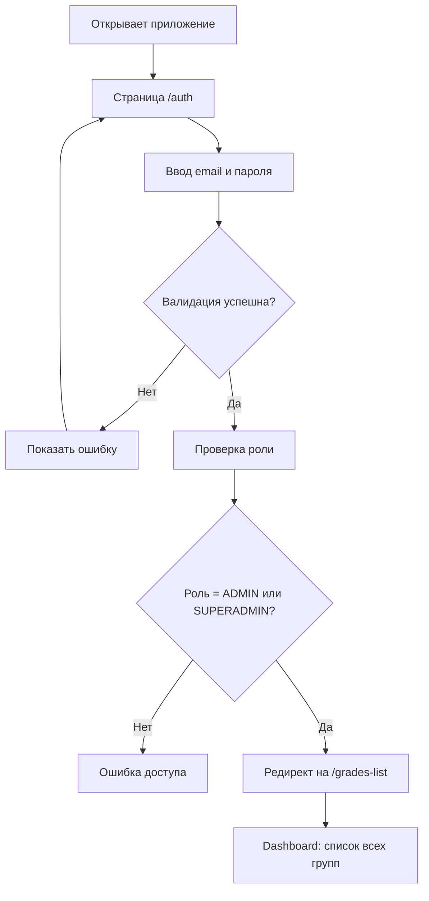

**Детальный сценарий:**

1. **Аутентификация**
   - Аналогично Teacher (раздел 3.1)
   - Ввод email и пароля

2. **Проверка роли**
   - Система проверяет роль: `ADMIN` или `SUPERADMIN`
   - Если роль не соответствует → ошибка доступа

3. **Редирект на Dashboard**
   - Автоматический редирект на `/grades-list`
   - Отображается dashboard со списком всех групп

4. **Dashboard**
   - Карточки всех групп
   - Статистика по группам
   - Быстрые действия

---

### 4.2. Управление преподавателями

**Цель:** Администратор добавляет нового преподавателя и назначает его на группы

**Диаграмма потока:**

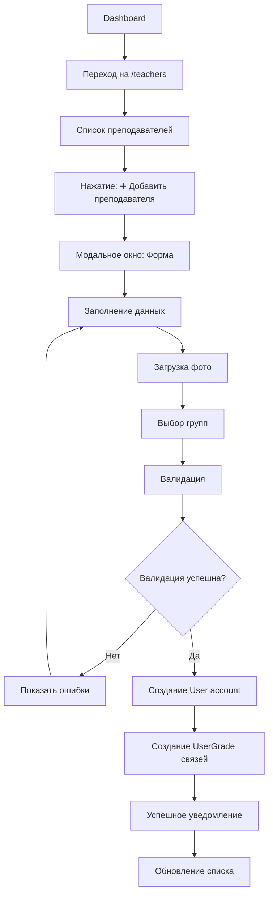

**Детальный сценарий:**

1. **Начальная точка**
   - Администратор находится на Dashboard `/grades-list`
   - Переходит в раздел "Преподаватели" → `/teachers`

2. **Просмотр списка**
   - Отображается список всех преподавателей
   - Карточки с аватарами, ФИО, назначенными группами
   - Фильтры: по группе, по статусу

3. **Добавление преподавателя**
   - Нажимает "➕ Добавить преподавателя"
   - Открывается модальное окно с формой:
     - **Фото:** Загрузка изображения (drag & drop или выбор файла)
     - **Имя:** Текстовое поле (обязательное)
     - **Фамилия:** Текстовое поле (обязательное)
     - **Отчество:** Текстовое поле (опционально)
     - **Email:** Текстовое поле (обязательное, уникальное)
     - **Назначение групп:** Multi-select (минимум 1 группа)
     - **Статус:** Переключатель (Активный/Неактивный)

4. **Валидация**
   - Email должен быть уникальным
   - Минимум одна группа должна быть выбрана
   - ФИО обязательны

5. **Сохранение**
   - Создается запись в таблице `User` с ролью `TEACHER`
   - Создаются записи в таблице `UserGrade` для каждой выбранной группы
   - Генерируется временный пароль (или отправляется email с паролем)

6. **Уведомление**
   - Отображается уведомление: "Преподаватель успешно добавлен"
   - Новый преподаватель появляется в списке

**Обработка ошибок:**
- ❌ Email уже существует → ошибка "Пользователь с таким email уже существует"
- ❌ Не выбрана группа → ошибка "Необходимо выбрать хотя бы одну группу"
- ❌ Ошибка загрузки фото → ошибка "Не удалось загрузить изображение"

---

### 4.3. Управление учениками

**Цель:** Администратор добавляет нового ученика и назначает его на группу

**Диаграмма потока:**

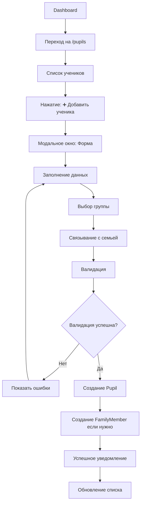

**Детальный сценарий:**

1. **Начальная точка**
   - Администратор находится на Dashboard
   - Переходит в раздел "Ученики" → `/pupils`

2. **Просмотр списка**
   - Отображается список всех учеников
   - Таблица с колонками: ФИО, Группа, Статус, Действия
   - Фильтры: по группе, по статусу, поиск по имени

3. **Добавление ученика**
   - Нажимает "➕ Добавить ученика"
   - Открывается модальное окно с формой:
     - **Фото:** Загрузка изображения (опционально)
     - **Имя:** Текстовое поле (обязательное)
     - **Фамилия:** Текстовое поле (обязательное)
     - **Отчество:** Текстовое поле (опционально)
     - **Дата рождения:** Date picker (опционально)
     - **Группа:** Dropdown (может быть NULL)
     - **Семья:** Dropdown с поиском (опционально, можно создать новую)

4. **Связывание с семьей**
   - Можно выбрать существующую семью из dropdown
   - Можно создать новую семью прямо в форме
   - Указывается родственная связь (сын, дочь, брат, сестра)

5. **Валидация и сохранение**
   - ФИО обязательны
   - При сохранении создается запись в таблице `Pupil`
   - Если указана семья → создается запись в `FamilyMember`

**Обработка ошибок:**
- ❌ ФИО не заполнено → ошибка валидации
- ❌ Ошибка сохранения → общее сообщение об ошибке

---

### 4.4. Управление группами

**Цель:** Администратор создает новую группу и настраивает параметры оценивания

**Диаграмма потока:**

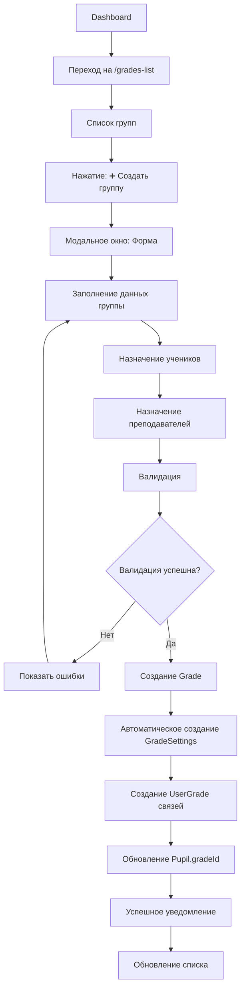

**Детальный сценарий:**

1. **Создание группы**
   - На странице `/grades-list` нажимает "➕ Создать группу"
   - Заполняет форму:
     - **Название:** Текстовое поле (например, "Младшая группа")
     - **Описание:** Текстовое поле (опционально)
     - **Минимальный возраст:** Числовое поле (опционально)
     - **Максимальный возраст:** Числовое поле (опционально)

2. **Назначение учеников**
   - Multi-select с поиском
   - Можно выбрать несколько учеников
   - Ученики могут быть без группы или из других групп

3. **Назначение преподавателей**
   - Multi-select с поиском
   - Можно выбрать несколько преподавателей

4. **Автоматическое создание настроек**
   - При создании группы автоматически создается запись `GradeSettings` с дефолтными значениями:
     - `showGoldenVerses = true`
     - `showTest = true`
     - `showNotebook = true`
     - `showSinging = true`

5. **Настройка параметров оценивания**
   - После создания группы можно перейти в настройки `/grades/:gradeId/settings`
   - Включение/выключение параметров
   - Настройка кастомных меток
   - Настройка кастомных баллов

**Обработка ошибок:**
- ❌ Название группы не заполнено → ошибка валидации
- ❌ minAge > maxAge → ошибка валидации

---

### 4.5. Завершение учебного года

**Цель:** Администратор завершает текущий учебный год и создает новый

**Диаграмма потока:**

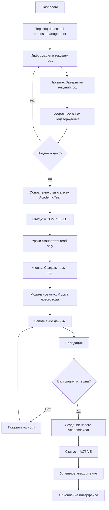

**Детальный сценарий:**

1. **Начальная точка**
   - Администратор находится на Dashboard
   - Переходит в раздел "Управление учебным процессом" → `/school-process-management`

2. **Просмотр текущего года**
   - Отображается информация:
     - Текущий активный год (например, "2024-2025")
     - Даты начала и окончания
     - Статус: 🟢 ACTIVE
   - Кнопка "Завершить текущий год 2024-2025"

3. **Завершение года**
   - Нажимает "Завершить текущий год"
   - Открывается модальное окно с предупреждением:
     - "После завершения года все уроки станут доступны только для просмотра. Продолжить?"
   - Подтверждает действие

4. **Обновление статуса**
   - Система обновляет статус всех `AcademicYear` со статусом `ACTIVE` на `COMPLETED`
   - Все уроки становятся read-only (нельзя редактировать)

5. **Создание нового года**
   - Кнопка "Создать новый год" становится активной
   - Нажимает кнопку
   - Открывается форма:
     - **Название:** Автозаполнение (например, "2025-2026")
     - **Дата начала:** Автозаполнение (01.09.2025)
     - **Дата окончания:** Автозаполнение (31.05.2026)
     - Можно изменить даты

6. **Валидация и сохранение**
   - Проверяется, что endDate > startDate
   - Для каждой группы создается новый `AcademicYear` со статусом `ACTIVE`
   - Учителя могут снова создавать уроки

**Обработка ошибок:**
- ❌ Нет активного года → сообщение "Нет активного учебного года"
- ❌ endDate < startDate → ошибка валидации
- ❌ Ошибка сохранения → общее сообщение об ошибке

---

## 5. User Flow для роли Superadmin (Главный администратор)

### 5.1. Общие сценарии

**В MVP функционал Superadmin идентичен Admin.**

Все сценарии из раздела 4 (Admin) применимы к Superadmin.

**Post-MVP возможности:**
- Управление ролями пользователей
- Системные настройки
- Расширенная аналитика

---

## 6. User Flow для роли Parent (Родитель) — Post-MVP

### 6.1. Просмотр данных детей

**Цель:** Родитель просматривает данные своих детей (только чтение)

**Диаграмма потока:**

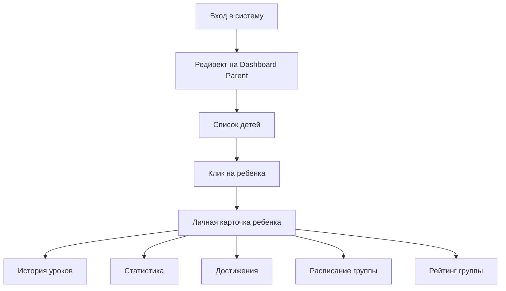

**Детальный сценарий:**

1. **Вход в систему**
   - Родитель входит через `/auth`
   - После аутентификации редирект на Dashboard Parent
   - Отображается список всех детей родителя

2. **Просмотр данных ребенка**
   - Клик на ребенка → переход на личную карточку
   - Доступны разделы:
     - История уроков (read-only)
     - Статистика
     - Достижения
     - Расписание группы (read-only)
     - Рейтинг группы (read-only)

3. **Ограничения**
   - Все данные только для просмотра
   - Нет возможности редактирования
   - Нет доступа к другим ученикам

---

## 7. User Flow для роли Pupil (Ученик) — Post-MVP

### 7.1. Просмотр своих данных

**Цель:** Ученик просматривает свои данные и достижения

**Диаграмма потока:**

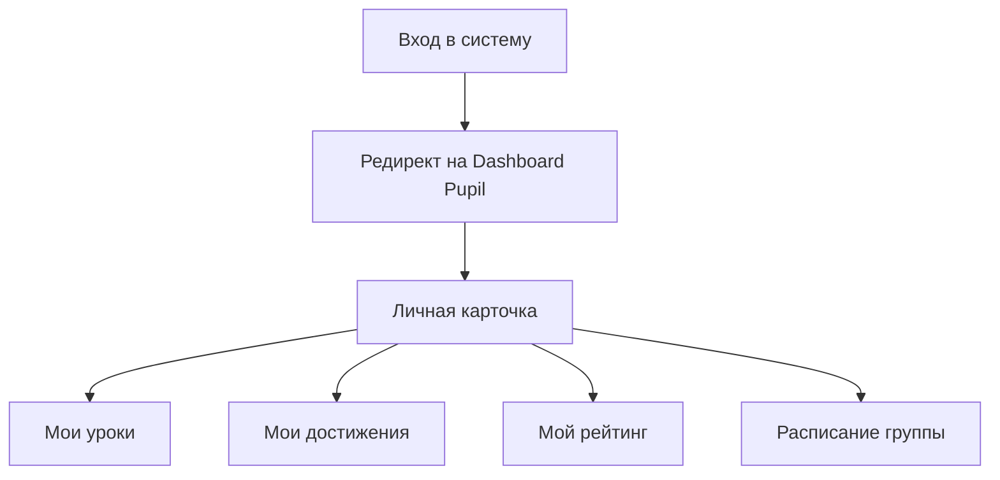

**Детальный сценарий:**

1. **Вход в систему**
   - Ученик входит через `/auth`
   - После аутентификации редирект на Dashboard Pupil
   - Отображается личная карточка ученика

2. **Просмотр данных**
   - **Мои уроки:** История всех уроков с оценками
   - **Мои достижения:** Все полученные badges
   - **Мой рейтинг:** Позиция в рейтинге группы
   - **Расписание группы:** Календарь с предстоящими уроками

3. **Ограничения**
   - Доступ только к своим данным
   - Все данные только для просмотра
   - Нет возможности редактирования

---

## 8. Обработка ошибок и edge cases

### 8.1. Общие ошибки аутентификации

**Сценарий:** Пользователь вводит неверные учетные данные

**Обработка:**
- Отображается сообщение: "Неверный email или пароль"
- Поля не очищаются (для удобства повторного ввода)
- Кнопка "Войти" остается активной

**Сценарий:** Пользователь пытается войти с деактивированным аккаунтом

**Обработка:**
- Отображается сообщение: "Ваш аккаунт деактивирован. Обратитесь к администратору."
- Предоставляется контактная информация администратора

---

### 8.2. Ошибки при создании урока

**Сценарий:** Нет активного учебного года для группы

**Обработка:**
- Блокировка создания урока
- Отображение информационного сообщения: "Для создания урока необходимо наличие активного учебного года. Обратитесь к администратору."
- Кнопка "Создать урок" неактивна или форма не отображается

**Сценарий:** Дата урока вне пределов учебного года

**Обработка:**
- Валидация на клиенте (date picker ограничивает выбор дат)
- Если дата выбрана вне диапазона → ошибка: "Дата урока должна быть в пределах учебного года (startDate - endDate)"

**Сценарий:** Ошибка сохранения в БД

**Обработка:**
- Отображение общего сообщения об ошибке: "Не удалось создать урок. Попробуйте еще раз."
- Данные формы сохраняются (автосохранение в localStorage)
- Кнопка "Повторить" для повторной попытки

---

### 8.3. Ошибки при проверке ДЗ

**Сценарий:** Нет активных учеников в группе

**Обработка:**
- Отображение сообщения: "В группе нет активных учеников"
- Кнопка "Начать проверку" неактивна

**Сценарий:** Ошибка сохранения данных проверки

**Обработка:**
- Автосохранение данных в localStorage
- Отображение предупреждения: "Не удалось сохранить изменения. Данные сохранены локально."
- Кнопка "Повторить сохранение"

**Сценарий:** Частичная проверка (не все ученики проверены)

**Обработка:**
- Данные сохраняются частично
- Прогресс отображается (например, "10/15")
- Можно продолжить проверку позже

---

### 8.4. Ошибки доступа

**Сценарий:** Teacher пытается получить доступ к другой группе

**Обработка:**
- Проверка прав в proxy.ts
- Редирект на страницу своей группы
- Отображение сообщения: "У вас нет доступа к этой группе"

**Сценарий:** Неавторизованный пользователь пытается получить доступ к защищенной странице

**Обработка:**
- Редирект на `/auth`
- После входа → редирект на запрошенную страницу (если есть права)

---

### 8.5. Edge cases

**Сценарий:** У группы несколько активных учебных годов (не должно быть, но на случай ошибки)

**Обработка:**
- Система выбирает первый найденный активный год
- Логирование предупреждения для администратора
- Рекомендация проверить данные

**Сценарий:** Ученик перемещен в другую группу во время проверки ДЗ

**Обработка:**
- Проверка актуальности данных перед сохранением
- Если ученик больше не в группе → исключение из проверки
- Уведомление преподавателю

**Сценарий:** Учебный год завершен во время создания урока

**Обработка:**
- Проверка статуса года перед сохранением
- Если год завершен → ошибка: "Учебный год был завершен. Обновите страницу."
- Предложение обновить страницу

---

## 9. Особенности мобильной версии

### 9.1. Mobile-First подход

**Принципы:**
- Все интерфейсы разрабатываются сначала для мобильных устройств
- Адаптация для планшетов и десктопов происходит позже
- Touch-friendly элементы (минимум 44x44px для кнопок)

---

### 9.2. Навигация на мобильных устройствах

**Стратегия:**
- **Bottom Navigation:** Для основных разделов (на некоторых страницах)
- **Hamburger Menu:** Для дополнительных разделов
- **Breadcrumbs:** Упрощенные, с возможностью возврата назад

**Пример для Teacher:**
```
[🏠 Главная] [📖 Уроки] [👥 Ученики] [📊 Рейтинг]
```

---

### 9.3. Адаптация форм

**Создание урока:**
- Вертикальная компоновка всех полей
- Date picker открывается в нативном формате устройства
- Dropdown для выбора книг оптимизирован для touch
- Блоки выбора стихов расположены вертикально

**Проверка ДЗ:**
- Последовательный режим предпочтителен для мобильных
- Кнопки оценки увеличены (минимум 60x60px)
- Swipe-жесты для перехода между учениками (опционально)
- Автосохранение при переходе к следующему ученику

---

### 9.4. Адаптация таблиц

**Стратегия:**
- На маленьких экранах (< 768px) таблицы преобразуются в карточки
- Каждая строка таблицы → отдельная карточка
- Важная информация выносится на первый план

**Пример: Рейтинг группы**
- Desktop: Таблица с колонками
- Mobile: Карточки учеников с рейтингом

---

### 9.5. Календарь на мобильных

**Расписание группы:**
- Месячный вид по умолчанию
- Swipe для навигации по месяцам
- События отображаются как список под календарем
- Клик на событие → модальное окно на весь экран

---

### 9.6. Оптимизация производительности

**Загрузка данных:**
- Lazy loading для списков
- Пагинация (15-20 элементов на странице)
- Skeleton loaders вместо спиннеров

**Кеширование:**
- Кеширование списков групп, учеников
- Офлайн-доступ (Post-MVP через Service Worker)

---

### 9.7. Touch interactions

**Жесты:**
- **Swipe left/right:** Навигация между учениками в последовательном режиме проверки
- **Pull to refresh:** Обновление данных на страницах списков
- **Long press:** Контекстное меню (опционально)

**Обратная связь:**
- Haptic feedback при нажатии (на поддерживаемых устройствах)
- Визуальная обратная связь (ripple effect)

---

### 9.8. Адаптация модальных окон

**Стратегия:**
- На мобильных устройствах модальные окна занимают весь экран
- Кнопка закрытия (X) в правом верхнем углу
- Swipe down для закрытия (опционально)

---

### 9.9. Responsive breakpoints

**Определенные breakpoints:**
```css
/* Mobile First */
sm:  640px  /* Small tablets */
md:  768px  /* Tablets */
lg:  1024px /* Laptops */
xl:  1280px /* Desktops */
2xl: 1536px /* Large desktops */
```

**Адаптация:**
- Mobile (< 640px): Одноколоночная компоновка, карточки вместо таблиц
- Tablet (640px - 1024px): Двухколоночная компоновка, упрощенные таблицы
- Desktop (> 1024px): Полная функциональность, таблицы, боковая панель

---

## 10. Заключение

Данный документ описывает все основные пользовательские сценарии для Sunday School App. Документ охватывает:

✅ **Все роли пользователей** (Teacher, Admin, Superadmin, Parent, Pupil)  
✅ **Детальные user flow** с диаграммами Mermaid  
✅ **Обработку ошибок** и edge cases  
✅ **Особенности мобильной версии** и адаптацию интерфейса  

Документ служит основой для:
- Разработки интерфейсов
- Тестирования функционала
- Обучения пользователей
- Планирования новых функций

---

**Последнее обновление:** 11 ноября 2025  
**Версия:** 1.0  
**Автор:** AI Senior Architect & UX Designer


